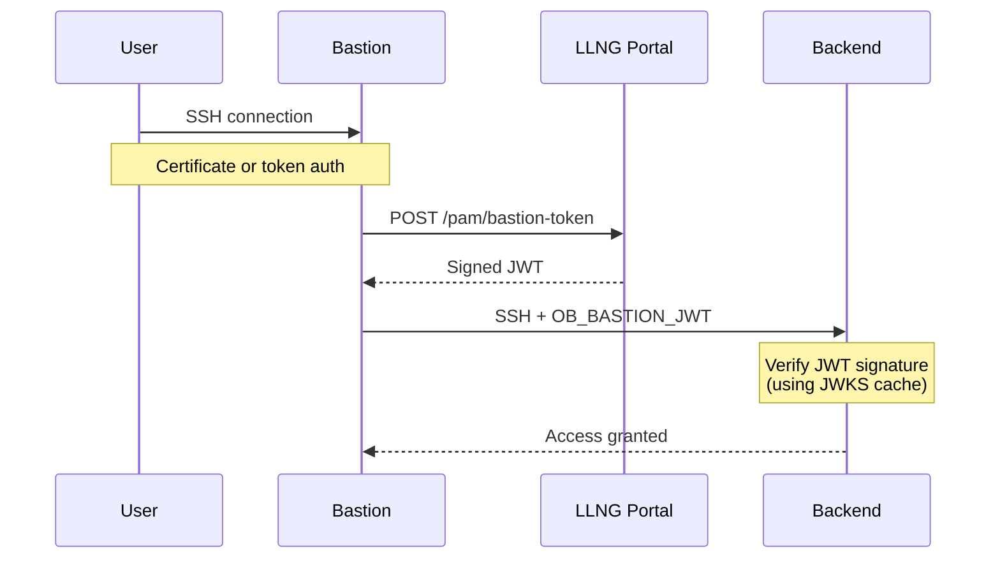

# Open Bastion

**Control SSH access and sudo privileges on your Linux servers through a centralized bastion server.**

Open Bastion integrates your servers with [LemonLDAP::NG](https://lemonldap-ng.org) (LLNG)
to centrally manage who can SSH into which servers and who can use [sudo](https://en.wikipedia.org/wiki/Sudo).
Administrators define access rules in the portal, and the PAM/NSS modules enforce them on each server.

The module supports two authentication methods:

- **Token-based authentication**: Users generate temporary access tokens from the portal to use as SSH passwords
- **Key-based authorization**: When users connect via SSH keys, the module checks if they're authorized to access this server

## Features

- Token introspection via OIDC introspection endpoint
- Server authorization via `/pam/authorize` endpoint
- Server groups support for granular access control
- Token caching to reduce server load
- Secure communication with SSL/TLS support
- Easy server enrollment with `ob-enroll` script
- **Service accounts** (ansible, backup, etc.):
  - SSH key authentication without OIDC
  - Per-server configuration file
  - Fine-grained sudo permissions
  - Automatic account creation
- **Bastion-to-backend authentication**:
  - JWT-based proof of connection origin
  - Backends only accept SSH from authorized bastions
  - Offline verification via cached JWKS public keys
  - `ob-ssh-proxy` script for seamless bastion connections
- **Security hardening**:
  - Structured JSON audit logging with correlation IDs
  - Rate limiting with exponential backoff
  - AES-256-GCM encrypted secret storage
  - Webhook notifications for security events
  - Token binding (IP, fingerprint)
- **CrowdSec integration** (optional):
  - Pre-authentication IP blocking via CrowdSec bouncer
  - Post-authentication failure reporting via CrowdSec watcher
  - Auto-ban after configurable failure threshold
  - Compatible with [Crowdsieve](https://github.com/linagora/crowdsieve) for centralized alert management

## Requirements

Globally:
- A LemonLDAP::NG system >= 2.21.0 _(LTS)_ with [additional plugins](./llng-plugin) installed and enabled

On each SSH servers to protect:
- libcurl
- json-c
- OpenSSL
- libkeyutils
- PAM development headers
- curl and jq (for enrollment script)

### Debian/Ubuntu

```bash
sudo apt-get install libcurl4-openssl-dev libjson-c-dev libpam0g-dev libssl-dev libkeyutils-dev cmake curl jq
```

### RHEL/CentOS/Fedora

```bash
sudo dnf install libcurl-devel json-c-devel pam-devel openssl-devel keyutils-libs-devel cmake curl jq
```

## LemonLDAP::NG Configuration

Before deploying the PAM module on your servers, you need to configure LemonLDAP::NG.

### Step 1: Install the Plugins

Copy the plugins from the [`llng-plugin`](./llng-plugin) directory to your LemonLDAP::NG installation:

```bash
sudo cp -r llng-plugin/usr/share/* /usr/share/
```

This installs the 3 Open Bastion plugins for LemonLDAP::NG:
- **PamAccess** - Main plugin: token generation interface and authorization endpoints (`/pam/authorize`, `/pam/bastion-token`)
- **OIDCDeviceAuthorization** - Server enrollment via OAuth 2.0 Device Authorization Grant (RFC 8628)
- **SSHCA** *(optional)* - SSH Certificate Authority for certificate-based authentication

### Step 2: Create the OIDC Relying Party

In the LLNG Manager, create a new OIDC Relying Party:

1. Go to **OpenID Connect Relying Parties** → **Add**
2. Configure:
   - **Client ID**: `pam-access`
   - **Client secret**: Generate a strong secret
   - **Allowed grant types**: Enable `device_code` (for server enrollment)
   - **Allowed scopes**: `openid`, `pam:server`

### Step 3: Enable the Plugins

Use `customPlugins` inside `lemonldap-ng.ini`, section `[portal]`:

* without SSHCA:
```ini
[portal]
customPlugins = ::Plugin::OIDCDeviceAuthorization, ::Plugins::PamAccess
```

* with SSHCA
```ini
[portal]
customPlugins = ::Plugin::OIDCDeviceAuthorization, ::Plugins::PamAccess, ::Plugins::SSHCA
```

### Step 4: Plugins parameters

Additional and optional parameters that can be inserted into `lemonldap-ng.ini`, section `[portal]`:
* `oidcServiceDeviceAuthorizationExpiration` _(default `600` == 10mn)_
* `oidcServiceDeviceAuthorizationPollingInterval` _(default `5`)_
* `oidcServiceDeviceAuthorizationUserCodeLength` _(default `8`)_
* `portalDisplayPamAccess` _(default `0`)_: set to 1 _(or a rule)_ to display PAM tab into Lemonldap-NG module, useless if you're using SSHCA
* `pamAccessRp` _(default `pam-access`)_
* `pamAccessTokenDuration` _(default `600` == 10mn)_
* `pamAccessMaxDuration` _(default `3600` == 1h)_
* `pamAccessExportedVars` _(default `{}`)_
* `pamAccessOfflineTtl` _(default `86400` == 1d)_
* `pamAccessSshRules` _(default `{}`)_
* `pamAccessServerGroups` _(default `{}`)_
* `pamAccessSudoRules` _(default `{}`)_
* `pamAccessOfflineEnabled` _(default `0`)_
* `pamAccessHeartbeatInterval` _(default `300` == 5mn)_
* `portalDisplaySshCa` _(default `0`)_: set to 1 _(or a rule)_ to display SSHCA tab into Lemonldap-NG module if you're using SSHCA
* `sshCaCertMaxValidity` _(default `365` == 1y)_
* `sshCaSerialPath` _(default "")_: set it to the path where the certificates serial will be stored _(`/var/lib/lemonldap-ng/ssh` for example)_
* `sshCaPrincipalSources` _(default `$uid`)_
* `sshCaKrlPath` _(default "")_: set it to the path where the Certificate Revocation List will be stored

#### Step 4.1: Generate and Import the SSH CA Key (optional)

If you're using the SSH CA plugin for key-based authentication, you need to generate a CA key pair and import it into LemonLDAP::NG.

##### Generate the SSH CA Key Pair

```bash
# Generate Ed25519 CA key pair (recommended)
openssl genpkey -algorithm ed25519 -out ssh-ca.key
openssl pkey -in ssh-ca.key -pubout -out ssh-ca.pub

# Display keys for import into LLNG Manager
echo "=== Private Key (copy this) ==="
cat ssh-ca.key
echo "=== Public Key (copy this) ==="
cat ssh-ca.pub
```

Alternatively, for compatibility with older systems, use RSA:

```bash
openssl genpkey -algorithm RSA -pkeyopt rsa_keygen_bits:4096 -out ssh-ca.key
openssl pkey -in ssh-ca.key -pubout -out ssh-ca.pub
```

##### Import the Key into LLNG

###### Via Manager _(Lemonldap-NG >= 2.22)_

1. Go to **General Parameters** → **Keys** → **Add a key**
2. Set a key name (e.g., `ssh-ca`)
3. Paste the private key content into **Private key**
4. Paste the public key content into **Public key**
5. Save the configuration

Then configure the SSH CA plugin to use this key inside `lemonldap-ng.ini`, section `[portal]`:
```ini
[portal]
sshCaKeyRef = ssh-ca
```

###### Via lemonldap-ng.ini

Insert this into `lemonldap-ng.ini`, section `[portal]`:

```ini
[portal]
keys = { ssh-ca => { keyPublic => "<public key value>", keyPrivate => "<private key value>" } }
sshCaKeyRef = ssh-ca
```

##### Create directories for SSH CA state files

```bash
sudo mkdir -p /var/lib/lemonldap-ng/ssh
sudo chown www-data:www-data /var/lib/lemonldap-ng/ssh
```

These directories store the certificate serial number counter and the Key Revocation List (KRL).

### Step 5: Restart LemonLDAP::NG

```bash
sudo systemctl restart lemonldap-ng-fastcgi-server
# or
sudo systemctl restart apache2  # if using mod_perl
```

## Building and Installation

```bash
mkdir build && cd build
cmake ..
make
sudo make install
```

This installs:
- `/usr/lib/security/pam_openbastion.so` - The PAM module
- `/usr/sbin/ob-enroll` - Server enrollment script
- `/etc/open-bastion/openbastion.conf.example` - Example configuration

## Quick Start

### Step 1: Create the Configuration File

```bash
sudo cp /etc/open-bastion/openbastion.conf.example /etc/open-bastion/openbastion.conf
sudo chmod 600 /etc/open-bastion/openbastion.conf
sudo nano /etc/open-bastion/openbastion.conf
```

Configure at minimum:
```ini
portal_url = https://auth.example.com
client_id = pam-access
client_secret = your-secret-here
server_group = default
```

### Step 2: Enroll the Server

Run the enrollment script as root:

```bash
sudo ob-enroll
```

The script will:
1. Initiate a Device Authorization request
2. Display a user code for administrator approval
3. Wait for the administrator to approve the server
4. Save the server token to `/etc/open-bastion/token`

**Administrator approval**: An administrator must visit the LLNG portal, go to the device verification page, and enter the displayed code to approve this server.

### Step 3: Configure PAM for SSH

Edit `/etc/pam.d/sshd`. The configuration depends on your authentication mode.

> **Important**: The configurations below have different security implications regarding
> which authentication methods are accepted. Read the descriptions carefully.

#### Mode A: LLNG Token Only (Strictest)

**Only LLNG tokens are accepted as passwords. Unix passwords are rejected.**

This is the most secure mode: users must authenticate via LemonLDAP::NG.

```
# /etc/pam.d/sshd
#
# AUTHENTICATION: Only LLNG tokens accepted
# - Unix passwords: REJECTED
# - LLNG tokens: ACCEPTED
# - SSH keys: depends on sshd_config (PubkeyAuthentication)

auth       sufficient   pam_openbastion.so
auth       required     pam_deny.so

account    required     pam_openbastion.so
account    required     pam_unix.so

session    required     pam_unix.so
```

#### Mode B: LLNG Token or Unix Password (Fallback)

**Both LLNG tokens AND traditional Unix passwords are accepted.**

Useful for transition periods or when some users don't have LLNG accounts.

```
# /etc/pam.d/sshd
#
# AUTHENTICATION: LLNG token OR unix password
# - Unix passwords: ACCEPTED (fallback)
# - LLNG tokens: ACCEPTED (tried first)
# - SSH keys: depends on sshd_config

auth       sufficient   pam_openbastion.so
auth       sufficient   pam_unix.so nullok try_first_pass
auth       required     pam_deny.so

account    required     pam_openbastion.so
account    required     pam_unix.so

session    required     pam_unix.so
```

#### Mode C: SSH Key with LLNG Authorization

**SSH key authentication only, but LLNG checks if user is authorized.**

Users authenticate with SSH keys. PAM doesn't handle password authentication,
but LLNG verifies the user has permission to access this server.

```
# /etc/pam.d/sshd
#
# AUTHENTICATION: Handled by SSH keys (not PAM)
# - Unix passwords: NOT USED (disable PasswordAuthentication in sshd_config)
# - LLNG tokens: NOT USED
# - SSH keys: REQUIRED
#
# AUTHORIZATION: LLNG checks if user can access this server

auth       required     pam_permit.so

account    required     pam_openbastion.so
account    required     pam_unix.so

session    required     pam_unix.so
```

For this mode, configure `/etc/ssh/sshd_config`:
```
PasswordAuthentication no
PubkeyAuthentication yes
```

#### Mode D: All Methods with LLNG Authorization (Most Flexible)

**SSH keys, LLNG tokens, AND Unix passwords all accepted. LLNG authorization required.**

Maximum flexibility: any authentication method works, but users must be authorized
in LLNG to access this server.

```
# /etc/pam.d/sshd
#
# AUTHENTICATION: Any method accepted
# - Unix passwords: ACCEPTED
# - LLNG tokens: ACCEPTED
# - SSH keys: ACCEPTED (if enabled in sshd_config)
#
# AUTHORIZATION: LLNG checks if user can access this server

auth       sufficient   pam_openbastion.so
auth       sufficient   pam_unix.so nullok try_first_pass
auth       required     pam_deny.so

account    required     pam_openbastion.so
account    required     pam_unix.so

session    required     pam_unix.so
```

#### Summary Table

| Mode | Unix Password | LLNG Token | SSH Key | LLNG Authorization |
|------|---------------|------------|---------|-------------------|
| A - LLNG Only | ❌ Rejected | ✅ Required | Optional* | ✅ Required |
| B - LLNG + Unix | ✅ Fallback | ✅ Preferred | Optional* | ✅ Required |
| C - SSH Key Only | ❌ Disabled | ❌ Not used | ✅ Required | ✅ Required |
| D - All Methods | ✅ Accepted | ✅ Accepted | Optional* | ✅ Required |

\* SSH key authentication depends on `PubkeyAuthentication` in sshd_config

### Step 4: Configure SSH Server

Edit `/etc/ssh/sshd_config` according to your chosen mode:

#### For Mode A or B (Password/Token authentication)

```
UsePAM yes
PasswordAuthentication yes
KbdInteractiveAuthentication yes
PubkeyAuthentication yes          # Optional: also allow SSH keys
PermitEmptyPasswords no
```

#### For Mode C (SSH Key only)

```
UsePAM yes
PasswordAuthentication no         # Disable password authentication
KbdInteractiveAuthentication no
PubkeyAuthentication yes          # SSH keys required
PermitEmptyPasswords no
```

#### For Mode D (All methods)

```
UsePAM yes
PasswordAuthentication yes
KbdInteractiveAuthentication yes
PubkeyAuthentication yes
PermitEmptyPasswords no
```

Restart SSH:

```bash
sudo systemctl restart sshd
```

### Step 5: Test

**Important**: Open a **new terminal** and keep your current session open as backup!

```bash
# Test with LLNG token (Modes A, B, D)
ssh user@server
Password: <paste LLNG token from portal>

# Test with Unix password (Modes B, D only)
ssh user@server
Password: <unix password>

# Test with SSH key (Modes C, D, or any mode with PubkeyAuthentication yes)
ssh -i ~/.ssh/id_rsa user@server
```

## Server Enrollment Script

The `ob-enroll` script automates the Device Authorization Grant flow.

### Usage

```bash
sudo ob-enroll [OPTIONS]
```

### Options

| Option | Description |
|--------|-------------|
| `-p, --portal URL` | LemonLDAP::NG portal URL |
| `-c, --client-id ID` | OIDC client ID (default: pam-access) |
| `-s, --client-secret SECRET` | OIDC client secret |
| `-g, --server-group GROUP` | Server group name (default: default) |
| `-t, --token-file FILE` | Where to save the token (default: /etc/open-bastion/token) |
| `-C, --config FILE` | Configuration file (default: /etc/open-bastion/openbastion.conf) |
| `-k, --insecure` | Skip SSL certificate verification |
| `-q, --quiet` | Quiet mode |
| `-h, --help` | Show help |

### Examples

```bash
# Enroll using settings from config file
sudo ob-enroll

# Enroll with explicit parameters
sudo ob-enroll -p https://auth.example.com -s mysecret

# Enroll for a specific server group
sudo ob-enroll -g production

# Enroll with custom token file location
sudo ob-enroll -t /etc/open-bastion/server.token
```

### Manual Enrollment (Without Script)

If you prefer manual enrollment:

#### 1. Initiate enrollment

```bash
curl -X POST https://auth.example.com/oauth2/device \
  -d "client_id=pam-access" \
  -d "scope=pam:server"
```

Response:
```json
{
  "device_code": "...",
  "user_code": "ABCD-EFGH",
  "verification_uri": "https://auth.example.com/device",
  "expires_in": 1800
}
```

#### 2. Admin approval

An administrator visits `https://auth.example.com/device`, logs in, and enters the user code.

#### 3. Get access token

```bash
curl -X POST https://auth.example.com/oauth2/token \
  -d "grant_type=urn:ietf:params:oauth:grant-type:device_code" \
  -d "device_code=<device_code_from_step_1>" \
  -d "client_id=pam-access" \
  -d "client_secret=your-secret"
```

#### 4. Save the token

```bash
echo "<access_token>" | sudo tee /etc/open-bastion/token
sudo chmod 600 /etc/open-bastion/token
```

## Configuration Reference

### /etc/open-bastion/openbastion.conf

```ini
# Required: LemonLDAP::NG portal URL
portal_url = https://auth.example.com

# Required: OIDC client credentials
client_id = pam-access
client_secret = your-secret

# Server token file (created by enrollment)
server_token_file = /etc/open-bastion/token

# Server group for authorization rules
server_group = default

# HTTP settings
timeout = 10
verify_ssl = true
# ca_cert = /etc/ssl/certs/custom-ca.pem

# Cache settings
cache_enabled = true
cache_dir = /var/cache/open-bastion
cache_ttl = 300
cache_ttl_high_risk = 60
high_risk_services = sudo,su

# Logging: error, warn, info, debug
log_level = warn

# Audit logging
audit_enabled = true
audit_log_file = /var/log/open-bastion/audit.json
audit_to_syslog = true
audit_level = 1  # 0=critical, 1=auth events, 2=all

# Rate limiting
rate_limit_enabled = true
rate_limit_max_attempts = 5
rate_limit_initial_lockout = 30
rate_limit_max_lockout = 3600

# Webhook notifications (optional)
# notify_enabled = true
# notify_url = https://alerts.example.com/webhook
# notify_secret = your-hmac-secret
```

### PAM Module Arguments

Arguments can be passed directly in PAM configuration:

```
auth required pam_openbastion.so portal_url=https://auth.example.com debug
```

| Argument | Description |
|----------|-------------|
| `conf=/path/to/file` | Use alternate config file |
| `portal_url=URL` | Override portal URL |
| `server_group=GROUP` | Override server group |
| `debug` | Enable debug logging |
| `authorize_only` | Skip password check (for SSH key mode) |
| `no_cache` | Disable token caching |
| `insecure` | Skip SSL verification |
| `no_audit` | Disable audit logging |
| `no_rate_limit` | Disable rate limiting |
| `no_bind_ip` | Disable IP binding for tokens |

## Service Accounts

Service accounts (ansible, backup, deploy, etc.) are local accounts that authenticate via SSH key
only, without OIDC authentication. They are defined in a local configuration file on each server.

### Why Service Accounts?

Some accounts don't correspond to real users and can't authenticate via OIDC:
- **Automation tools**: Ansible, Puppet, Chef
- **Backup systems**: rsync, borg, restic
- **CI/CD pipelines**: GitLab Runner, GitHub Actions
- **Monitoring agents**: Prometheus, Zabbix

These accounts need:
- SSH key authentication (no interactive login)
- Fine-grained sudo permissions
- Automatic account creation
- Full audit logging

### Configuration

Create `/etc/open-bastion/service-accounts.conf`:

```ini
# Ansible automation account
[ansible]
key_fingerprint = SHA256:abc123def456...
sudo_allowed = true
sudo_nopasswd = true
gecos = Ansible Automation
shell = /bin/bash
home = /var/lib/ansible

# Backup service account
[backup]
key_fingerprint = SHA256:xyz789...
sudo_allowed = false
gecos = Backup Service Account
shell = /bin/sh
home = /var/lib/backup
```

**Security requirements for this file:**
- Owned by root (uid 0)
- Permissions 0600
- Not a symlink

**SSH server requirement:**
The SSH server must have `ExposeAuthInfo yes` in `/etc/ssh/sshd_config` for fingerprint
validation to work. This allows the PAM module to verify that the SSH key used matches
the configured fingerprint.

```bash
# /etc/ssh/sshd_config
ExposeAuthInfo yes
```

Get the SSH key fingerprint:
```bash
ssh-keygen -lf /path/to/key.pub
# Output: 256 SHA256:abc123def456 user@host (ED25519)
# Use the "SHA256:abc123def456" part
```

### Configuration Options

| Option | Required | Description |
|--------|----------|-------------|
| `key_fingerprint` | Yes | SSH key fingerprint (SHA256:... or MD5:...) |
| `sudo_allowed` | No | Allow sudo access (default: false) |
| `sudo_nopasswd` | No | Sudo without password (default: false) |
| `gecos` | No | User description |
| `shell` | No | Login shell (must be in approved_shells) |
| `home` | No | Home directory (must match approved_home_prefixes) |
| `uid` | No | Fixed UID (0 = auto-assign) |
| `gid` | No | Fixed GID (0 = auto-assign) |

### How It Works

1. Service account connects via SSH with its configured key
2. PAM module extracts the SSH key fingerprint from `SSH_USER_AUTH` environment
3. PAM module checks if user is in `service-accounts.conf`
4. If found, the SSH key fingerprint is validated against the configured value
5. If fingerprint matches, account is authorized locally (no LLNG call needed)
6. Account is created automatically if it doesn't exist
7. sudo permissions are enforced based on configuration

### Per-Server Control

Since the configuration file is local to each server, you control which service accounts
can access which servers:

- Server `web01` has `[ansible]` and `[backup]` → both can connect
- Server `db01` has only `[backup]` → only backup can connect
- Server `dev01` has no service accounts → none can connect

Use configuration management (Ansible, Puppet) to deploy the appropriate configuration
to each server.

### Specifying the Configuration File

In `/etc/open-bastion/openbastion.conf`:

```ini
service_accounts_file = /etc/open-bastion/service-accounts.conf
```

## Server Groups

Server groups allow different authorization rules for different server categories.

### Configure in LLNG Manager

```
General Parameters > Plugins > PAM Access > Server Groups

production => $hGroup->{ops}
staging    => $hGroup->{ops} or $hGroup->{dev}
dev        => $hGroup->{dev}
default    => 1
```

### Configure on Each Server

In `/etc/open-bastion/openbastion.conf`:

```ini
server_group = production
```

Or during enrollment:

```bash
sudo ob-enroll -g production
```

## Bastion-to-Backend Authentication

In a bastion architecture, backend servers should only accept SSH connections that originate
from authorized bastion servers, not direct connections from users or attackers.

The PAM module supports **Bastion JWT verification** to cryptographically ensure that
SSH connections to backends come from authorized bastions with valid LLNG sessions.

### How It Works



1. User connects to bastion via SSH (with certificate or token)
2. From bastion, user runs `ob-ssh-proxy backend-server`
3. The proxy requests a signed JWT from LLNG `/pam/bastion-token` endpoint
4. The proxy connects to backend with the JWT in `OB_BASTION_JWT` environment variable
5. Backend's PAM module verifies the JWT signature using cached JWKS public keys
6. If valid and not expired, SSH connection proceeds; otherwise, denied

### Bastion Configuration

On the **bastion server**, install the SSH proxy script and configure it:

```bash
# Install ob-ssh-proxy (included with the PAM module)
sudo cp scripts/ob-ssh-proxy /usr/bin/
sudo chmod 755 /usr/bin/ob-ssh-proxy

# Create configuration
sudo tee /etc/open-bastion/ssh-proxy.conf << 'EOF'
PORTAL_URL=https://auth.example.com
SERVER_TOKEN_FILE=/etc/open-bastion/token
SERVER_GROUP=bastion
TARGET_GROUP=backend
TIMEOUT=10
VERIFY_SSL=true
EOF
```

Users can then connect to backends using:

```bash
# From bastion, connect to backend
ob-ssh-proxy backend-server

# Or configure SSH to use the proxy automatically
# In ~/.ssh/config on bastion:
Host backend-*
    ProxyCommand ob-ssh-proxy %h %p
```

### Backend Configuration

On the **backend server**, enable bastion JWT verification:

```ini
# /etc/open-bastion/openbastion.conf

# ... other settings ...

# Bastion JWT verification (REQUIRED for backends)
bastion_jwt_required = true
bastion_jwt_issuer = https://auth.example.com
bastion_jwt_jwks_url = https://auth.example.com/.well-known/jwks.json
bastion_jwt_jwks_cache = /var/cache/open-bastion/jwks.json
bastion_jwt_cache_ttl = 3600
bastion_jwt_clock_skew = 60
# bastion_jwt_allowed_bastions = bastion-01,bastion-02  # Optional whitelist
```

Also configure sshd to accept the JWT environment variable:

```bash
# /etc/ssh/sshd_config.d/open-bastion.conf
AcceptEnv OB_BASTION_JWT
```

### Security Benefits

- **No direct access**: Backends reject connections without valid bastion JWT
- **Cryptographic proof**: JWT is RS256-signed by LLNG, cannot be forged
- **Offline verification**: JWKS cache allows verification without contacting LLNG
- **Session binding**: JWT contains user info, bastion ID, and expiration
- **Audit trail**: Both bastion and backend log the connection with JWT claims

### Configuration Options

| Option | Default | Description |
|--------|---------|-------------|
| `bastion_jwt_required` | `false` | Enable bastion JWT verification |
| `bastion_jwt_issuer` | (portal_url) | Expected JWT issuer |
| `bastion_jwt_jwks_url` | (auto) | URL to fetch public keys |
| `bastion_jwt_jwks_cache` | `/var/cache/open-bastion/jwks.json` | Local JWKS cache file |
| `bastion_jwt_cache_ttl` | `3600` | JWKS cache TTL in seconds |
| `bastion_jwt_clock_skew` | `60` | Allowed clock skew in seconds |
| `bastion_jwt_allowed_bastions` | (none) | Comma-separated list of allowed bastion IDs |

## User Experience

### Token Authentication

1. User visits the LLNG portal
2. Navigates to "PAM Access" tab
3. Generates a temporary token (valid 5-60 minutes)
4. SSH to server, paste token as password:

```bash
ssh user@server.example.com
Password: <paste token>
```

### SSH Key Authentication

1. User has SSH key configured normally
2. SSH to server:

```bash
ssh user@server.example.com
```

3. PAM module checks authorization via LLNG
4. Access granted or denied based on rules

## Troubleshooting

### Check Logs

```bash
# System auth log
sudo tail -f /var/log/auth.log

# Or journald
sudo journalctl -u sshd -f
```

### Enable Debug Mode

In `/etc/open-bastion/openbastion.conf`:
```ini
log_level = debug
```

### Test Token Introspection

```bash
curl -X POST https://auth.example.com/oauth2/introspect \
  -u "pam-access:secret" \
  -d "token=<user_token>"
```

### Test Authorization Endpoint

```bash
curl -X POST https://auth.example.com/pam/authorize \
  -H "Authorization: Bearer $(sudo cat /etc/open-bastion/token)" \
  -H "Content-Type: application/json" \
  -d '{"user": "testuser", "host": "'$(hostname)'", "server_group": "default"}'
```

### Common Issues

| Issue | Cause | Solution |
|-------|-------|----------|
| `PAM unable to load module` | Module not in path | Check `/lib/security/` or `/lib64/security/` |
| `Token introspection failed` | Wrong credentials | Verify client_id and client_secret |
| `Server not enrolled` | Missing/invalid token | Run `ob-enroll` |
| `User not authorized` | Server group rules | Check LLNG Manager configuration |
| `Connection refused` | Portal unreachable | Check network and portal_url |

### Re-enrollment

If the server token expires or is compromised:

```bash
sudo rm /etc/open-bastion/token
sudo ob-enroll
```

## Security Considerations

1. **Protect configuration files**: `/etc/open-bastion/openbastion.conf` and `token` should be readable only by root
2. **Use TLS**: Always use HTTPS for portal_url
3. **Server tokens**: Server tokens are automatically rotated via refresh token mechanism (`token_rotate_refresh = true` by default). If you suspect compromise, re-enroll the server with `ob-enroll`
4. **Backup access**: Keep a root password or console access as fallback

## CrowdSec Integration

Open Bastion can integrate with [CrowdSec](https://www.crowdsec.net/) for enhanced security:

- **Bouncer** (pre-authentication): Block IPs that are banned in CrowdSec before authentication
- **Watcher** (post-authentication): Report authentication failures to CrowdSec for threat detection

### Prerequisites

1. A running CrowdSec Local API (LAPI) - either locally or via [Crowdsieve](https://github.com/linagora/crowdsieve)
2. A bouncer API key (for IP checking): `cscli bouncers add open-bastion`
3. A machine ID and password (for alert reporting): `cscli machines add open-bastion --password <password>`

### Configuration

Add to `/etc/open-bastion/openbastion.conf`:

```ini
# Enable CrowdSec integration
crowdsec_enabled = true
crowdsec_url = http://127.0.0.1:8080

# Bouncer: check if IP is banned before authentication
crowdsec_bouncer_key = your-bouncer-api-key
crowdsec_action = reject       # reject or warn
crowdsec_fail_open = true      # allow if CrowdSec unavailable

# Watcher: report authentication failures
crowdsec_machine_id = open-bastion
crowdsec_password = your-machine-password
crowdsec_scenario = open-bastion/ssh-auth-failure
crowdsec_send_all_alerts = true   # send all alerts, not just bans
crowdsec_max_failures = 5         # auto-ban after N failures
crowdsec_block_delay = 180        # time window in seconds
crowdsec_ban_duration = 4h        # ban duration
```

### Using Crowdsieve

[Crowdsieve](https://github.com/linagora/crowdsieve) is a filtering proxy between local CrowdSec instances
and the Central API (CAPI). It provides:

- Alert filtering before forwarding to the cloud
- Local web dashboard for visualization
- Decision synchronization across multiple LAPI servers
- Manual IP banning from the dashboard

To use Open Bastion with Crowdsieve, point the `crowdsec_url` to your Crowdsieve instance:

```ini
crowdsec_url = http://crowdsieve.internal:8080
```

### Configuration Options

| Option | Default | Description |
|--------|---------|-------------|
| `crowdsec_enabled` | `false` | Enable CrowdSec integration |
| `crowdsec_url` | `http://127.0.0.1:8080` | CrowdSec LAPI URL |
| `crowdsec_timeout` | `5` | HTTP timeout in seconds |
| `crowdsec_fail_open` | `true` | Allow auth if CrowdSec unavailable |
| `crowdsec_bouncer_key` | (none) | Bouncer API key for IP checking |
| `crowdsec_action` | `reject` | Action on ban: `reject` or `warn` |
| `crowdsec_machine_id` | (none) | Machine ID for alert reporting |
| `crowdsec_password` | (none) | Machine password |
| `crowdsec_scenario` | `open-bastion/ssh-auth-failure` | Scenario name for alerts |
| `crowdsec_send_all_alerts` | `true` | Send all alerts or only bans |
| `crowdsec_max_failures` | `5` | Auto-ban after N failures (0=disabled) |
| `crowdsec_block_delay` | `180` | Time window for counting failures |
| `crowdsec_ban_duration` | `4h` | Ban duration (e.g., `4h`, `1d`) |

## License

AGPL-3.0

## Author

Xavier Guimard <xguimard@linagora.com>

Copyright (C) 2025 [Linagora](https://linagora.com)
