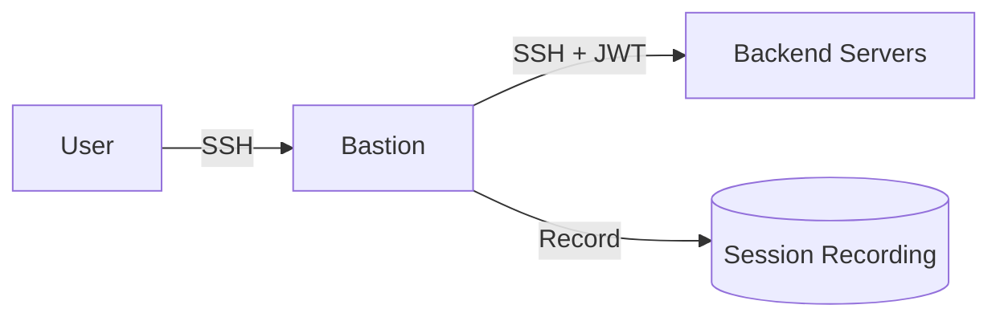
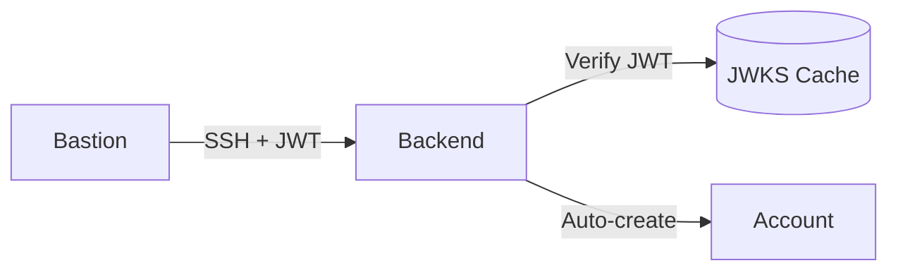

# Administrator Guide

This guide explains how to configure Linux servers to authenticate
and authorize users via LemonLDAP::NG.

## Server Types

There are three typical deployment scenarios:

| Type           | Description                         | Use Case                                   |
| -------------- | ----------------------------------- | ------------------------------------------ |
| **Standalone** | Single server with direct LLNG auth | Web servers, databases, isolated systems   |
| **Bastion**    | Jump host with session recording    | Entry point for all SSH access             |
| **Backend**    | Internal server behind bastion      | Production servers, accessed via ProxyJump |

## Prerequisites

### On All Servers

1. Install the PAM module package
2. Network access to LLNG portal (HTTPS)
3. Root access for configuration

### On LLNG Portal

1. PAM Access plugin enabled
2. Server groups configured (if using)
3. OIDC client for PAM (`pam-access`)

---

## Standalone Server Configuration

A standalone server authenticates users directly with LLNG, without
going through a bastion.


### Step 1: Install Packages

```bash
# Debian/Ubuntu
apt-get install libpam-openbastion libnss-openbastion

# RHEL/Rocky
dnf install libpam-openbastion nss-openbastion
```

### Step 2: Create Configuration

```bash
cat > /etc/open-bastion/openbastion.conf << 'EOF'
# LLNG Portal URL
portal_url = https://auth.example.com

# OIDC client credentials
client_id = pam-access
client_secret = your-client-secret

# Server group (must match LLNG configuration)
server_group = standalone

# Token file (created by enrollment)
server_token_file = /etc/open-bastion/token

# Security settings
verify_ssl = true
timeout = 10

# Logging
log_level = warn
audit_enabled = true
audit_to_syslog = true

# Rate limiting
rate_limit_enabled = true
rate_limit_max_attempts = 5
EOF

chmod 600 /etc/open-bastion/openbastion.conf
```

### Step 3: Enroll Server

```bash
ob-enroll -g standalone
```

Follow the instructions to approve the server in LLNG.

### Step 4: Configure PAM

```bash
cat > /etc/pam.d/sshd << 'EOF'
# Authentication: LLNG token or Unix password
auth       sufficient   pam_openbastion.so
auth       sufficient   pam_unix.so nullok try_first_pass
auth       required     pam_deny.so

# Authorization: LLNG checks access
account    required     pam_openbastion.so
account    required     pam_unix.so

# Session
session    required     pam_unix.so
EOF
```

### Step 5: Configure SSH

```bash
cat >> /etc/ssh/sshd_config << 'EOF'

# LLNG PAM Authentication
UsePAM yes
PasswordAuthentication yes
KbdInteractiveAuthentication yes
PubkeyAuthentication yes
EOF

systemctl restart sshd
```

### Step 6: Test

```bash
# From another terminal (keep current session open!)
ssh user@server
# Enter LLNG token as password
```

---

## Bastion Configuration

A bastion is a hardened jump host that:

- Authenticates all users via LLNG
- Records all SSH sessions
- Proxies connections to backend servers



### Step 1: Install Packages

```bash
# Debian/Ubuntu
apt-get install libpam-openbastion libnss-openbastion uuid-runtime jq

# RHEL/Rocky
dnf install libpam-openbastion nss-openbastion util-linux jq
```

### Step 2: Create Configuration

```bash
cat > /etc/open-bastion/openbastion.conf << 'EOF'
# LLNG Portal URL
portal_url = https://auth.example.com

# OIDC client credentials
client_id = pam-access
client_secret = your-client-secret

# Server group for bastions
server_group = bastion

# Token file
server_token_file = /etc/open-bastion/token

# Security settings (stricter for bastion)
verify_ssl = true
timeout = 10

# Logging (verbose for audit)
log_level = info
audit_enabled = true
audit_log_file = /var/log/open-bastion/audit.json
audit_to_syslog = true
audit_level = 2

# Rate limiting (stricter for bastion)
rate_limit_enabled = true
rate_limit_max_attempts = 3
rate_limit_initial_lockout = 60
EOF

chmod 600 /etc/open-bastion/openbastion.conf
```

### Step 3: Configure Session Recording

```bash
mkdir -p /etc/open-bastion
cat > /etc/open-bastion/session-recorder.conf << 'EOF'
# Session recordings directory
sessions_dir = /var/lib/open-bastion/sessions

# Recording format (script is default, always available)
# Use asciinema for web replay if installed
format = script

# Max session duration (8 hours)
max_duration = 28800
EOF

# Create sessions directory
mkdir -p /var/lib/open-bastion/sessions
chmod 700 /var/lib/open-bastion/sessions
```

### Step 4: Enroll Server

```bash
ob-enroll -g bastion
```

### Step 5: Configure PAM

```bash
cat > /etc/pam.d/sshd << 'EOF'
# Authentication: LLNG only (no Unix passwords on bastion)
auth       sufficient   pam_openbastion.so
auth       required     pam_deny.so

# Authorization: LLNG required
account    required     pam_openbastion.so
account    required     pam_unix.so

# Session
session    required     pam_unix.so
EOF
```

### Step 6: Configure SSH with Recording

```bash
cat > /etc/ssh/sshd_config.d/llng-bastion.conf << 'EOF'
# LLNG PAM Authentication
UsePAM yes
PasswordAuthentication yes
KbdInteractiveAuthentication yes
PubkeyAuthentication yes

# Session recording for all users except emergency admin
Match User *,!root,!admin
    ForceCommand /usr/sbin/ob-session-recorder

# Emergency admin access (no recording, direct shell)
Match User admin
    ForceCommand none
EOF

systemctl restart sshd
```

### Step 7: Configure SSH Proxy for Backend Access

When bastion JWT verification is enabled on backends, configure the SSH proxy:

```bash
mkdir -p /etc/open-bastion
cat > /etc/open-bastion/ssh-proxy.conf << 'EOF'
# LLNG SSH Proxy configuration
PORTAL_URL=https://auth.example.com
SERVER_TOKEN_FILE=/etc/open-bastion/token
SERVER_GROUP=bastion
TARGET_GROUP=production
TIMEOUT=10
VERIFY_SSL=true
SSH_OPTIONS="-o StrictHostKeyChecking=accept-new"
EOF

chmod 644 /etc/open-bastion/ssh-proxy.conf
```

Users can then connect to backends using:

```bash
# Direct command
ob-ssh-proxy backend-server

# Or via SSH config on bastion (~/.ssh/config):
Host backend-*
    ProxyCommand ob-ssh-proxy %h %p
```

### Step 8: Configure Log Rotation

```bash
cat > /etc/logrotate.d/llng-sessions << 'EOF'
/var/lib/open-bastion/sessions/*/*.cast
/var/lib/open-bastion/sessions/*/*.json {
    monthly
    rotate 12
    compress
    delaycompress
    missingok
    notifempty
    create 0600 root root
}
EOF
```

### Step 8: Test

```bash
# Connect to bastion
ssh user@bastion

# Verify recording was created
ls -la /var/lib/open-bastion/sessions/$USER/

# Jump to backend
ssh backend-server
```

---

## Backend Server Configuration

Backend servers are internal servers accessed through the bastion.
They auto-create Unix accounts for LLNG users.



### Step 1: Install Packages

```bash
# Debian/Ubuntu
apt-get install libpam-openbastion libnss-openbastion

# RHEL/Rocky
dnf install libpam-openbastion nss-openbastion
```

### Step 2: Create PAM Configuration

```bash
cat > /etc/open-bastion/openbastion.conf << 'EOF'
# LLNG Portal URL
portal_url = https://auth.example.com

# OIDC client credentials
client_id = pam-access
client_secret = your-client-secret

# Server group (production, staging, dev, etc.)
server_group = production

# Token file
server_token_file = /etc/open-bastion/token

# Security settings
verify_ssl = true
timeout = 10

# User creation settings
create_user = true
create_user_home_base = /home
create_user_shell = /bin/bash
create_user_skel = /etc/skel

# Bastion JWT verification (REQUIRED for backends)
bastion_jwt_required = true
bastion_jwt_issuer = https://auth.example.com
bastion_jwt_jwks_url = https://auth.example.com/.well-known/jwks.json
bastion_jwt_jwks_cache = /var/cache/open-bastion/jwks.json
bastion_jwt_cache_ttl = 3600
bastion_jwt_clock_skew = 60
# Optionally restrict to specific bastions:
# bastion_jwt_allowed_bastions = bastion-01,bastion-02

# Logging
log_level = warn
audit_enabled = true
audit_to_syslog = true
EOF

chmod 600 /etc/open-bastion/openbastion.conf
```

### Step 3: Create NSS Configuration

```bash
cat > /etc/open-bastion/nss_openbastion.conf << 'EOF'
# LLNG Portal URL
portal_url = https://auth.example.com

# Server token (same as PAM)
server_token_file = /etc/open-bastion/token

# Timeouts
timeout = 5

# Cache settings (reduce LLNG queries)
cache_ttl = 300

# UID/GID allocation range
min_uid = 10000
max_uid = 60000
default_gid = 100
EOF

chmod 644 /etc/open-bastion/nss_openbastion.conf
```

### Step 4: Configure NSS

```bash
# Edit /etc/nsswitch.conf
# Change:
#   passwd: files
# To:
#   passwd: files openbastion

sed -i 's/^passwd:.*/passwd: files openbastion/' /etc/nsswitch.conf
```

### Step 5: Enroll Server

```bash
ob-enroll -g production
```

### Step 6: Configure PAM

```bash
cat > /etc/pam.d/sshd << 'EOF'
# Authentication: Accept from bastion (SSH keys)
auth       required     pam_permit.so

# Authorization: LLNG required
account    required     pam_openbastion.so
account    required     pam_unix.so

# Session: Create user if needed
session    required     pam_openbastion.so
session    required     pam_unix.so
EOF
```

### Step 7: Configure SSH

```bash
cat > /etc/ssh/sshd_config.d/llng-backend.conf << 'EOF'
# PAM required for authorization and user creation
UsePAM yes

# SSH key authentication only (via bastion)
PasswordAuthentication no
KbdInteractiveAuthentication no
PubkeyAuthentication yes

# Accept bastion JWT environment variable
AcceptEnv OB_BASTION_JWT

# Accept connections from bastion only
# (combine with firewall rules)
EOF

systemctl restart sshd
```

### Step 8: Firewall (Optional but Recommended)

```bash
# Allow SSH only from bastion
ufw allow from bastion-ip to any port 22
ufw deny 22
ufw enable
```

### Step 10: Test

```bash
# From bastion, connect to backend using ob-ssh-proxy
ob-ssh-proxy backend-server

# Verify user was created
grep $USER /etc/passwd

# Verify home directory
ls -la /home/$USER
```

> **Note**: Direct SSH connections to the backend (without the bastion JWT) will be rejected,
> even with valid SSH keys. This ensures all access goes through authorized bastions.

---

## Server Groups Reference

Configure server groups in LLNG Manager:

```
General Parameters > Plugins > PAM Access > Server Groups
```

Example configuration:

| Server Group  | Rule                                  | Description                          |
| ------------- | ------------------------------------- | ------------------------------------ |
| `bastion`     | `$hGroup->{employees}`                | All employees can access bastions    |
| `production`  | `$hGroup->{sre} or $hGroup->{oncall}` | Only SRE and on-call can access prod |
| `staging`     | `$hGroup->{sre} or $hGroup->{dev}`    | SRE and developers                   |
| `development` | `$hGroup->{dev}`                      | Only developers                      |
| `database`    | `$hGroup->{dba}`                      | Only DBAs                            |
| `default`     | `0`                                   | Deny by default                      |

## LLNG OIDC Client Security Settings

Configure security options for the `pam-access` OIDC client in LLNG Manager:

```
LLNG Manager → OIDC → Relying Parties → pam-access → Options
```

### Refresh Token Inactivity Timeout

Automatically revoke refresh tokens that haven't been used within a specified period:

```yaml
# Revoke refresh tokens after 30 days of inactivity (recommended)
oidcRPMetaDataOptionsRtActivity: 2592000 # seconds (0 = disabled)
```

This setting protects against:

- Stolen tokens from inactive/decommissioned servers
- Dormant tokens in old backups
- Forgotten enrolled servers

**Important**: Ensure the PAM heartbeat timer is enabled to keep tokens active:

```bash
systemctl enable --now libpam-openbastion-heartbeat.timer
```

### Other Recommended Security Settings

```yaml
# Require PKCE for device authorization flow
oidcRPMetaDataOptionsRequirePKCE: 1

# Use JWT client assertion (not basic auth)
oidcRPMetaDataOptionsClientAuthenticationMethod: client_secret_jwt

# Enable refresh token rotation
oidcRPMetaDataOptionsRefreshTokenRotation: 1
```

## Troubleshooting

### Server Enrollment Issues

```bash
# Check token file exists
ls -la /etc/open-bastion/token

# Re-enroll if needed
rm /etc/open-bastion/token
ob-enroll -g <server_group>
```

### Authentication Failures

```bash
# Check PAM logs
journalctl -u sshd | grep pam_llng

# Enable debug mode
# In /etc/open-bastion/openbastion.conf:
log_level = debug

# Test token introspection (using Basic Auth for simplicity)
# Note: The PAM module uses JWT Client Assertion (RFC 7523) for enhanced security
curl -X POST https://auth.example.com/oauth2/introspect \
  -u "pam-access:secret" \
  -d "token=<user_token>"
```

### NSS Issues

```bash
# Test NSS resolution
getent passwd username

# Check NSS configuration
grep passwd /etc/nsswitch.conf

# Check NSS logs
journalctl | grep nss_openbastion
```

### User Creation Issues

```bash
# Check if create_user is enabled
grep create_user /etc/open-bastion/openbastion.conf

# Check PAM session configuration
grep session /etc/pam.d/sshd

# Manually check user creation
grep username /etc/passwd
ls -la /home/username
```

## SSH Key Policy

Open Bastion can enforce restrictions on SSH key types and minimum key sizes. This helps ensure
users connect with cryptographically strong keys, preventing the use of weak or deprecated
algorithms.

### Configuration

```ini
# /etc/open-bastion/openbastion.conf

# Enable SSH key policy enforcement
ssh_key_policy_enabled = true

# Allowed key types (comma-separated)
# Supported: rsa, ed25519, ecdsa, dsa, sk (FIDO2), all
ssh_key_allowed_types = ed25519, rsa, ecdsa, sk

# Minimum RSA key size in bits (default: 2048)
ssh_key_min_rsa_bits = 3072

# Minimum ECDSA key size in bits (default: 256)
ssh_key_min_ecdsa_bits = 256
```

### Key Type Aliases

The following aliases are recognized:

| Alias        | Key Types Included              |
| ------------ | ------------------------------- |
| `ecdsa`      | ecdsa-256, ecdsa-384, ecdsa-521 |
| `ecdsa-256`  | ecdsa-sha2-nistp256             |
| `ecdsa-384`  | ecdsa-sha2-nistp384             |
| `ecdsa-521`  | ecdsa-sha2-nistp521             |
| `sk-ecdsa`   | sk-ecdsa-sha2-nistp256 (FIDO2)  |
| `sk-ed25519` | sk-ssh-ed25519 (FIDO2)          |

### SSH Server Requirement

For SSH key policy to work, the SSH server must expose authentication information:

```bash
# /etc/ssh/sshd_config
ExposeAuthInfo yes
```

### Example Configurations

**High Security (Ed25519 and FIDO2 only):**

```ini
ssh_key_policy_enabled = true
ssh_key_allowed_types = ed25519, sk-ed25519, sk-ecdsa
```

**Balanced (Modern algorithms, strong RSA):**

```ini
ssh_key_policy_enabled = true
ssh_key_allowed_types = ed25519, ecdsa, rsa, sk-ed25519, sk-ecdsa
ssh_key_min_rsa_bits = 3072
ssh_key_min_ecdsa_bits = 256
```

**Legacy compatibility (allows RSA-2048):**

```ini
ssh_key_policy_enabled = true
ssh_key_allowed_types = ed25519, ecdsa, rsa
ssh_key_min_rsa_bits = 2048
```

### Troubleshooting

If users are rejected due to key policy:

```bash
# Check audit logs for rejection reason
journalctl -u sshd | grep "SSH key policy"

# Common errors:
# - "Key type not allowed: ssh-dss" → DSA keys are disabled
# - "RSA key too small: 1024 bits" → User needs a larger key
```

---

## Quick Reference

### File Locations

| File                                      | Purpose                           |
| ----------------------------------------- | --------------------------------- |
| `/etc/open-bastion/openbastion.conf`      | PAM module configuration          |
| `/etc/open-bastion/token`                 | Server enrollment token           |
| `/etc/open-bastion/nss_openbastion.conf`  | NSS module configuration          |
| `/etc/open-bastion/session-recorder.conf` | Session recorder configuration    |
| `/etc/open-bastion/ssh-proxy.conf`        | SSH proxy configuration (bastion) |
| `/var/lib/open-bastion/sessions/`         | Session recordings                |
| `/var/cache/open-bastion/jwks.json`       | JWKS cache for JWT verification   |
| `/var/log/open-bastion/audit.json`        | Audit log                         |

### Commands

| Command               | Purpose                             |
| --------------------- | ----------------------------------- |
| `ob-enroll`           | Enroll server with LLNG             |
| `ob-enroll -g GROUP`  | Enroll with specific server group   |
| `ob-session-recorder` | Record SSH session (ForceCommand)   |
| `ob-ssh-proxy HOST`   | Connect to backend with bastion JWT |

## CrowdSec Integration

Open Bastion can integrate with [CrowdSec](https://www.crowdsec.net/) for collaborative
threat detection and IP blocking. This is particularly useful for bastions exposed to
the internet.

### Overview


### Prerequisites

1. Install CrowdSec: https://docs.crowdsec.net/docs/getting_started/install_crowdsec
2. Create a bouncer: `cscli bouncers add open-bastion`
3. Create a machine: `cscli machines add open-bastion --password <password>`

### Bastion Configuration with CrowdSec

For bastions exposed to the internet, CrowdSec provides defense in depth:

```bash
cat >> /etc/open-bastion/openbastion.conf << 'EOF'

# CrowdSec integration
crowdsec_enabled = true
crowdsec_url = http://127.0.0.1:8080

# Bouncer: block banned IPs
crowdsec_bouncer_key = your-bouncer-key
crowdsec_action = reject
crowdsec_fail_open = true

# Watcher: report failures
crowdsec_machine_id = bastion-01
crowdsec_password = your-password
crowdsec_scenario = open-bastion/ssh-auth-failure
crowdsec_send_all_alerts = true
crowdsec_max_failures = 5
crowdsec_block_delay = 180
crowdsec_ban_duration = 4h
EOF
```

### Backend Configuration with CrowdSec

For backends behind a bastion, you may only want the watcher (reporting) without
the bouncer (blocking), since traffic already comes from trusted bastions:

```bash
cat >> /etc/open-bastion/openbastion.conf << 'EOF'

# CrowdSec integration (watcher only)
crowdsec_enabled = true
crowdsec_url = http://127.0.0.1:8080

# No bouncer key = no IP blocking (bastion already filters)
# crowdsec_bouncer_key =

# Watcher: report suspicious activity
crowdsec_machine_id = backend-01
crowdsec_password = your-password
crowdsec_scenario = open-bastion/ssh-auth-failure
crowdsec_send_all_alerts = true
crowdsec_max_failures = 0  # 0 = don't auto-ban (bastion handles this)
EOF
```

### Using Crowdsieve

[Crowdsieve](https://github.com/linagora/crowdsieve) is a filtering proxy that sits
between your local CrowdSec instances and the Central API (CAPI). Benefits:

- **Alert filtering**: Filter alerts before they reach the cloud
- **Local dashboard**: Visualize and manage security events locally
- **Decision sync**: Query decisions across multiple CrowdSec servers
- **Manual banning**: Ban IPs directly from the web interface

To use Crowdsieve, point all your servers to it instead of local LAPI:

```ini
crowdsec_url = http://crowdsieve.internal:8080
```

### Monitoring

Check CrowdSec decisions:

```bash
# List current bans
cscli decisions list

# Check alerts
cscli alerts list

# Check a specific IP
cscli decisions list --ip 1.2.3.4
```

## See Also

- [bastion-architecture.md](bastion-architecture.md) - Architecture overview
- [session-recording.md](session-recording.md) - Session recording details
- [../README.md](../README.md) - Installation and quick start
- [../SECURITY.md](../SECURITY.md) - Security considerations
