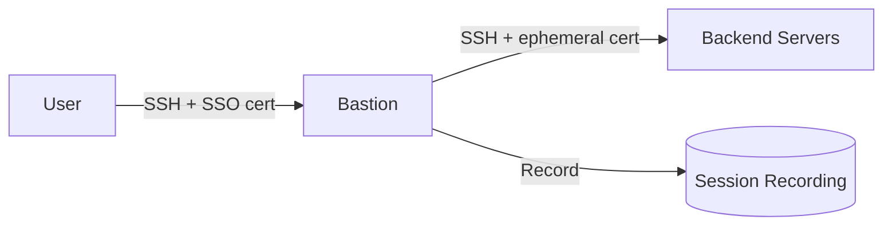
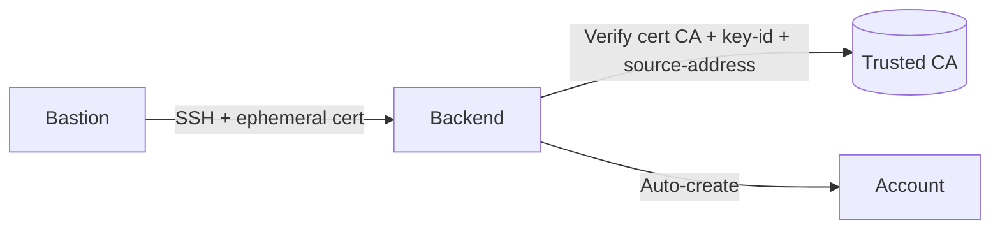

# Administrator Guide

This guide explains how to configure Linux servers to authenticate
and authorize users via LemonLDAP::NG.

## Server Types

There are three typical deployment scenarios:

| Type           | Description                         | Use Case                                                   |
| -------------- | ----------------------------------- | ---------------------------------------------------------- |
| **Standalone** | Single server with direct LLNG auth | Web servers, databases, isolated systems                   |
| **Bastion**    | Jump host with session recording    | Entry point for all SSH access                             |
| **Backend**    | Internal server behind bastion      | Production servers, reached through the bastion (`ob-ssh`) |

## Prerequisites

### On All Servers

1. Install the PAM module package
2. Network access to LLNG portal (HTTPS)
3. Root access for configuration

### On LLNG Portal

1. PAM Access plugin enabled
2. Server groups configured (if using)
3. OIDC client for PAM (`pam-access`)

---

## Standalone Server Configuration

A standalone server authenticates users directly with LLNG, without
going through a bastion.


```mermaid
flowchart LR
    User -->|SSH| Standalone[Standalone Server]
    Standalone -->|Verify| LLNG[LLNG Portal]
```

### Step 1: Install Packages

```bash
# Debian/Ubuntu
apt-get install open-bastion libnss-openbastion

# RHEL/Rocky
dnf install open-bastion nss-openbastion
```

### Step 2: Create Configuration

```bash
cat > /etc/open-bastion/openbastion.conf << 'EOF'
# LLNG Portal URL
portal_url = https://auth.example.com

# OIDC client credentials
client_id = pam-access
client_secret = your-client-secret

# Server group (must match LLNG configuration)
server_group = standalone

# Token file (runtime state, refreshed automatically by ob-heartbeat)
# The token lives under /var/lib/open-bastion/ (FHS: runtime state, not config).
server_token_file = /var/lib/open-bastion/token

# Security settings
verify_ssl = true
timeout = 10

# Logging
log_level = warn
audit_enabled = true
audit_to_syslog = true

# Rate limiting
rate_limit_enabled = true
rate_limit_max_attempts = 5
EOF

chmod 600 /etc/open-bastion/openbastion.conf
```

### Step 3: Enroll Server

```bash
ob-enroll -g standalone
```

Follow the instructions to approve the server in LLNG.

### Step 4: Configure PAM

```bash
cat > /etc/pam.d/sshd << 'EOF'
# Authentication: LLNG token or Unix password
auth       sufficient   pam_openbastion.so
auth       sufficient   pam_unix.so nullok try_first_pass
auth       required     pam_deny.so

# Authorization: LLNG checks access
account    required     pam_openbastion.so
account    required     pam_unix.so

# Session
session    required     pam_unix.so
EOF
```

### Step 5: Configure SSH

```bash
cat >> /etc/ssh/sshd_config << 'EOF'

# LLNG PAM Authentication
UsePAM yes
PasswordAuthentication yes
KbdInteractiveAuthentication yes
PubkeyAuthentication yes
EOF

systemctl restart sshd
```

### Step 6: Test

```bash
# From another terminal (keep current session open!)
ssh user@server
# Enter LLNG token as password
```

---

## Bastion Configuration

A bastion is a hardened jump host that:

- Authenticates all users via LLNG
- Records all SSH sessions
- Proxies connections to backend servers


```mermaid
flowchart LR
    User -->|SSH + SSO cert| Bastion
    Bastion -->|SSH + ephemeral cert| Backend[Backend Servers]
    Bastion -->|Record| Sessions[(Session Recording)]
```

### Step 1: Install Packages

```bash
# Debian/Ubuntu
apt-get install open-bastion libnss-openbastion uuid-runtime jq

# RHEL/Rocky
dnf install open-bastion nss-openbastion util-linux jq
```

### Step 2: Create Configuration

```bash
cat > /etc/open-bastion/openbastion.conf << 'EOF'
# LLNG Portal URL
portal_url = https://auth.example.com

# OIDC client credentials
client_id = pam-access
client_secret = your-client-secret

# Server group for bastions
server_group = bastion

# Token file (runtime state, refreshed automatically by ob-heartbeat)
server_token_file = /var/lib/open-bastion/token

# Security settings (stricter for bastion)
verify_ssl = true
timeout = 10

# Logging (verbose for audit)
log_level = info
audit_enabled = true
audit_log_file = /var/log/open-bastion/audit.json
audit_to_syslog = true
audit_level = 2

# Rate limiting (stricter for bastion)
rate_limit_enabled = true
rate_limit_max_attempts = 3
rate_limit_initial_lockout = 60
EOF

chmod 600 /etc/open-bastion/openbastion.conf
```

### Step 3: Configure Session Recording

```bash
mkdir -p /etc/open-bastion
cat > /etc/open-bastion/session-recorder.conf << 'EOF'
# Recording format (script is the v1 supported format over the recording sink)
# asciinema and ttyrec are planned but not yet supported; they fall back to script.
format = script

# Max session duration (8 hours)
# Enforced by ob-session-recorder (it terminates the session at the limit); the
# sink records the end as a torn-down session. The sink's "truncated" status is
# for recordings that hit the byte cap, not the time limit.
max_duration = 28800
EOF

# The sessions directory tree is created and owned by ob-record-sink (root).
# The package sets up the parent with the correct permissions:
# mode 0750, owned root:ob-sessions (the recorded user cannot delete or read recordings)
# If you need to recreate it manually:
# mkdir -p /var/lib/open-bastion/sessions
# chown root:ob-sessions /var/lib/open-bastion/sessions
# chmod 0750 /var/lib/open-bastion/sessions

# Enable the recording socket (must be done before first use):
systemctl enable --now ob-record.socket
```

### Step 4: Enroll Server

```bash
ob-enroll -g bastion
```

### Step 5: Configure PAM

```bash
cat > /etc/pam.d/sshd << 'EOF'
# Authentication: LLNG only (no Unix passwords on bastion)
auth       sufficient   pam_openbastion.so
auth       required     pam_deny.so

# Authorization: LLNG required
account    required     pam_openbastion.so
account    required     pam_unix.so

# Session
session    required     pam_unix.so
EOF
```

### Step 6: Configure SSH with Recording

```bash
cat > /etc/ssh/sshd_config.d/00-open-bastion-bastion.conf << 'EOF'
# LLNG PAM Authentication
UsePAM yes
PasswordAuthentication yes
KbdInteractiveAuthentication yes
PubkeyAuthentication yes

# Session recording for all users except emergency admin
Match User *,!root,!admin
    ForceCommand /usr/sbin/ob-session-recorder

# Emergency admin access (no recording, direct shell)
Match User admin
    ForceCommand none
EOF

systemctl restart sshd
```

### Step 7: Configure SSH Proxy for Backend Access

The SSH proxy uses certificate-based vouching to authenticate to backends.
Certificate requests are handled by `ob-cert-daemon` (socket-activated systemd service
running as root), which derives the caller's user via kernel `SO_PEERCRED` from the Unix
socket connection (no sudo or setuid needed). Configure the proxy:

```bash
mkdir -p /etc/open-bastion
cat > /etc/open-bastion/ssh-proxy.conf << 'EOF'
# LLNG SSH Proxy configuration
PORTAL_URL=https://auth.example.com
SERVER_TOKEN_FILE=/var/lib/open-bastion/token
SERVER_GROUP=bastion
TARGET_GROUP=production
TIMEOUT=10
VERIFY_SSL=true
SSH_OPTIONS="-o StrictHostKeyChecking=accept-new"
EOF

chmod 644 /etc/open-bastion/ssh-proxy.conf
```

Users can then connect to backends in one command.

On the bastion, run `ob-ssh` directly:

```bash
ob-ssh backend-server
```

For a one-command jump straight from your **workstation** — it lands on the
bastion (where the session is recorded) and hops to the backend — add a host to
your **local** `~/.ssh/config` using `RemoteCommand`:

```sshconfig
Host backend-server
    HostName bastion.example.com
    User alice
    IdentityFile ~/.ssh/id_llng    # your LLNG-signed key/cert
    IdentitiesOnly yes
    RequestTTY yes
    RemoteCommand ob-ssh backend-server
```

Then simply `ssh backend-server`.

> **Why not `ProxyJump` / `ProxyCommand`?** `ob-ssh` re-originates a full
> interactive SSH session from the bastion using a freshly vouched certificate;
> it is **not** a `-W` stdio forwarder, so it cannot be used as a `ProxyCommand`.
> A plain `ProxyJump bastion` from the workstation would also bypass the vouched
> certificate and the session recording, and the backend — which only accepts a
> bastion-vouched certificate pinned to the bastion's source address — would
> reject it. `RemoteCommand` (or running `ob-ssh` on the bastion) is the
> supported path.

> **Recording retention is automatic.** The package installs and enables
> `ob-session-prune.timer`, which daily compresses and expires recordings under
> `/var/lib/open-bastion/sessions`. Tune `recording_compress_after_days` /
> `recording_retention_days` in `/etc/open-bastion/session-recorder.conf`. Do
> **not** add a `logrotate` rule for the recordings tree — it would rename
> root-owned recordings and break the tamper-evident layout. See
> [Session Recording](session-recording.md) and `ob-session-prune(8)`.

### Step 8: Test

```bash
# Connect to bastion
ssh user@bastion

# Verify recording was created
ls -la /var/lib/open-bastion/sessions/$USER/

# Jump to backend
ssh backend-server
```

---

## Backend Server Configuration

Backend servers are internal servers accessed through the bastion.
They auto-create Unix accounts for LLNG users.


```mermaid
flowchart LR
    Bastion -->|SSH + ephemeral cert| Backend
    Backend -->|Verify cert CA + key-id + source-address| TrustedCA[(Trusted CA)]
    Backend -->|Auto-create| Account
```

### Step 1: Install Packages

```bash
# Debian/Ubuntu
apt-get install open-bastion libnss-openbastion

# RHEL/Rocky
dnf install open-bastion nss-openbastion
```

### Step 2: Create PAM Configuration

```bash
cat > /etc/open-bastion/openbastion.conf << 'EOF'
# LLNG Portal URL
portal_url = https://auth.example.com

# OIDC client credentials
client_id = pam-access
client_secret = your-client-secret

# Server group (production, staging, dev, etc.)
server_group = production

# Token file (runtime state, refreshed automatically by ob-heartbeat)
server_token_file = /var/lib/open-bastion/token

# Security settings
verify_ssl = true
timeout = 10

# User creation settings
create_user = true
create_user_home_base = /home
create_user_shell = /bin/bash
create_user_skel = /etc/skel

# Allowed bastions (cert vouching — REQUIRED for backends)
# Comma or space-separated list of OIDC client_id values for authorized bastions.
# Leave empty to allow any vouched bastion; remove the file entirely for legacy mode.
# Managed by ob-backend-setup --allowed-bastions <ids>  (Ansible: ob_bastion_allowed_bastions)
# The file /etc/open-bastion/allowed_bastions is checked at runtime by pam_openbastion.

# Logging
log_level = warn
audit_enabled = true
audit_to_syslog = true
EOF

chmod 600 /etc/open-bastion/openbastion.conf
```

### Step 3: Create NSS Configuration

```bash
cat > /etc/open-bastion/nss_openbastion.conf << 'EOF'
# LLNG Portal URL
portal_url = https://auth.example.com

# Server token (same as PAM)
server_token_file = /var/lib/open-bastion/token

# Timeouts
timeout = 5

# Cache settings (reduce LLNG queries)
cache_ttl = 300

# UID/GID allocation range
min_uid = 10000
max_uid = 60000
default_gid = 100
EOF

chmod 644 /etc/open-bastion/nss_openbastion.conf
```

### Step 4: Configure NSS

```bash
# Edit /etc/nsswitch.conf
# Change:
#   passwd: files
# To:
#   passwd: files openbastion

sed -i 's/^passwd:.*/passwd: files openbastion/' /etc/nsswitch.conf

# No name-service cache daemon is required. The NSS module maintains its own
# in-memory and on-disk cache, so the new resolver takes effect immediately.
# (nscd is intentionally NOT used: it loaded this multithreaded NSS module
# and crashed in the NSS path; PAM invalidates the module's file cache
# directly when users or group memberships change.)
```

### Step 5: Enroll Server

```bash
ob-enroll -g production
```

### Step 6: Configure PAM

```bash
cat > /etc/pam.d/sshd << 'EOF'
# Authentication: Accept from bastion (SSH keys)
auth       required     pam_permit.so

# Authorization: LLNG required
account    required     pam_openbastion.so
account    required     pam_unix.so

# Session: Create user if needed
session    required     pam_openbastion.so
session    required     pam_unix.so
EOF
```

### Step 7: Configure SSH

```bash
cat > /etc/ssh/sshd_config.d/00-open-bastion-backend.conf << 'EOF'
# PAM required for authorization and user creation
UsePAM yes

# SSH certificate authentication only (via bastion ephemeral certs)
PasswordAuthentication no
KbdInteractiveAuthentication no
PubkeyAuthentication yes

# Trust the LLNG CA for user certificates
TrustedUserCAKeys /etc/ssh/open-bastion_ca.pub

# Enforce the bastion key-id + allowed_bastions allowlist BEFORE PAM runs:
# ob-ssh-principals (run as nobody) only emits the principal when the cert
# key-id carries an allowed bastion=<id> and user=<u> matches the login, so a
# direct user SSO cert is rejected here, pre-PAM.
AuthorizedPrincipalsCommand /usr/local/sbin/ob-ssh-principals %u %f %i
AuthorizedPrincipalsCommandUser nobody

# Expose cert metadata (key-id, fingerprint) to the PAM environment so
# pam_openbastion can use it for /pam/authorize fingerprint binding. (This does
# NOT perform the allowlist check — that is ob-ssh-principals' job above.)
ExposeAuthInfo yes

# Accept connections from bastion only
# (combine with firewall rules)
EOF

systemctl restart sshd
```

### Step 8: Firewall (Optional but Recommended)

```bash
# Allow SSH only from bastion
ufw allow from bastion-ip to any port 22
ufw deny 22
ufw enable
```

### Step 10: Test

```bash
# From bastion, connect to backend using ob-ssh
ob-ssh backend-server

# Verify user was created
grep $USER /etc/passwd

# Verify home directory
ls -la /home/$USER
```

> **Note**: Direct SSH connections to the backend (without a valid bastion-issued ephemeral
> certificate) will be rejected. The backend sshd enforces this at the TLS/cert layer via
> `TrustedUserCAKeys`, the `source-address` critical option (bastion IP pinned in the cert),
> and the `ob-ssh-principals` helper (which only emits a principal for a cert whose key-id
> encodes a recognized `bastion=<id>` matching `/etc/open-bastion/allowed_bastions`). This
> ensures all access goes through authorized bastions.

---

## Mode E: Maximum Security Deployment

Mode E uses LLNG-signed SSH certificates for access and LLNG temporary tokens for
sudo. All users exist only in NSS (not in `/etc/passwd`). This section describes
the tested deployment flow.

### Step 1: Install Bootstrap Package

The `open-bastion-linagora` bootstrap package prepares the system before the main
package is installed. It provides:

- `/etc/securetty` with `ttyS0` for OVH serial console root access (pre-hardening)
- A pre-hardening sshd snippet (`40-pre-hardening.conf`) that sets conservative
  defaults so sshd is not locked out during setup
- A dedicated service account used for initial enrollment

```bash
apt install open-bastion-linagora
```

### Step 2: Install Open Bastion

```bash
apt install open-bastion libnss-openbastion uuid-runtime jq
```

### Step 3: Run ob-bastion-setup

`ob-bastion-setup --max-security` is the single command that configures everything:

```bash
ob-bastion-setup --max-security
```

It performs all of the following automatically:

- Generates or imports the LLNG CA public key to `/etc/ssh/open-bastion_ca.pub`
- Writes the hardened sshd configuration via an `Include` directive:
  - `AuthorizedKeysFile none`
  - `TrustedUserCAKeys /etc/ssh/open-bastion_ca.pub`
  - `RevokedKeys /etc/ssh/revoked_keys`
  - `AuthorizedPrincipalsCommand /bin/echo %u`
  - `AuthorizedPrincipalsCommandUser nobody`
  - `PermitRootLogin no`
  - `ExposeAuthInfo yes`
- Writes `/etc/pam.d/sshd` and `/etc/pam.d/sudo` for Mode E
- Configures NSS: adds `openbastion` to `passwd` and `group` in `/etc/nsswitch.conf`
- Runs `ob-enroll` to obtain `/var/lib/open-bastion/token`
- Downloads the initial KRL to `/etc/ssh/revoked_keys`
- Creates `/etc/sudoers.d/open-bastion` for sudo authorization

### Step 4: Verify

```bash
# Check NSS resolves LLNG users
getent passwd <a-portal-user>

# Test SSH certificate authentication
ssh -i /path/to/cert user@bastion

# Test sudo token flow
sudo -k && sudo whoami
# Enter LLNG temporary token when prompted
```

---

## Server Groups Reference

The per-group SSH/sudo access rules (`server_group → rule`) go in
`pamAccessSshRules` / `pamAccessSudoRules`, in
`/etc/lemonldap-ng/lemonldap-ng.ini`, section `[portal]`:

```ini
[portal]
pamAccessSshRules = { \
    bastion     => '$hGroup->{employees}', \
    production  => '$hGroup->{sre} or $hGroup->{oncall}', \
    staging     => '$hGroup->{sre} or $hGroup->{dev}', \
    development => '$hGroup->{dev}', \
    database    => '$hGroup->{dba}', \
    default     => '0' \
}
```

> `pamAccessServerGroups` is a separate, optional setting — an authority map
> `client_id → server_group` (not `server_group → rule`). When non-empty it forces
> a host's server group from its enrolled `client_id`; leave it empty for the
> default "one `client_id` per project, several server groups inside" model.

Example configuration:

| Server Group  | Rule                                  | Description                          |
| ------------- | ------------------------------------- | ------------------------------------ |
| `bastion`     | `$hGroup->{employees}`                | All employees can access bastions    |
| `production`  | `$hGroup->{sre} or $hGroup->{oncall}` | Only SRE and on-call can access prod |
| `staging`     | `$hGroup->{sre} or $hGroup->{dev}`    | SRE and developers                   |
| `development` | `$hGroup->{dev}`                      | Only developers                      |
| `database`    | `$hGroup->{dba}`                      | Only DBAs                            |
| `default`     | `0`                                   | Deny by default                      |

## LLNG OIDC Client Security Settings

Configure security options for the `pam-access` OIDC client in LLNG Manager:

```
LLNG Manager → OIDC → Relying Parties → pam-access → Options
```

### Refresh Token Inactivity Timeout

Automatically revoke refresh tokens that haven't been used within a specified period:

```yaml
# Revoke refresh tokens after 30 days of inactivity (recommended)
oidcRPMetaDataOptionsRtActivity: 2592000 # seconds (0 = disabled)
```

This setting protects against:

- Stolen tokens from inactive/decommissioned servers
- Dormant tokens in old backups
- Forgotten enrolled servers

**Important**: Ensure the PAM heartbeat timer is enabled to keep tokens active:

```bash
systemctl enable --now open-bastion-heartbeat.timer
```

### Other Recommended Security Settings

```yaml
# Require PKCE for device authorization flow
oidcRPMetaDataOptionsRequirePKCE: 1

# Use JWT client assertion (not basic auth)
oidcRPMetaDataOptionsClientAuthenticationMethod: client_secret_jwt

# Enable refresh token rotation
oidcRPMetaDataOptionsRefreshTokenRotation: 1
```

## Troubleshooting

### Server Enrollment Issues

```bash
# Check token file exists
ls -la /var/lib/open-bastion/token

# Re-enroll if needed
rm /var/lib/open-bastion/token
ob-enroll -g <server_group>
```

### Authentication Failures

```bash
# Check PAM logs
journalctl -u sshd | grep pam_openbastion

# Enable debug mode
# In /etc/open-bastion/openbastion.conf:
log_level = debug

# Test token introspection (using Basic Auth for simplicity)
# Note: The PAM module uses JWT Client Assertion (RFC 7523) for enhanced security
curl -X POST https://auth.example.com/oauth2/introspect \
  -u "pam-access:secret" \
  -d "token=<user_token>"
```

### NSS Issues

```bash
# Test NSS resolution
getent passwd username

# Check NSS configuration
grep passwd /etc/nsswitch.conf

# Check NSS logs
journalctl | grep nss_openbastion
```

### User Creation Issues

```bash
# Check if create_user is enabled
grep create_user /etc/open-bastion/openbastion.conf

# Check PAM session configuration
grep session /etc/pam.d/sshd

# Manually check user creation
grep username /etc/passwd
ls -la /home/username
```

## SSH Key Policy

Open Bastion can enforce restrictions on SSH key types and minimum key sizes. This helps ensure
users connect with cryptographically strong keys, preventing the use of weak or deprecated
algorithms.

### Configuration

```ini
# /etc/open-bastion/openbastion.conf

# Enable SSH key policy enforcement
ssh_key_policy_enabled = true

# Allowed key types (comma-separated)
# Supported: rsa, ed25519, ecdsa, dsa, sk (FIDO2), all
ssh_key_allowed_types = ed25519, rsa, ecdsa, sk

# Minimum RSA key size in bits (default: 2048)
ssh_key_min_rsa_bits = 3072

# Minimum ECDSA key size in bits (default: 256)
ssh_key_min_ecdsa_bits = 256
```

### Key Type Aliases

The following aliases are recognized:

| Alias        | Key Types Included              |
| ------------ | ------------------------------- |
| `ecdsa`      | ecdsa-256, ecdsa-384, ecdsa-521 |
| `ecdsa-256`  | ecdsa-sha2-nistp256             |
| `ecdsa-384`  | ecdsa-sha2-nistp384             |
| `ecdsa-521`  | ecdsa-sha2-nistp521             |
| `sk-ecdsa`   | sk-ecdsa-sha2-nistp256 (FIDO2)  |
| `sk-ed25519` | sk-ssh-ed25519 (FIDO2)          |

### SSH Server Requirement

For SSH key policy to work, the SSH server must expose authentication information:

```bash
# /etc/ssh/sshd_config
ExposeAuthInfo yes
```

### Example Configurations

**High Security (Ed25519 and FIDO2 only):**

```ini
ssh_key_policy_enabled = true
ssh_key_allowed_types = ed25519, sk-ed25519, sk-ecdsa
```

**Balanced (Modern algorithms, strong RSA):**

```ini
ssh_key_policy_enabled = true
ssh_key_allowed_types = ed25519, ecdsa, rsa, sk-ed25519, sk-ecdsa
ssh_key_min_rsa_bits = 3072
ssh_key_min_ecdsa_bits = 256
```

**Legacy compatibility (allows RSA-2048):**

```ini
ssh_key_policy_enabled = true
ssh_key_allowed_types = ed25519, ecdsa, rsa
ssh_key_min_rsa_bits = 2048
```

### Troubleshooting

If users are rejected due to key policy:

```bash
# Check audit logs for rejection reason
journalctl -u sshd | grep "SSH key policy"

# Common errors:
# - "Key type not allowed: ssh-dss" → DSA keys are disabled
# - "RSA key too small: 1024 bits" → User needs a larger key
```

---

## Quick Reference

### File Locations

| File                                      | Purpose                                                            |
| ----------------------------------------- | ------------------------------------------------------------------ |
| `/etc/open-bastion/openbastion.conf`      | PAM module configuration                                           |
| `/var/lib/open-bastion/token`             | Server enrollment token (runtime state, refreshed by ob-heartbeat) |
| `/etc/open-bastion/nss_openbastion.conf`  | NSS module configuration                                           |
| `/etc/open-bastion/session-recorder.conf` | Session recorder configuration                                     |
| `/etc/open-bastion/ssh-proxy.conf`        | SSH proxy configuration (bastion)                                  |
| `/var/lib/open-bastion/sessions/`         | Session recordings                                                 |
| `/etc/open-bastion/allowed_bastions`      | Allowed bastion client_ids (backend)                               |
| `/var/log/open-bastion/audit.json`        | Audit log                                                          |

### Commands

| Command               | Purpose                                              |
| --------------------- | ---------------------------------------------------- |
| `ob-enroll`           | Enroll server with LLNG                              |
| `ob-enroll -g GROUP`  | Enroll with specific server group                    |
| `ob-session-recorder` | Record SSH session (ForceCommand)                    |
| `ob-ssh HOST`         | Connect to backend via bastion ephemeral cert        |
| `ob-scp SRC DEST`     | Copy files to/from/between backends via bastion      |
| `ob-sftp HOST`        | SFTP session to a backend via bastion ephemeral cert |

## CrowdSec Integration

Open Bastion can integrate with [CrowdSec](https://www.crowdsec.net/) for collaborative
threat detection and IP blocking. This is particularly useful for bastions exposed to
the internet.

### Overview


```mermaid
flowchart LR
    User -->|SSH| Server
    Server -->|Check IP| CrowdSec[CrowdSec LAPI]
    Server -->|Report failures| CrowdSec
    CrowdSec -->|Decisions| Crowdsieve[Crowdsieve]
    Crowdsieve -->|Filtered alerts| CAPI[CrowdSec CAPI]
```

### Prerequisites

1. Install CrowdSec: https://docs.crowdsec.net/docs/getting_started/install_crowdsec
2. Create a bouncer: `cscli bouncers add open-bastion`
3. Create a machine: `cscli machines add open-bastion --password <password>`

### Bastion Configuration with CrowdSec

For bastions exposed to the internet, CrowdSec provides defense in depth:

```bash
cat >> /etc/open-bastion/openbastion.conf << 'EOF'

# CrowdSec integration
crowdsec_enabled = true
crowdsec_url = http://127.0.0.1:8080

# Bouncer: block banned IPs
crowdsec_bouncer_key = your-bouncer-key
crowdsec_action = reject
crowdsec_fail_open = true

# Watcher: report failures
crowdsec_machine_id = bastion-01
crowdsec_password = your-password
crowdsec_scenario = open-bastion/ssh-auth-failure
crowdsec_send_all_alerts = true
crowdsec_max_failures = 5
crowdsec_block_delay = 180
crowdsec_ban_duration = 4h
EOF
```

### Backend Configuration with CrowdSec

For backends behind a bastion, you may only want the watcher (reporting) without
the bouncer (blocking), since traffic already comes from trusted bastions:

```bash
cat >> /etc/open-bastion/openbastion.conf << 'EOF'

# CrowdSec integration (watcher only)
crowdsec_enabled = true
crowdsec_url = http://127.0.0.1:8080

# No bouncer key = no IP blocking (bastion already filters)
# crowdsec_bouncer_key =

# Watcher: report suspicious activity
crowdsec_machine_id = backend-01
crowdsec_password = your-password
crowdsec_scenario = open-bastion/ssh-auth-failure
crowdsec_send_all_alerts = true
crowdsec_max_failures = 0  # 0 = don't auto-ban (bastion handles this)
EOF
```

### Using Crowdsieve

[Crowdsieve](https://github.com/linagora/crowdsieve) is a filtering proxy that sits
between your local CrowdSec instances and the Central API (CAPI). Benefits:

- **Alert filtering**: Filter alerts before they reach the cloud
- **Local dashboard**: Visualize and manage security events locally
- **Decision sync**: Query decisions across multiple CrowdSec servers
- **Manual banning**: Ban IPs directly from the web interface

To use Crowdsieve, point all your servers to it instead of local LAPI:

```ini
crowdsec_url = http://crowdsieve.internal:8080
```

### Monitoring

Check CrowdSec decisions:

```bash
# List current bans
cscli decisions list

# Check alerts
cscli alerts list

# Check a specific IP
cscli decisions list --ip 1.2.3.4
```

## See Also

- [bastion-architecture.md](bastion-architecture.md) - Architecture overview
- [session-recording.md](session-recording.md) - Session recording details
- [../README.md](../README.md) - Installation and quick start
- [Security Architecture](security/00-architecture.md) - Security implementation details
- [../SECURITY.md](../SECURITY.md) - Security policy and reporting
