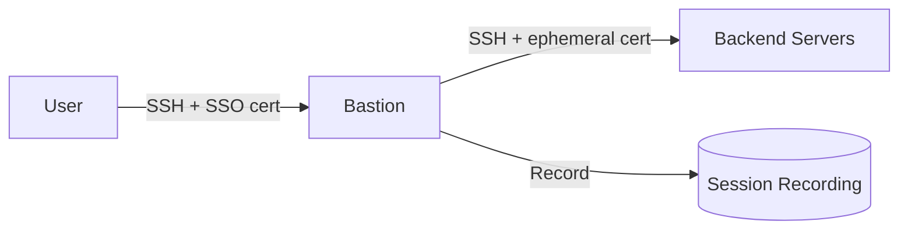
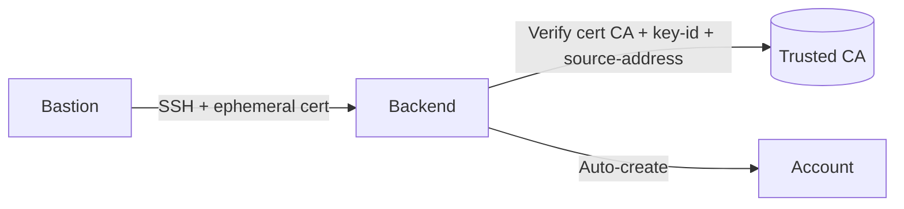

# Administrator Guide

This guide explains how to configure Linux servers to authenticate
and authorize users via LemonLDAP::NG.

## Server Types

There are three typical deployment scenarios:

| Type           | Description                         | Use Case                                                   |
| -------------- | ----------------------------------- | ---------------------------------------------------------- |
| **Standalone** | Single server with direct LLNG auth | Web servers, databases, isolated systems                   |
| **Bastion**    | Jump host with session recording    | Entry point for all SSH access                             |
| **Backend**    | Internal server behind bastion      | Production servers, reached through the bastion (`ob-ssh`) |

## Prerequisites

### On All Servers

1. Install the PAM module package
2. Network access to LLNG portal (HTTPS)
3. Root access for configuration

### On LLNG Portal

1. PAM Access plugin enabled
2. Server groups configured (if using)
3. OIDC client for PAM (`pam-access`)

---

## Standalone Server Configuration

A standalone server authenticates users directly with LLNG, without
going through a bastion.


```mermaid
flowchart LR
    User -->|SSH| Standalone[Standalone Server]
    Standalone -->|Verify| LLNG[LLNG Portal]
```

### Step 1: Install Packages

```bash
# Debian/Ubuntu
apt-get install open-bastion

# RHEL/Rocky
dnf install open-bastion
```

### Step 2: Create Configuration

```bash
cat > /etc/open-bastion/openbastion.conf << 'EOF'
# LLNG Portal URL
portal_url = https://auth.example.com

# OIDC client credentials
client_id = pam-access
client_secret = your-client-secret

# Server group (must match LLNG configuration)
server_group = standalone

# Token file (runtime state, refreshed automatically by ob-heartbeat)
# The token lives under /var/lib/open-bastion/ (FHS: runtime state, not config).
server_token_file = /var/lib/open-bastion/token

# Security settings
verify_ssl = true
timeout = 10

# Logging
log_level = warn
audit_enabled = true
audit_to_syslog = true

# Rate limiting
rate_limit_enabled = true
rate_limit_max_attempts = 5
EOF

chmod 600 /etc/open-bastion/openbastion.conf
```

### Step 3: Enroll Server

```bash
ob-enroll -g standalone
```

Follow the instructions to approve the server in LLNG.

### Step 4: Configure PAM

```bash
cat > /etc/pam.d/sshd << 'EOF'
# Authentication: LLNG token or Unix password
auth       sufficient   pam_openbastion.so
auth       sufficient   pam_unix.so nullok try_first_pass
auth       required     pam_deny.so

# Authorization: LLNG checks access
account    required     pam_openbastion.so
account    required     pam_unix.so

# Session
session    required     pam_unix.so
EOF
```

### Step 5: Configure SSH

```bash
cat >> /etc/ssh/sshd_config << 'EOF'

# LLNG PAM Authentication
UsePAM yes
PasswordAuthentication yes
KbdInteractiveAuthentication yes
PubkeyAuthentication yes
EOF

systemctl restart sshd
```

### Step 6: Test

```bash
# From another terminal (keep current session open!)
ssh user@server
# Enter LLNG token as password
```

---

## Bastion Configuration

A bastion is a hardened jump host that:

- Authenticates all users via LLNG
- Records all SSH sessions
- Proxies connections to backend servers


```mermaid
flowchart LR
    User -->|SSH + SSO cert| Bastion
    Bastion -->|SSH + ephemeral cert| Backend[Backend Servers]
    Bastion -->|Record| Sessions[(Session Recording)]
```

### Step 1: Install Packages

```bash
# Debian/Ubuntu
apt-get install open-bastion uuid-runtime jq

# RHEL/Rocky
dnf install open-bastion util-linux jq
```

### Step 2: Create Configuration

```bash
cat > /etc/open-bastion/openbastion.conf << 'EOF'
# LLNG Portal URL
portal_url = https://auth.example.com

# OIDC client credentials
client_id = pam-access
client_secret = your-client-secret

# Server group for bastions
server_group = bastion

# Token file (runtime state, refreshed automatically by ob-heartbeat)
server_token_file = /var/lib/open-bastion/token

# Security settings (stricter for bastion)
verify_ssl = true
timeout = 10

# Logging (verbose for audit)
log_level = info
audit_enabled = true
audit_log_file = /var/log/open-bastion/audit.json
audit_to_syslog = true
audit_level = 2

# Rate limiting (stricter for bastion)
rate_limit_enabled = true
rate_limit_max_attempts = 3
rate_limit_initial_lockout = 60
EOF

chmod 600 /etc/open-bastion/openbastion.conf
```

### Step 3: Configure Session Recording

```bash
mkdir -p /etc/open-bastion
cat > /etc/open-bastion/session-recorder.conf << 'EOF'
# Recording format (script is the v1 supported format over the recording sink)
# asciinema and ttyrec are planned but not yet supported; they fall back to script.
format = script

# Max session duration (8 hours)
# Enforced by ob-session-recorder (it terminates the session at the limit); the
# sink records the end as a torn-down session. The sink's "truncated" status is
# for recordings that hit the byte cap, not the time limit.
max_duration = 28800
EOF

# The sessions directory tree is created and owned by ob-record-sink (root).
# The package sets up the parent with the correct permissions:
# mode 0750, owned root:ob-sessions (the recorded user cannot delete or read recordings)
# If you need to recreate it manually:
# mkdir -p /var/lib/open-bastion/sessions
# chown root:ob-sessions /var/lib/open-bastion/sessions
# chmod 0750 /var/lib/open-bastion/sessions

# Enable the recording socket (must be done before first use):
systemctl enable --now ob-record.socket
```

### Step 4: Enroll Server

```bash
ob-enroll -g bastion
```

### Step 5: Configure PAM

> **This section describes a token-authenticated bastion (PAM
> [Mode A](pam-modes.md#mode-a-llng-token-only-strictest)), not Mode E.**
> Steps 5 and 6 deliberately enable `PasswordAuthentication` /
> `KbdInteractiveAuthentication` so that sshd prompts for the LLNG token as a
> "password". A **Mode E** bastion authenticates with SSO certificates instead
> and must have both of those set to `no`; do not copy this PAM stack or this
> `sshd_config` drop-in onto a Mode E host. For Mode E, skip to
> [Mode E: Maximum Security Deployment](#mode-e-maximum-security-deployment),
> which runs `ob-bastion-setup --max-security` and writes both files for you.

```bash
cat > /etc/pam.d/sshd << 'EOF'
# Authentication: LLNG only (no Unix passwords on bastion)
auth       sufficient   pam_openbastion.so
auth       required     pam_deny.so

# Authorization: LLNG required
account    required     pam_openbastion.so
account    required     pam_unix.so

# Session
session    required     pam_unix.so
EOF
```

### Step 6: Configure SSH with Recording

```bash
cat > /etc/ssh/sshd_config.d/00-open-bastion-bastion.conf << 'EOF'
# LLNG PAM Authentication
UsePAM yes
PasswordAuthentication yes
KbdInteractiveAuthentication yes
PubkeyAuthentication yes

# Session recording for all users except emergency admin
Match User *,!root,!admin
    ForceCommand /usr/sbin/ob-session-recorder

# Emergency admin access (no recording, direct shell)
Match User admin
    ForceCommand none
EOF

systemctl restart sshd
```

### Step 7: Configure SSH Proxy for Backend Access

The SSH proxy uses certificate-based vouching to authenticate to backends.
Certificate requests are handled by `ob-cert-daemon` (socket-activated systemd service
running as root), which derives the caller's user via kernel `SO_PEERCRED` from the Unix
socket connection (no sudo or setuid needed). Configure the proxy:

```bash
mkdir -p /etc/open-bastion
cat > /etc/open-bastion/ssh-proxy.conf << 'EOF'
# LLNG SSH Proxy configuration
PORTAL_URL=https://auth.example.com
SERVER_TOKEN_FILE=/var/lib/open-bastion/token
TARGET_GROUP=production
TIMEOUT=10
VERIFY_SSL=true
EOF

chmod 644 /etc/open-bastion/ssh-proxy.conf
```

`PORTAL_URL`, `SERVER_TOKEN_FILE`, `VERIFY_SSL` and `TIMEOUT` are read here by
`ob-cert-daemon`; `ob-ssh` and friends read only `TARGET_GROUP`, `SSH_OPTIONS`
and `DEBUG`. The token itself is never read by the user-facing commands — the
daemon holds it, and refuses it unless it is a root-owned `0600` regular file.
`SERVER_GROUP` is still parsed for backward compatibility but does nothing: the
bastion's group is resolved server-side from its enrolled token.

#### Host-key policy on the bastion→backend hop

`ob-ssh`, `ob-scp` and `ob-sftp` connect with
`StrictHostKeyChecking=accept-new` unless you say otherwise. That is
trust-on-first-use: the **first** connection to a given backend accepts whatever
host key it presents, and every later one is pinned against the bastion's
`known_hosts`.

What that costs you: an attacker able to intercept the bastion→backend network
path can impersonate a backend on that first connection and read the session.
What it does not cost you: the ephemeral private key never leaves the bastion
and the certificate is pinned to the bastion's source address, so nothing
reusable is captured.

If the bastion→backend path is not trusted, pre-seed the host keys and turn the
policy off. `SSH_OPTIONS` is passed to `ssh` **before** the default, and `ssh`
keeps the first value it is given for an option, so setting it here wins:

```bash
# Collect the backends' host keys over a trusted channel, once
ssh-keyscan -t ed25519 backend-01 backend-02 >> /etc/ssh/ssh_known_hosts

# /etc/open-bastion/ssh-proxy.conf
SSH_OPTIONS="-o StrictHostKeyChecking=yes -o GlobalKnownHostsFile=/etc/ssh/ssh_known_hosts"
```

A backend whose key is not in that file is then refused instead of trusted.

Users can then connect to backends in one command.

On the bastion, run `ob-ssh` directly:

```bash
ob-ssh backend-server
```

For a one-command jump straight from your **workstation** — it lands on the
bastion (where the session is recorded) and hops to the backend — add a host to
your **local** `~/.ssh/config` using `RemoteCommand`:

```sshconfig
Host backend-server
    HostName bastion.example.com
    User alice
    IdentityFile ~/.ssh/id_llng    # your LLNG-signed key/cert
    IdentitiesOnly yes
    RequestTTY yes
    RemoteCommand ob-ssh backend-server
```

Then simply `ssh backend-server`.

> **Why not `ProxyJump` / `ProxyCommand`?** `ob-ssh` re-originates a full
> interactive SSH session from the bastion using a freshly vouched certificate;
> it is **not** a `-W` stdio forwarder, so it cannot be used as a `ProxyCommand`.
> A plain `ProxyJump bastion` from the workstation would also bypass the vouched
> certificate and the session recording, and the backend — which only accepts a
> bastion-vouched certificate pinned to the bastion's source address — would
> reject it. `RemoteCommand` (or running `ob-ssh` on the bastion) is the
> supported path.

> **Recording retention is automatic.** The package installs and enables
> `ob-session-prune.timer`, which daily compresses and expires recordings under
> `/var/lib/open-bastion/sessions`. Tune `recording_compress_after_days` /
> `recording_retention_days` in `/etc/open-bastion/session-recorder.conf`. Do
> **not** add a `logrotate` rule for the recordings tree — it would rename
> root-owned recordings and break the tamper-evident layout. See
> [Session Recording](session-recording.md) and `ob-session-prune(8)`.

### Step 8: Test

```bash
# Connect to bastion
ssh user@bastion

# Verify recording was created
ls -la /var/lib/open-bastion/sessions/$USER/

# Jump to backend
ssh backend-server
```

---

## Backend Server Configuration

Backend servers are internal servers accessed through the bastion.
They auto-create Unix accounts for LLNG users.


```mermaid
flowchart LR
    Bastion -->|SSH + ephemeral cert| Backend
    Backend -->|Verify cert CA + key-id + source-address| TrustedCA[(Trusted CA)]
    Backend -->|Auto-create| Account
```

### Step 1: Install Packages

```bash
# Debian/Ubuntu
apt-get install open-bastion

# RHEL/Rocky
dnf install open-bastion
```

### Step 2: Create PAM Configuration

```bash
cat > /etc/open-bastion/openbastion.conf << 'EOF'
# LLNG Portal URL
portal_url = https://auth.example.com

# OIDC client credentials
client_id = pam-access
client_secret = your-client-secret

# Server group (production, staging, dev, etc.)
server_group = production

# Token file (runtime state, refreshed automatically by ob-heartbeat)
server_token_file = /var/lib/open-bastion/token

# Security settings
verify_ssl = true
timeout = 10

# User creation settings
create_user = true
create_user_home_base = /home
create_user_shell = /bin/bash
create_user_skel = /etc/skel

# Allowed bastions (cert vouching — REQUIRED for backends)
# Comma, semicolon or whitespace-separated list of bastion_id values (the
# per-device ids the portal assigns at enrolment — read one with ob-bastion-id;
# NOT the OIDC client_id).
# Leave empty to allow any vouched bastion -- i.e. a hop voucher minted by ANY
# host enrolled in the project, which is exactly what this list defends against;
# ob-ssh-principals logs an authpriv.warning on every such hop.
# Remove the file entirely for legacy mode.
# Managed by ob-backend-setup --allowed-bastions <ids>  (Ansible: ob_bastion_allowed_bastions)
# The file /etc/open-bastion/allowed_bastions is NOT read by pam_openbastion. It
# is enforced by the ob-ssh-principals helper that sshd runs as
# AuthorizedPrincipalsCommand — i.e. BEFORE PAM is invoked at all. See Step 7.

# Logging
log_level = warn
audit_enabled = true
audit_to_syslog = true
EOF

chmod 600 /etc/open-bastion/openbastion.conf
```

### Step 3: Create NSS Configuration

```bash
cat > /etc/open-bastion/nss_openbastion.conf << 'EOF'
# LLNG Portal URL
portal_url = https://auth.example.com

# Server token (same as PAM)
server_token_file = /var/lib/open-bastion/token

# Timeouts
timeout = 5

# Cache settings (reduce LLNG queries)
cache_ttl = 300

# UID/GID allocation range
min_uid = 10000
max_uid = 60000
default_gid = 100
# Policy range for a server-supplied gid (LDAP gidNumber via
# pamAccessExportedVars). Defaults to the Debian/RHEL system-vs-user group
# boundary; gid 0 is always refused. An out-of-range gid falls back to
# default_gid with a syslog warning.
min_gid = 1000
max_gid = 65533
EOF

chmod 644 /etc/open-bastion/nss_openbastion.conf
```

#### NSS cache and LLNG outages

`cache_ttl` is not only a load knob: on a host without `nscd` — the default,
since it is no longer a dependency — it is the *only* thing standing between an
LLNG outage and a host that can no longer resolve its users.

The NSS module deliberately **never serves stale data**:

- a file-cache entry older than `cache_ttl` is deleted the moment it is read,
  rather than returned;
- a transient LLNG failure (network error, 5xx, persistent 401) returns
  `NSS_STATUS_UNAVAIL` and is *not* answered from the expired entry — this is
  what stops a blip from being cached as an authoritative "no such user".

The practical consequence is a cliff rather than a slope. Roughly `cache_ttl`
after the last successful lookup, `getent passwd <user>` returns nothing and
`sshd` can no longer map the account, so new logins for LLNG-backed users fail
until the portal is reachable again. With the default of 300 s that is about
five minutes of buffer. (This is a real change from the days when `nscd` was a
dependency: its persistent cache and `reload-count` re-served known users for
tens of minutes or longer.)

Choose `cache_ttl` accordingly:

| `cache_ttl` | Outage buffer | Deprovisioning lag |
| ----------- | ------------- | ------------------ |
| `300` (default) | ~5 min | a removed user stops resolving within ~5 min |
| `3600` | ~1 h | up to ~1 h |
| `86400` (maximum) | ~24 h | up to ~24 h |

```bash
# Raise the buffer to one hour on hosts where a short LLNG outage must not
# lock out new logins. Accepted range: 0-86400 seconds.
sed -i 's/^cache_ttl = .*/cache_ttl = 3600/' /etc/open-bastion/nss_openbastion.conf
```

Raising it is safe with respect to *revocation*, which does not depend on this
cache: PAM re-checks authorization at each login (against its own, separate
cache), and the SSH CA KRL revokes certificates independently. A stale passwd
entry lets a name resolve; it does not grant access.

What a longer TTL delays is how quickly a user **deprovisioned in LLNG** stops
appearing in `getent passwd`. Note the distinction:

- changes this host performs itself — user creation, `open-bastion-sudo` and
  managed-group membership changes — invalidate the user's cache entry
  immediately, so the TTL never applies to them;
- a deletion made upstream in LLNG is not observed locally, so there the TTL
  is genuinely the upper bound on how long the name keeps resolving.

Two things that do **not** substitute for this buffer, and should not be
confused with it:

- The PAM *authorization* cache (`auth_cache = true` in `openbastion.conf`)
  covers authorization during an outage. It does nothing if NSS can no longer
  resolve the user in the first place; the two need to be sized together. Its
  lifetime is not a local setting: the portal supplies it in the
  `/pam/authorize` response from LLNG's `pamAccessOfflineTtl` (the module falls
  back to 24 h when the portal sends none). `cache_ttl` is read only from
  `nss_openbastion.conf`; `ob-bastion-setup` and `ob-backend-setup` also write
  it into `openbastion.conf`, where nothing reads it back, so setting it there
  has no effect. `openbastion.conf`'s `offline_cache_ttl` belongs to the
  desktop-SSO credential cache, not to this one.
- The authorization cache is only **populated** in a build with
  `INSTALL_DESKTOP=ON`: the single `auth_cache_store()` call site sits inside
  `#ifdef ENABLE_DESKTOP_SSO`. Both shipped packages pass it (`debian/rules`,
  `rpm/open-bastion.spec`), so this affects nobody installing from them — but in
  a core build compiled by hand, `auth_cache = true` is accepted, reported by
  nothing, and does nothing.
- Service accounts declared in `/etc/open-bastion/service-accounts.conf` are
  resolved locally without contacting LLNG, so they keep working regardless of
  `cache_ttl`. Keeping one break-glass service account is the recommended
  backstop for a prolonged outage.

#### Who refreshes the cache

Only **root** can populate the NSS cache. The module authenticates to LLNG with
the server token in `/etc/open-bastion/`, which is `0600 root:root`, so an
unprivileged process can never query the portal: for it, the file cache under
`/var/cache/nss_llng` is the *only* source of LLNG-backed passwd data
(`getpwuid` is served from the cache and nothing else). Root processes refill
it as a side effect of their own lookups — `sshd` on every login, `sudo`,
`cron`, `systemd --user` session setup.

The consequence, in **normal operation and with LLNG perfectly healthy**: an
entry that expires while no root process happens to resolve that user is not
renewed. In a long idle SSH session, once `cache_ttl` has elapsed since the
last root-side lookup:

- `ls -l` shows numeric uids instead of names;
- `whoami` and `id` fail;
- an outgoing `ssh` or `scp` from that session refuses to start with
  `You don't exist, go away!` (OpenSSH calls `getpwuid(getuid())` at startup).

Anything that triggers a root-side lookup repairs it instantly — a new SSH
session, an `su`, a `sudo`, any `cron` job for that user — so this is a
transient nuisance in an idle session, not a lockout: authentication and
authorization are unaffected. Two mitigations, in order of bluntness:

```bash
# 1. Raise the TTL so an idle session outlives it (also raises the
#    deprovisioning lag -- see the table above).
sed -i 's/^cache_ttl = .*/cache_ttl = 3600/' /etc/open-bastion/nss_openbastion.conf

# 2. Or keep a root-side lookup ticking. Any cron job resolving the users you
#    care about will do; it runs as root, so it repopulates the shared cache.
```

Keeping `nscd` installed does **not** fix this — nscd's own entries expire the
same way, and it repopulates them through this same module, so a refresh from
an unprivileged caller still cannot reach LLNG.

Removing the root-only constraint properly needs a privileged refresher: a
socket-activated root helper along the lines of the existing `ob-cert-daemon`,
or a periodic refresh driven by `ob-heartbeat` (which already runs as root on a
timer). Neither is implemented yet.

#### Lookups for users that do not exist

A name LLNG does not know is cached **in memory only**, per process. The
on-disk cache is written on success only, on purpose: it is populated from an
unauthenticated code path (`sshd` resolves the login name *before*
authenticating), and letting that path create files would hand a remote
attacker a way to fill `/var/cache/nss_llng` with inodes.

So every SSH attempt with an unknown username costs one HTTPS
`/pam/userinfo` request to LLNG, and `sshd` forks a fresh process per
connection, so the in-memory negative entry never helps across attempts. This
is reachable by an unauthenticated remote client and should be sized for.

Two honest qualifications:

- `nscd` never really covered this either. Its negative cache
  (`negative-time-to-live passwd`, 20 s by default) is keyed *per name*, so it
  absorbed a flood repeating one username and did nothing at all against a
  flood of distinct usernames — which is the cheap attack. Dropping nscd
  widens the repeated-name case only.
- The cost is one request per *connection*, and `sshd` bounds concurrent
  pre-auth connections itself.

If this matters on an exposed bastion, bound it where connection floods are
already bounded, not in the resolver:

```
# /etc/ssh/sshd_config -- cap unauthenticated connections in flight
MaxStartups 10:30:60
```

and keep `fail2ban` or CrowdSec (which this project already integrates for PAM)
watching `sshd` for repeated failures from one source.

#### SELinux (Rocky, RHEL, AlmaLinux)

The cache is written from the **calling process's** domain — `sshd_t`,
`sudo_t`, `crond_t` — because an NSS module runs inside whatever process
resolves a user, not in a daemon of its own. On a host with SELinux in
`enforcing` mode, the default policy may not permit those domains to create
files under `/var/cache/nss_llng`.

**This has not been verified on Rocky 9 enforcing.** If the write is denied,
it fails silently (the module treats a failed cache write as non-fatal and
keeps serving from LLNG), and the on-disk cache is simply never populated —
which makes the "who refreshes the cache" section above the normal state of
affairs rather than an edge case, since nothing would ever be shared between
processes.

Check it before deploying on an enforcing host:

```bash
getenforce                     # Enforcing?
ls -la /var/cache/nss_llng/    # populated after an SSH login?
ausearch -m avc -ts recent | grep nss_llng
```

There is no stock type that `sshd_t`, `sudo_t` and `crond_t` may all write, so
relabelling to an existing type is not a solution: this needs a small policy
module giving the directory its own type and allowing the NSS callers (the
`nsswitch_domain` attribute is exactly the set of domains that resolve users)
to manage it. Untested sketch, to be confirmed against the actual denials:

```
# nss_llng.te
policy_module(nss_llng, 1.0.0)

require { attribute nsswitch_domain; }

type nss_llng_cache_t;
files_type(nss_llng_cache_t)

allow nsswitch_domain nss_llng_cache_t:dir  { search add_name remove_name write };
allow nsswitch_domain nss_llng_cache_t:file { create read write open getattr unlink rename };
```

```bash
make -f /usr/share/selinux/devel/Makefile nss_llng.pp && semodule -i nss_llng.pp
semanage fcontext -a -t nss_llng_cache_t '/var/cache/nss_llng(/.*)?'
restorecon -Rv /var/cache/nss_llng
```

Confirm against the real denials with `ausearch -m avc -ts recent | audit2allow`
rather than trusting the sketch. `setenforce 0` is a diagnostic, not a fix.
Shipping such a module from the RPM is the correct long-term answer; the RPM
does not ship one yet.

### Step 4: Configure NSS

```bash
# Edit /etc/nsswitch.conf
# Change:
#   passwd: files
# To:
#   passwd: files openbastion

sed -i 's/^passwd:.*/passwd: files openbastion/' /etc/nsswitch.conf

# No name-service cache daemon is required. The NSS module keeps its own
# in-memory and on-disk cache (/var/cache/nss_llng), so nscd would only add a
# redundant second cache in front of it -- and nscd is deprecated upstream and
# absent from modern distributions. PAM invalidates the module's file cache
# directly when users or group memberships change, so the new resolver takes
# effect immediately.
#
# Keeping nscd is still supported: it is no longer a dependency, but it is not
# disabled either, and PAM still runs `nscd --invalidate passwd group` when the
# binary is present -- which matters, because nscd also caches the *group*
# database this module does not implement.
# See "NSS cache and LLNG outages" below for the cache_ttl trade-off.
```

### Step 5: Enroll Server

```bash
ob-enroll -g production
```

### Step 6: Configure PAM

```bash
cat > /etc/pam.d/sshd << 'EOF'
# Authentication: denied. SSH keys/certs are checked by sshd, which does not
# call pam_authenticate() on that path; only password/keyboard-interactive
# authentication reaches this stack, and it is refused.
auth       required     pam_deny.so

# Authorization: LLNG required
account    required     pam_openbastion.so
account    required     pam_unix.so

# Session: Create user if needed
session    required     pam_openbastion.so
session    required     pam_unix.so
EOF
```

### Step 7: Configure SSH

```bash
cat > /etc/ssh/sshd_config.d/00-open-bastion-backend.conf << 'EOF'
# PAM required for authorization and user creation
UsePAM yes

# SSH certificate authentication only (via bastion ephemeral certs)
PasswordAuthentication no
KbdInteractiveAuthentication no
PubkeyAuthentication yes

# Trust the LLNG CA for user certificates
TrustedUserCAKeys /etc/ssh/open-bastion_ca.pub

# Enforce the bastion key-id + allowed_bastions allowlist BEFORE PAM runs:
# ob-ssh-principals (run as nobody) only emits the principal when the cert
# key-id carries an allowed bastion=<id> and user=<u> matches the login, so a
# direct user SSO cert is rejected here, pre-PAM.
AuthorizedPrincipalsCommand /usr/local/sbin/ob-ssh-principals %u %f %i
AuthorizedPrincipalsCommandUser nobody

# Expose cert metadata (key-id, fingerprint) to the PAM environment so
# pam_openbastion can use it for /pam/authorize fingerprint binding. (This does
# NOT perform the allowlist check — that is ob-ssh-principals' job above.)
ExposeAuthInfo yes

# Accept connections from bastion only
# (combine with firewall rules)
EOF

systemctl restart sshd
```

### Step 8: Firewall (Optional but Recommended)

```bash
# Allow SSH only from bastion
ufw allow from bastion-ip to any port 22
ufw deny 22
ufw enable
```

### Step 10: Test

```bash
# From bastion, connect to backend using ob-ssh
ob-ssh backend-server

# Verify user was created
grep $USER /etc/passwd

# Verify home directory
ls -la /home/$USER
```

> **Note**: Direct SSH connections to the backend (without a valid bastion-issued ephemeral
> certificate) will be rejected. The backend sshd enforces this at the TLS/cert layer via
> `TrustedUserCAKeys`, the `source-address` critical option (bastion IP pinned in the cert),
> and the `ob-ssh-principals` helper (which only emits a principal for a cert whose key-id
> encodes a recognized `bastion=<id>` matching `/etc/open-bastion/allowed_bastions`). This
> ensures all access goes through authorized bastions.

---

## Mode E: Maximum Security Deployment

Mode E uses LLNG-signed SSH certificates for access and LLNG temporary tokens for
sudo. All users exist only in NSS (not in `/etc/passwd`). This section describes
the tested deployment flow.

### Step 1 (optional, site-specific): Bootstrap package

> **Not part of Open Bastion.** `open-bastion-linagora` is an internal
> site-preparation package built from a private tree (`local/`, which is
> gitignored). It is **not in this repository and not in the public
> repositories** — `apt install open-bastion-linagora` will fail for anyone
> outside Linagora. Mode E does not depend on it: skip straight to Step 2.

Where it is available, it prepares the system before the main package is
installed and provides:

- `/etc/securetty` with `ttyS0` for OVH serial console root access (pre-hardening)
- A pre-hardening sshd snippet (`40-pre-hardening.conf`) that sets conservative
  defaults so sshd is not locked out during setup
- A dedicated service account used for initial enrollment

Everything it does is a site convention you can reproduce by hand. What actually
matters for Mode E is the warning repeated below: keep a working management
session (serial console, or an already open SSH session) while
`ob-bastion-setup` locks port 22 down to SSO certificates.

```bash
apt install open-bastion-linagora   # Linagora-internal repositories only
```

### Step 2: Install Open Bastion

```bash
apt install open-bastion uuid-runtime jq
```

### Step 3: Run ob-bastion-setup

`ob-bastion-setup --max-security` is the single command that configures everything:

```bash
ob-bastion-setup --max-security
```

It performs all of the following automatically:

- Generates or imports the LLNG CA public key to `/etc/ssh/open-bastion_ca.pub`
- Writes the hardened sshd configuration via an `Include` directive:
  - `AuthorizedKeysFile none`
  - `TrustedUserCAKeys /etc/ssh/open-bastion_ca.pub`
  - `RevokedKeys /etc/ssh/revoked_keys`
  - `AuthorizedPrincipalsCommand /usr/local/sbin/ob-ssh-principals %u %f`
    (`ob-backend-setup` adds a third token, `%i`, so the helper can check the
    certificate key-id against `/etc/open-bastion/allowed_bastions`)
  - `AuthorizedPrincipalsCommandUser nobody`
  - Writes the `ob-ssh-principals` helper itself to `/usr/local/sbin/` (it is
    generated at setup time, not shipped in the package) together with its
    `/run/open-bastion/ssh-fp` spool directory and a `/etc/tmpfiles.d` drop-in
  - `PermitRootLogin no`
  - `ExposeAuthInfo yes`
- Writes `/etc/pam.d/sshd` and `/etc/pam.d/sudo` for Mode E
- Configures NSS: adds `openbastion` to `passwd` and `group` in `/etc/nsswitch.conf`
- Runs `ob-enroll` to obtain `/var/lib/open-bastion/token`
- Downloads the initial KRL to `/etc/ssh/revoked_keys`
- Creates `/etc/sudoers.d/open-bastion` for sudo authorization

### Step 4: Verify

```bash
# Check NSS resolves LLNG users
getent passwd <a-portal-user>

# Test SSH certificate authentication
ssh -i /path/to/cert user@bastion

# Test sudo token flow
sudo -k && sudo whoami
# Enter LLNG temporary token when prompted
```

---

## Server Groups Reference

The per-group SSH/sudo access rules (`server_group → rule`) go in
`pamAccessSshRules` / `pamAccessSudoRules`, in
`/etc/lemonldap-ng/lemonldap-ng.ini`, section `[portal]`:

```ini
[portal]
pamAccessSshRules = { \
    bastion     => '$hGroup->{employees}', \
    production  => '$hGroup->{sre} or $hGroup->{oncall}', \
    staging     => '$hGroup->{sre} or $hGroup->{dev}', \
    development => '$hGroup->{dev}', \
    database    => '$hGroup->{dba}', \
    default     => '0' \
}
```

> `pamAccessServerGroups` is a separate setting — an authority map
> `client_id → server_group` (not `server_group → rule`). When non-empty it forces
> a host's server group from its enrolled `client_id`.
>
> **From 0.7.0 it is required.** Left empty, `server_group` comes from the
> request body and any compromised enrolled host can claim to be a bastion
> (R-P1). It costs the "one `client_id` per project, several server groups
> inside" model: give each server group its own `client_id`, since an unmapped
> one is refused. See [UPGRADE-NOTES.md](../UPGRADE-NOTES.md), B0.

Example configuration:

| Server Group  | Rule                                  | Description                          |
| ------------- | ------------------------------------- | ------------------------------------ |
| `bastion`     | `$hGroup->{employees}`                | All employees can access bastions    |
| `production`  | `$hGroup->{sre} or $hGroup->{oncall}` | Only SRE and on-call can access prod |
| `staging`     | `$hGroup->{sre} or $hGroup->{dev}`    | SRE and developers                   |
| `development` | `$hGroup->{dev}`                      | Only developers                      |
| `database`    | `$hGroup->{dba}`                      | Only DBAs                            |
| `default`     | `0`                                   | Deny by default                      |

## LLNG OIDC Client Security Settings

Configure security options for the `pam-access` OIDC client in LLNG Manager:

```
LLNG Manager → OIDC → Relying Parties → pam-access → Options
```

### Refresh Token Inactivity Timeout

Automatically revoke refresh tokens that haven't been used within a specified period:

```yaml
# Revoke refresh tokens after 30 days of inactivity (recommended)
oidcRPMetaDataOptionsRtActivity: 2592000 # seconds (0 = disabled)
```

This setting protects against:

- Stolen tokens from inactive/decommissioned servers
- Dormant tokens in old backups
- Forgotten enrolled servers

**Important**: Ensure the PAM heartbeat timer is enabled to keep tokens active:

```bash
systemctl enable --now ob-heartbeat.timer
```

### Other Recommended Security Settings

```yaml
# Require PKCE for device authorization flow
oidcRPMetaDataOptionsRequirePKCE: 1

# Use JWT client assertion (not basic auth)
oidcRPMetaDataOptionsClientAuthenticationMethod: client_secret_jwt

# Enable refresh token rotation
oidcRPMetaDataOptionsRefreshTokenRotation: 1
```

## Upgrading the package

### What the Debian `postinst` re-asserts on a bastion

Two socket units are deliberately **not** enabled by the package: `ob-cert.socket`
(hop-certificate minting for `ob-ssh` / `ob-scp` / `ob-sftp`) and
`ob-record.socket` (the session-recording sink). The package cannot know a
host's role, so it ships them `--no-enable` / `--no-start` and lets
`ob-bastion-setup` turn them on.

That left a trap before 0.6.1: a plain `apt upgrade` on an already-configured
bastion could leave both inactive, and since recording is **fail-closed**, every
login was then refused with `Session recording is required but unavailable;
access refused.`

Since 0.6.1 the `postinst` re-enables them on `configure`, idempotently — but
only when it can tell the host is a bastion, and only for what is actually in
use:

- The **role marker** is the presence of a file matching
  `/etc/ssh/sshd_config.d/*-open-bastion-bastion.conf`, the drop-in
  `ob-bastion-setup` writes (as `00-open-bastion-bastion.conf`). Backends and
  unconfigured hosts are never touched.
- `ob-record.socket` is enabled only if that drop-in still contains a
  `ForceCommand … ob-session-recorder` line — i.e. not on a bastion set up with
  `--disable-session-recorder`.
- Failures are non-fatal: the upgrade succeeds and you can always re-run
  `ob-bastion-setup`.

> **If you renamed or replaced that drop-in, you lose this safety net.** A site
> that manages its own `sshd_config.d` file under a different name (or folds the
> settings into `sshd_config` itself) will not match the marker, and an upgrade
> will leave the sockets as it found them. Check after upgrading:
>
> ```bash
> systemctl is-enabled ob-cert.socket ob-record.socket
> systemctl is-active  ob-cert.socket ob-record.socket
> ```
>
> and re-run `ob-bastion-setup` (or `systemctl enable --now`) if they are not
> active.

### Re-running the setup after an upgrade

Re-running `ob-bastion-setup` / `ob-backend-setup` is the supported way to pick
up changes to the generated files, and it is what the CHANGELOG's upgrade notes
point to when a release changes the PAM stack, the sshd drop-in or the sudoers
rule. It **regenerates** `/etc/pam.d/sshd`, `/etc/pam.d/sudo`, the sshd drop-in
and `/etc/sudoers.d/open-bastion`, so keep site additions in separate files
(a higher-numbered `sshd_config.d` drop-in, a second `sudoers.d` file) — see
[Access & permissions](permissions.md).

Re-running a setup does **not** re-enrol the host and does not change its
`bastion_id`. Only `ob-enroll` does that.

## Troubleshooting

### Server Enrollment Issues

```bash
# Check token file exists
ls -la /var/lib/open-bastion/token

# Re-enroll if needed
rm /var/lib/open-bastion/token
ob-enroll -g <server_group>
```

### Authentication Failures

```bash
# Check PAM logs
journalctl -u sshd | grep pam_openbastion

# Enable debug mode
# In /etc/open-bastion/openbastion.conf:
log_level = debug

# Test token introspection (using Basic Auth for simplicity)
# Note: The PAM module uses JWT Client Assertion (RFC 7523) for enhanced security
curl -X POST https://auth.example.com/oauth2/introspect \
  -u "pam-access:secret" \
  -d "token=<user_token>"
```

### NSS Issues

```bash
# Test NSS resolution
getent passwd username

# Check NSS configuration
grep passwd /etc/nsswitch.conf

# Check NSS logs
journalctl | grep nss_openbastion
```

### User Creation Issues

```bash
# Check if create_user is enabled
grep create_user /etc/open-bastion/openbastion.conf

# Check PAM session configuration
grep session /etc/pam.d/sshd

# Manually check user creation
grep username /etc/passwd
ls -la /home/username
```

## SSH Key Policy

Open Bastion can enforce restrictions on SSH key types and minimum key sizes. This helps ensure
users connect with cryptographically strong keys, preventing the use of weak or deprecated
algorithms.

### Configuration

```ini
# /etc/open-bastion/openbastion.conf

# Enable SSH key policy enforcement
ssh_key_policy_enabled = true

# Allowed key types (comma-separated)
# Supported: rsa, ed25519, ecdsa, dsa, sk (FIDO2), all
ssh_key_allowed_types = ed25519, rsa, ecdsa, sk

# Minimum RSA key size in bits (default: 2048)
ssh_key_min_rsa_bits = 3072

# Minimum ECDSA key size in bits (default: 256)
ssh_key_min_ecdsa_bits = 256

# Refuse an SSH session that carries no key fingerprint at all
# (alias: ssh_fingerprint_required). Default: false.
fingerprint_required = true
```

### Requiring a fingerprint at all

`fingerprint_required` is separate from the policy above: the policy says which
keys are acceptable, this says whether a session without any identified key may
proceed. It defaults to `false`, and `ssh_fingerprint_required` is accepted as
an alias.

Set it to `true` on hosts in a certificate or SSH-key mode, and leave it off on
token modes, where there is never a fingerprint to find.

It matters more than a hardening knob usually would. The fingerprint reaches
LemonLDAP::NG through the spool the `ob-ssh-principals` helper writes; if that
spool disappears — a `tmpfiles.d` entry lost across an upgrade, a helper that
stopped running — the module calls `/pam/authorize` with no `fingerprint` field,
the plugin treats it as optional, and the binding silently stops existing. The
residual scores of R-S3 and R-S15 in `doc/security/` assume it does exist, which
is why the homologation dossier carries it as condition of use **CE09**
([08-dossier-homologation.md](security/08-dossier-homologation.md)).

With `fingerprint_required = true` the session is refused at login, with an
audited reason, instead of proceeding unbound. From plugin 0.6.0 the portal
gains the matching half (`pamAccessRequireFingerprint`, and a 15-minute cap on
unbound vouchers), which turns the same drift into onward-hop failures a quarter
of an hour into a session — visible, but much further from the cause. See
[UPGRADE-NOTES.md](../UPGRADE-NOTES.md).

### Key Type Aliases

The following aliases are recognized:

| Alias        | Key Types Included              |
| ------------ | ------------------------------- |
| `ecdsa`      | ecdsa-256, ecdsa-384, ecdsa-521 |
| `ecdsa-256`  | ecdsa-sha2-nistp256             |
| `ecdsa-384`  | ecdsa-sha2-nistp384             |
| `ecdsa-521`  | ecdsa-sha2-nistp521             |
| `sk-ecdsa`   | sk-ecdsa-sha2-nistp256 (FIDO2)  |
| `sk-ed25519` | sk-ssh-ed25519 (FIDO2)          |

### SSH Server Requirement

The module identifies the presented key through the `ob-ssh-principals` helper
installed by `ob-bastion-setup` / `ob-backend-setup`, which sshd calls with the
key type and key blob:

```bash
# /etc/ssh/sshd_config — written by the setup scripts
AuthorizedPrincipalsCommand /usr/local/sbin/ob-ssh-principals %u %f %t %k
AuthorizedPrincipalsCommandUser nobody

ExposeAuthInfo yes   # fallback for sshd variants that propagate SSH_USER_AUTH
```

> **Enforcement is fail-closed.** With `ssh_key_policy_enabled = true`, a key
> whose type or size cannot be determined is **denied**. sshd does not export
> `SSH_USER_AUTH` to PAM during `pam_acct_mgmt` on OpenSSH >= 9.8, so the helper
> above is the channel that makes the policy work at all. Before enabling the
> policy — and after any package upgrade — make sure the installed helper writes
> the key metadata:
>
> ```bash
> grep -q 'spool-format: v1' /usr/local/sbin/ob-ssh-principals && echo OK
> ```
>
> If it does not, re-run `ob-bastion-setup` / `ob-backend-setup` for this host's
> role. A package upgrade replaces the PAM module but not the helper, which
> lives in `/usr/local/sbin` and is written by the setup script.

`ssh_key_min_rsa_bits` is enforced from the RSA modulus decoded out of the key
blob, so it is a real check and not only documentation.

### Example Configurations

**High Security (Ed25519 and FIDO2 only):**

```ini
ssh_key_policy_enabled = true
ssh_key_allowed_types = ed25519, sk-ed25519, sk-ecdsa
```

**Balanced (Modern algorithms, strong RSA):**

```ini
ssh_key_policy_enabled = true
ssh_key_allowed_types = ed25519, ecdsa, rsa, sk-ed25519, sk-ecdsa
ssh_key_min_rsa_bits = 3072
ssh_key_min_ecdsa_bits = 256
```

**Legacy compatibility (allows RSA-2048):**

```ini
ssh_key_policy_enabled = true
ssh_key_allowed_types = ed25519, ecdsa, rsa
ssh_key_min_rsa_bits = 2048
```

### Troubleshooting

If users are rejected due to key policy:

```bash
# Check audit logs for rejection reason
journalctl -u sshd | grep "SSH key policy"

# Common errors:
# - "RSA keys are not allowed by policy" → the type is excluded
# - "RSA key size below minimum required" → user needs a larger key
# - "DSA keys are not allowed by policy (deprecated)" → DSA is disabled
# - "cannot identify the key presented by user ..." → the host still has the
#   pre-v1 ob-ssh-principals helper: re-run ob-bastion-setup / ob-backend-setup
```

---

## Quick Reference

The full, authoritative list of paths, systemd unit names and package names is
in [Canonical names and paths](reference-paths.md).

### File Locations

| File                                      | Purpose                                                            |
| ----------------------------------------- | ------------------------------------------------------------------ |
| `/etc/open-bastion/openbastion.conf`      | PAM module configuration                                           |
| `/var/lib/open-bastion/token`             | Server enrollment token (runtime state, refreshed by ob-heartbeat) |
| `/etc/open-bastion/nss_openbastion.conf`  | NSS module configuration                                           |
| `/etc/open-bastion/session-recorder.conf` | Session recorder configuration                                     |
| `/etc/open-bastion/ssh-proxy.conf`        | SSH proxy configuration (bastion)                                  |
| `/var/lib/open-bastion/sessions/`         | Session recordings                                                 |
| `/etc/open-bastion/allowed_bastions`      | Allowed `bastion_id` values (backend); read by `ob-ssh-principals` |
| `/var/log/open-bastion/audit.json`        | Audit log                                                          |

### Commands

| Command               | Purpose                                              |
| --------------------- | ---------------------------------------------------- |
| `ob-enroll`           | Enroll server with LLNG                              |
| `ob-enroll -g GROUP`  | Enroll with specific server group                    |
| `ob-session-recorder` | Record SSH session (ForceCommand)                    |
| `ob-ssh HOST`         | Connect to backend via bastion ephemeral cert        |
| `ob-scp SRC DEST`     | Copy files to/from/between backends via bastion      |
| `ob-sftp HOST`        | SFTP session to a backend via bastion ephemeral cert |

## CrowdSec Integration

Open Bastion can integrate with [CrowdSec](https://www.crowdsec.net/) for collaborative
threat detection and IP blocking. This is particularly useful for bastions exposed to
the internet.

### Overview


```mermaid
flowchart LR
    User -->|SSH| Server
    Server -->|Check IP| CrowdSec[CrowdSec LAPI]
    Server -->|Report failures| CrowdSec
    CrowdSec -->|Decisions| Crowdsieve[Crowdsieve]
    Crowdsieve -->|Filtered alerts| CAPI[CrowdSec CAPI]
```

### Prerequisites

1. Install CrowdSec: https://docs.crowdsec.net/docs/getting_started/install_crowdsec
2. Create a bouncer: `cscli bouncers add open-bastion`
3. Create a machine: `cscli machines add open-bastion --password <password>`

### Bastion Configuration with CrowdSec

For bastions exposed to the internet, CrowdSec provides defense in depth:

```bash
cat >> /etc/open-bastion/openbastion.conf << 'EOF'

# CrowdSec integration
crowdsec_enabled = true
crowdsec_url = http://127.0.0.1:8080

# Bouncer: block banned IPs
crowdsec_bouncer_key = your-bouncer-key
crowdsec_action = reject
crowdsec_fail_open = true

# Watcher: report failures
crowdsec_machine_id = bastion-01
crowdsec_password = your-password
crowdsec_scenario = open-bastion/ssh-auth-failure
crowdsec_send_all_alerts = true
crowdsec_max_failures = 5
crowdsec_block_delay = 180
crowdsec_ban_duration = 4h
EOF
```

### Backend Configuration with CrowdSec

For backends behind a bastion, you may only want the watcher (reporting) without
the bouncer (blocking), since traffic already comes from trusted bastions:

```bash
cat >> /etc/open-bastion/openbastion.conf << 'EOF'

# CrowdSec integration (watcher only)
crowdsec_enabled = true
crowdsec_url = http://127.0.0.1:8080

# No bouncer key = no IP blocking (bastion already filters)
# crowdsec_bouncer_key =

# Watcher: report suspicious activity
crowdsec_machine_id = backend-01
crowdsec_password = your-password
crowdsec_scenario = open-bastion/ssh-auth-failure
crowdsec_send_all_alerts = true
crowdsec_max_failures = 0  # 0 = don't auto-ban (bastion handles this)
EOF
```

### Using Crowdsieve

[Crowdsieve](https://github.com/linagora/crowdsieve) is a filtering proxy that sits
between your local CrowdSec instances and the Central API (CAPI). Benefits:

- **Alert filtering**: Filter alerts before they reach the cloud
- **Local dashboard**: Visualize and manage security events locally
- **Decision sync**: Query decisions across multiple CrowdSec servers
- **Manual banning**: Ban IPs directly from the web interface

To use Crowdsieve, point all your servers to it instead of local LAPI:

```ini
crowdsec_url = http://crowdsieve.internal:8080
```

### Monitoring

Check CrowdSec decisions:

```bash
# List current bans
cscli decisions list

# Check alerts
cscli alerts list

# Check a specific IP
cscli decisions list --ip 1.2.3.4
```

## See Also

- [bastion-architecture.md](bastion-architecture.md) - Architecture overview
- [session-recording.md](session-recording.md) - Session recording details
- [../README.md](../README.md) - Installation and quick start
- [Security Architecture](security/00-architecture.md) - Security implementation details
- [../SECURITY.md](../SECURITY.md) - Security policy and reporting
