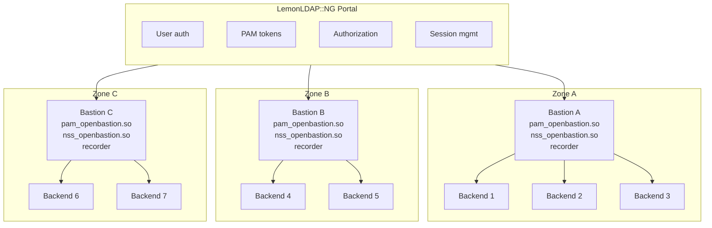
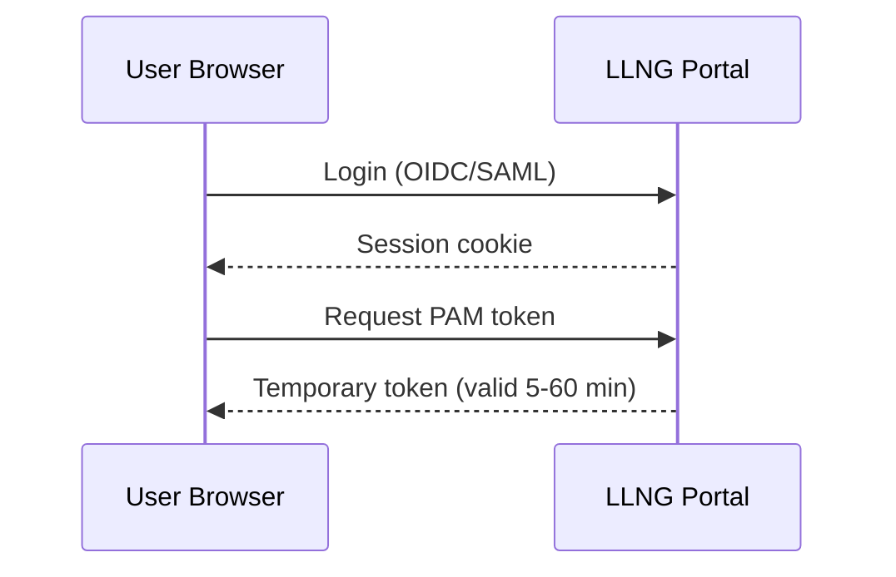
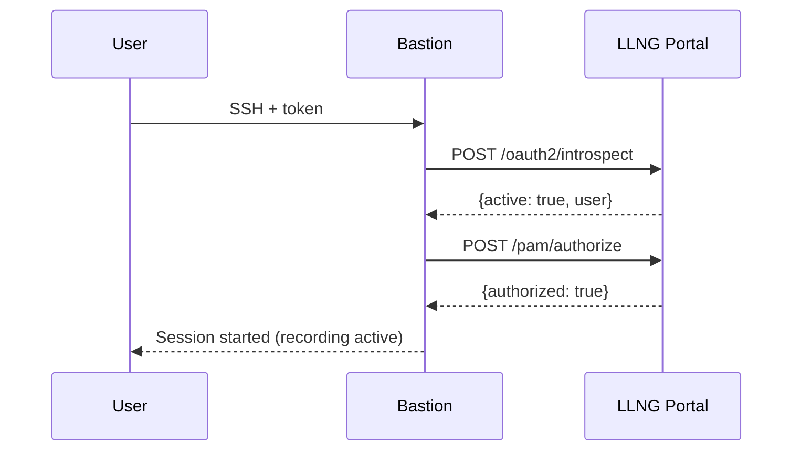
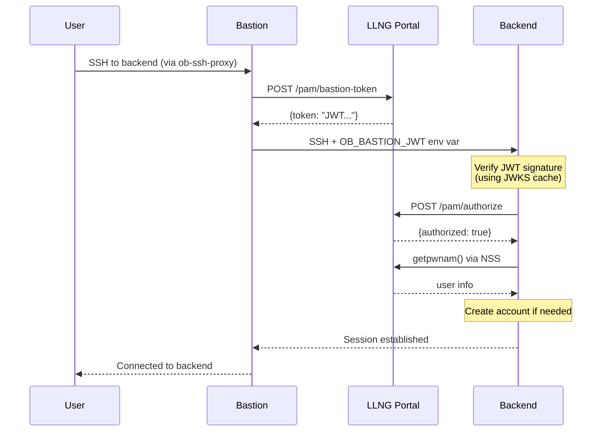
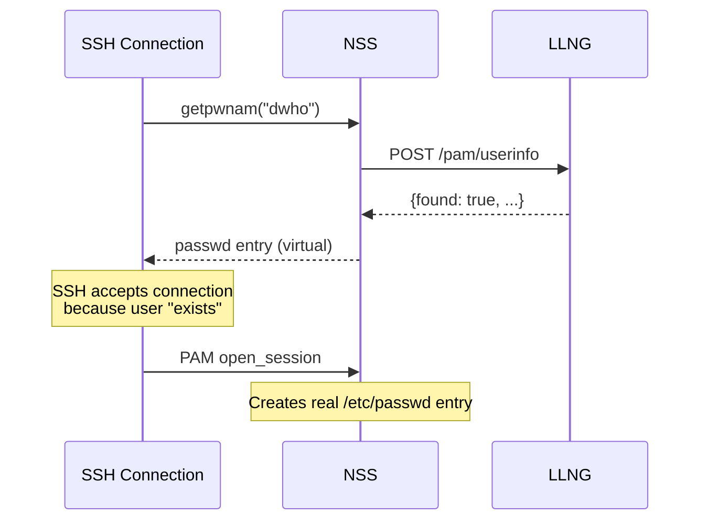
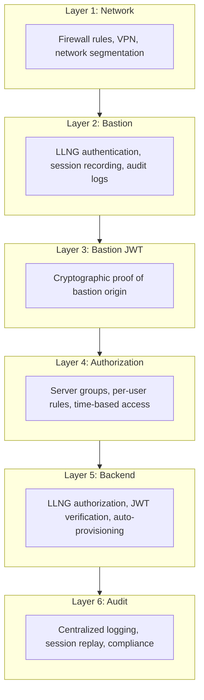
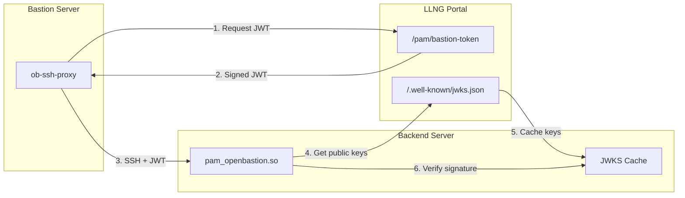

# Bastion Architecture with LemonLDAP::NG

This document describes the overall architecture for SSH access control
using LemonLDAP::NG as the central identity provider.

## Overview



## Components

### LemonLDAP::NG Portal

Central identity and access management:

- **User authentication**: OIDC, SAML, LDAP, etc.
- **PAM token generation**: Temporary tokens for SSH access
- **Authorization rules**: Per-user, per-group, per-server-group
- **Server enrollment**: Device Authorization Grant (RFC 8628)
- **Audit logging**: Centralized access logs

### Bastion Hosts

Jump servers that users connect to first:

| Component               | Purpose                                                       |
| ----------------------- | ------------------------------------------------------------- |
| `pam_openbastion.so`    | Authenticate users via LLNG tokens or authorize SSH key users |
| `libnss_openbastion.so` | Resolve LLNG users before local account exists                |
| `ob-session-recorder`   | Record all SSH sessions for audit                             |
| SSH CA                  | Optional: sign user certificates                              |

### Backend Servers

Internal servers accessed through bastions:

| Component               | Purpose                                |
| ----------------------- | -------------------------------------- |
| `pam_openbastion.so`    | Authorize access based on server_group |
| `libnss_openbastion.so` | Resolve users, auto-create accounts    |
| Standard SSH            | ProxyJump through bastion              |

## Authentication Flow

### 1. User Obtains PAM Token



### 2. User Connects to Bastion



### 3. User Jumps to Backend (with Bastion JWT)

When bastion JWT verification is enabled, the bastion must obtain a signed JWT from LLNG
before connecting to the backend. This provides cryptographic proof that the connection
originates from an authorized bastion.



The bastion JWT contains:

- `sub`: Username being proxied
- `iss`: LLNG portal URL
- `exp`: Expiration time (short-lived)
- `bastion_id`: Identifier of the bastion server
- `bastion_group`: Server group of the bastion
- `target_host`: Target backend hostname
- `user_groups`: User's LLNG groups

## Server Groups

Server groups allow different authorization rules for different environments:

**LLNG Manager Configuration** → Server Groups:

| Group Name    | Authorization Rule                    |
| ------------- | ------------------------------------- |
| `production`  | `$hGroup->{sre} or $hGroup->{oncall}` |
| `staging`     | `$hGroup->{sre} or $hGroup->{dev}`    |
| `development` | `$hGroup->{dev}`                      |
| `bastion`     | `$hGroup->{employees}`                |
| `default`     | `0` (deny all)                        |

Each server enrolls with its server_group:

```bash
# On production servers
ob-enroll -g production

# On staging servers
ob-enroll -g staging

# On bastions
ob-enroll -g bastion
```

## NSS Integration

The NSS module (`libnss_openbastion`) enables user resolution before account creation:



### nsswitch.conf

```
passwd: files llng
group:  files
shadow: files
```

### NSS Configuration

`/etc/open-bastion/nss_openbastion.conf`:

```ini
portal_url = https://auth.example.com
server_token_file = /etc/llng/server_token
timeout = 5
cache_ttl = 300
min_uid = 10000
max_uid = 60000
default_gid = 100
```

## Automatic Account Creation

When a user connects for the first time:

1. **NSS resolution**: `libnss_openbastion` queries LLNG for user info
2. **SSH accepts**: User appears to exist (virtual passwd entry)
3. **PAM session**: `pam_sm_open_session` creates real account
4. **Home directory**: Created with skel files
5. **Permissions**: Set to user's UID/GID from LLNG

### Configuration

In `/etc/open-bastion/openbastion.conf`:

```ini
create_user = true
create_user_home_base = /home
create_user_shell = /bin/bash
create_user_skel = /etc/skel
```

In `/etc/pam.d/sshd`:

```
session required pam_openbastion.so
session required pam_unix.so
```

## Session Recording

All sessions through bastions are recorded:

```
/var/lib/llng-sessions/
├── dwho/
│   ├── 20251216-103000_<uuid>.cast      # Recording
│   └── 20251216-103000_<uuid>.json      # Metadata
└── rtyler/
    └── ...
```

### sshd_config

```sshd_config
Match Group *,!admin
    ForceCommand /usr/sbin/ob-session-recorder
```

See [session-recording.md](session-recording.md) for details.

## Security Model

### Defense in Depth



### Token Security

- **Short-lived**: PAM tokens expire in 5-60 minutes
- **Single-use**: Tokens invalidated after successful use
- **IP binding**: Optional token-to-IP binding
- **Rate limiting**: Exponential backoff on failures

### Server Token Security

- **Automatic rotation**: Refresh tokens rotate server credentials
- **Secure storage**: Tokens stored with 0600 permissions
- **Per-server**: Each server has unique credentials
- **Revocable**: Admin can revoke server access in LLNG

## Setup Scripts

### Bastion Setup

Use `ob-bastion-setup` to automate bastion configuration:

```bash
sudo ob-bastion-setup --portal https://auth.example.com --server-group bastion
```

This script:

- Downloads SSH CA public key from LLNG
- Configures sshd with `TrustedUserCAKeys`
- Enables session recording via `ForceCommand`
- Configures PAM for LLNG authorization
- Enrolls the server with LLNG

Options:
| Option | Description |
|--------|-------------|
| `-p, --portal URL` | LLNG portal URL (required) |
| `-g, --server-group NAME` | Server group (default: bastion) |
| `-t, --token-file FILE` | Read server token from file |
| `-k, --insecure` | Skip SSL verification |
| `-n, --dry-run` | Show what would be done |

### Backend Setup

Use `ob-backend-setup` to automate backend server configuration:

```bash
sudo ob-backend-setup --portal https://auth.example.com --server-group production
```

This script:

- Downloads SSH CA public key from LLNG
- Configures sshd for certificate authentication
- Configures PAM with automatic user creation
- Configures sudo to use LLNG authorization
- Configures NSS for user/group resolution
- Enrolls the server with LLNG

Options:
| Option | Description |
|--------|-------------|
| `-p, --portal URL` | LLNG portal URL (required) |
| `-g, --server-group NAME` | Server group (default: default) |
| `-t, --token-file FILE` | Read server token from file |
| `--no-sudo` | Don't configure sudo |
| `--no-create-user` | Disable auto user creation |
| `-k, --insecure` | Skip SSL verification |
| `-n, --dry-run` | Show what would be done |

## SSH Certificates

Users can obtain SSH certificates from LLNG using `ob-ssh-cert`:

```bash
ob-ssh-cert --portal https://auth.example.com --validity 60
```

This uses the Device Authorization Grant to authenticate and sign the user's public key.

## Deployment Checklist

### LLNG Portal

- [ ] PAM Access plugin enabled
- [ ] SSH CA enabled (`sshCaActivation`)
- [ ] Server groups configured
- [ ] Authorization rules defined
- [ ] Device authorization enabled

### Bastion Hosts

```bash
sudo ob-bastion-setup --portal https://auth.example.com
```

Or manually:

- [ ] `pam_openbastion.so` installed
- [ ] Server enrolled (`ob-enroll`)
- [ ] PAM configured in `/etc/pam.d/sshd`
- [ ] SSH CA key configured (`TrustedUserCAKeys`)
- [ ] Session recorder configured (`ForceCommand`)
- [ ] sshd_config updated

### Backend Servers

```bash
sudo ob-backend-setup --portal https://auth.example.com -g production
```

Or manually:

- [ ] `pam_openbastion.so` installed
- [ ] `libnss_openbastion.so` installed
- [ ] Server enrolled with correct server_group
- [ ] `create_user = true` if auto-provisioning needed
- [ ] PAM, NSS, and sudo configured

## Bastion JWT Verification

Bastion JWT verification provides cryptographic assurance that SSH connections to backend
servers originate from authorized bastion servers.

### Why Bastion JWT?

Without bastion JWT verification, an attacker who:

- Obtains valid LLNG credentials, or
- Compromises a backend server's network access

...could potentially connect directly to backends, bypassing the bastion's session recording
and audit controls.

With bastion JWT:

- Backends cryptographically verify the connection source
- Direct connections are rejected, even with valid credentials
- All access is forced through audited bastion channels

### Architecture



### Configuration

#### On Bastion

```bash
# /etc/llng/ssh-proxy.conf
PORTAL_URL=https://auth.example.com
SERVER_TOKEN_FILE=/etc/open-bastion/token
SERVER_GROUP=bastion
TARGET_GROUP=backend
```

#### On Backend

```ini
# /etc/open-bastion/openbastion.conf
bastion_jwt_required = true
bastion_jwt_issuer = https://auth.example.com
bastion_jwt_jwks_url = https://auth.example.com/.well-known/jwks.json
bastion_jwt_jwks_cache = /var/cache/open-bastion/jwks.json
bastion_jwt_cache_ttl = 3600
bastion_jwt_clock_skew = 60
# bastion_jwt_allowed_bastions = bastion-01,bastion-02
```

```bash
# /etc/ssh/sshd_config.d/llng.conf
AcceptEnv OB_BASTION_JWT
```

### Offline Verification

The JWKS cache allows backends to verify JWT signatures without contacting LLNG:

1. On first connection, backend fetches JWKS from LLNG
2. Public keys are cached locally with TTL (default: 1 hour)
3. Subsequent verifications use cached keys
4. Cache is refreshed when TTL expires or key ID not found

This enables:

- Faster verification (no network latency)
- Resilience to LLNG outages
- Reduced load on LLNG portal

### JWT Claims

| Claim           | Description               |
| --------------- | ------------------------- |
| `iss`           | LLNG portal URL (issuer)  |
| `sub`           | Username being proxied    |
| `aud`           | `pam:bastion-backend`     |
| `exp`           | Expiration timestamp      |
| `iat`           | Issued-at timestamp       |
| `jti`           | Unique token ID           |
| `bastion_id`    | Bastion server identifier |
| `bastion_group` | Bastion's server group    |
| `bastion_ip`    | Bastion's IP address      |
| `target_host`   | Target backend hostname   |
| `target_group`  | Target server group       |
| `user_groups`   | User's LLNG groups        |

## See Also

- [README.md](../README.md) - Installation and configuration
- [Security Architecture](security/00-architecture.md) - Security implementation details
- [SECURITY.md](../SECURITY.md) - Security policy and reporting
- [session-recording.md](session-recording.md) - Session recording details
