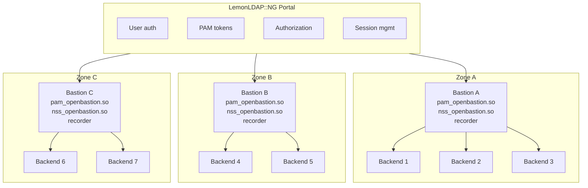
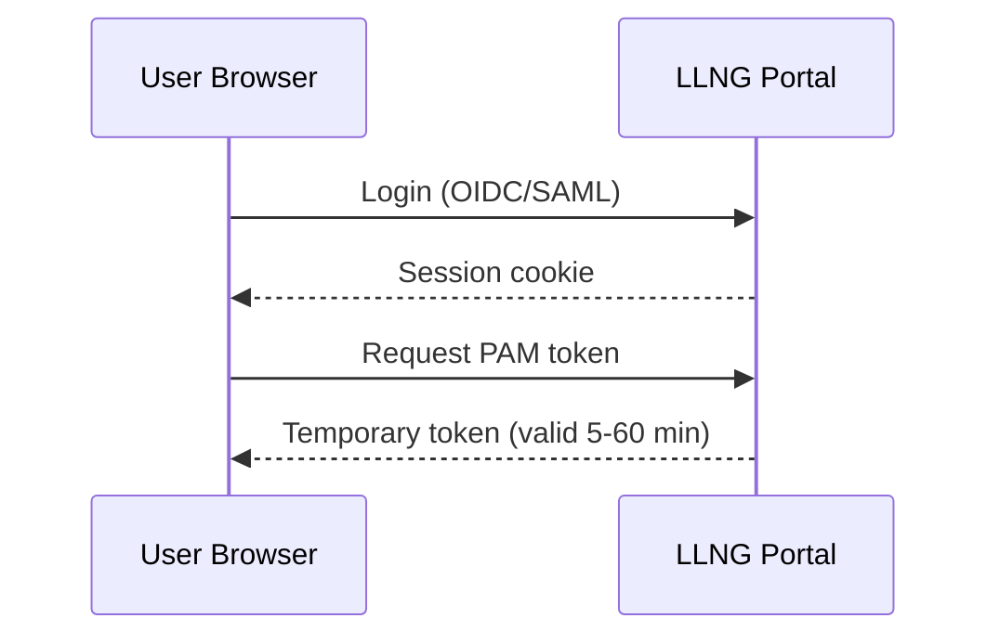
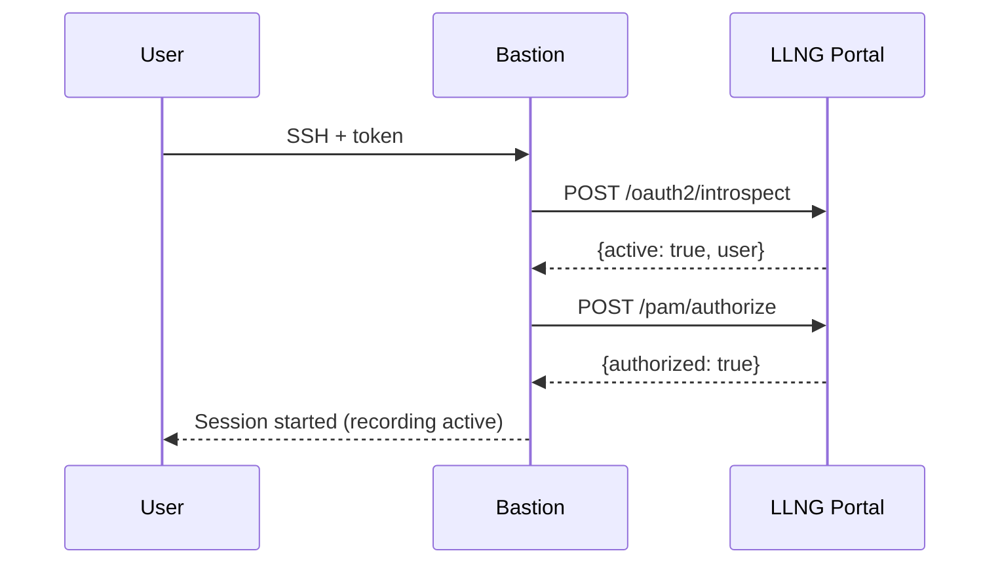
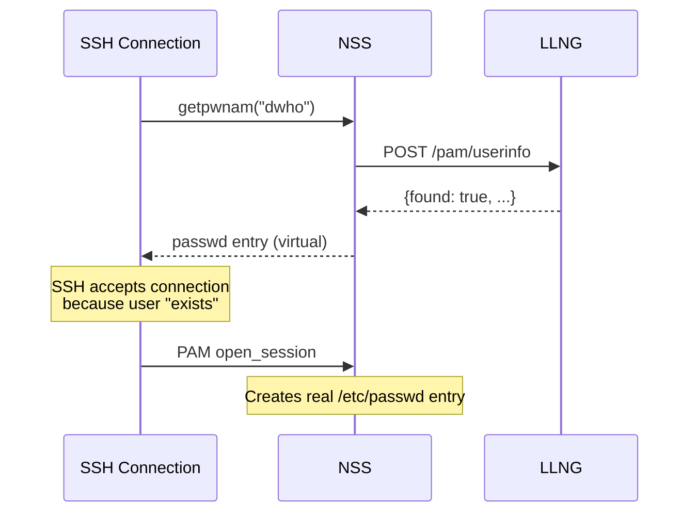
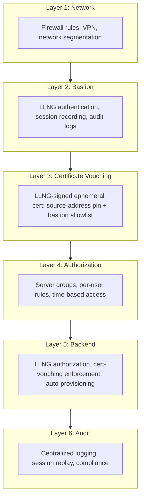

# Bastion Architecture with LemonLDAP::NG

This document describes the overall architecture for SSH access control
using LemonLDAP::NG as the central identity provider.

## Overview


```mermaid
flowchart TB
    subgraph LLNG["LemonLDAP::NG Portal"]
        direction TB
        auth["User auth"]
        tokens["PAM tokens"]
        authz["Authorization"]
        sessions["Session mgmt"]
    end

    subgraph ZoneA["Zone A"]
        BastionA["Bastion A<br/>pam_openbastion.so<br/>nss_openbastion.so<br/>recorder"]
        Backend1["Backend 1"]
        Backend2["Backend 2"]
        Backend3["Backend 3"]
    end

    subgraph ZoneB["Zone B"]
        BastionB["Bastion B<br/>pam_openbastion.so<br/>nss_openbastion.so<br/>recorder"]
        Backend4["Backend 4"]
        Backend5["Backend 5"]
    end

    subgraph ZoneC["Zone C"]
        BastionC["Bastion C<br/>pam_openbastion.so<br/>nss_openbastion.so<br/>recorder"]
        Backend6["Backend 6"]
        Backend7["Backend 7"]
    end

    LLNG --> BastionA
    LLNG --> BastionB
    LLNG --> BastionC

    BastionA --> Backend1
    BastionA --> Backend2
    BastionA --> Backend3

    BastionB --> Backend4
    BastionB --> Backend5

    BastionC --> Backend6
    BastionC --> Backend7
```

## Components

### LemonLDAP::NG Portal

Central identity and access management:

- **User authentication**: OIDC, SAML, LDAP, etc.
- **PAM token generation**: Temporary tokens for SSH access
- **Authorization rules**: Per-user, per-group, per-server-group
- **Server enrollment**: Device Authorization Grant (RFC 8628)
- **Audit logging**: Centralized access logs

### Bastion Hosts

Jump servers that users connect to first:

| Component               | Purpose                                                       |
| ----------------------- | ------------------------------------------------------------- |
| `pam_openbastion.so`    | Authenticate users via LLNG tokens or authorize SSH key users |
| `libnss_openbastion.so` | Resolve LLNG users before local account exists                |
| `ob-session-recorder`   | Record all SSH sessions for audit                             |
| SSH CA                  | Optional: sign user certificates                              |

### Backend Servers

Internal servers accessed through bastions:

| Component               | Purpose                                                     |
| ----------------------- | ----------------------------------------------------------- |
| `pam_openbastion.so`    | Authorize access; enforce bastion allowlist via cert key-id |
| `libnss_openbastion.so` | Resolve users, auto-create accounts                         |
| Standard SSH            | Accept connections through bastion (cert vouching)          |

## Authentication Flow

### 1. User Obtains PAM Token


```mermaid
sequenceDiagram
    participant User as User Browser
    participant LLNG as LLNG Portal

    User->>LLNG: Login (OIDC/SAML)
    LLNG-->>User: Session cookie

    User->>LLNG: Request PAM token
    LLNG-->>User: Temporary token (valid 5-60 min)
```

### 2. User Connects to Bastion


```mermaid
sequenceDiagram
    participant User
    participant Bastion
    participant LLNG as LLNG Portal

    User->>Bastion: SSH + token
    Bastion->>LLNG: POST /oauth2/introspect
    LLNG-->>Bastion: {active: true, user}

    Bastion->>LLNG: POST /pam/authorize
    LLNG-->>Bastion: {authorized: true}

    Bastion-->>User: Session started (recording active)
```

### 3. User Jumps to Backend (Certificate Vouching)

The bastion vouches for the user by obtaining a short-lived LLNG-signed SSH certificate
bound to that specific hop. The previous `LLNG_BASTION_JWT` / `SendEnv` approach was
structurally broken: `SendEnv`/`AcceptEnv` populate only the child-process environment,
never the PAM environment that `pam_getenv` reads at any stage, so a backend with
`bastion_jwt_required=true` rejected every session.

```mermaid
sequenceDiagram
    participant User
    participant Bastion
    participant LLNG as LLNG Portal
    participant Backend

    User->>Bastion: SSH (SSO cert) → pam_openbastion calls POST /pam/authorize
    LLNG-->>Bastion: {authorized: true, bastion_voucher: "..."}
    Note over Bastion: pam_putenv("LLNG_BASTION_VOUCHER=...")<br/>merged into session env (UsePAM yes)

    User->>Bastion: ob-ssh user@backend
    Note over Bastion: ob-ssh mints ephemeral ed25519 keypair in tmpfs
    Bastion->>Bastion: sudo ob-bastion-cert-helper (NOPASSWD, root-only server token)
    Bastion->>LLNG: POST /pam/bastion-cert (Bearer=server token,<br/>body={voucher, pubkey, user, target_host, target_group})
    Note over LLNG: Re-checks gates: device-code grant,<br/>pam:server scope, server_group ∈ pamAccessBastionGroups,<br/>per-(bastion_id,user) voucher
    LLNG-->>Bastion: Signed user cert (principal=user, ttl≈120s,<br/>key-id=bastion=<id>;user=<u>;target=<host>,<br/>source-address=bastion IP)

    Bastion->>Backend: ssh -i <eph> -o CertificateFile=<cert> user@backend
    Note over Backend: sshd: TrustedUserCAKeys validates CA sig,<br/>source-address critical option rejects off-bastion IPs,<br/>AuthorizedPrincipalsCommand checks key-id bastion=<id> ∈ allowed_bastions

    Backend->>LLNG: POST /pam/authorize
    LLNG-->>Backend: {authorized: true}

    Backend->>LLNG: getpwnam() via NSS
    LLNG-->>Backend: user info

    Note over Backend: Create account if needed

    Backend-->>Bastion: Session established
    Bastion-->>User: Connected to backend
```

The ephemeral certificate carries:

- `principal`: username
- `key-id`: `bastion=<bastion_id>;user=<user>;target=<target_host>` (audit + allowlist)
- `source-address` critical option: bastion IP (sshd refuses it from any other source)
- Validity: ~120 s (`pamAccessBastionCertTtl`)

The voucher is reusable for the duration of the user's SSO session (up to
`pamAccessBastionVoucherTtl`, default 12 h, capped by the user's SSO cert expiry). On
expiry `ob-ssh` exits with a clear error and the user reconnects to the bastion to
obtain a fresh voucher (fail-closed; no silent re-vouching).

## Server Groups

Server groups allow different authorization rules for different environments.

Configure in `/etc/lemonldap-ng/lemonldap-ng.ini`, section `[portal]`:

```ini
[portal]
pamAccessServerGroups = { \
    production  => '$hGroup->{sre} or $hGroup->{oncall}', \
    staging     => '$hGroup->{sre} or $hGroup->{dev}', \
    development => '$hGroup->{dev}', \
    bastion     => '$hGroup->{employees}', \
    default     => '0' \
}
```

Each server enrolls with its server_group:

```bash
# On production servers
ob-enroll -g production

# On staging servers
ob-enroll -g staging

# On bastions
ob-enroll -g bastion
```

## NSS Integration

The NSS module (`libnss_openbastion`) enables user resolution before account creation:


```mermaid
sequenceDiagram
    participant SSH as SSH Connection
    participant NSS
    participant LLNG

    SSH->>NSS: getpwnam("dwho")
    NSS->>LLNG: POST /pam/userinfo
    LLNG-->>NSS: {found: true, ...}
    NSS-->>SSH: passwd entry (virtual)

    Note over SSH: SSH accepts connection<br/>because user "exists"

    SSH->>NSS: PAM open_session
    Note over NSS: Creates real /etc/passwd entry
```

### nsswitch.conf

```
passwd: files openbastion
group:  files
shadow: files
```

### NSS Configuration

`/etc/open-bastion/nss_openbastion.conf`:

```ini
portal_url = https://auth.example.com
server_token_file = /var/lib/open-bastion/token
timeout = 5
cache_ttl = 300
min_uid = 10000
max_uid = 60000
default_gid = 100
```

## Automatic Account Creation

When a user connects for the first time:

1. **NSS resolution**: `libnss_openbastion` queries LLNG for user info
2. **SSH accepts**: User appears to exist (virtual passwd entry)
3. **PAM session**: `pam_sm_open_session` creates real account
4. **Home directory**: Created with skel files
5. **Permissions**: Set to user's UID/GID from LLNG

### Configuration

In `/etc/open-bastion/openbastion.conf`:

```ini
create_user = true
create_user_home_base = /home
create_user_shell = /bin/bash
create_user_skel = /etc/skel
```

In `/etc/pam.d/sshd`:

```
session required pam_openbastion.so
session required pam_unix.so
```

## Session Recording

All sessions through bastions are recorded:

```
/var/lib/open-bastion/sessions/
├── dwho/
│   ├── 20251216-103000_<uuid>.cast      # Recording
│   └── 20251216-103000_<uuid>.json      # Metadata
└── rtyler/
    └── ...
```

### sshd_config

```sshd_config
Match Group *,!admin
    ForceCommand /usr/sbin/ob-session-recorder
```

See [session-recording.md](session-recording.md) for details.

## Security Model

### Defense in Depth


```mermaid
flowchart TB
    subgraph L1["Layer 1: Network"]
        N[Firewall rules, VPN, network segmentation]
    end

    subgraph L2["Layer 2: Bastion"]
        B[LLNG authentication, session recording, audit logs]
    end

    subgraph L3["Layer 3: Certificate Vouching"]
        J[LLNG-signed ephemeral cert: source-address pin + bastion allowlist]
    end

    subgraph L4["Layer 4: Authorization"]
        A[Server groups, per-user rules, time-based access]
    end

    subgraph L5["Layer 5: Backend"]
        BE[LLNG authorization, cert-vouching enforcement, auto-provisioning]
    end

    subgraph L6["Layer 6: Audit"]
        AU[Centralized logging, session replay, compliance]
    end

    L1 --> L2 --> L3 --> L4 --> L5 --> L6
```

### Token Security

- **Short-lived**: PAM tokens expire in 5-60 minutes
- **Single-use**: Tokens invalidated after successful use
- **IP binding**: Optional token-to-IP binding
- **Rate limiting**: Exponential backoff on failures
- **SSH key binding**: When the SSH session is authenticated with a
  CA-signed certificate, the PAM module extracts the SHA256 fingerprint
  of the user's SSH key from `SSH_USER_AUTH` and forwards it to LLNG in
  **both** `/pam/authorize` (PAM `account` phase, at every SSH
  connection) and `/pam/verify` (token verification, used for sudo and
  re-authentication). LLNG checks that the fingerprint is present in
  the user's persistent session (`_sshCerts`), is not revoked and is
  not expired. If the check fails, LLNG refuses authorization (so the
  SSH session cannot open) and rejects token verification (so sudo
  cannot elevate). This binds both the SSH session and the PAM token
  to the specific SSH certificate registered in LLNG, even when the
  local `sshd` KRL is stale or not enforced.

### Server Token Security

- **Automatic rotation**: Refresh tokens rotate server credentials
- **Secure storage**: Tokens stored with 0600 permissions
- **Per-server**: Each server has unique credentials
- **Revocable**: Admin can revoke server access in LLNG

## Setup Scripts

### Bastion Setup

Use `ob-bastion-setup` to automate bastion configuration:

```bash
sudo ob-bastion-setup --portal https://auth.example.com --server-group bastion
```

This script:

- Downloads SSH CA public key from LLNG
- Configures sshd with `TrustedUserCAKeys`
- Enables session recording via `ForceCommand`
- Configures PAM for LLNG authorization
- Enrolls the server with LLNG

Options:
| Option | Description |
|--------|-------------|
| `-p, --portal URL` | LLNG portal URL (required) |
| `-g, --server-group NAME` | Server group (default: bastion) |
| `-t, --token-file FILE` | Read server token from file |
| `-k, --insecure` | Skip SSL verification |
| `-n, --dry-run` | Show what would be done |

### Backend Setup

Use `ob-backend-setup` to automate backend server configuration:

```bash
sudo ob-backend-setup --portal https://auth.example.com --server-group production
```

This script:

- Downloads SSH CA public key from LLNG
- Configures sshd for certificate authentication
- Configures PAM with automatic user creation
- Configures sudo to use LLNG authorization
- Configures NSS for user/group resolution
- Enrolls the server with LLNG

Options:
| Option | Description |
|--------|-------------|
| `-p, --portal URL` | LLNG portal URL (required) |
| `-g, --server-group NAME` | Server group (default: default) |
| `-t, --token-file FILE` | Read server token from file |
| `--no-sudo` | Don't configure sudo |
| `--no-create-user` | Disable auto user creation |
| `-k, --insecure` | Skip SSL verification |
| `-n, --dry-run` | Show what would be done |

## SSH Certificates

Users can obtain SSH certificates from LLNG using `ob-ssh-cert`:

```bash
ob-ssh-cert --portal https://auth.example.com --validity 60
```

This uses the Device Authorization Grant to authenticate and sign the user's public key.

## Deployment Checklist

### LLNG Portal

- [ ] PAM Access plugin enabled
- [ ] SSH CA enabled (`sshCaActivation`)
- [ ] Server groups configured
- [ ] Authorization rules defined
- [ ] Device authorization enabled

### Bastion Hosts

```bash
sudo ob-bastion-setup --portal https://auth.example.com
```

Or manually:

- [ ] `pam_openbastion.so` installed
- [ ] Server enrolled (`ob-enroll`)
- [ ] PAM configured in `/etc/pam.d/sshd`
- [ ] SSH CA key configured (`TrustedUserCAKeys`)
- [ ] Session recorder configured (`ForceCommand`)
- [ ] sshd_config updated

### Backend Servers

```bash
sudo ob-backend-setup --portal https://auth.example.com -g production \
    --allowed-bastions bastion-01,bastion-02
```

Or manually:

- [ ] `pam_openbastion.so` installed
- [ ] `libnss_openbastion.so` installed
- [ ] Server enrolled with correct server_group
- [ ] `create_user = true` if auto-provisioning needed
- [ ] PAM, NSS, and sudo configured
- [ ] `AuthorizedPrincipalsCommand` wired (`ob-ssh-principals`)
- [ ] `/etc/open-bastion/allowed_bastions` written (0644)
- [ ] `bastion_jwt_*` keys and `AcceptEnv LLNG_BASTION_JWT` removed from existing configs

## Certificate Vouching (Bastion→Backend)

Certificate vouching provides cryptographic assurance that SSH connections to backend
servers originate from an authorized bastion and that the user genuinely connected to
that bastion.

### Why Certificate Vouching?

The previous mechanism (`LLNG_BASTION_JWT` passed via `SendEnv`/`AcceptEnv`) was
structurally broken: `SendEnv`/`AcceptEnv` populate only the SSH child-process
environment, never the PAM environment that `pam_getenv` reads (at account or session
stage, with or without a PTY). A `pam_exec.so` probe confirms the variable is always
unset in the PAM context. Consequently, any backend configured with
`bastion_jwt_required=true` rejected every session. All `bastion_jwt_*` config keys and
`AcceptEnv LLNG_BASTION_JWT` have been removed.

The replacement avoids the PAM env problem entirely: the bastion mints an ephemeral SSH
keypair, asks LLNG to sign it as a ~120 s user certificate, and connects to the backend
with that certificate. Backend enforcement is at the sshd layer (certificate validation),
not the PAM layer.

Without certificate vouching, an attacker who obtains valid LLNG credentials or
network access to a backend could connect directly, bypassing the bastion's session
recording and audit controls. With certificate vouching:

- Backends cryptographically verify the connection originates from an authorized bastion IP
- Direct user connections are rejected (cert key-id lacks the `bastion=` prefix)
- All access is forced through audited bastion channels

### Architecture

```mermaid
flowchart LR
    subgraph Bastion["Bastion Server"]
        proxy["ob-ssh"]
        helper["ob-bastion-cert-helper\n(sudoers NOPASSWD)"]
    end

    subgraph LLNG["LLNG Portal"]
        authorize["/pam/authorize\n(mints voucher)"]
        bastion_cert["/pam/bastion-cert\n(signs ephemeral key)"]
    end

    subgraph Backend["Backend Server"]
        sshd["sshd\nTrustedUserCAKeys\nsource-address check"]
        principals["ob-ssh-principals\n(AuthorizedPrincipalsCommand)"]
    end

    proxy -->|1. sudo call| helper
    helper -->|2. POST {voucher, pubkey, user, target}| bastion_cert
    bastion_cert -->|3. Signed cert (~120s)| helper
    helper -->|4. cert| proxy
    proxy -->|5. ssh -i eph -o CertificateFile=cert| sshd
    sshd -->|6. check key-id + allowed_bastions| principals
```

### How the Voucher Reaches `ob-ssh`

When the user SSHes to the bastion, `pam_openbastion` (account stage) calls
`POST /pam/authorize`. LLNG mints a reusable voucher bound to `(bastion_id, user)`,
stores it in the user's persistent LLNG session, and returns it in the authorize
response. `pam_openbastion` calls `pam_putenv("LLNG_BASTION_VOUCHER=...")`. Because
the bastion runs `UsePAM yes`, sshd merges the PAM environment into the session via
`pam_getenvlist`, so `ob-ssh` inherits the variable directly — no cross-host
transport, no `SendEnv`.

The voucher is reusable (e.g. `scp backend1:/f backend2:/g` = two cert requests, same
voucher). Its validity is `min(now + pamAccessBastionVoucherTtl, userCert.expires_at)`
(default cap: 43200 s / 12 h). On expiry, `POST /pam/bastion-cert` returns
`voucher_expired`; `ob-ssh` prints a clear reconnect message and exits non-zero.

### Why `ob-bastion-cert-helper` (no setuid)

The bastion's server token (Bearer for `POST /pam/bastion-cert`) must be root-readable
only. `ob-ssh` runs as the connecting user, so it cannot read the token directly.
A narrow `sudoers` `NOPASSWD` rule allows the user to invoke `ob-bastion-cert-helper`,
which reads the token, calls LLNG, and always mints for `$SUDO_USER` (the invoking user,
not the sudoers target). No setuid binary is introduced.

### Configuration

#### On Bastion (no change to `openbastion.conf` needed)

```bash
# /etc/open-bastion/ssh-proxy.conf
PORTAL_URL=https://auth.example.com
SERVER_TOKEN_FILE=/var/lib/open-bastion/token
SERVER_GROUP=bastion
TARGET_GROUP=backend
```

#### On Backend

Run `ob-backend-setup` with the `--allowed-bastions` option to configure backend
enforcement. The `bastion_jwt_*` keys and `AcceptEnv LLNG_BASTION_JWT` are no longer
used and must be removed from existing deployments.

```bash
sudo ob-backend-setup --portal https://auth.example.com \
    --server-group production \
    --allowed-bastions bastion-01,bastion-02
```

This writes `/etc/open-bastion/allowed_bastions` (world-readable 0644 in a 0711
directory so the helper, running as nobody, can read it) and wires
`AuthorizedPrincipalsCommand`. Ansible variable: `ob_bastion_allowed_bastions`.

```ini
# /etc/ssh/sshd_config.d/00-open-bastion-backend.conf  (managed by ob-backend-setup)
TrustedUserCAKeys /etc/open-bastion/llng_ca.pub
AuthorizedPrincipalsCommand /usr/local/sbin/ob-ssh-principals %u %f %i
AuthorizedPrincipalsCommandUser nobody
# AcceptEnv LLNG_BASTION_JWT   ← REMOVED
```

`ob-ssh-principals` emits the username as principal only when the cert key-id matches
`bastion=<id>;user=<u>;...`, the user `<u>` equals the login user, and `<id>` is listed
in `/etc/open-bastion/allowed_bastions` (empty file = accept any vouched bastion; absent
file = legacy non-enforcing mode; present-but-unreadable = fail closed). A direct user
SSO cert (no `bastion=` key-id prefix) is rejected before PAM runs.

#### LLNG Portal (`pam-access` plugin)

| Parameter                    | Default   | Description                                                                     |
| ---------------------------- | --------- | ------------------------------------------------------------------------------- |
| `pamAccessBastionGroups`     | `bastion` | Server groups whose tokens may call `/pam/bastion-cert`                         |
| `pamAccessBastionVoucherTtl` | `43200`   | Max voucher age in seconds (12 h); effective exp also capped by SSO cert expiry |
| `pamAccessBastionCertTtl`    | `120`     | Ephemeral user-cert validity in seconds                                         |

The `ssh-ca` plugin must be active (`sshCaActivation=1`). `bastion_id` equals the
enrolling OIDC `client_id`; give each bastion its own OIDC client to distinguish them.

### Ephemeral Certificate Fields

| Field            | Value                                                            |
| ---------------- | ---------------------------------------------------------------- |
| Principal        | username                                                         |
| Key-ID           | `bastion=<bastion_id>;user=<user>;target=<target_host>`          |
| Validity         | ~120 s (`pamAccessBastionCertTtl`)                               |
| `source-address` | Bastion IP (sshd rejects cert from any other source)             |
| Extension        | `bastion-id@open-bastion = <bastion_id>` (optional, for tooling) |

## See Also

- [README.md](../README.md) - Installation and configuration
- [Security Architecture](security/00-architecture.md) - Security implementation details
- [SECURITY.md](../SECURITY.md) - Security policy and reporting
- [session-recording.md](session-recording.md) - Session recording details
