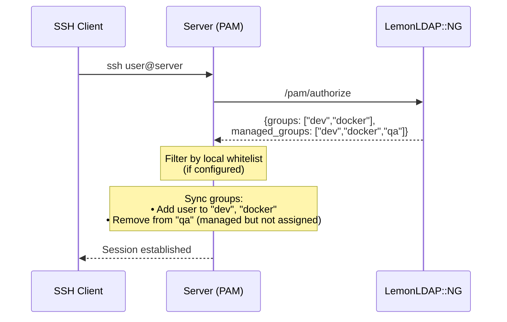

# LemonLDAP::NG Configuration

Before deploying the PAM module on your servers, you need to configure LemonLDAP::NG.

## Step 1: Install the Plugins

Copy the plugins from the [`llng-plugin`](../llng-plugin) directory to your LemonLDAP::NG installation:

```bash
sudo cp -r llng-plugin/usr/share/* /usr/share/
```

This installs the 3 Open Bastion plugins for LemonLDAP::NG:

- **PamAccess** - Main plugin: token generation interface and authorization endpoints (`/pam/authorize`, `/pam/bastion-token`)
- **OIDCDeviceAuthorization** - Server enrollment via OAuth 2.0 Device Authorization Grant (RFC 8628)
- **SSHCA** _(optional)_ - SSH Certificate Authority for certificate-based authentication

## Step 2: Create the OIDC Relying Party

In the LLNG Manager, create a new OIDC Relying Party:

1. Go to **OpenID Connect Relying Parties** → **Add**
2. Configure:
   - **Client ID**: `pam-access`
   - **Client secret**: Generate a strong secret
   - **Allowed grant types**: Enable `device_code` (for server enrollment)
   - **Allowed scopes**: `openid`, `pam:server`

## Step 3: Enable the Plugins

Use `customPlugins` inside `lemonldap-ng.ini`, section `[portal]`:

- without SSHCA:

```ini
[portal]
customPlugins = ::Plugin::OIDCDeviceAuthorization, ::Plugins::PamAccess
```

- with SSHCA

```ini
[portal]
customPlugins = ::Plugin::OIDCDeviceAuthorization, ::Plugins::PamAccess, ::Plugins::SSHCA
```

## Step 4: Plugin Parameters

Additional and optional parameters that can be inserted into `lemonldap-ng.ini`, section `[portal]`:

### General Parameters

| Parameter                                       | Default      | Description                                                                                        |
| ----------------------------------------------- | ------------ | -------------------------------------------------------------------------------------------------- |
| `oidcServiceDeviceAuthorizationExpiration`      | `600` (10mn) | Device authorization expiration time                                                               |
| `oidcServiceDeviceAuthorizationPollingInterval` | `5`          | Polling interval in seconds                                                                        |
| `oidcServiceDeviceAuthorizationUserCodeLength`  | `8`          | Length of user code                                                                                |
| `portalDisplayPamAccess`                        | `0`          | Set to 1 (or a rule) to display PAM tab                                                            |
| `pamAccessRp`                                   | `pam-access` | OIDC Relying Party name                                                                            |
| `pamAccessTokenDuration`                        | `600` (10mn) | Token duration                                                                                     |
| `pamAccessMaxDuration`                          | `3600` (1h)  | Maximum token duration                                                                             |
| `pamAccessExportedVars`                         | `{}`         | Exported variables                                                                                 |
| `pamAccessOfflineTtl`                           | `86400` (1d) | Offline cache TTL                                                                                  |
| `pamAccessSshRules`                             | `{}`         | SSH access rules                                                                                   |
| `pamAccessServerGroups`                         | `{}`         | Server groups configuration                                                                        |
| `pamAccessSudoRules`                            | `{}`         | Sudo rules                                                                                         |
| `pamAccessOfflineEnabled`                       | `0`          | Enable offline mode                                                                                |
| `pamAccessHeartbeatInterval`                    | `300` (5mn)  | Heartbeat interval                                                                                 |
| `pamAccessManagedGroups`                        | `{}`         | Unix groups managed by LLNG per server group (see [Group Synchronization](#group-synchronization)) |

When offline mode is enabled, the server-side cache is protected by
[Cache Brute-Force Protection](security.md#cache-brute-force-protection).

### SSH CA Parameters (optional)

| Parameter               | Default    | Description                               |
| ----------------------- | ---------- | ----------------------------------------- |
| `portalDisplaySshCa`    | `0`        | Set to 1 (or a rule) to display SSHCA tab |
| `sshCaCertMaxValidity`  | `365` (1y) | Maximum certificate validity              |
| `sshCaSerialPath`       | `""`       | Path for certificate serial storage       |
| `sshCaPrincipalSources` | `$uid`     | Principal sources                         |
| `sshCaKrlPath`          | `""`       | Path for Key Revocation List              |

## Step 4.1: Generate and Import the SSH CA Key (optional)

If you're using the SSH CA plugin for key-based authentication, you need to generate a CA key pair and import it into LemonLDAP::NG.

### Generate the SSH CA Key Pair

```bash
# Generate Ed25519 CA key pair (recommended)
openssl genpkey -algorithm ed25519 -out ssh-ca.key
openssl pkey -in ssh-ca.key -pubout -out ssh-ca.pub

# Display keys for import into LLNG Manager
echo "=== Private Key (copy this) ==="
cat ssh-ca.key
echo "=== Public Key (copy this) ==="
cat ssh-ca.pub
```

Alternatively, for compatibility with older systems, use RSA:

```bash
openssl genpkey -algorithm RSA -pkeyopt rsa_keygen_bits:4096 -out ssh-ca.key
openssl pkey -in ssh-ca.key -pubout -out ssh-ca.pub
```

### Import the Key into LLNG

#### Via Manager (LemonLDAP::NG >= 2.22)

1. Go to **General Parameters** → **Keys** → **Add a key**
2. Set a key name (e.g., `ssh-ca`)
3. Paste the private key content into **Private key**
4. Paste the public key content into **Public key**
5. Save the configuration

Then configure the SSH CA plugin to use this key inside `lemonldap-ng.ini`, section `[portal]`:

```ini
[portal]
sshCaKeyRef = ssh-ca
```

#### Via lemonldap-ng.ini

Insert this into `lemonldap-ng.ini`, section `[portal]`:

```ini
[portal]
keys = { ssh-ca => { keyPublic => "<public key value>", keyPrivate => "<private key value>" } }
sshCaKeyRef = ssh-ca
```

### Create directories for SSH CA state files

```bash
sudo mkdir -p /var/lib/lemonldap-ng/ssh
sudo chown www-data:www-data /var/lib/lemonldap-ng/ssh
```

These directories store the certificate serial number counter and the Key Revocation List (KRL).

## Step 5: Restart LemonLDAP::NG

```bash
sudo systemctl restart lemonldap-ng-fastcgi-server
# or
sudo systemctl restart apache2  # if using mod_perl
```

## Server Groups

Server groups allow different authorization rules for different server categories.

### Configure in LLNG Manager

```
General Parameters > Plugins > PAM Access > Server Groups

production => $hGroup->{ops}
staging    => $hGroup->{ops} or $hGroup->{dev}
dev        => $hGroup->{dev}
default    => 1
```

### Configure on Each Server

In `/etc/open-bastion/openbastion.conf`:

```ini
server_group = production
```

Or during enrollment:

```bash
sudo ob-enroll -g production
```

## Group Synchronization

The group synchronization feature (#38) allows LemonLDAP::NG to manage Unix supplementary groups on target servers. When a user connects via SSH, their Unix groups are synchronized with the groups defined in LLNG.

### Configuration

In `lemonldap-ng.ini`, configure which groups LLNG should manage for each server group:

```perl
pamAccessManagedGroups = {
    production => 'docker,developers,readonly',
    staging => 'developers,testers',
    bastion => 'operators,auditors',
    default => ''
}
```

- Groups listed in `pamAccessManagedGroups` will be created automatically on the server if they don't exist
- Users are added to groups they're assigned to in LLNG
- Users are removed from managed groups they're no longer assigned to in LLNG
- Groups NOT in `pamAccessManagedGroups` are never modified (local groups are preserved)

### How It Works



### Security Considerations

- **Principle of least privilege**: Don't include privileged groups (sudo, wheel, admin) in `managed_groups`
- **Audit trail**: All group modifications are logged with event type `GROUP_SYNC`
- **Offline behavior**: Group sync uses cached group information when LLNG is unreachable
- **File protection**: Group modifications use system tools (`groupadd`, `gpasswd`) which handle `/etc/group` and `/etc/gshadow` atomically

### Local Whitelist (Defense-in-Depth)

Administrators can optionally configure a local whitelist of groups allowed to be managed on each server. This provides defense-in-depth by restricting which groups LLNG can actually modify, regardless of what `managed_groups` it sends.

In `/etc/open-bastion/openbastion.conf`:

```ini
# Only allow these groups to be managed by LLNG on this server
allowed_managed_groups = docker,developers,readonly
```

When configured:

- Groups must be in BOTH `pamAccessManagedGroups` (from LLNG) AND `allowed_managed_groups` (local) to be synced
- Groups sent by LLNG but not in the local whitelist are silently ignored
- This allows local administrators to have final control over which groups can be managed

**Use cases:**

- Restrict LLNG to manage only specific groups on sensitive servers
- Allow different group policies per server even within the same server group
- Provide a safety net against misconfigured LLNG policies

### Example: Per-Environment Groups

```perl
# Developer groups differ by environment
pamAccessManagedGroups = {
    production => 'app-users,readonly',           # Read-only in prod
    staging => 'app-users,developers,docker',     # Full dev access in staging
    bastion => 'operators'                        # Bastion operators only
}
```

When a user moves from staging to production access, their docker and developers group memberships are automatically removed on production servers.

## See Also

- [PAM Authentication Modes](pam-modes.md) - Configure PAM on servers
- [Configuration Reference](configuration.md) - All configuration options
- [Admin Guide](admin-guide.md) - Complete administration guide
