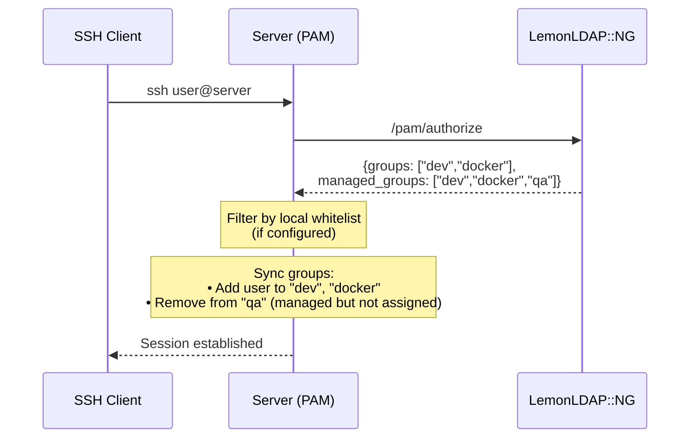

# LemonLDAP::NG Configuration

Before deploying the PAM module on your servers, you need to configure LemonLDAP::NG.

## Step 1: Install the Plugins

The Open Bastion plugins are available from the [Linagora plugin store](https://linagora.github.io/lemonldap-ng-plugins/).

### Option A: Debian/Ubuntu (APT)

Add the Linagora plugin repository and install:

```bash
# Add repository key
curl -fsSL https://linagora.github.io/lemonldap-ng-plugins/store-key.asc \
  | sudo gpg --dearmor -o /usr/share/keyrings/linagora-llng-plugins.gpg

# Add repository
echo "deb [signed-by=/usr/share/keyrings/linagora-llng-plugins.gpg] https://linagora.github.io/lemonldap-ng-plugins/debian stable main" \
  | sudo tee /etc/apt/sources.list.d/llng-plugins.list

# Install (pick pam-access and/or ssh-ca depending on your auth mode)
sudo apt-get update
sudo apt-get install \
  lemonldap-ng-plugin-oidc-device-authorization \
  lemonldap-ng-plugin-oidc-device-organization \
  lemonldap-ng-plugin-pam-access \
  lemonldap-ng-plugin-ssh-ca
# pam-access = token-based auth; ssh-ca = certificate-based auth
```

### Option B: Plugin-store CLI (`lemonldap-ng-store`)

The `lemonldap-ng-store` CLI installs and activates plugins from the store
regardless of the OS package manager. It is **bundled with LemonLDAP::NG 2.24.0
and later**; on earlier versions it is provided by the lemonldap-ng-plugins store
itself — install the `linagora-lemonldap-ng-store` package first (from the
Linagora repository set up in Option A).

```bash
sudo lemonldap-ng-store add-store https://linagora.github.io/lemonldap-ng-plugins/
sudo lemonldap-ng-store install oidc-device-authorization --activate
sudo lemonldap-ng-store install oidc-device-organization --activate
sudo lemonldap-ng-store install pam-access --activate   # token-based auth
sudo lemonldap-ng-store install ssh-ca     --activate   # certificate-based auth
sudo systemctl restart lemonldap-ng-fastcgi-server
```

With the Autoloader present (see Step 3), `--activate` is a no-op: the store drops
each plugin's autoload rule into `/etc/lemonldap-ng/autoload.d/` and the plugin
loads once its activation condition is truthy. (Only on a portal without the
Autoloader does `--activate` fall back to editing `customPlugins`.)

> **RPM / non-Debian systems:** the `linagora-lemonldap-ng-store` package is
> currently Debian-only, so until LemonLDAP::NG **2.24.0** bundles the CLI there
> is no packaged plugin-install path on RHEL / Rocky / Fedora. Use a Docker image
> (Option C) or run the portal on Debian in the meantime.

### Option C: Docker

The LemonLDAP::NG portal/manager images tagged **2.23.0-1 or later** already
bundle the Open Bastion plugins — `yadd/lemonldap-ng-portal`,
`yadd/lemonldap-ng-manager` and `yadd/lemonldap-ng-full` (the high-performance
uWSGI portal is a tag variant of the portal image, e.g.
`yadd/lemonldap-ng-portal:2.23.0-1-hiperf`). They also ship the Autoloader
enabled, so no extra installation is needed — just activate the plugins (see
Step 3). See the full image set at
<https://github.com/guimard/llng-docker/>.

### Plugins used by Open Bastion

- **OIDCDeviceAuthorization** - Server enrollment via OAuth 2.0 Device Authorization Grant (RFC 8628)
- **OIDCDeviceOrganization** - Extension for organizational device enrollment (tokens identify the device, not the approving admin)
- **PamAccess** _(optional)_ - Token-based authentication and bastion vouching: authorization endpoints (`/pam/authorize`, `/pam/bastion-cert`)
- **SSHCA** _(optional)_ - Certificate-based authentication: SSH Certificate Authority

> You need at least one of **PamAccess** or **SSHCA** depending on your authentication mode. See [PAM Authentication Modes](pam-modes.md).

## Step 2: Create the OIDC Relying Party

The OIDC Relying Party (a.k.a. OIDC client) is what your servers enroll against —
one RP can carry a whole fleet, or you can use several (one per project/zone).
For **general** OIDC RP configuration, refer to the upstream
[LemonLDAP::NG OpenID Connect documentation](https://lemonldap-ng.org/documentation/latest/idpopenidconnect.html);
the options below are the Open-Bastion-specific ones.

In the LLNG Manager, create a new OIDC Relying Party:

1. Go to **OpenID Connect Relying Parties** → **Add**
2. Configure:
   - **Client ID**: `pam-access`
   - **Client secret**: Generate a strong secret
   - No scope configuration is needed (the requested `pam:server` scope is issued
     as-is); offline sessions are authorized in step 3.
3. Set the per-RP options that let servers enroll with a **renewable** identity
   (see [Per-RP Device Authorization Parameters](#per-rp-device-authorization-parameters)):
   - `oidcRPMetaDataOptionsAllowDeviceAuthorization` = `1`
   - `oidcRPMetaDataOptionsDeviceOwnership` = `organization`
   - `oidcRPMetaDataOptionsAllowOffline` = `1`

> **Critical — the offline refresh token.** A server's access token lasts ~1 h
> and is renewed by `ob-heartbeat` from an **offline refresh token**. That
> refresh token is issued only when **all** of the following hold:
>
> - the enrollment requests the `offline_access` scope (`ob-enroll` always does),
> - `oidcRPMetaDataOptionsAllowOffline = 1` on the RP, **and**
> - the deployed **`oidc-device-organization` plugin is >= 0.3.3** — older
>   versions strip `offline_access` from the device scope, so the portal returns
>   **no refresh token**.
>
> Without a refresh token, `ob-enroll` fails and `ob-bastion-setup` refuses the
> Mode E lockdown (NSS/SSO would break ~1 h after enrollment). The
> authorization-code flow can still return a refresh token even when this is
> misconfigured, so test the **device** flow, not auth-code.

## Step 3: Activate the Plugins

These plugins ship **autoload rules**, so you do **not** edit `customPlugins`.
With LLNG's **Autoloader** — enabled by default in LemonLDAP::NG 2.24.0 and later,
and added by the `linagora-lemonldap-ng-store` backport on earlier versions — each
plugin loads automatically as soon as its activation condition is truthy. You
toggle that condition **in the LLNG Manager**; the underlying configuration keys
are listed here for reference:

| Plugin                   | Configuration key / condition                                                | Reference                                                                                                                        |
| ------------------------ | ---------------------------------------------------------------------------- | -------------------------------------------------------------------------------------------------------------------------------- |
| PamAccess (token auth)   | `pamAccessActivation = 1`                                                    | [pam-access](https://github.com/linagora/lemonldap-ng-plugins/tree/main/plugins/pam-access#readme)                               |
| SSHCA (certificate auth) | `sshCaActivation = 1`                                                        | [ssh-ca](https://github.com/linagora/lemonldap-ng-plugins/tree/main/plugins/ssh-ca#readme)                                       |
| OIDCDeviceAuthorization  | any RP sets `oidcRPMetaDataOptionsAllowDeviceAuthorization` (done in Step 2) | [oidc-device-authorization](https://github.com/linagora/lemonldap-ng-plugins/tree/main/plugins/oidc-device-authorization#readme) |
| OIDCDeviceOrganization   | any RP sets `oidcRPMetaDataOptionsDeviceOwnership` (done in Step 2)          | [oidc-device-organization](https://github.com/linagora/lemonldap-ng-plugins/tree/main/plugins/oidc-device-organization#readme)   |

In practice you only enable PamAccess and/or SSHCA in the Manager for your auth
mode; the two OIDC device plugins switch on automatically from the per-RP options
you configured in [Step 2](#step-2-create-the-oidc-relying-party). See each
plugin's README (linked above) for its full list of parameters.

> **Legacy portals without the Autoloader** (LLNG < 2.24.0 and no
> `linagora-lemonldap-ng-store`): add the modules to `customPlugins` in `[portal]`
> instead — e.g.
> `customPlugins = ::Plugins::OIDCDeviceAuthorization, ::Plugins::OIDCDeviceOrganization, ::Plugins::PamAccess, ::Plugins::SSHCA`
> (drop `PamAccess` or `SSHCA` per your mode).

## Step 4: Plugin Parameters

Additional and optional parameters that can be inserted into `lemonldap-ng.ini`, section `[portal]`:

### General Parameters

| Parameter                                       | Default      | Description                                                                                        |
| ----------------------------------------------- | ------------ | -------------------------------------------------------------------------------------------------- |
| `oidcServiceDeviceAuthorizationExpiration`      | `600` (10mn) | Device authorization expiration time                                                               |
| `oidcServiceDeviceAuthorizationPollingInterval` | `5`          | Polling interval in seconds (clients polling faster get `slow_down` errors)                        |
| `oidcServiceDeviceAuthorizationUserCodeLength`  | `8`          | Length of user code (base-20 charset, collision-safe)                                              |
| `portalDisplayPamAccess`                        | `0`          | Set to 1 (or a rule) to display PAM tab                                                            |
| `pamAccessRp`                                   | `pam-access` | OIDC Relying Party name                                                                            |
| `pamAccessTokenDuration`                        | `600` (10mn) | Token duration                                                                                     |
| `pamAccessMaxDuration`                          | `3600` (1h)  | Maximum token duration                                                                             |
| `pamAccessExportedVars`                         | `{}`         | Exported variables                                                                                 |
| `pamAccessOfflineTtl`                           | `86400` (1d) | Offline cache TTL                                                                                  |
| `pamAccessSshRules`                             | `{}`         | SSH access rules                                                                                   |
| `pamAccessServerGroups`                         | `{}`         | Server groups configuration                                                                        |
| `pamAccessSudoRules`                            | `{}`         | Sudo rules                                                                                         |
| `pamAccessOfflineEnabled`                       | `0`          | Enable offline mode                                                                                |
| `pamAccessHeartbeatInterval`                    | `300` (5mn)  | Heartbeat interval                                                                                 |
| `pamAccessManagedGroups`                        | `{}`         | Unix groups managed by LLNG per server group (see [Group Synchronization](#group-synchronization)) |

### Per-RP Device Authorization Parameters

These are set in the LLNG Manager on each OIDC Relying Party:

| Parameter                                       | Default | Description                                                                                                                                                                                                           |
| ----------------------------------------------- | ------- | --------------------------------------------------------------------------------------------------------------------------------------------------------------------------------------------------------------------- |
| `oidcRPMetaDataOptionsAllowDeviceAuthorization` | `0`     | Enable device grant. Can be a rule expression to restrict who can approve                                                                                                                                             |
| `oidcRPMetaDataOptionsDeviceOwnership`          | (empty) | Set to `organization` for organizational device mode (see below)                                                                                                                                                      |
| `oidcRPMetaDataOptionsAllowOffline`             | `0`     | Set to `1` to issue an **offline refresh token** so `ob-heartbeat` can renew the server's access token. **Required** for server enrollment (with the `offline_access` scope and `oidc-device-organization` >= 0.3.3). |

### Organizational Device Enrollment

When `oidcRPMetaDataOptionsDeviceOwnership` is set to `organization` on an RP, the **OIDCDeviceOrganization** plugin changes the device authorization behavior:

- An administrator approves the device normally through the `/device` page
- The resulting tokens identify the **client application** (client_id) instead of the approving admin
- The device token survives the admin's session expiration or account removal
- Refresh tokens remain valid independently of the admin's session

This is useful for enrolling servers, kiosks, or IoT devices that belong to the organization rather than a specific user.

For the device to get a **durable** (offline) refresh token, also set
`oidcRPMetaDataOptionsAllowOffline = 1` and deploy `oidc-device-organization`
**>= 0.3.3** (earlier versions stripped `offline_access`, leaving the server
with a non-renewable token). See the critical note under
[Step 2](#step-2-create-the-oidc-relying-party).

### Device Authorization Security Features

- **CSRF protection**: the `/device` verification form uses a one-time token
- **Rate limiting**: clients polling faster than the configured interval receive `slow_down` errors with incremental backoff
- **User code collision detection**: codes are regenerated on collision (up to 10 retries)
- **Per-RP access rules**: `AllowDeviceAuthorization` accepts boolean expressions to restrict which users can approve devices
- **CrowdSec integration**: invalid user_code attempts are reported to CrowdSec (scenario `llng/device-auth-bruteforce`)

When offline mode is enabled, the server-side cache is protected by
[Cache Brute-Force Protection](security.md#cache-brute-force-protection).

### SSH CA Parameters (optional)

| Parameter               | Default    | Description                               |
| ----------------------- | ---------- | ----------------------------------------- |
| `portalDisplaySshCa`    | `0`        | Set to 1 (or a rule) to display SSHCA tab |
| `sshCaCertMaxValidity`  | `365` (1y) | Maximum certificate validity              |
| `sshCaSerialPath`       | `""`       | Path for certificate serial storage       |
| `sshCaPrincipalSources` | `$uid`     | Principal sources                         |
| `sshCaKrlPath`          | `""`       | Path for Key Revocation List              |

## Step 4.1: Generate and Import the SSH CA Key (optional)

If you're using the SSH CA plugin for key-based authentication, you need to generate a CA key pair and import it into LemonLDAP::NG.

### Generate the SSH CA Key Pair

```bash
# Generate Ed25519 CA key pair (recommended)
openssl genpkey -algorithm ed25519 -out ssh-ca.key
openssl pkey -in ssh-ca.key -pubout -out ssh-ca.pub

# Display keys for import into LLNG Manager
echo "=== Private Key (copy this) ==="
cat ssh-ca.key
echo "=== Public Key (copy this) ==="
cat ssh-ca.pub
```

Alternatively, for compatibility with older systems, use RSA:

```bash
openssl genpkey -algorithm RSA -pkeyopt rsa_keygen_bits:4096 -out ssh-ca.key
openssl pkey -in ssh-ca.key -pubout -out ssh-ca.pub
```

### Import the Key into LLNG

#### Via Manager (LemonLDAP::NG >= 2.22)

1. Go to **General Parameters** → **Keys** → **Add a key**
2. Set a key name (e.g., `ssh-ca`)
3. Paste the private key content into **Private key**
4. Paste the public key content into **Public key**
5. Save the configuration

Then configure the SSH CA plugin to use this key inside `lemonldap-ng.ini`, section `[portal]`:

```ini
[portal]
sshCaKeyRef = ssh-ca
```

#### Via lemonldap-ng.ini

Insert this into `lemonldap-ng.ini`, section `[portal]`:

```ini
[portal]
keys = { ssh-ca => { keyPublic => "<public key value>", keyPrivate => "<private key value>" } }
sshCaKeyRef = ssh-ca
```

### Create directories for SSH CA state files

```bash
sudo mkdir -p /var/lib/lemonldap-ng/ssh
sudo chown www-data:www-data /var/lib/lemonldap-ng/ssh
```

These directories store the certificate serial number counter and the Key Revocation List (KRL).

## Step 5: Restart LemonLDAP::NG

```bash
sudo systemctl restart lemonldap-ng-fastcgi-server
# or
sudo systemctl restart apache2  # if using mod_perl
```

## Server Groups

Server groups allow different authorization rules for different server categories.

### Configure in lemonldap-ng.ini

In `/etc/lemonldap-ng/lemonldap-ng.ini`, section `[portal]`:

```ini
[portal]
pamAccessServerGroups = { \
    production => '$hGroup->{ops}', \
    staging    => '$hGroup->{ops} or $hGroup->{dev}', \
    dev        => '$hGroup->{dev}', \
    default    => '1' \
}
```

### Configure on Each Server

In `/etc/open-bastion/openbastion.conf`:

```ini
server_group = production
```

Or during enrollment:

```bash
sudo ob-enroll -g production
```

## Group Synchronization

The group synchronization feature (#38) allows LemonLDAP::NG to manage Unix supplementary groups on target servers. When a user connects via SSH, their Unix groups are synchronized with the groups defined in LLNG.

### Configuration

In `lemonldap-ng.ini`, configure which groups LLNG should manage for each server group:

```perl
pamAccessManagedGroups = {
    production => 'docker,developers,readonly',
    staging => 'developers,testers',
    bastion => 'operators,auditors',
    default => ''
}
```

- Groups listed in `pamAccessManagedGroups` will be created automatically on the server if they don't exist
- Users are added to groups they're assigned to in LLNG
- Users are removed from managed groups they're no longer assigned to in LLNG
- Groups NOT in `pamAccessManagedGroups` are never modified (local groups are preserved)

### How It Works


```mermaid
sequenceDiagram
    participant Client as SSH Client
    participant Server as Server (PAM)
    participant LLNG as LemonLDAP::NG

    Client->>Server: ssh user@server
    Server->>LLNG: /pam/authorize
    LLNG-->>Server: {groups: ["dev","docker"],<br/>managed_groups: ["dev","docker","qa"]}
    Note over Server: Filter by local whitelist<br/>(if configured)
    Note over Server: Sync groups:<br/>• Add user to "dev", "docker"<br/>• Remove from "qa" (managed but not assigned)
    Server-->>Client: Session established
```

### Security Considerations

- **Principle of least privilege**: Don't include privileged groups (sudo, wheel, admin) in `managed_groups`
- **Audit trail**: All group modifications are logged with event type `GROUP_SYNC`
- **Offline behavior**: Group sync uses cached group information when LLNG is unreachable
- **File protection**: Group modifications use system tools (`groupadd`, `gpasswd`) which handle `/etc/group` and `/etc/gshadow` atomically

### Local Whitelist (Defense-in-Depth)

Administrators can optionally configure a local whitelist of groups allowed to be managed on each server. This provides defense-in-depth by restricting which groups LLNG can actually modify, regardless of what `managed_groups` it sends.

In `/etc/open-bastion/openbastion.conf`:

```ini
# Only allow these groups to be managed by LLNG on this server
allowed_managed_groups = docker,developers,readonly
```

When configured:

- Groups must be in BOTH `pamAccessManagedGroups` (from LLNG) AND `allowed_managed_groups` (local) to be synced
- Groups sent by LLNG but not in the local whitelist are silently ignored
- This allows local administrators to have final control over which groups can be managed

**Use cases:**

- Restrict LLNG to manage only specific groups on sensitive servers
- Allow different group policies per server even within the same server group
- Provide a safety net against misconfigured LLNG policies

### Example: Per-Environment Groups

```perl
# Developer groups differ by environment
pamAccessManagedGroups = {
    production => 'app-users,readonly',           # Read-only in prod
    staging => 'app-users,developers,docker',     # Full dev access in staging
    bastion => 'operators'                        # Bastion operators only
}
```

When a user moves from staging to production access, their docker and developers group memberships are automatically removed on production servers.

## See Also

- [Access & Permissions](permissions.md) - Which controls live SSO-side vs server-side
- [PAM Authentication Modes](pam-modes.md) - Configure PAM on servers
- [Configuration Reference](configuration.md) - All configuration options
- [Admin Guide](admin-guide.md) - Complete administration guide
