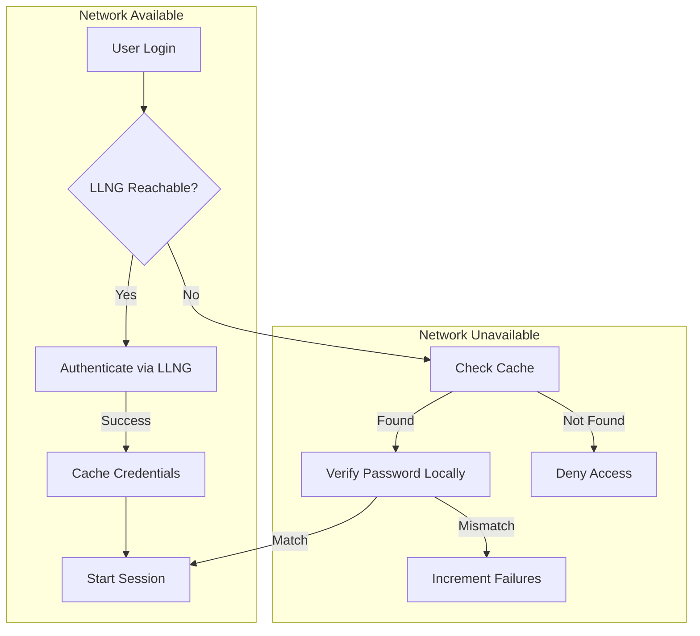

# Offline Mode

This guide explains how offline authentication works and how to configure it
for environments where network connectivity to the LLNG portal may be
intermittent or unavailable.

## Overview

Offline mode allows users to authenticate to their workstation or server when
the LLNG portal is unreachable. This is achieved by securely caching credentials
after a successful online authentication.



## Use Cases

| Scenario | Description |
|----------|-------------|
| **Laptop users** | Employees traveling or working remotely without VPN |
| **Disaster recovery** | Network outage doesn't lock out all users |
| **Air-gapped systems** | Systems that only occasionally connect to network |
| **LightDM desktop** | Workstation login when SSO portal is unavailable |

## How It Works

### Credential Storage

When a user successfully authenticates online, their credentials are cached:

1. **Password hashing**: Password is hashed using Argon2id (memory-hard algorithm)
2. **Encryption**: The cache entry is encrypted with AES-256-GCM
3. **Key derivation**: Encryption key is derived from `/etc/machine-id`
4. **Storage**: Encrypted entry saved to `/var/cache/open-bastion/offline/`

### Offline Authentication

When the LLNG portal is unreachable:

1. User enters username and password
2. PAM module attempts to contact LLNG (with timeout)
3. Connection fails → switch to offline mode
4. Load cached entry for user (if exists)
5. Verify password using Argon2id
6. If match → authenticate user with cached attributes
7. If mismatch → increment failure counter, check lockout

### Cache Refresh

- Credentials are refreshed on every successful online login
- Cache entries have a configurable TTL (default: 24 hours)
- Expired entries are automatically removed

## Configuration

### Enable Offline Mode

Add to `/etc/open-bastion/openbastion.conf`:

```ini
# Enable offline authentication
offline_mode = enabled

# Cache directory
offline_cache_dir = /var/cache/open-bastion/offline

# Cache TTL in seconds (default: 86400 = 24 hours)
offline_cache_ttl = 86400

# Maximum cache TTL (absolute limit)
offline_cache_max_ttl = 604800

# Connection timeout before switching to offline (seconds)
offline_timeout = 5

# Cleanup expired entries interval (seconds)
offline_cache_cleanup_interval = 3600
```

### Disable Offline Mode

To disable offline authentication completely:

```ini
offline_mode = disabled
```

### Security Settings

```ini
# Maximum failed attempts before lockout
offline_max_attempts = 5

# Initial lockout duration (seconds)
offline_lockout_initial = 30

# Maximum lockout duration (seconds)
offline_lockout_max = 3600

# Lockout backoff multiplier
offline_lockout_multiplier = 2.0
```

## LightDM Desktop Integration

The LightDM greeter automatically detects when the SSO portal is unreachable
and switches to offline mode.

### Visual Indicators

| Element | Description |
|---------|-------------|
| **Offline banner** | Shows "Server unavailable" with retry button |
| **Mode indicator** | Orange dot instead of green when offline |
| **Lockout countdown** | Shows remaining time when account is locked |

### User Experience

1. Greeter attempts to load SSO iframe
2. If portal unreachable:
   - Banner appears with "Server unavailable"
   - Mode switches to password-based login
   - User enters cached credentials
3. Greeter periodically retries connection
4. When online again, user can switch back to SSO

### Greeter Configuration

Edit `/etc/lightdm/lightdm-openbastion.conf`:

```ini
[greeter]
portal_url = https://auth.example.com
desktop_login_path = /desktop/login

# Online check interval (ms)
check_online_interval = 30000

# Timeout for online check (ms)
online_check_timeout = 5000

# Retry interval when offline (ms)
offline_retry_interval = 60000
```

## Administration

### Cache Management Tool

Use `ob-cache-admin` to manage the offline cache:

```bash
# List all cached credentials
ob-cache-admin list

# Show cache statistics
ob-cache-admin stats

# Remove specific user's cache
ob-cache-admin clear-user username

# Clear all cached credentials
ob-cache-admin clear

# Unlock a locked account
ob-cache-admin unlock username

# Remove expired entries
ob-cache-admin expire

# Show configuration
ob-cache-admin config
```

### Example Output

```
$ ob-cache-admin list
Username        Status    Expires              Failed  Locked
--------------------------------------------------------------
alice           ACTIVE    2025-01-28 14:30:00  0       No
bob             ACTIVE    2025-01-28 10:15:00  2       No
charlie         LOCKED    2025-01-27 20:00:00  5       Yes (29m left)
--------------------------------------------------------------
Total: 3 entries (2 active, 1 locked)
```

```
$ ob-cache-admin stats
Offline Cache Statistics
========================
Cache directory: /var/cache/open-bastion/offline
Total entries:   45
Active entries:  42
Expired entries: 2
Locked accounts: 1
Total size:      1.2 MB
Oldest entry:    2025-01-21 08:00:00
Newest entry:    2025-01-27 16:45:00
```

## Security Considerations

### Cryptographic Protections

| Component | Algorithm | Purpose |
|-----------|-----------|---------|
| Password hash | Argon2id | Prevent offline cracking |
| Encryption | AES-256-GCM | Protect cached data |
| Key derivation | PBKDF2-SHA256 | Derive encryption key |
| Filename | SHA-256 | Prevent user enumeration |

### Argon2id Parameters

| Parameter | Value | Rationale |
|-----------|-------|-----------|
| Memory | 64 MB | Prevents GPU/ASIC attacks |
| Iterations | 3 | Balanced time cost |
| Parallelism | 4 | Multi-core utilization |

These parameters follow OWASP recommendations for password storage.

### File System Security

| Path | Permissions | Purpose |
|------|-------------|---------|
| Cache directory | 0700 | Owner only |
| Cache files | 0600 | Owner read/write |

### Machine-ID Dependency

The encryption key is derived from `/etc/machine-id`. This means:

- **Pros**: Cache files are useless if stolen (key is machine-specific)
- **Cons**: Changing machine-id invalidates all cached credentials

**Important scenarios:**

| Scenario | Impact | Mitigation |
|----------|--------|------------|
| VM cloning | All caches invalid | Regenerate machine-id after clone |
| System reinstall | All caches invalid | Users re-authenticate online |
| Machine-id modification | All caches invalid | Avoid modifying machine-id |

### Brute-Force Protection

The lockout mechanism prevents brute-force attacks:

```
Attempt 1-5:   Normal authentication
Attempt 6:     Locked for 30 seconds
Attempt 7:     Locked for 60 seconds
Attempt 8:     Locked for 120 seconds
...
Maximum:       Locked for 1 hour
```

Lockout state is stored encrypted within the cache entry, preventing bypass.

## Troubleshooting

### User Cannot Login Offline

**Symptom:** User sees "User not found in cache"

**Causes:**
1. User never logged in online (no cached credentials)
2. Cache expired
3. Cache was manually cleared

**Solution:**
1. User must login online at least once before offline mode works
2. Check cache TTL settings
3. Verify user exists: `ob-cache-admin list | grep username`

### Account Locked

**Symptom:** User sees "Account temporarily locked"

**Causes:**
- Too many failed password attempts

**Solution:**
```bash
# Unlock the account
ob-cache-admin unlock username
```

### Cache Not Working

**Symptom:** Offline mode always fails

**Debugging:**
```bash
# Check if cache directory exists and has correct permissions
ls -la /var/cache/open-bastion/offline/

# Check if user has cached credentials
ob-cache-admin list

# Check PAM configuration
grep offline /etc/open-bastion/openbastion.conf

# Check syslog for errors
journalctl -u sshd | grep -i offline
```

### Machine-ID Changed

**Symptom:** All users get "Decryption failed"

**Cause:** `/etc/machine-id` was modified or regenerated

**Solution:**
1. All users must re-authenticate online
2. Clear the invalid cache: `ob-cache-admin clear`

## Best Practices

### For Desktop Workstations

1. **Enable offline mode** for laptop users who may travel
2. **Set reasonable TTL** (24-72 hours) to balance convenience and security
3. **Train users** to login online periodically to refresh cache
4. **Monitor lockouts** via `ob-cache-admin stats`

### For Servers

1. **Disable offline mode** if not needed (reduces attack surface)
2. **Use shorter TTL** (8 hours) for sensitive systems
3. **Enable audit logging** to track offline authentications
4. **Regular cleanup** of expired entries

### For High-Security Environments

1. Consider **disabling offline mode entirely**
2. If required, use **very short TTL** (1-4 hours)
3. **Monitor** for unusual offline authentication patterns
4. **Alert** on repeated lockouts (possible attack indicator)

## Monitoring and Alerts

### Syslog Messages

The PAM module logs offline events to syslog:

```
# Successful offline auth
pam_openbastion: offline auth success for user 'alice' (cached 6h ago)

# Failed offline auth
pam_openbastion: offline auth failed for user 'bob' (password mismatch, attempt 3/5)

# Account locked
pam_openbastion: offline auth blocked for user 'charlie' (locked for 120s)

# Fallback to offline
pam_openbastion: LLNG unreachable, switching to offline mode for user 'alice'
```

### Metrics to Monitor

| Metric | Alert Condition | Possible Cause |
|--------|-----------------|----------------|
| Offline auth count | Sudden spike | Network outage |
| Lockout count | > 5/hour | Brute-force attempt |
| Cache size | > 1000 entries | Cleanup not running |
| Expired entries | > 10% of total | Users not refreshing |

## Limitations

1. **First login must be online**: Users without cached credentials cannot login offline
2. **Password changes**: If user changes password online, old password still works offline until cache refreshes
3. **Group changes**: Group membership changes require online login to propagate
4. **MFA bypass**: Offline mode uses password only (no MFA)
5. **Session attributes**: Limited attributes available offline (only what was cached)

## Related Documentation

- [Security Architecture](../SECURITY.md#offline-credential-cache-security)
- [Cache Administration](offline-cache-admin.md)
- [LightDM Greeter](desktop-sso.md)
- [Administrator Guide](admin-guide.md)
