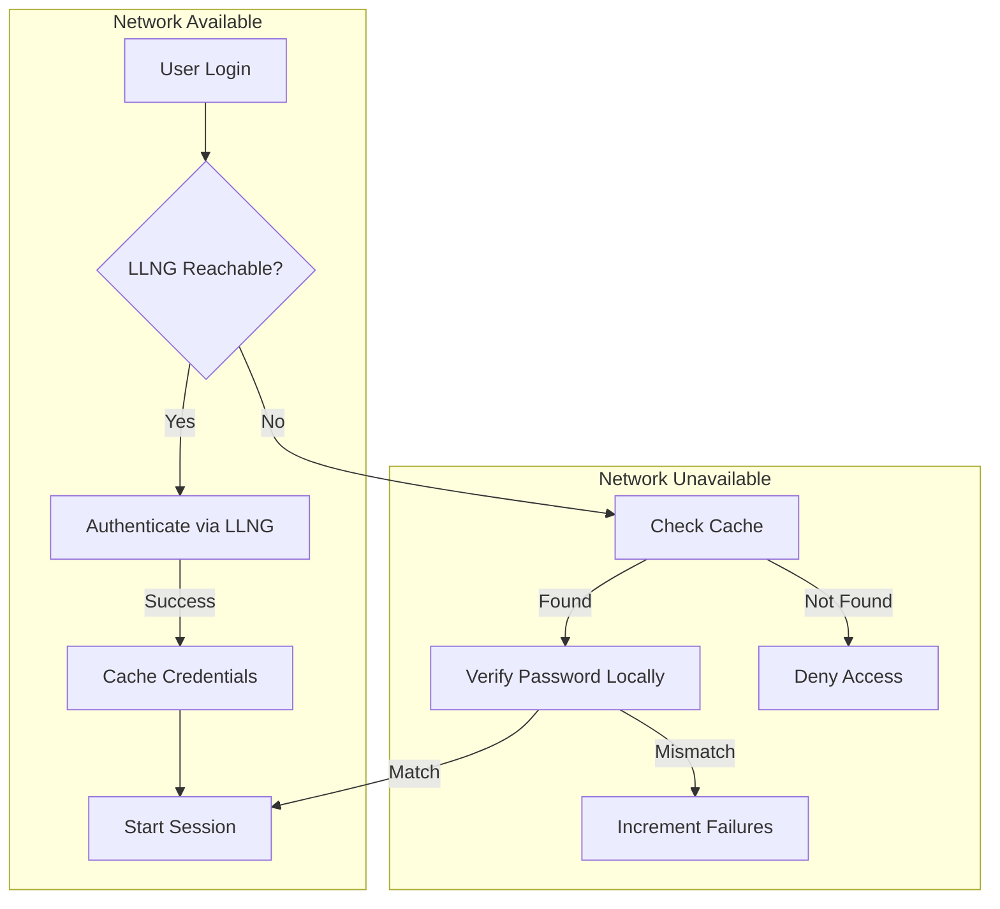

# Offline Mode

This guide explains how offline authentication works and how to configure it
for environments where network connectivity to the LLNG portal may be
intermittent or unavailable.

## Overview

Offline mode allows users to authenticate to their workstation or server when
the LLNG portal is unreachable. This is achieved by securely caching credentials
after a successful online authentication.



## Use Cases

| Scenario               | Description                                         |
| ---------------------- | --------------------------------------------------- |
| **Laptop users**       | Employees traveling or working remotely without VPN |
| **Disaster recovery**  | Network outage doesn't lock out all users           |
| **Air-gapped systems** | Systems that only occasionally connect to network   |
| **LightDM desktop**    | Workstation login when SSO portal is unavailable    |

## How It Works

### Credential Storage

When a user successfully authenticates online, their credentials are cached:

1. **Password hashing**: Password is hashed using Argon2id (memory-hard algorithm)
2. **Encryption**: The cache entry is encrypted with AES-256-GCM
3. **Key derivation**: Encryption key derived via PBKDF2-SHA256 from a root-only key file (`/etc/open-bastion/cache.key`) or `/etc/machine-id`
4. **Storage**: Encrypted entry saved to `/var/cache/open-bastion/credentials/`

### Offline Authentication

When the LLNG portal is unreachable:

1. User enters username and password
2. PAM module attempts to contact LLNG (with timeout)
3. Connection fails → switch to offline mode
4. Load cached entry for user (if exists)
5. Verify password using Argon2id
6. If match → authenticate user with cached attributes
7. If mismatch → increment failure counter, check lockout

### Cache Refresh

- Credentials are refreshed on every successful online login
- Cache entries have a configurable TTL (default: 7 days)
- Expired entries are rejected at runtime by the PAM module

## Configuration

### Enable Offline Mode

Add to `/etc/open-bastion/openbastion.conf`:

```ini
# Enable offline credential caching
offline_cache_enabled = true

# Cache directory (default: /var/cache/open-bastion/credentials)
offline_cache_dir = /var/cache/open-bastion/credentials

# Cache TTL in seconds (default: 604800 = 7 days, range: 3600–2592000)
offline_cache_ttl = 604800

# Maximum failed attempts before lockout (default: 5, range: 1–20)
offline_cache_max_failures = 5

# Lockout duration in seconds (default: 300 = 5 min, range: 60–86400)
offline_cache_lockout = 300
```

Or via PAM module arguments:

```
auth sufficient pam_openbastion.so oauth2_token_auth offline_cache
```

### Disable Offline Mode

```ini
# Disable offline credential caching
offline_cache_enabled = false
```

Or via PAM module arguments:

```
auth sufficient pam_openbastion.so oauth2_token_auth no_offline_cache
```

## LightDM Desktop Integration

The LightDM greeter automatically detects when the SSO portal is unreachable
and switches to offline mode.

### Visual Indicators

| Element               | Description                                  |
| --------------------- | -------------------------------------------- |
| **Offline banner**    | Shows "Server unavailable" with retry button |
| **Mode indicator**    | Orange dot instead of green when offline     |
| **Lockout countdown** | Shows remaining time when account is locked  |

### User Experience

1. Greeter attempts to load SSO iframe
2. If portal unreachable:
   - Banner appears with "Server unavailable"
   - Mode switches to password-based login
   - User enters cached credentials
3. Greeter periodically retries connection
4. When online again, user can switch back to SSO

### Greeter Configuration

Edit `/etc/lightdm/lightdm-webkit2-greeter.conf`:

```ini
[open-bastion]
# LemonLDAP::NG Portal URL
portal_url = https://auth.example.com

# Desktop login endpoint path (relative to portal_url)
desktop_login_path = /desktop/login

# Check online status interval (ms)
check_online_interval = 30000

# Enable offline mode fallback
offline_mode_enabled = true
```

## Administration

### Cache Management Tool

Use `ob-cache-admin` to manage the offline cache (requires root):

```bash
# Show cache statistics
ob-cache-admin stats

# List all cached credential entries
ob-cache-admin list

# Show details for a specific user
ob-cache-admin show username

# Remove specific user's cache (secure deletion)
ob-cache-admin invalidate username

# Remove all cached credentials (requires confirmation)
ob-cache-admin invalidate-all

# Reset failed attempts for a locked user
ob-cache-admin unlock username

# Remove invalid/orphaned cache files
ob-cache-admin cleanup
```

### Example Output

```
$ sudo ob-cache-admin list

Cached credential entries:
--------------------------
  a1b2c3d4e5f6a7b8c9d0e1f2a3b4c5d6  2025-06-15 09:30:12  (512 bytes)
  d6c5b4a3f2e1d0c9b8a7f6e5d4c3b2a1  2025-06-14 14:00:45  (498 bytes)

Total: 2 entries

Note: Filenames are SHA256 hashes of usernames.
Use 'ob-cache-admin show <username>' to check a specific user.
```

```
$ sudo ob-cache-admin stats

Open Bastion Offline Cache Statistics
======================================

Cache directory: /var/cache/open-bastion/credentials

Total entries:   2
Valid format:    2

Disk usage:      12K

Oldest entry:    2025-06-14 14:00:45
Newest entry:    2025-06-15 09:30:12
```

See [Cache Administration](offline-cache-admin.md) for full documentation.

## Security Considerations

### Cryptographic Protections

| Component      | Algorithm     | Purpose                                                 |
| -------------- | ------------- | ------------------------------------------------------- |
| Password hash  | Argon2id      | Prevent offline cracking                                |
| Encryption     | AES-256-GCM   | Protect cached data at rest                             |
| Key derivation | PBKDF2-SHA256 | Derive cache encryption key from key file or machine-id |
| Filename       | SHA-256       | Prevent user enumeration                                |

### Argon2id Parameters

| Parameter   | Value    | Rationale                 |
| ----------- | -------- | ------------------------- |
| Memory      | 64 MB    | Prevents GPU/ASIC attacks |
| Iterations  | 3        | Balanced time cost        |
| Parallelism | 4        | Multi-core utilization    |
| Hash length | 32 bytes | 256-bit output            |
| Salt length | 16 bytes | Unique per user, random   |

These parameters follow OWASP recommendations for password storage.

### File System Security

| Path            | Permissions | Purpose              |
| --------------- | ----------- | -------------------- |
| Cache directory | 0700        | Owner only           |
| Cache files     | 0600        | Owner read/write     |
| Key file        | 0600        | Root read/write only |

### Machine-ID / Key File Dependency

The encryption key is derived from a root-only key file (`/etc/open-bastion/cache.key`)
or falls back to `/etc/machine-id`. This means:

- **Pros**: Cache files are useless if stolen (key is machine-specific)
- **Cons**: Changing key file or machine-id invalidates all cached credentials

**Important scenarios:**

| Scenario          | Impact             | Mitigation                        |
| ----------------- | ------------------ | --------------------------------- |
| VM cloning        | All caches invalid | Regenerate machine-id after clone |
| System reinstall  | All caches invalid | Users re-authenticate online      |
| Key file rotation | All caches invalid | Users re-authenticate online      |

### Brute-Force Protection

After 5 failed password attempts, the account is locked for 5 minutes.
These are compile-time constants defined in `offline_cache.h`
(`OFFLINE_CACHE_MAX_FAILED_ATTEMPTS` and `OFFLINE_CACHE_LOCKOUT_DURATION`).
They can also be configured at runtime via `offline_cache_max_failures` and
`offline_cache_lockout` in the configuration file.

Lockout state is stored encrypted within the cache entry, preventing bypass
by file manipulation.

## Troubleshooting

### User Cannot Login Offline

**Symptom:** User sees "User not found in cache"

**Causes:**

1. User never logged in online (no cached credentials)
2. Cache expired (TTL exceeded)
3. Cache was manually cleared

**Solution:**

1. User must login online at least once before offline mode works
2. Check cache TTL: `grep offline_cache_ttl /etc/open-bastion/openbastion.conf`
3. Verify user exists: `sudo ob-cache-admin show username`

### Account Locked

**Symptom:** User sees "Account temporarily locked"

**Causes:**

- Too many failed password attempts (5 by default)

**Solution:**

```bash
# Check lock status and options
sudo ob-cache-admin unlock username
```

Note: The unlock command cannot modify the encrypted lockout state directly.
It offers to invalidate the cache entry instead, requiring the user to
authenticate online next time. Alternatively, wait for the lockout to expire
(5 minutes by default).

### Cache Not Working

**Symptom:** Offline mode always fails

**Debugging:**

```bash
# Check if cache directory exists and has correct permissions
ls -la /var/cache/open-bastion/credentials/

# Check if user has cached credentials
sudo ob-cache-admin show username

# Check PAM configuration
grep offline_cache /etc/open-bastion/openbastion.conf

# Check syslog for errors
journalctl | grep pam_openbastion
```

### Machine-ID or Key File Changed

**Symptom:** All users get decryption errors

**Cause:** `/etc/machine-id` or `/etc/open-bastion/cache.key` was modified

**Solution:**

1. All users must re-authenticate online
2. Clear the invalid cache: `sudo ob-cache-admin invalidate-all`

## Best Practices

### For Desktop Workstations

1. **Enable offline mode** for laptop users who may travel
2. **Set reasonable TTL** (1–7 days) to balance convenience and security
3. **Generate a key file**: `ob-desktop-setup --offline` or manually
4. **Train users** to login online periodically to refresh cache
5. **Monitor lockouts** via `ob-cache-admin stats`

### For Servers

1. **Disable offline mode** if not needed (reduces attack surface)
2. **Use shorter TTL** if enabled
3. **Enable audit logging** to track offline authentications
4. **Regular cleanup** of expired entries via cron

### For High-Security Environments

1. Consider **disabling offline mode entirely**
2. If required, use **very short TTL** (hours, not days)
3. **Monitor** for unusual offline authentication patterns
4. **Alert** on repeated lockouts (possible attack indicator)

## Monitoring and Alerts

### Syslog Messages

The PAM module logs offline events to syslog (`auth` facility):

```
# Successful offline auth
pam_openbastion[1234]: Offline authentication successful for user johndoe

# Failed offline auth
pam_openbastion[1235]: Offline authentication failed for johndoe: Password does not match

# Account locked
pam_openbastion[1236]: Offline authentication failed for johndoe: Entry locked

# Fallback to offline
pam_openbastion[1237]: LLNG unreachable, switching to offline mode
```

### Metrics to Monitor

| Metric             | Alert Condition | Possible Cause       |
| ------------------ | --------------- | -------------------- |
| Offline auth count | Sudden spike    | Network outage       |
| Lockout count      | > 5/hour        | Brute-force attempt  |
| Cache size         | Unusually large | Cleanup not running  |
| Expired entries    | Accumulating    | Users not refreshing |

## Limitations

1. **First login must be online**: Users without cached credentials cannot login offline
2. **Password changes**: If user changes password online, old cached password still works offline until the cache is refreshed by a new online login
3. **Group changes**: Group membership changes require online login to propagate
4. **MFA bypass**: Offline mode uses password only (MFA is not available offline)
5. **Session attributes**: Limited attributes available offline (only what was cached)

## Network Revalidation

When a user authenticates offline and the network later returns, the system
revalidates the session to ensure the user's account is still valid on LLNG.

### How It Works

Three complementary mechanisms provide revalidation:

1. **Screen unlock revalidation (Part C)**: When the user unlocks their screen
   with a password, the PAM module detects the offline session marker and
   attempts a real online LLNG authentication. On success, the offline cache is
   refreshed and the marker removed. On failure (revoked account), the unlock
   is refused; session termination is handled by `ob-session-monitor`.

2. **Token refresh (Part B)**: The LightDM greeter stores the OAuth2 refresh
   token. On screen unlock, if the access token has expired, the greeter calls
   `/desktop/refresh` to get a fresh token before falling back to the SSO iframe
   or offline mode.

3. **Background monitor (ob-session-monitor)**: A systemd service that polls the
   LLNG portal. When connectivity returns, it checks all offline sessions against
   LLNG's `/pam/userinfo` endpoint. Revoked users have their sessions terminated.
   Users with old caches are forced to re-authenticate online on next unlock.

### Anti-Firewall-Bypass Protection

If a malicious user blocks the SSO portal with a local firewall rule while
maintaining general network access, `ob-session-monitor` detects this condition.
After a configurable timeout (`offline_max_sso_unreachable`, default 1 hour),
all offline sessions are terminated.

| Network | SSO Portal | Duration  | Action                         |
| ------- | ---------- | --------- | ------------------------------ |
| Down    | Down       | Any       | Normal offline mode            |
| Up      | Up         | —         | Revalidate sessions            |
| Up      | Down       | < timeout | Warning logged                 |
| Up      | Down       | ≥ timeout | Terminate all offline sessions |

### Configuration

```ini
# Enable network revalidation (default: true)
offline_revalidation_enabled = true

# Grace period before forcing online re-auth (default: 4 hours)
offline_revalidation_grace = 14400

# Max SSO unreachable time before terminating sessions (default: 1 hour)
offline_max_sso_unreachable = 3600
```

### ob-session-monitor Service

```bash
# Enable the service
sudo systemctl enable ob-session-monitor
sudo systemctl start ob-session-monitor

# Check status
sudo systemctl status ob-session-monitor

# View logs
journalctl -u ob-session-monitor
```

## Related Documentation

- [Security Architecture](../SECURITY.md#offline-credential-cache-security)
- [Cache Administration](offline-cache-admin.md)
- [LightDM Desktop SSO](desktop-sso.md)
- [Administrator Guide](admin-guide.md)
