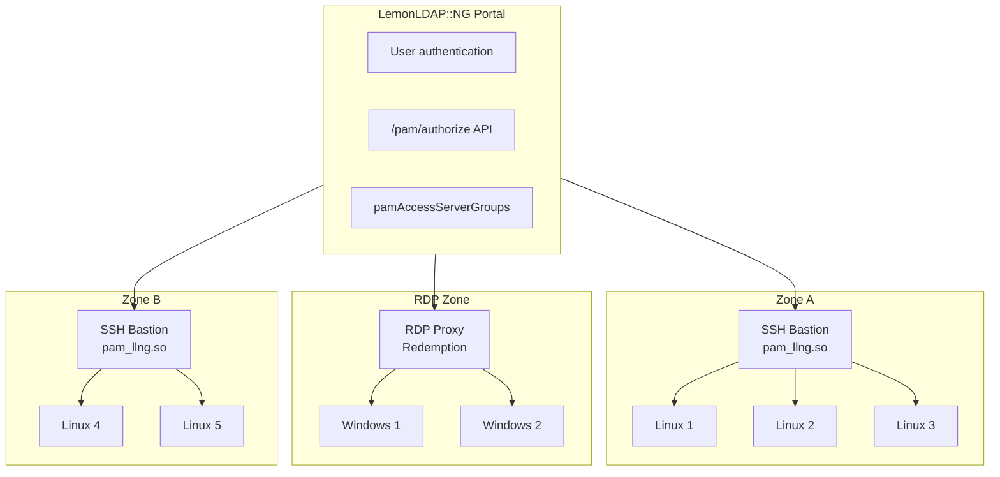
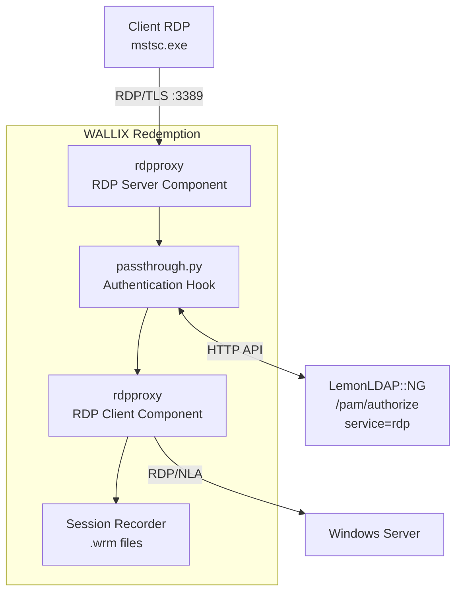

# RDP Support Feasibility Study

This document evaluates the feasibility of adding RDP (Remote Desktop Protocol)
support to the LLNG-PAM-MODULE project, including proxy functionality,
LemonLDAP::NG authentication integration, and session recording.

## Executive Summary

**Recommendation**: Integrate **WALLIX Redemption** as the RDP proxy component.

| Aspect | Assessment |
|--------|------------|
| Feasibility | High - proven open-source solution exists |
| Effort | 9-13 days for Proof of Concept |
| Risk | Medium - GPL-2.0 license, build complexity |
| Integration | Native `/pam/authorize` API reuse |

---

## Requirements Analysis

### Functional Requirements

| Requirement | Priority | Notes |
|-------------|----------|-------|
| Native RDP client support (mstsc.exe) | Must have | Web-only (Guacamole) rejected |
| LemonLDAP::NG authentication | Must have | Unified identity management |
| Session recording | Must have | Audit compliance |
| Session replay | Must have | Security investigations |
| Unified authorization (SSH/RDP) | Must have | Same `pamAccessServerGroups` |

### Non-Functional Requirements

| Requirement | Target |
|-------------|--------|
| License | Compatible with AGPL |
| Maintenance | Reasonable community support |
| Performance | Acceptable latency for interactive sessions |

---

## Solutions Evaluated

### Option 1: Apache Guacamole

**Description**: Browser-based RDP gateway using HTML5.

| Aspect | Assessment |
|--------|------------|
| RDP proxy | Via guacd daemon |
| Session recording | Native (`.guac` format) |
| Authentication | OIDC native support |
| License | Apache 2.0 |

**Verdict**: Rejected - does not support native RDP clients (mstsc.exe).

### Option 2: FreeRDP Native Development

**Description**: Build custom RDP proxy using FreeRDP library.

| Aspect | Assessment |
|--------|------------|
| RDP proxy | Via `freerdp-proxy` |
| Session recording | Must be developed from scratch |
| Authentication | Must be developed |
| Effort | 15-21 days |

**Verdict**: Rejected - excessive development effort and risk.

### Option 3: WALLIX Redemption (Recommended)

**Description**: Open-source RDP proxy from Wallix (French company).

| Aspect | Assessment |
|--------|------------|
| RDP proxy | True MITM proxy, native clients work |
| Session recording | Native (`.wrm` format, MP4 export) |
| Authentication | Python hooks (`passthrough.py`) |
| License | GPL-2.0 |
| Repository | https://github.com/wallix/redemption |

**Verdict**: Recommended - best balance of features and effort.

### Option 4: JumpServer

**Description**: Complete PAM platform with RDP support.

| Aspect | Assessment |
|--------|------------|
| RDP proxy | Native web-based |
| Session recording | Native |
| Authentication | OIDC support |
| License | GPLv3 |

**Verdict**: Alternative - larger footprint, parallel system to LLNG.

---

## Comparison Matrix

| Criterion | Guacamole | FreeRDP | Redemption | JumpServer |
|-----------|-----------|---------|------------|------------|
| Native RDP client | No | Yes | Yes | No |
| Session recording | Yes | No | Yes | Yes |
| LLNG integration effort | Low | Very High | Medium | Low |
| Maintenance burden | Low | Very High | Medium | Medium |
| License | Apache 2.0 | Apache 2.0 | GPL-2.0 | GPLv3 |
| **Score** | 3/5 | 1/5 | **4/5** | 3/5 |

---

## Recommended Architecture

### Overview



### Redemption Components



---

## Authorization Integration

### Unified SSH/RDP Authorization

The existing `pamAccessServerGroups` mechanism will apply to both SSH and RDP:

| Group Name | Authorization Rule | Protocol |
|------------|-------------------|----------|
| production | `$hGroups->{sre} or $hGroups->{oncall}` | SSH |
| staging | `$hGroups->{sre} or $hGroups->{dev}` | SSH |
| development | `$hGroups->{dev}` | SSH |
| windows-prod | `$hGroups->{sre} or $hGroups->{admins}` | RDP |
| windows-dev | `$hGroups->{dev}` | RDP |
| bastion | `$hGroups->{employees}` | SSH |

### API Call Flow

```python
# passthrough.py (Redemption hook)

def authenticate(username, target_host):
    """Called by Redemption when user connects"""

    # Call existing LLNG authorization API
    response = requests.post(
        f"{LLNG_PORTAL}/pam/authorize",
        headers={"Authorization": f"Bearer {SERVER_TOKEN}"},
        json={
            "user": username,
            "host": target_host,
            "service": "rdp"  # New service type
        }
    )

    if response.json().get("authorized"):
        return {
            "status": "authorized",
            "target_user": response.json().get("target_user", username),
            "target_password": get_credentials(username, target_host)
        }
    else:
        return {"status": "denied"}
```

### Server Enrollment

RDP proxy enrolls with LLNG like any other server:

```bash
# On RDP proxy server
llng-pam-enroll --portal https://auth.example.com --server-group rdp-proxy
```

---

## Session Recording

### Recording Format

Redemption uses `.wrm` (WALLIX Recording Media) format:

| Aspect | Details |
|--------|---------|
| Format | Proprietary binary, efficient |
| Contents | RDP protocol capture with timing |
| Size | ~10-50 MB/hour typical |
| Conversion | `redrec` tool converts to MP4 |

### Storage Structure

```
/var/lib/llng-sessions/rdp/
├── dwho/
│   ├── 20251216-103000_<uuid>.wrm       # Recording
│   ├── 20251216-103000_<uuid>.json      # Metadata
│   └── 20251216-103000_<uuid>.mp4       # Converted (optional)
└── rtyler/
    └── ...
```

### Metadata Format

```json
{
    "session_id": "550e8400-e29b-41d4-a716-446655440000",
    "user": "dwho",
    "client_ip": "192.168.1.100",
    "target_host": "windows-server.example.com",
    "target_user": "dwho@DOMAIN",
    "start_time": "2025-12-16T10:30:00Z",
    "end_time": "2025-12-16T11:45:23Z",
    "status": "completed",
    "protocol": "rdp",
    "recording_file": "20251216-103000_550e8400.wrm",
    "recording_size_bytes": 15728640,
    "hostname": "rdp-proxy.example.com",
    "version": "1.0.0"
}
```

### Replay Options

1. **Native replay**: `redrec --play recording.wrm`
2. **Video conversion**: `redrec --to-mp4 recording.wrm`
3. **Web replay**: Future integration with LLNG Manager

---

## Risks and Mitigations

### License Risk: GPL-2.0

| Risk | Impact | Mitigation |
|------|--------|------------|
| Copyleft requirement | Modifications must be published | Acceptable for open-source project |
| License compatibility | Must verify AGPL compatibility | GPLv3 Section 13 allows combination |

**Action**: Verify with legal team before production deployment.

### Build Complexity

| Risk | Impact | Mitigation |
|------|--------|------------|
| C++20 requirement | Modern compiler needed | Use Docker container |
| 15+ dependencies | Complex build process | Pre-built Docker image |
| Build time | 30-60 minutes | Cache build artifacts |

### Credential Management

| Risk | Impact | Mitigation |
|------|--------|------------|
| Credential exposure | Proxy handles Windows passwords | TLS encryption, secure storage |
| Pass-through mode | User provides credentials | Acceptable for PoC |
| Vault mode (future) | LLNG stores credentials | Requires additional development |

### NLA (Network Level Authentication)

| Risk | Impact | Mitigation |
|------|--------|------------|
| NLA complexity | Credential extraction complex | Test both NLA and non-NLA |
| CredSSP handling | Protocol-specific challenges | Redemption handles this |

---

## Implementation Plan

### Phase 1: Documentation (1-2 days)

- [x] Create this feasibility study
- [ ] Update `doc/competitors.md` with RDP roadmap

### Phase 2: Build Redemption (2-3 days)

- [ ] Create Dockerfile with all dependencies
- [ ] Build Redemption from source
- [ ] Create minimal `rdpproxy.ini` configuration
- [ ] Test basic RDP proxy functionality

### Phase 3: LLNG Integration (3-4 days)

- [ ] Implement `passthrough.py` hook
- [ ] Call `/pam/authorize` with `service=rdp`
- [ ] Test authorization with existing server groups
- [ ] Handle credential pass-through

### Phase 4: Session Recording (2-3 days)

- [ ] Configure recording in Redemption
- [ ] Test `.wrm` file generation
- [ ] Test MP4 conversion with `redrec`
- [ ] Create metadata JSON files

### Phase 5: Documentation (1 day)

- [ ] Write PoC README
- [ ] Document deployment steps
- [ ] Create demo screenshots/video

---

## Effort Estimation

| Phase | Effort | Cumulative |
|-------|--------|------------|
| Documentation | 1-2 days | 1-2 days |
| Build Redemption | 2-3 days | 3-5 days |
| LLNG Integration | 3-4 days | 6-9 days |
| Session Recording | 2-3 days | 8-12 days |
| Final Documentation | 1 day | 9-13 days |

**Total PoC effort**: 9-13 days

### Production Readiness (Post-PoC)

Additional work for production:

| Task | Effort |
|------|--------|
| High availability setup | 2-3 days |
| Monitoring and alerting | 1-2 days |
| Backup and retention policies | 1 day |
| Security hardening | 2-3 days |
| Documentation and training | 2-3 days |
| **Total** | **8-12 days** |

---

## Decision Criteria

### Go Criteria

- [ ] PoC demonstrates native RDP client connectivity
- [ ] LLNG authorization working with existing server groups
- [ ] Session recording captures usable recordings
- [ ] MP4 conversion produces viewable videos
- [ ] GPL-2.0 license acceptable to project

### No-Go Criteria

- [ ] Build process unreliable or unmaintainable
- [ ] Performance unacceptable for interactive use
- [ ] Security vulnerabilities discovered
- [ ] License incompatibility confirmed

---

## Conclusion

Adding RDP support via WALLIX Redemption is **feasible** and **recommended**.

**Key advantages**:
- Proven technology from French company (Wallix)
- Native RDP client support (mstsc.exe works)
- Built-in session recording
- Integrates with existing LLNG authorization model

**Key risks**:
- GPL-2.0 license requires legal review
- Build complexity (mitigated by Docker)
- Credential management needs careful design

**Next step**: Approve PoC implementation (9-13 days effort).

---

## References

- [WALLIX Redemption GitHub](https://github.com/wallix/redemption)
- [Apache Guacamole](https://guacamole.apache.org/)
- [FreeRDP](https://www.freerdp.com/)
- [FreeRDP Proxy Documentation](https://pub.freerdp.com/api/)
- [bastion-architecture.md](bastion-architecture.md)
- [session-recording.md](session-recording.md)
- [competitors.md](competitors.md)
