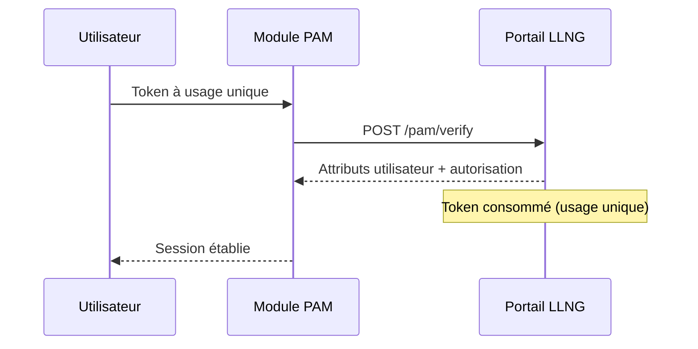
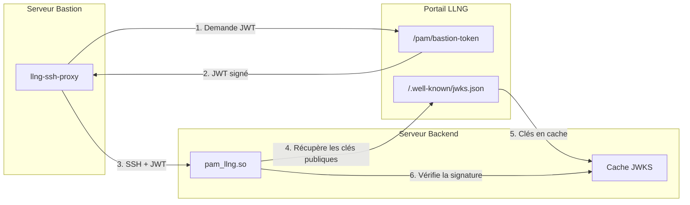
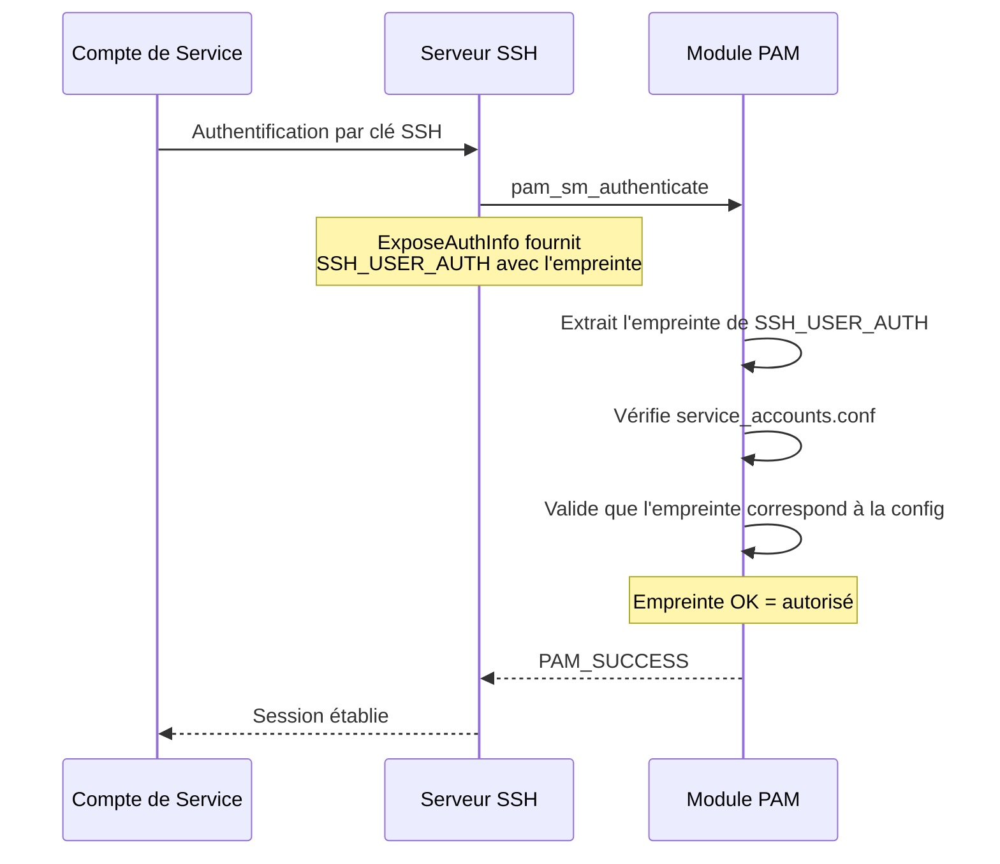

# Architecture de Sécurité

## Cible de Sécurité

Cette étude de sécurité porte sur la **cible de sécurité maximale** d'Open Bastion (Mode E) :

| Composant                | Configuration                                                            |
| ------------------------ | ------------------------------------------------------------------------ |
| **Architecture réseau**  | Bastion + backends isolés                                                |
| **Authentification SSH** | Certificats signés par la CA LLNG uniquement (`AuthorizedKeysFile none`) |
| **Autorisation SSH**     | Vérification LLNG `/pam/authorize` à chaque connexion                    |
| **Escalade sudo**        | Token temporaire LLNG uniquement (réauthentification SSO)                |
| **Révocation**           | KRL obligatoire + désactivation compte LLNG                              |
| **Bastion → Backend**    | JWT signé vérifié cryptographiquement                                    |

```mermaid
flowchart TB
    subgraph Client["Client SSH"]
        cert["Certificat signé\npar CA LLNG (1 an)"]
    end

    subgraph Infra["Infrastructure"]
        subgraph Bastion["Bastion"]
            sshd_b["sshd\nTrustedCA + KRL\nAuthorizedKeysFile none"]
            pam_b["PAM\n/pam/authorize"]
        end

        subgraph Backend["Backend"]
            sshd_be["sshd\nTrustedCA + KRL\nAuthorizedKeysFile none"]
            pam_be["PAM\n/pam/authorize\n+ bastion JWT"]
            sudo_be["sudo\nToken LLNG\n(réauth SSO)"]
        end
    end

    LLNG["Portail LLNG\n(CA, authorize, KRL)"]

    Client -->|SSH + certificat| Bastion
    Bastion -->|SSH + JWT bastion| Backend
    pam_b -->|/pam/authorize| LLNG
    pam_be -->|/pam/authorize\n/pam/verify (sudo)| LLNG
```

D'autres architectures moins restrictives sont possibles (serveur isolé, sans CA, sans bastion), mais cette étude se concentre sur la configuration offrant le meilleur profil de risque.

## Flux d'Authentification



1. L'utilisateur fournit un token à usage unique généré par le portail LLNG
2. Le module PAM vérifie le token via l'endpoint `/pam/verify`
3. Le token est consommé _(usage unique)_ et ne peut pas être rejoué
4. Le serveur retourne les attributs utilisateur et le statut d'autorisation

## Sécurité du Transport

### Configuration TLS

| Paramètre         | Défaut       | Description                                     |
| ----------------- | ------------ | ----------------------------------------------- |
| `min_tls_version` | 13 (TLS 1.3) | Version TLS minimale (12=1.2, 13=1.3)           |
| `verify_ssl`      | true         | Vérifier le certificat serveur                  |
| `ca_cert`         | système      | Chemin vers un certificat CA personnalisé       |
| `cert_pin`        | aucun        | Épinglage de certificat (format sha256//base64) |

**Épinglage de Certificat** : Lorsqu'il est configuré, le module valide la clé publique du serveur par rapport à la valeur épinglée, empêchant les attaques MITM même en cas de compromission de CA.

```ini
# Exemple de configuration
min_tls_version = 13
cert_pin = sha256//AAAAAAAAAAAAAAAAAAAAAAAAAAAAAAAAAAAAAAAAAAA=
```

### Signature des Requêtes (Optionnel)

Lorsque `request_signing_secret` est configuré, les requêtes incluent :

- `X-Timestamp` : Horodatage Unix _(le serveur devrait rejeter les valeurs trop anciennes)_
- `X-Nonce` : Format unique `timestamp_ms-uuid` _(le serveur devrait rejeter les doublons)_
- `X-Signature-256` : Signature HMAC-SHA256 de la requête

Cela fournit une défense en profondeur contre la falsification de requêtes, même si TLS est d'une façon ou d'une autre compromis.

## Authentification du Serveur

Le module PAM s'authentifie auprès du serveur LLNG en utilisant :

| Paramètre              | Description                                                         |
| ---------------------- | ------------------------------------------------------------------- |
| `server_token_file`    | Chemin vers le fichier contenant le token bearer du serveur         |
| `server_group`         | Nom du groupe serveur (défaut : "default")                          |
| `token_rotate_refresh` | Rotation automatique des tokens de rafraîchissement (défaut : true) |

Le token serveur doit être stocké dans un fichier avec des permissions restreintes (0600) appartenant à root.

### Authentification Client OAuth2

Pour les opérations d'introspection et de rafraîchissement de tokens OAuth2, le module utilise **JWT Client Assertion**
(RFC 7523) plutôt que l'authentification HTTP Basic. Cela offre une sécurité renforcée :

- Le `client_secret` n'est jamais transmis sur le réseau
- Chaque requête inclut un JWT unique signé avec HMAC-SHA256
- Le JWT contient : `iss`, `sub`, `aud`, `exp`, `iat`, et un `jti` unique (UUID v4)
- La validité du JWT est de 5 minutes pour éviter les attaques par rejeu

### Rotation Automatique des Tokens

Lorsque `token_rotate_refresh = true` (défaut), le module fait automatiquement tourner le token de rafraîchissement après chaque rafraîchissement de token réussi. Cela limite la fenêtre d'opportunité si un token est compromis, car les tokens volés deviennent invalides après la prochaine utilisation légitime.

## Authentification Bastion vers Backend (JWT)

Dans les architectures bastion/backend, le module PAM prend en charge la vérification cryptographique que les connexions SSH vers les backends proviennent de serveurs bastion autorisés.

### Architecture



### Bénéfices de Sécurité

| Menace                          | Sans JWT Bastion              | Avec JWT Bastion             |
| ------------------------------- | ----------------------------- | ---------------------------- |
| Accès direct au backend         | Possible si réseau accessible | Bloqué (pas de JWT valide)   |
| Contournement VPN vers backend  | Possible                      | Bloqué                       |
| Mauvaise configuration pare-feu | Expose les backends           | Backends toujours protégés   |
| Clés bastion compromises        | Accès aux backends            | Chaque saut toujours vérifié |

### Configuration (Backend)

```ini
# /etc/security/pam_llng.conf
bastion_jwt_required = true
bastion_jwt_issuer = https://auth.example.com
bastion_jwt_jwks_url = https://auth.example.com/.well-known/jwks.json
bastion_jwt_jwks_cache = /var/cache/pam_llng/jwks.json
bastion_jwt_cache_ttl = 3600
bastion_jwt_clock_skew = 60
# Optionnel : restreindre à des bastions spécifiques
bastion_jwt_allowed_bastions = bastion-01,bastion-02
```

```bash
# /etc/ssh/sshd_config
AcceptEnv LLNG_BASTION_JWT
```

### Claims JWT

| Claim           | Description                                                    |
| --------------- | -------------------------------------------------------------- |
| `iss`           | URL du portail LLNG (doit correspondre à `bastion_jwt_issuer`) |
| `sub`           | Nom d'utilisateur proxifié                                     |
| `aud`           | `pam:bastion-backend`                                          |
| `exp`           | Horodatage d'expiration (courte durée de vie)                  |
| `bastion_id`    | Identifiant du serveur bastion                                 |
| `bastion_group` | Groupe serveur du bastion                                      |
| `target_host`   | Nom d'hôte du backend cible                                    |
| `user_groups`   | Groupes LLNG de l'utilisateur                                  |

### Vérification Hors-Ligne

Le cache JWKS permet la vérification des JWT sans accès réseau au LLNG :

1. La première connexion récupère les JWKS depuis le portail LLNG
2. Les clés publiques sont mises en cache localement avec un TTL configurable
3. Les vérifications suivantes utilisent les clés en cache
4. Le cache est rafraîchi à l'expiration du TTL ou lors de la rencontre d'un identifiant de clé inconnu

Cela offre une résilience face aux interruptions du LLNG tout en maintenant la sécurité.

## Sécurité du Cache de Tokens

### Chiffrement au Repos

Lorsque `cache_encrypted = true` _(défaut)_, les tokens en cache sont chiffrés en utilisant :

- **Algorithme** : AES-256-GCM _(chiffrement authentifié)_
- **Dérivation de clé** : PBKDF2-SHA256 avec 100 000 itérations
- **Source de la clé** : Machine ID (`/etc/machine-id`) + nom d'utilisateur du cache comme sel
- **Authentification** : Le tag GCM empêche la falsification

```
Format du fichier :
[Texte clair : "expires_at\n"][Magic : LLNGCACHE02][IV : 12 octets][Tag : 16 octets][Texte chiffré]
```

L'en-tête d'horodatage en clair permet des vérifications rapides d'expiration sans déchiffrement
_(optimisation des performances)_. Cependant, l'horodatage est **dupliqué à l'intérieur du payload chiffré**
pour vérification d'intégrité. Si un attaquant modifie l'en-tête en clair pour étendre la validité du cache,
la discordance avec l'horodatage chiffré entraîne un rejet immédiat et la suppression du fichier cache.

### Isolation du Cache

- Le cache de chaque utilisateur est stocké dans un fichier séparé
- Permissions du fichier : 0600 _(lecture/écriture propriétaire uniquement)_
- Permissions du répertoire : 0700

### Invalidation du Cache

Lorsque `cache_invalidate_on_logout = true` _(défaut)_ :

- Le cache de l'utilisateur est effacé à la fermeture de sa session PAM
- Empêche la réutilisation de tokens périmés

### TTL Basé sur le Risque

| Type de service        | TTL par défaut |
| ---------------------- | -------------- |
| Services normaux       | 300 secondes   |
| Services à haut risque | 60 secondes    |

Configurer les services à haut risque via `high_risk_services` _(séparés par des virgules)_.

## Limitation de Débit

Protection contre les attaques par force brute :

| Paramètre                    | Défaut | Description                            |
| ---------------------------- | ------ | -------------------------------------- |
| `rate_limit_enabled`         | true   | Activer la limitation de débit         |
| `rate_limit_max_attempts`    | 5      | Échecs avant verrouillage              |
| `rate_limit_initial_lockout` | 30s    | Durée initiale de verrouillage         |
| `rate_limit_max_lockout`     | 3600s  | Durée maximale de verrouillage         |
| `rate_limit_backoff_mult`    | 2.0    | Multiplicateur d'attente exponentielle |

L'état de verrouillage est stocké par utilisateur dans `rate_limit_state_dir`.

## Sécurité de la Création Automatique d'Utilisateurs

Lorsque `create_user_enabled = true`, les utilisateurs peuvent être créés automatiquement à la première connexion.

### Validation des Chemins

Tous les chemins sont validés avant utilisation :

**Validation du Shell** (`approved_shells`) :

- Doit figurer dans la liste approuvée _(défaut : shells courants comme /bin/bash, /bin/zsh)_
- Doit être un chemin absolu
- Pas de séquences de traversée de répertoire _(.., //)_
- Pas de métacaractères shell

**Validation du Répertoire Personnel** (`approved_home_prefixes`) :

- Doit commencer par un préfixe approuvé _(défaut : /home, /var/home)_
- Mêmes vérifications de sécurité que pour le shell

**Validation du Répertoire Squelette** :

- Doit être un chemin absolu
- Doit appartenir à root
- Pas de liens symboliques dans les composants du chemin
- Pas de motifs dangereux

### Génération d'UID

- Les UID sont générés de façon déterministe à partir du hash du nom d'utilisateur
- Plage : 10000-60000 _(configurable)_
- **Gestion des collisions** : Si l'UID existe, l'opération échoue de façon sûre _(retourne 0)_
- Pas de repli vers des UID aléatoires qui pourraient entraîner un comportement imprévisible

### Sécurité du Module NSS

Le module NSS (`libnss_llng.so`) fournit la résolution des utilisateurs :

- **Protection contre les débordements de tampon** : Toutes les copies de chaînes utilisent `safe_strcpy()` avec vérification des limites
- **Validation des entrées serveur** : Les chemins de shell et de répertoire personnel provenant du serveur sont validés par rapport aux listes approuvées
- **Contrôle de la plage d'UID** : Les UID fournis par le serveur doivent être dans la plage min_uid/max_uid configurée
- **Sécurité par défaut** : Retourne les codes d'erreur appropriés en cas d'échec ; les chemins invalides se replient sur les valeurs par défaut

### Manipulation Directe de /etc/passwd et /etc/shadow

Les comptes utilisateurs sont créés en écrivant directement dans `/etc/passwd` et `/etc/shadow` plutôt qu'en utilisant
des outils externes comme `useradd`. Ce choix de conception a été fait pour :

**Avantages** :

- **Portabilité** : Pas de dépendance à `useradd` qui peut ne pas exister ou avoir des options différentes selon les distributions
- **Atomicité** : Le contrôle du verrouillage de fichier par un seul processus garantit un état cohérent
- **Prévisibilité** : Pas de variations de comportement d'outils externes ni de prompts inattendus

**Compromis** :

- Les hooks de création de compte PAM ne sont pas déclenchés _(ce module EST le hook PAM)_
- Les contextes SELinux doivent être gérés séparément si nécessaire
- Les journaux d'audit système ne voient que les modifications de fichiers, pas les événements sémantiques de type "utilisateur créé"

**Atténuations** :

- Le module émet ses propres événements d'audit structurés lorsque `audit_enabled = true`
- Les opérations sur les fichiers utilisent des verrous exclusifs (`flock`) pour éviter les conditions de course
- Si l'écriture dans `/etc/shadow` échoue après le succès de `/etc/passwd`, une annulation est tentée via `userdel`
- Protection TOCTOU : l'existence de l'utilisateur est revérifiée après acquisition des verrous

## Journalisation d'Audit

Lorsque `audit_enabled = true` :

| Paramètre         | Défaut | Description                               |
| ----------------- | ------ | ----------------------------------------- |
| `audit_log_file`  | aucun  | Chemin du fichier de journal d'audit JSON |
| `audit_to_syslog` | true   | Émettre également vers syslog             |
| `audit_level`     | 1      | 0=critique, 1=événements auth, 2=tous     |

Les événements d'audit incluent :

- Tentatives d'authentification _(succès/échec)_
- Décisions d'autorisation
- Déclenchements de limitation de débit
- Événements de création d'utilisateur

### Classification des Types d'Événements

Les événements d'audit utilisent des codes différenciés pour l'intégration SIEM :

| Type d'événement       | Description                                                       |
| ---------------------- | ----------------------------------------------------------------- |
| `AUDIT_AUTH_SUCCESS`   | Authentification réussie                                          |
| `AUDIT_AUTH_FAILURE`   | Authentification échouée                                          |
| `AUDIT_AUTHZ_DENIED`   | Autorisation refusée (utilisateur valide, sans permission)        |
| `AUDIT_SECURITY_ERROR` | Échec cryptographique/sécurité (signature invalide, JWT malformé) |
| `AUDIT_RATE_LIMITED`   | Limitation de débit déclenchée                                    |
| `AUDIT_USER_CREATED`   | Compte utilisateur local créé                                     |
| `AUDIT_SERVER_ERROR`   | Erreur de communication avec le backend                           |

Cette classification permet aux équipes de sécurité de distinguer :

- Les échecs d'autorisation (l'utilisateur n'a pas la permission) → `AUDIT_AUTHZ_DENIED`
- Les incidents de sécurité (tentative d'attaque) → `AUDIT_SECURITY_ERROR`

## Notifications Webhook

Pour la surveillance de sécurité en temps réel :

| Paramètre        | Description                                  |
| ---------------- | -------------------------------------------- |
| `notify_enabled` | Activer les webhooks                         |
| `notify_url`     | URL de l'endpoint webhook                    |
| `notify_secret`  | Secret HMAC pour les signatures des webhooks |

## Sécurité de la Configuration

### Gestion des Secrets

| Paramètre              | Défaut     | Description                   |
| ---------------------- | ---------- | ----------------------------- |
| `secrets_encrypted`    | true       | Chiffrer les secrets au repos |
| `secrets_use_keyring`  | true       | Utiliser le trousseau noyau   |
| `secrets_keyring_name` | "pam_llng" | Identifiant du trousseau      |

### Permissions des Fichiers

Permissions recommandées :

| Fichier                             | Permissions | Propriétaire |
| ----------------------------------- | ----------- | ------------ |
| `/etc/pam_llng.conf`                | 0600        | root         |
| Fichier token serveur               | 0600        | root         |
| Répertoire cache                    | 0700        | root         |
| Répertoire état limitation de débit | 0700        | root         |

## Sécurité des Scripts

Les scripts shell (`ob-ssh-proxy`, `ob-enroll`, `ob-ssh-cert`) mettent en œuvre des mesures de sécurité :

### Construction JSON

Les scripts utilisent `jq` pour la construction des payloads JSON plutôt que l'interpolation de chaînes :

```bash
# Sûr - utilise le passage d'arguments jq
json_payload=$(jq -n --arg user "$user" --arg host "$host" '{user: $user, host: $host}')

# Non sûr - vulnérable à l'injection (NON UTILISÉ)
# json_payload="{\"user\": \"$user\"}"
```

Cela empêche les attaques par injection JSON où des entrées malveillantes pourraient sortir du contexte de chaîne.

### Validation des Fichiers de Configuration

Les scripts vérifient la sécurité des fichiers de configuration avant de les sourcer :

```bash
# Vérifier que le propriétaire est root
# Vérifier l'absence de permissions d'écriture pour le groupe/les autres
# Refuser de sourcer en cas d'échec des vérifications
```

Cela empêche l'escalade de privilèges via une injection de configuration malveillante.

## Considérations de Sécurité Opérationnelle

### Avertissement sur la Journalisation de Débogage

**CRITIQUE : Ne jamais activer la journalisation de débogage en environnement de production.**

Lorsque `log_level = debug`, le module peut journaliser des informations sensibles dans syslog :

- Métadonnées du certificat SSH (key_id, numéro de série, principals)
- Détails de validation des tokens
- Paramètres de requête d'autorisation

**Risque** : Si les journaux de débogage sont capturés par un agrégateur de logs ou accessibles par des utilisateurs non autorisés,
ces informations pourraient être utilisées pour :

- Identifier la topologie de l'infrastructure
- Suivre les mouvements des utilisateurs entre les systèmes
- Corréler des sessions à des fins de ciblage

**Recommandation** :

- Utiliser `log_level = warn` ou `log_level = error` en production
- Si la journalisation de débogage est temporairement nécessaire, s'assurer que l'accès à syslog est restreint
- Faire tourner et purger rapidement les journaux contenant des sorties de débogage

### Exigence de Stabilité du Machine-ID

La clé de chiffrement pour les tokens et secrets en cache est dérivée de `/etc/machine-id`.

**Impact d'un changement de machine-id** :

- Tous les tokens en cache deviennent illisibles (réauthentification automatique requise)
- Les secrets chiffrés dans le magasin de secrets deviennent définitivement irrécupérables
- Les tokens d'enrôlement serveur doivent être réémis

**Scénarios provoquant un changement de machine-id** :

- Clonage de VM sans régénération du machine-id
- Réinstallation du système
- Réutilisation d'une image de conteneur sur différents hôtes
- Recréation d'instance chez certains fournisseurs cloud

**Recommandations** :

1. **Documenter la stabilité du machine-id** comme exigence de déploiement
2. **Avant une migration système** : Sauvegarder les tokens d'enrôlement ou planifier un ré-enrôlement
3. **Clonage de VM** : Toujours régénérer le machine-id (`systemd-machine-id-setup`) et ré-enrôler
4. **Surveillance** : Alerter sur les changements de machine-id via la gestion de configuration

**Procédure de ré-enrôlement après changement de machine-id** :

```bash
# 1. L'ancien fichier token est maintenant inutilisable - le supprimer
rm /etc/security/pam_llng.token

# 2. Relancer l'enrôlement
llng-pam-enroll --portal https://auth.example.com --client-id pam-access
```

## Sécurité des Comptes de Service

Les comptes de service (ansible, backup, deploy, etc.) sont des comptes locaux qui s'authentifient uniquement par clé SSH,
contournant l'authentification OIDC. Ils sont définis dans un fichier de configuration local.

### Sécurité du Fichier de Configuration

| Exigence    | Description                                                 |
| ----------- | ----------------------------------------------------------- |
| Propriété   | Doit appartenir à root (uid 0)                              |
| Permissions | Doit être 0600 (lecture/écriture propriétaire uniquement)   |
| Liens sym.  | Le fichier ne doit pas être un lien symbolique (O_NOFOLLOW) |
| Emplacement | `/etc/open-bastion/service-accounts.conf` (configurable)    |

### Validation des Comptes

Les comptes de service sont validés selon les mêmes règles de sécurité que les utilisateurs réguliers :

| Champ             | Validation                                                                       |
| ----------------- | -------------------------------------------------------------------------------- |
| `name`            | Lettres minuscules, chiffres, underscore, tiret ; max 32 caractères              |
| `key_fingerprint` | Doit commencer par `SHA256:` ou `MD5:`, uniquement des caractères base64 valides |
| `shell`           | Doit figurer dans la liste `approved_shells`                                     |
| `home`            | Doit correspondre à `approved_home_prefixes`                                     |
| `uid`/`gid`       | Doit être dans la plage valide (0-65534)                                         |

### Exigence du Serveur SSH

**Important :** Le serveur SSH doit avoir `ExposeAuthInfo yes` dans `/etc/ssh/sshd_config` :

```bash
# /etc/ssh/sshd_config
ExposeAuthInfo yes
```

Ce paramètre permet au module PAM d'accéder à l'empreinte de clé SSH via la variable d'environnement `SSH_USER_AUTH`,
qui est requise pour la validation de l'empreinte.

### Flux d'Authentification



1. Le compte de service se connecte via SSH avec sa clé configurée
2. Le serveur SSH expose l'empreinte de clé via `SSH_USER_AUTH` (nécessite `ExposeAuthInfo yes`)
3. Le module PAM extrait l'empreinte et vérifie si l'utilisateur est dans `service_accounts.conf`
4. Le module PAM valide que l'empreinte de clé SSH correspond à la valeur configurée
5. Si l'empreinte correspond, le compte est autorisé localement (pas d'appel LLNG nécessaire)
6. Les permissions sudo sont vérifiées depuis le même fichier de configuration

### Bénéfices de Sécurité

| Fonctionnalité         | Bénéfice                                                            |
| ---------------------- | ------------------------------------------------------------------- |
| Configuration locale   | Pas de dépendance réseau pour les comptes de service                |
| Contrôle par serveur   | Chaque serveur liste explicitement les comptes de service autorisés |
| Liaison par clé SSH    | La validation de l'empreinte empêche la substitution de clé         |
| Journalisation d'audit | Tous les accès de comptes de service sont journalisés               |
| Contrôle sudo          | Permissions sudo fines par compte                                   |

### Limitations

| Limitation                  | Atténuation                                            |
| --------------------------- | ------------------------------------------------------ |
| Pas de gestion centralisée  | Utiliser la gestion de configuration (Ansible, Puppet) |
| Rotation manuelle des clés  | Mettre en œuvre des procédures de rotation des clés    |
| Dépendance au fichier local | Surveiller l'intégrité des fichiers avec AIDE/Tripwire |

### Exemple de Configuration

```ini
[ansible]
key_fingerprint = SHA256:abc123def456
sudo_allowed = true
sudo_nopasswd = true
gecos = Ansible Automation
shell = /bin/bash
home = /var/lib/ansible
```

## Politique de Clés SSH

Le module PAM peut imposer des restrictions sur les types de clés SSH autorisés et leurs tailles minimales.
Cela empêche les connexions utilisant des algorithmes cryptographiques faibles ou obsolètes.

### Configuration

| Paramètre                | Défaut | Description                                        |
| ------------------------ | ------ | -------------------------------------------------- |
| `ssh_key_policy_enabled` | false  | Activer les restrictions de type de clé SSH        |
| `ssh_key_allowed_types`  | tous   | Liste séparée par des virgules des types autorisés |
| `ssh_key_min_rsa_bits`   | 2048   | Taille minimale de clé RSA en bits                 |
| `ssh_key_min_ecdsa_bits` | 256    | Taille minimale de clé ECDSA en bits               |

### Types de Clés Supportés

| Type         | Algorithme                | Recommandation                             |
| ------------ | ------------------------- | ------------------------------------------ |
| `ed25519`    | Ed25519                   | **Recommandé** - Moderne, rapide, sécurisé |
| `sk-ed25519` | Ed25519 avec FIDO2        | **Recommandé** - Lié au matériel           |
| `sk-ecdsa`   | ECDSA avec FIDO2          | **Recommandé** - Lié au matériel           |
| `ecdsa`      | ECDSA (P-256/P-384/P-521) | Acceptable                                 |
| `rsa`        | RSA                       | Acceptable avec ≥3072 bits                 |
| `dsa`        | DSA                       | **Obsolète** - Devrait être désactivé      |

### Considérations de Sécurité

- **Clés DSA** : Devraient être désactivées. DSA est considéré comme obsolète et a une taille de clé fixe de 1024 bits.
- **Clés RSA** : Devraient exiger au moins 2048 bits, de préférence 3072 bits pour une sécurité à long terme.
- **Clés ECDSA** : P-256 (256 bits) est la courbe minimale recommandée.
- **Clés Ed25519** : Toujours 256 bits, pas de configuration de taille nécessaire.
- **FIDO2/Clés de Sécurité** : `sk-ed25519` et `sk-ecdsa` fournissent des clés privées liées au matériel.

### Exemple : Configuration Haute Sécurité

```ini
ssh_key_policy_enabled = true
ssh_key_allowed_types = ed25519, sk-ed25519, sk-ecdsa
```

Cette configuration n'autorise que les clés Ed25519 et les clés de sécurité matérielles FIDO2.

## Atténuation des Menaces

| Menace                      | Atténuation                                                                               |
| --------------------------- | ----------------------------------------------------------------------------------------- |
| Rejeu de token              | Tokens à usage unique, invalidation du cache                                              |
| Attaques MITM               | TLS 1.3, épinglage de certificat                                                          |
| Force brute                 | Limitation de débit avec attente exponentielle                                            |
| Falsification du cache      | Chiffrement authentifié AES-256-GCM                                                       |
| Injection de chemin         | Validation stricte des chemins, listes approuvées                                         |
| Débordement de tampon       | Opérations sur chaînes avec vérification des limites, snprintf avec terminaison null      |
| Collision d'UID             | Détection de collision à sécurité intégrée                                                |
| Falsification de requête    | Signature HMAC optionnelle avec nonces                                                    |
| DoS par épuisement mémoire  | Limites de taille de réponse (256 Ko), limites de groupes (256 max)                       |
| Dépassement d'entier        | Validation des entrées dans l'encodage base64, calculs d'attente                          |
| JSON malformé               | Validation de type pour les champs de réponse critiques                                   |
| Exposition du secret client | JWT Client Assertion (RFC 7523) - secret jamais transmis                                  |
| Contournement du bastion    | Vérification JWT bastion sur les backends (signé RS256)                                   |
| Accès direct au backend     | JWT requis + vérification hors-ligne basée sur JWKS                                       |
| Clés SSH faibles            | Application de la politique de clés SSH avec restrictions de type/taille                  |
| Force brute sur le cache    | Limitation de débit pour les consultations de cache hors-ligne avec attente exponentielle |
