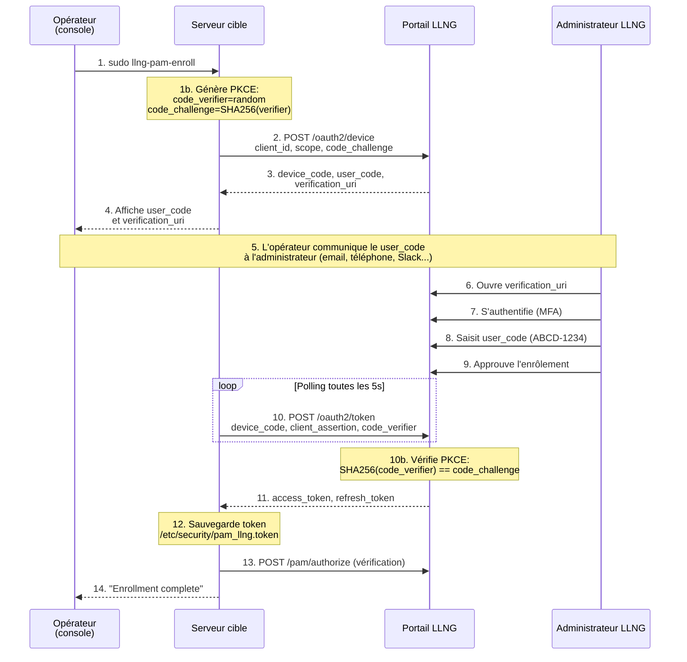
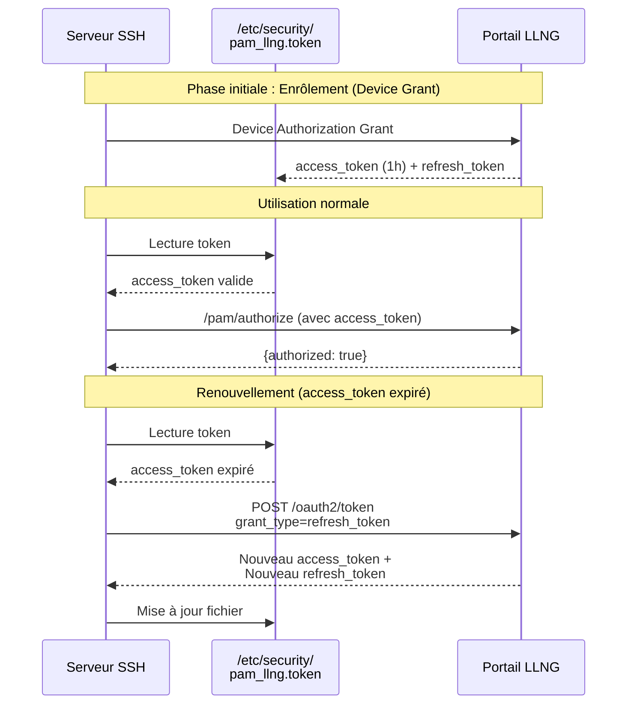
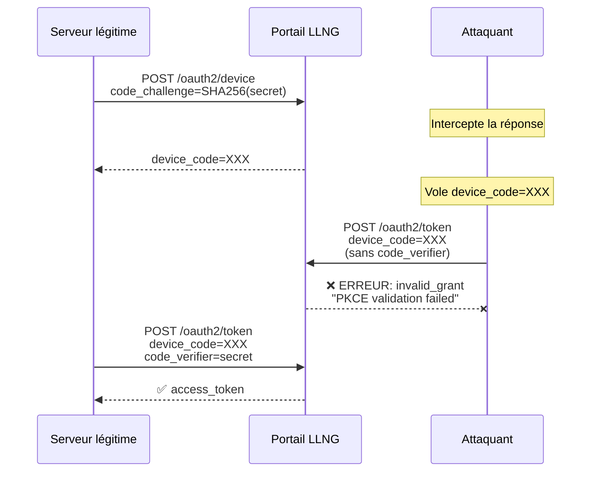
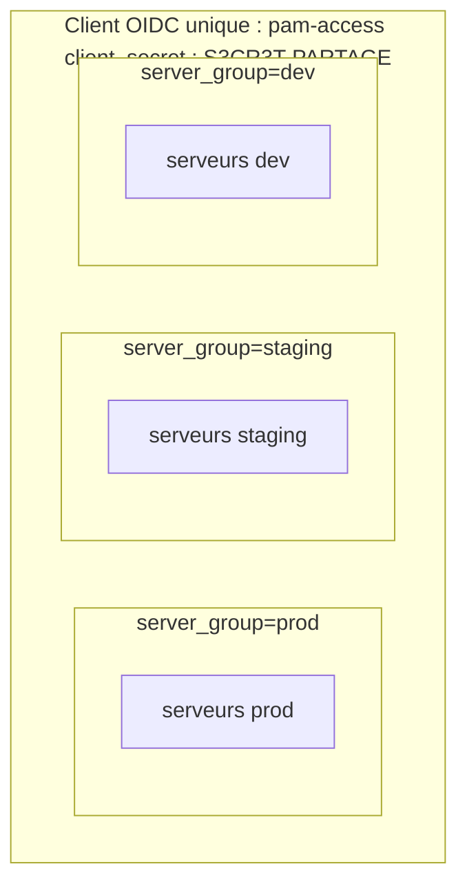
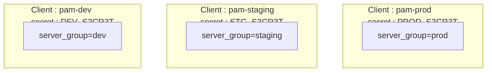
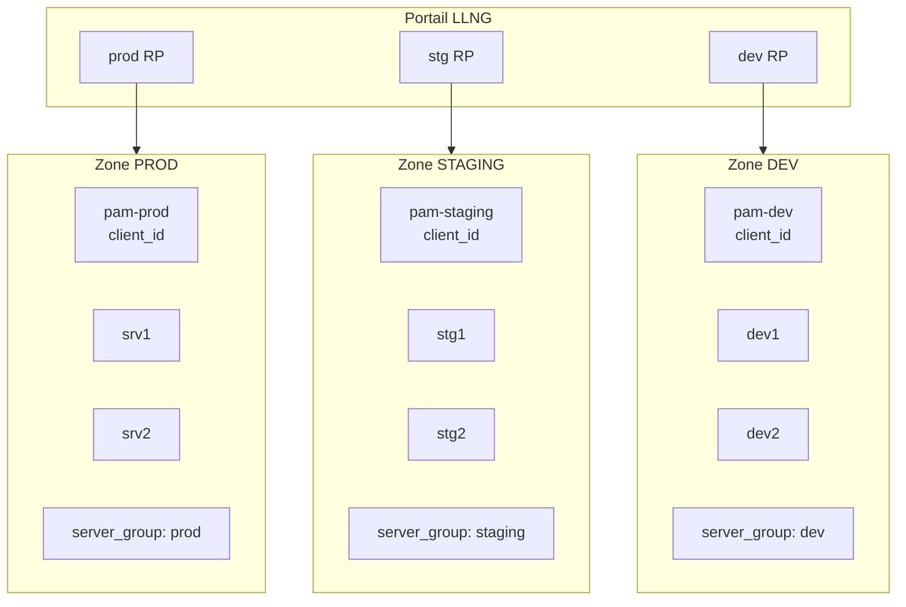
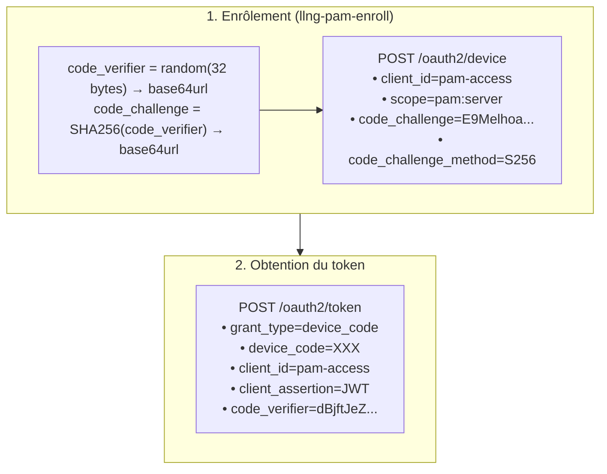

# Analyse de Sécurité - Phase 1 : Enrôlement du Serveur

## 1. Description du Flux

L'enrôlement utilise le flux **OAuth2 Device Authorization Grant** (RFC 8628). Ce flux est conçu pour les appareils sans navigateur (serveurs, IoT, CLI) qui ne peuvent pas effectuer de redirection HTTP.

### Acteurs

| Acteur                   | Rôle                                                               |
| ------------------------ | ------------------------------------------------------------------ |
| **Opérateur**            | Personne exécutant `llng-pam-enroll` sur le serveur à enrôler      |
| **Administrateur LLNG**  | Personne habilitée à approuver les enrôlements sur le portail LLNG |
| **Serveur cible**        | Machine à enrôler pour l'authentification PAM                      |
| **Portail LLNG**         | Serveur LemonLDAP::NG fournissant les endpoints OAuth2             |

### Prérequis (côté LLNG)

- Le portail LLNG doit avoir le Device Authorization Grant activé
- Un client OIDC `pam-access` (ou autre) doit être configuré avec :
  - `client_id` : identifiant public
  - `client_secret` : secret partagé entre le serveur et LLNG
  - Scope autorisé : `pam:server`
- L'administrateur LLNG doit avoir les droits d'approbation des devices

### Phase 0 : Initialisation par l'administrateur

Avant de pouvoir exécuter `llng-pam-enroll`, l'administrateur système doit configurer le serveur cible avec les informations de connexion à LLNG. Cette étape est réalisée une seule fois par serveur (ou par `server_group`).

**Informations à fournir :**

| Paramètre       | Description                    | Exemple                    |
| --------------- | ------------------------------ | -------------------------- |
| `portal_url`    | URL du portail LLNG            | `https://auth.example.com` |
| `client_id`     | Identifiant du client OIDC     | `pam-access`               |
| `client_secret` | Secret partagé OIDC            | `s3cr3t-p@ssw0rd`          |
| `server_group`  | Groupe de serveurs (optionnel) | `production`               |

**Comment l'administrateur obtient ces informations :**

1. **URL du portail** : Fournie par l'équipe qui gère LLNG (connue de l'organisation)
2. **client_id et client_secret** : Créés par l'administrateur LLNG lors de la configuration du client OIDC dans le Manager LLNG :
   - Manager LLNG → OIDC → Relying Parties → Nouveau client
   - Type : "Device Authorization"
   - Scope autorisé : `pam:server`
   - Le `client_secret` est généré ou défini à ce moment

**Création du fichier de configuration :**

L'administrateur crée `/etc/security/pam_llng.conf` :

```bash
# Création du fichier de configuration
sudo tee /etc/security/pam_llng.conf > /dev/null << 'EOF'
portal_url = https://auth.example.com
client_id = pam-access
client_secret = s3cr3t-p@ssw0rd
server_group = production
verify_ssl = true
EOF

# Sécurisation des permissions
sudo chmod 0600 /etc/security/pam_llng.conf
sudo chown root:root /etc/security/pam_llng.conf
```

**Points de sécurité :**
- Le fichier de configuration contient le `client_secret` → permissions strictes (0600)
- Le `client_secret` ne doit PAS être transmis par email ou canal non chiffré
- Idéalement, utiliser un gestionnaire de secrets (Vault, Ansible Vault) pour le déploiement
- Une alternative plus sécurisée est de passer le secret via une variable d'environnement au moment de l'enrôlement

**Alternative : transmission du secret lors de l'enrôlement**

Si le secret n'est pas dans le fichier de configuration, l'opérateur peut le fournir au moment de l'exécution :

```bash
sudo llng-pam-enroll --client-secret "$CLIENT_SECRET"
```

Dans ce cas, le secret est obtenu par l'opérateur via un canal sécurisé (gestionnaire de secrets, communication chiffrée avec l'admin LLNG).

---

### Flux détaillé (Phase 1 : Device Authorization Grant avec PKCE)



**Rôle de PKCE (RFC 7636) dans ce flux :**
- Le `code_verifier` est un secret généré localement (32 octets aléatoires, base64url)
- Le `code_challenge` est le hash SHA256 du `code_verifier` (envoyé à l'étape 2)
- Seul le serveur légitime possède le `code_verifier` (jamais transmis avant l'étape 10)
- Un attaquant interceptant le `device_code` ne peut pas l'échanger sans le `code_verifier`

### Étapes détaillées

#### Étape 1-3 : Initiation du flux Device Authorization avec PKCE

L'opérateur exécute `sudo llng-pam-enroll` sur le serveur. Le script génère d'abord les paramètres PKCE :

```bash
# Génération PKCE (RFC 7636)
code_verifier=$(head -c 32 /dev/urandom | openssl base64 -e -A | tr '+/' '-_' | tr -d '=')
code_challenge=$(echo -n "$code_verifier" | openssl dgst -sha256 -binary | openssl base64 -e -A | tr '+/' '-_' | tr -d '=')
```

Puis envoie une requête au portail avec le `code_challenge` :

```http
POST /oauth2/device HTTP/1.1
Host: auth.example.com
Content-Type: application/x-www-form-urlencoded

client_id=pam-access
&scope=pam:server
&code_challenge=E9Melhoa2OwvFrEMTJguCHaoeK1t8URWbuGJSstw-cM
&code_challenge_method=S256
```

**Note :** Le `code_verifier` reste secret sur le serveur. Seul le hash (`code_challenge`) est envoyé.

Le portail répond avec :

```json
{
  "device_code": "GmRhmhcxhwAzkoEqiMEg_DnyEysNkuNhszIySk9eS",
  "user_code": "ABCD-1234",
  "verification_uri": "https://auth.example.com/device",
  "verification_uri_complete": "https://auth.example.com/device?user_code=ABCD-1234",
  "expires_in": 300,
  "interval": 5
}
```

#### Étape 4-5 : Communication du user_code

Le script affiche à l'opérateur :

```
==> Administrator approval required

To authorize this server, an administrator must:

  1. Go to: https://auth.example.com/device

  2. Log in with administrator credentials

  3. Enter this code: ABCD-1234

Or open this URL directly: https://auth.example.com/device?user_code=ABCD-1234

The code expires in 5 minutes.
```

**L'opérateur doit alors transmettre ce code à un administrateur LLNG** par un canal externe :
- Email
- Téléphone
- Messagerie instantanée (Slack, Teams, etc.)
- En personne

**Point de sécurité critique :** Le `user_code` est un secret temporaire (5 min). Sa transmission doit être sécurisée.

#### Étape 6-9 : Approbation par l'administrateur

L'administrateur LLNG :
1. Ouvre `https://auth.example.com/device` dans son navigateur
2. S'authentifie sur LLNG (avec potentiellement MFA)
3. Saisit le `user_code` reçu de l'opérateur
4. Vérifie les informations et approuve l'enrôlement

#### Étape 10-11 : Obtention du token avec validation PKCE

Pendant ce temps, le script poll toutes les 5 secondes avec :
- Authentification `client_secret_jwt` (RFC 7523)
- Le `code_verifier` PKCE pour prouver la possession du secret initial

```http
POST /oauth2/token HTTP/1.1
Host: auth.example.com
Content-Type: application/x-www-form-urlencoded

grant_type=urn:ietf:params:oauth:grant-type:device_code
&device_code=GmRhmhcxhwAzkoEqiMEg_DnyEysNkuNhszIySk9eS
&client_id=pam-access
&client_assertion_type=urn:ietf:params:oauth:client-assertion-type:jwt-bearer
&client_assertion=eyJhbGciOiJIUzI1NiIsInR5cCI6IkpXVCJ9....<SIGNATURE>
&code_verifier=dBjftJeZ4CVP-mB92K27uhbUJU1p1r_wW1gFWFOEjXk
```

**Validation PKCE côté LLNG :**
Le serveur vérifie que `SHA256(code_verifier) == code_challenge` (envoyé à l'étape 2).
Si la vérification échoue, le serveur retourne `{"error": "invalid_grant", "error_description": "PKCE validation failed"}`.

**Le JWT (`client_assertion`) contient :**
- `iss` et `sub` : le `client_id` (pam-access)
- `aud` : l'URL du token endpoint
- `exp` : expiration (maintenant + 60 secondes)
- `iat` : timestamp de création
- `jti` : UUID unique (protection anti-replay)

Le `client_secret` sert uniquement à signer le JWT avec HMAC-SHA256. Il n'est jamais transmis sur le réseau.

Réponses possibles :
- `{"error": "authorization_pending"}` → continuer à poll
- `{"error": "slow_down"}` → augmenter l'intervalle
- `{"error": "expired_token"}` → le code a expiré, recommencer
- `{"error": "access_denied"}` → l'admin a refusé
- `{"access_token": "...", "refresh_token": "...", "expires_in": 3600}` → succès

#### Étape 12 : Stockage du token

Le token est sauvegardé en JSON :

```json
{
  "access_token": "eyJhbGciOiJSUzI1NiIs...",
  "refresh_token": "dGhpcyBpcyBhIHJlZnJlc2ggdG9rZW4...",
  "expires_at": 1734567890,
  "enrolled_at": 1734564290
}
```

Fichier : `/etc/security/pam_llng.token`
Permissions : `0600` (lecture/écriture root uniquement)
Propriétaire : `root:root`

#### Étape 13-14 : Vérification

Le script teste le token avec un appel à `/pam/authorize` pour confirmer que l'enrôlement fonctionne.

### Phase 2 : Cycle de vie du token (post-enrôlement)

Après l'enrôlement initial, le module PAM gère automatiquement le renouvellement des tokens pour maintenir l'authentification opérationnelle.

#### Polling régulier et renouvellement

À chaque authentification PAM, le module vérifie si le token approche de son expiration :

```c
// src/token_manager.c:445-461
bool token_manager_needs_refresh(const token_info_t *info, int threshold_sec)
{
    time_t now = time(NULL);

    /* Token déjà expiré */
    if (info->expires_at > 0 && now >= info->expires_at) {
        return true;
    }

    /* Token proche de l'expiration (threshold par défaut: 300s = 5min) */
    if (info->expires_at > 0 && (info->expires_at - now) <= threshold_sec) {
        return true;
    }

    return false;
}
```

#### Rotation systématique du refresh_token

Lors de chaque renouvellement, le module demande un nouveau `refresh_token` avec authentification `client_secret_jwt` :

```http
POST /oauth2/token HTTP/1.1
Host: auth.example.com
Content-Type: application/x-www-form-urlencoded

grant_type=refresh_token
&refresh_token=<CURRENT_REFRESH_TOKEN>
&client_id=pam-access
&client_assertion_type=urn:ietf:params:oauth:client-assertion-type:jwt-bearer
&client_assertion=<JWT_SIGNE>
&rotate_refresh_token=1
```

Le JWT d'authentification est généré à chaque requête avec un nouveau `jti` (UUID unique), empêchant toute attaque par rejeu.

**Réponse :**

```json
{
  "access_token": "eyJhbGciOiJSUzI1NiIs...(nouveau)",
  "refresh_token": "dGhpcyBpcyBhIG5ldyByZWZyZXNo...(nouveau)",
  "expires_in": 3600
}
```

**Avantages de la rotation :**
- L'ancien `refresh_token` est invalidé immédiatement
- Limite la fenêtre d'exploitation en cas de vol
- Détection d'utilisation concurrente (si un token est utilisé deux fois, le second échoue)

**Configuration :**

```ini
# /etc/security/pam_llng.conf
token_rotate_refresh = true   # Activé par défaut
```

Ou en argument PAM :
```
auth required pam_llng.so no_rotate_refresh  # Pour désactiver (non recommandé)
```

#### Diagramme du cycle de renouvellement



**Points de sécurité :**
- Le `refresh_token` change à chaque renouvellement → pas de valeur statique à long terme
- Si le serveur LLNG est indisponible, le cache local permet de continuer l'authentification
- L'ancien `refresh_token` devient inutilisable dès qu'un nouveau est émis

---

## 2. Analyse des Risques

### Échelle de cotation

| Score | Probabilité     | Impact      |
| ----- | --------------- | ----------- |
| 1     | Très improbable | Négligeable |
| 2     | Peu probable    | Limité      |
| 3     | Probable        | Important   |
| 4     | Très probable   | Critique    |

---

### R0 - Compromission du client_secret lors de l'initialisation

|                 | Score |
| --------------- | :---: |
| **Probabilité** |   2   |
| **Impact**      |   2   |

**Description :** Le `client_secret` doit être transmis de l'administrateur LLNG à l'administrateur système du serveur cible lors de la phase d'initialisation. Ce secret pourrait être intercepté.

**Vecteurs d'attaque :**
- Transmission par email non chiffré
- Stockage dans un wiki ou documentation partagée non sécurisée
- Copier-coller via un canal non sécurisé (Slack, Teams sans chiffrement E2E)

**Analyse d'impact (limité) :**

Le `client_secret` seul ne permet PAS de :
- Obtenir un token sans approbation de l'administrateur LLNG (flux Device Authorization)
- Accéder aux données des utilisateurs
- Valider des authentifications

**Le vrai risque** : Un attaquant qui possède le `client_secret` ET qui peut usurper l'adresse IP d'un serveur légitime pourrait :
1. Initier un flux d'enrôlement
2. Obtenir un `user_code`
3. Convaincre l'admin LLNG d'approuver (social engineering)
4. Recevoir un token pour son serveur malveillant qui se fait passer pour le serveur légitime

Ce scénario nécessite plusieurs conditions :
- Possession du `client_secret`
- Capacité d'usurpation IP (ARP spoofing sur LAN, BGP hijacking, compromission DNS)
- Social engineering réussi sur l'admin LLNG

**Facteur atténuant majeur :** Même si l'attaquant réussit à enrôler un serveur malveillant avec l'IP d'un serveur légitime, les clients SSH détecteront le changement de clef hôte :

```
@@@@@@@@@@@@@@@@@@@@@@@@@@@@@@@@@@@@@@@@@@@@@@@@@@@@@@@@@@@
@    WARNING: REMOTE HOST IDENTIFICATION HAS CHANGED!     @
@@@@@@@@@@@@@@@@@@@@@@@@@@@@@@@@@@@@@@@@@@@@@@@@@@@@@@@@@@@
IT IS POSSIBLE THAT SOMEONE IS DOING SOMETHING NASTY!
```

Ce mécanisme SSH natif rend l'attaque très visible et nécessite que l'utilisateur ignore explicitement l'avertissement.

**Remédiation embarquée :**
- Le `client_secret` n'est utile que combiné au flux Device Authorization avec approbation humaine
- Le scope `pam:server` limite les actions possibles

**Remédiation configuration :**
- Utiliser un gestionnaire de secrets (Vault, Ansible Vault) pour le déploiement
- Ne jamais stocker le secret dans un wiki, email ou fichier partagé
- Rotation périodique du `client_secret` côté LLNG
- Utiliser `client_secret_jwt` (implémenté) pour éviter la transmission du secret en clair dans les requêtes HTTP

**Remédiation procédurale :**
- L'admin LLNG génère le secret et le transmet via un canal chiffré (Signal, GPG)
- Le secret est saisi directement sur le serveur cible, pas copié dans des documents intermédiaires

|                 | Score résiduel |
| --------------- | :------------: |
| **Probabilité** |       1        |
| **Impact**      |       2        |

---

### R1 - Interception du user_code pendant sa transmission

|                 | Score |
| --------------- | :---: |
| **Probabilité** |   3   |
| **Impact**      |   3   |

**Description :** Le `user_code` (ex: `ABCD-1234`) doit être transmis de l'opérateur à l'administrateur LLNG par un canal externe (email, téléphone, Slack...). Ce canal peut être compromis.

**Vecteurs d'attaque :**
- Interception email (SMTP non chiffré, compromission boîte mail)
- Écoute téléphonique
- Compromission du canal de messagerie
- Shoulder surfing (lecture par-dessus l'épaule)

**Conséquence :** Un attaquant ayant le `user_code` peut l'utiliser avant l'administrateur légitime et faire approuver un serveur malveillant.

**Remédiation embarquée :**
- Expiration courte du code (5 minutes par défaut, `expires_in`)
- Format court et lisible (8 caractères) limitant les erreurs de transmission
- Le code seul ne suffit pas : il faut que l'admin l'approuve activement

**Remédiation configuration :**
- Utiliser des canaux de communication chiffrés (Signal, email chiffré)
- Vérifier verbalement l'identité de l'opérateur avant approbation
- Réduire `expires_in` côté LLNG si le risque est élevé
- Limiter le nombre de tentatives de saisie du `user_code`

**Remédiation procédurale :**
- L'administrateur doit vérifier que la demande est légitime (ticket, appel téléphonique de confirmation)
- Documenter qui a demandé l'enrôlement et pourquoi

|                 | Score résiduel |
| --------------- | :------------: |
| **Probabilité** |       2        |
| **Impact**      |       3        |

---

### R2 - Brute-force du user_code

|                 | Score |
| --------------- | :---: |
| **Probabilité** |   2   |
| **Impact**      |   3   |

**Description :** Le `user_code` est court (8 caractères, typiquement alphanumériques). Un attaquant pourrait tenter de le deviner.

**Vecteurs d'attaque :**
- Attaque automatisée sur `/device` avec différents codes
- Tentatives multiples avant expiration

**Calcul RFC 8628 :** Avec un code de 8 caractères base-20 et max 5 tentatives : probabilité de succès = 2^-32 (négligeable).

**Remédiation embarquée (LLNG) :**
- Format `user_code` conforme RFC 8628 §6.1 : base-20 sans voyelles (`BCDFGHJKLMNPQRSTVWXZ`)
- Expiration courte (10 minutes par défaut, configurable)
- Intégration CrowdSec : chaque tentative invalide est signalée (scénario `llng/device-auth-bruteforce`)

**Remédiation configuration (côté LLNG) :**
```yaml
# FORTEMENT RECOMMANDÉ : Activer CrowdSec pour le rate-limiting IP
crowdsec: 1
crowdsecAgent: 1

# Optionnel : ajuster les paramètres
oidcServiceDeviceAuthorizationExpiration: 300      # TTL en secondes (défaut: 600)
oidcServiceDeviceAuthorizationUserCodeLength: 8    # Longueur du code (défaut: 8)
```

**Note :** Sans CrowdSec activé, LLNG affiche un warning au démarrage. Le rate-limiting IP est délégué à CrowdSec qui gère le lockout automatique après N échecs

|                 | Score résiduel |
| --------------- | :------------: |
| **Probabilité** |       1        |
| **Impact**      |       3        |

---

### R3 - Interception du client_secret pendant le polling

|                 | Score |
| --------------- | :---: |
| **Probabilité** |   2   |
| **Impact**      |   4   |

**Description :** Le `client_secret` OIDC est utilisé pour authentifier le client lors des requêtes vers `/oauth2/token`. Une interception permettrait de créer des tokens serveur frauduleux pour n'importe quel `device_code` futur.

**Vecteurs d'attaque :**
- MITM sur le réseau (ARP spoofing, DNS spoofing, proxy malveillant)
- Compromission d'un équipement réseau
- Configuration `verify_ssl=false` (désactive la vérification TLS)
- Lecture des arguments de la commande (`ps aux` montre `-s secret`)

**Remédiation embarquée :**
- **Authentification `client_secret_jwt` (RFC 7523)** : Le secret n'est plus transmis en clair dans les requêtes. À la place, un JWT signé avec HMAC-SHA256 est généré :
  - Le JWT contient les claims `iss`, `sub`, `aud`, `exp`, `iat`, `jti`
  - Le `jti` (JWT ID) est un UUID unique pour chaque requête, empêchant le replay
  - Le secret sert uniquement à signer le JWT localement, il ne transite jamais sur le réseau
- TLS 1.3 par défaut (`src/llng_client.c:410`)
- Vérification SSL activée par défaut
- Support du certificate pinning (`src/llng_client.c:512-521`)
- Le secret n'apparaît pas dans les logs du script

**Flux d'authentification `client_secret_jwt` :**
```http
POST /oauth2/token HTTP/1.1
Content-Type: application/x-www-form-urlencoded

grant_type=urn:ietf:params:oauth:grant-type:device_code
&device_code=GmRhmhcxhwAzkoEqiMEg_DnyEysNkuNhszIySk9eS
&client_id=pam-access
&client_assertion_type=urn:ietf:params:oauth:client-assertion-type:jwt-bearer
&client_assertion=eyJhbGciOiJIUzI1NiIsInR5cCI6IkpXVCJ9...
```

Le JWT (`client_assertion`) est signé avec le `client_secret` mais celui-ci n'est jamais envoyé directement.

**Remédiation configuration :**
```ini
# /etc/security/pam_llng.conf
verify_ssl = true          # Ne JAMAIS mettre false en production
min_tls_version = 1.3      # Imposer TLS 1.3
cert_pin = sha256//...     # Pinning du certificat LLNG (recommandé)
```

```ini
# Configuration LLNG (Manager) pour activer client_secret_jwt
# OIDC → Relying Parties → pam-access → Options → Client authentication method
oidcRPMetaDataOptionsClientAuthenticationMethod: client_secret_jwt
```

- Stocker `client_secret` dans le fichier de config plutôt que le passer en CLI
- Protéger le fichier de config (`chmod 600`)

|                 | Score résiduel                                                              |
| --------------- | :-------------------------------------------------------------------------: |
| **Probabilité** |                                      1                                      |
| **Impact**      | 3 (avec `client_secret_jwt`, le secret intercepté est un JWT à usage unique) |

---

### R4 - Vol du fichier token après enrôlement

|                 | Score |
| --------------- | :---: |
| **Probabilité** |   3   |
| **Impact**      |   4   |

**Description :** Le fichier `/etc/security/pam_llng.token` contient l'`access_token` du serveur. Sa compromission permet d'usurper l'identité du serveur auprès de LLNG.

**Vecteurs d'attaque :**
- Accès root compromis (malware, exploit, insider)
- Backup non chiffré incluant le fichier
- Mauvaises permissions sur le fichier (erreur de configuration)
- Accès physique à la machine (boot USB, extraction disque)

**Conséquence :** L'attaquant peut :
- Valider des authentifications pour n'importe quel utilisateur sur ce server_group
- Obtenir les attributs des utilisateurs (groupes, permissions sudo)

**Remédiation embarquée :**
- Création avec permissions 0600 (`scripts/llng-pam-enroll:447`)
- Vérification propriétaire root à l'utilisation (`src/pam_llng.c:134-138`)
- Vérification permissions à l'utilisation (`src/pam_llng.c:141-146`)
- Re-vérification périodique toutes les 5 min (`src/pam_llng.c:96-100`)
- Détection de remplacement de fichier via inode (`src/pam_llng.c:119-124`)
- Écriture atomique via fichier temporaire + rename (`src/token_manager.c:632-663`)

**Remédiation configuration :**
```bash
# Vérifier les permissions
chmod 0600 /etc/security/pam_llng.token
chown root:root /etc/security/pam_llng.token

# SELinux context (si applicable)
semanage fcontext -a -t pam_var_run_t "/etc/security/pam_llng.token"
restorecon -v /etc/security/pam_llng.token

# Monitoring des accès
auditctl -w /etc/security/pam_llng.token -p rwa -k pam_token_access
```

**Remédiation infrastructure :**
- Chiffrement du disque (LUKS)
- Exclure le fichier des backups ou chiffrer les backups
- Restreindre l'accès root (sudo avec justification)

**Réduction d'impact par segmentation :**
- Utiliser des `server_group` distincts (prod, staging, dev, par département...)
- Un token compromis ne permet d'usurper que les serveurs du même `server_group`
- Impact réduit de 4 → 3 si segmentation fine appliquée

|                 | Score résiduel                          |
| --------------- | :-------------------------------------: |
| **Probabilité** |                    1                    |
| **Impact**      | 4 (ou 3 avec segmentation server_group) |

---

### R5 - Usurpation du serveur LLNG pendant l'enrôlement

|                 | Score |
| --------------- | :---: |
| **Probabilité** |   2   |
| **Impact**      |   4   |

**Description :** Un attaquant pourrait se faire passer pour le serveur LLNG et :
- Capturer le `client_secret` envoyé pendant le polling
- Délivrer un faux token permettant de contrôler les authentifications

**Vecteurs d'attaque :**
- DNS spoofing (attaquant redirige auth.example.com vers son serveur)
- Compromission de la chaîne de certificats (CA compromise)
- Configuration `verify_ssl=false`
- Absence de certificate pinning

**Remédiation embarquée :**
- Vérification SSL obligatoire par défaut
- Validation du format HTTPS dans la configuration (`src/config.c:659-663`)
- Support du certificate pinning (`CURLOPT_PINNEDPUBLICKEY`)
- Validation du format du pin à l'initialisation (`src/llng_client.c:298-359`)

**Remédiation configuration :**
```ini
# /etc/security/pam_llng.conf
portal_url = https://auth.example.com  # HTTPS obligatoire
verify_ssl = true                       # Ne jamais désactiver
cert_pin = sha256//XXXXXXXXXXXXXXXXXXXXXXXXXXXXXXXXXXXXXXXXXXX=
ca_cert = /etc/ssl/certs/internal-ca.pem  # Si CA interne
```

Pour obtenir le pin SHA256 du certificat LLNG :
```bash
openssl s_client -connect auth.example.com:443 2>/dev/null | \
  openssl x509 -pubkey -noout | \
  openssl pkey -pubin -outform DER | \
  openssl dgst -sha256 -binary | \
  openssl enc -base64
```

|                 | Score résiduel |
| --------------- | :------------: |
| **Probabilité** |       1        |
| **Impact**      |       4        |

---

### R6 - Expiration du device_code non gérée

|                 | Score |
| --------------- | :---: |
| **Probabilité** |   3   |
| **Impact**      |   2   |

**Description :** Le `device_code` expire après 5 minutes (par défaut). Si l'administrateur tarde à approuver, l'enrôlement échoue.

**Vecteurs d'attaque :**
- DoS : empêcher l'administrateur d'approuver à temps
- Confusion : l'opérateur relance le script, créant plusieurs codes

**Remédiation embarquée :**
- Affichage du temps restant (`scripts/llng-pam-enroll:320`)
- Message clair en cas d'expiration (`expired_token` → "Please run this script again")
- Gestion de l'erreur `slow_down` (augmentation de l'intervalle de polling)

**Remédiation procédurale :**
- Coordonner avec l'administrateur avant de lancer le script
- S'assurer que l'administrateur est disponible et prêt

|                 | Score résiduel |
| --------------- | :------------: |
| **Probabilité** |       2        |
| **Impact**      |       1        |

---

### R7 - Enrôlement non autorisé (serveur malveillant)

|                 | Score |
| --------------- | :---: |
| **Probabilité** |   2   |
| **Impact**      |   4   |

**Description :** Un attaquant pourrait enrôler un serveur non autorisé et obtenir un token valide.

**Vecteurs d'attaque :**
- Vol des credentials OIDC (`client_id`/`client_secret`) → l'attaquant peut initier un flux d'enrôlement
- Social engineering de l'administrateur LLNG ("Salut, j'ai besoin que tu approuves le code WXYZ-5678 pour le nouveau serveur")
- Compromission d'un serveur déjà enrôlé → utilisation de ses credentials

**Conséquence :** Le serveur malveillant peut valider des authentifications pour tout utilisateur du `server_group`.

**Remédiation embarquée :**
- Le flux RFC 8628 nécessite une approbation humaine sur le portail
- Le `user_code` doit être saisi manuellement
- Le scope `pam:server` limite les permissions du token
- Le `server_group` permet de segmenter les autorisations

**Remédiation configuration (côté LLNG) :**
- Restreindre qui peut approuver les enrôlements (ACL sur `/device`)
- Activer les notifications lors des approbations
- Audit log des enrôlements avec IP source
- Rotation périodique du `client_secret`

**Remédiation procédurale :**
- L'administrateur doit vérifier l'identité de l'opérateur (callback téléphonique, ticket)
- Utiliser des `server_group` distincts par environnement (prod, staging, dev)
- Inventaire des serveurs enrôlés avec revue périodique

**Réduction d'impact par segmentation :**
- La segmentation par `server_group` limite le blast radius
- Un serveur malveillant ne peut usurper que les serveurs de son groupe
- Impact réduit de 4 → 3 avec segmentation

|                 | Score résiduel                     |
| --------------- | :--------------------------------: |
| **Probabilité** |                 1                  |
| **Impact**      | 3 (avec segmentation server_group) |

---

### R8 - Fuite du token en mémoire

|                 | Score |
| --------------- | :---: |
| **Probabilité** |   2   |
| **Impact**      |   3   |

**Description :** Le token pourrait être extrait de la mémoire du processus PAM ou du script d'enrôlement.

**Vecteurs d'attaque :**
- Core dump du processus
- Lecture `/proc/<pid>/mem` ou `/proc/<pid>/environ`
- Attaque cold boot (lecture RAM après reboot)
- Swap non chiffré

**Remédiation embarquée :**
- `explicit_bzero()` sur tous les secrets après usage (`src/llng_client.c:468-470`)
- Effacement des buffers HMAC (`src/llng_client.c:203,220`)
- Effacement des headers Authorization (`src/llng_client.c:576,884`)
- Fonction `secure_free()` pour libération sécurisée (`src/token_manager.c:449-456`)

**Remédiation configuration :**
```bash
# Désactiver les core dumps
echo "* hard core 0" >> /etc/security/limits.conf
echo "fs.suid_dumpable = 0" >> /etc/sysctl.conf

# Protection ptrace
echo "kernel.yama.ptrace_scope = 1" >> /etc/sysctl.conf

# Chiffrer le swap
cryptsetup luksFormat /dev/swap_partition
```

|                 | Score résiduel |
| --------------- | :------------: |
| **Probabilité** |       1        |
| **Impact**      |       3        |

---

### R9 - Déni de service sur les endpoints d'enrôlement

|                 | Score |
| --------------- | :---: |
| **Probabilité** |   2   |
| **Impact**      |   2   |

**Description :** Un attaquant pourrait empêcher les enrôlements légitimes.

**Vecteurs d'attaque :**
- Flood du endpoint `/oauth2/device` → épuisement des ressources LLNG
- Flood avec des `client_id` valides → rate limiting déclenché pour tout le monde
- Blocage réseau entre le serveur et LLNG

**Remédiation embarquée :**
- Timeout sur les requêtes (évite les blocages infinis)
- Respect de l'intervalle de polling RFC 8628
- Gestion du `slow_down` (augmentation de l'intervalle)

**Remédiation configuration (côté LLNG) :**
- Rate limiting par IP sur `/oauth2/device` et `/oauth2/token`
- Monitoring des requêtes d'enrôlement
- Alerting sur les volumes anormaux

**Remédiation infrastructure :**
- WAF devant LLNG
- Procédure d'enrôlement alternative (hors-ligne) documentée

|                 | Score résiduel |
| --------------- | :------------: |
| **Probabilité** |       1        |
| **Impact**      |       2        |

---

### R10 - Expiration de l'access_token non détectée

|                 | Score |
| --------------- | :---: |
| **Probabilité** |   2   |
| **Impact**      |   3   |

**Description :** L'`access_token` du serveur a une durée de vie limitée (ex: 1 heure). S'il expire sans être rafraîchi, les authentifications échouent.

**Vecteurs d'attaque :**
- Serveur LLNG indisponible au moment du refresh
- Horloge désynchronisée (le serveur pense que le token est encore valide)
- Refresh token révoqué côté LLNG

**Conséquence :** Les utilisateurs ne peuvent plus s'authentifier sur le serveur.

**Remédiation embarquée :**
- Stockage de `expires_at` dans le fichier token
- Support du refresh token (`src/token_manager.c:202-326`)
- Rotation automatique du refresh token (si configuré côté LLNG)
- Détection HTTP 401 → message "Re-enrollment required"

**Remédiation configuration :**
```bash
# Synchronisation NTP
timedatectl set-ntp true

# Monitoring de l'expiration
# Script cron pour alerter si le token expire bientôt
```

**Remédiation procédurale :**
- Monitoring de l'expiration des tokens
- Procédure de ré-enrôlement d'urgence documentée

|                 | Score résiduel |
| --------------- | :------------: |
| **Probabilité** |       1        |
| **Impact**      |       2        |

---

### R11 - Compromission du refresh_token

|                 | Score |
| --------------- | :---: |
| **Probabilité** |   2   |
| **Impact**      |   4   |

**Description :** Le `refresh_token` est stocké avec l'`access_token` dans `/etc/security/pam_llng.token`. Contrairement à l'`access_token` qui expire rapidement (ex: 1h), le `refresh_token` a une durée de vie longue et permet d'obtenir de nouveaux `access_token` sans ré-enrôlement.

**Vecteurs d'attaque :**
- Mêmes que R4 (vol du fichier token)
- Interception lors du refresh (MITM)
- Le `refresh_token` reste valide même si l'`access_token` est révoqué

**Conséquence :** Un attaquant avec le `refresh_token` peut :
- Obtenir des `access_token` valides indéfiniment (jusqu'à révocation explicite)
- Maintenir un accès persistant même après détection et rotation de l'`access_token`

**Remédiation embarquée :**
- Stockage sécurisé (mêmes protections que l'`access_token`)
- Support de la rotation du refresh token (`src/token_manager.c:202-326`)
- Effacement sécurisé en mémoire après usage

**Remédiation configuration (côté LLNG) :**
- Activer la rotation du `refresh_token` (chaque refresh génère un nouveau refresh_token)
- Limiter la durée de vie du `refresh_token`
- Permettre la révocation par serveur/server_group
- Audit des opérations de refresh

**Remédiation procédurale :**
- En cas de compromission suspectée : révoquer le refresh_token côté LLNG ET ré-enrôler
- Rotation périodique des tokens (ré-enrôlement planifié)

**Réduction d'impact par segmentation :**
- Mêmes bénéfices que R4 : le token ne permet d'usurper que les serveurs du `server_group`
- Impact réduit de 4 → 3 avec segmentation

|                 | Score résiduel                     |
| --------------- | :--------------------------------: |
| **Probabilité** |                 1                  |
| **Impact**      | 3 (avec segmentation server_group) |

---

### R12 - Refresh_token dormant sur serveur inactif

|                 | Score |
| --------------- | :---: |
| **Probabilité** |   3   |
| **Impact**      |   3   |

**Description :** Si un serveur enrôlé ne poll pas le SSO pendant une longue période (serveur éteint, déconnecté, décommissionné mais pas dé-enrôlé), son `refresh_token` reste valide indéfiniment.

**Vecteurs d'attaque :**
- Vol du fichier token sur un serveur inactif (backup ancien, accès physique)
- Le serveur a été décommissionné mais le token n'a pas été révoqué
- Serveur compromis puis isolé du réseau : l'attaquant conserve un token valide

**Conséquence :** Un attaquant peut utiliser un token "dormant" des mois après sa compromission, sans qu'aucune activité suspecte ne soit détectée entre-temps.

**Remédiation embarquée (LLNG) :**
- **Implémenté** : Paramètre `oidcRPMetaDataOptionsRtActivity` pour révoquer automatiquement les refresh tokens inactifs
- Le timestamp `_oidcRtUpdate` est mis à jour à chaque utilisation du refresh token
- La purge des sessions (WebCron ou cron) supprime les tokens inactifs

**Configuration LLNG recommandée :**
```yaml
# LLNG Manager → OIDC → Relying Parties → pam-access → Options
oidcRPMetaDataOptionsRtActivity: 2592000  # 30 jours en secondes (0 = désactivé)
```

**Remédiation PAM :**
- **Implémenté** : Heartbeat périodique via `pam-llng-heartbeat.timer` (toutes les 5 minutes)
- Le heartbeat maintient le token actif et détecte les pertes de connectivité
- Activation : `systemctl enable --now pam-llng-heartbeat.timer`

**Remédiation procédurale :**
- Procédure de dé-enrôlement lors du décommissionnement d'un serveur
- Inventaire régulier des serveurs enrôlés vs serveurs actifs
- Révocation manuelle des tokens des serveurs inactifs (si timeout non configuré)

|                 | Score résiduel                                    |
| --------------- | :-----------------------------------------------: |
| **Probabilité** | 1 (avec `oidcRPMetaDataOptionsRtActivity` activé) |
| **Impact**      |                         3                         |

---

### R13 - Interception du device_code sans PKCE

|                 | Score |
| --------------- | :---: |
| **Probabilité** |   2   |
| **Impact**      |   4   |

**Description :** Sans PKCE, un attaquant qui intercepte le `device_code` sur le réseau peut l'échanger contre un token avant le serveur légitime, même sans connaître le `code_verifier`.

**Vecteurs d'attaque :**
- MITM sur le réseau lors de l'appel POST `/oauth2/device`
- Interception de la réponse contenant le `device_code`
- L'attaquant poll `/oauth2/token` avec le `device_code` volé
- Dès que l'admin approuve, l'attaquant obtient le token

**Conséquence :** L'attaquant obtient un token serveur valide, le serveur légitime échoue car le `device_code` a été consommé.

**Remédiation embarquée :**
- **PKCE (RFC 7636)** : Le script `llng-pam-enroll` génère un `code_verifier` secret qui n'est jamais transmis lors de la requête initiale. Seul le `code_challenge` (hash SHA256) est envoyé.
- Sans le `code_verifier`, l'attaquant ne peut pas échanger le `device_code` volé.

**Remédiation configuration (côté LLNG) :**
```yaml
# OIDC → Relying Parties → pam-access → Options
# FORTEMENT RECOMMANDÉ pour les clients Device Flow
oidcRPMetaDataOptionsRequirePKCE: 1
```

Avec cette option activée, LLNG rejette les requêtes d'enrôlement sans `code_challenge`.

**Flux sécurisé avec PKCE :**



|                 | Score résiduel (avec PKCE) |
| --------------- | :------------------------: |
| **Probabilité** |             1              |
| **Impact**      |  1 (attaque impossible)    |

---

## 3. Matrice des Risques

### Avant remédiation

| Impact ↓ / Probabilité → | 1 - Très improbable | 2 - Peu probable | 3 - Probable | 4 - Très probable |
|--------------------------|---------------------|------------------|--------------|-------------------|
| **4 - Critique**         |                     | R3 R5 R7 R11 R13 | R4           |                   |
| **3 - Important**        |                     | R8 R10           | R1 R2 R12    |                   |
| **2 - Limité**           |                     | R0 R6 R9         |              |                   |
| **1 - Négligeable**      |                     |                  |              |                   |

### Après remédiation

| Impact ↓ / Probabilité → | 1 - Très improbable | 2 - Peu probable | 3 - Probable | 4 - Très probable |
|--------------------------|---------------------|------------------|--------------|-------------------|
| **4 - Critique**         | R5                  |                  |              |                   |
| **3 - Important**        | R1 R3 R8 R12        | R2               |              |                   |
| **2 - Limité**           | R4 R7 R9 R10 R11    | R6               |              |                   |
| **1 - Négligeable**      | R0 R13              |                  |              |                   |

**Remédiations appliquées :**

| Remédiation | Risques impactés | Effet |
|-------------|------------------|-------|
| **PKCE obligatoire** | R13 | I=4 → I=1 : Sans `code_verifier`, l'interception du `device_code` est inutile |
| **`client_secret_jwt`** | R3 | I=4 → I=3 : JWT à usage unique (anti-rejeu via `jti`) |
| **Segmentation `server_group`** | R4 R7 R11 | I=4 → I=3 : Blast radius limité au groupe |
| **Clients OIDC distincts** | R0 R4 R7 R11 | I supplémentaire −1 : Isolation complète par zone |
| **CrowdSec** | R2 | P=3 → P=2 : Rate-limiting IP sur brute-force `user_code` |
| **`RtActivity`** | R12 | P=3 → P=1 : Révocation automatique des tokens inactifs |

**Détail des améliorations avec clients OIDC distincts (voir section 5.2) :**

| Risque | Sans clients distincts | Avec clients distincts | Amélioration |
|--------|------------------------|------------------------|--------------|
| **R0** | P=1, I=2               | **P=1, I=1**           | Le secret compromis ne peut initier d'enrôlements que dans sa zone |
| **R4** | P=1, I=3               | **P=1, I=2**           | Le token volé n'est valide que pour le scope de sa zone |
| **R7** | P=1, I=3               | **P=1, I=2**           | Le serveur malveillant ne peut usurper que sa zone |
| **R11**| P=1, I=3               | **P=1, I=2**           | Le refresh_token compromis est limité à sa zone |

**Résultat :** Seul R5 (usurpation du serveur LLNG) reste critique - c'est le point unique de défaillance irréductible.

**Légende :**
- Zone verte (P≤1, I≤2) : Risque acceptable
- Zone jaune (P≤2, I≤3) : Risque à surveiller
- Zone orange (P≤2, I=4 ou P=3, I=3) : Risque à traiter
- Zone rouge (P≥3, I≥3) : Risque critique

---

## 4. Synthèse des Remédiations

### Configuration minimale sécurisée

```ini
# /etc/security/pam_llng.conf

# Portal LLNG (HTTPS obligatoire)
portal_url = https://auth.example.com

# Sécurité TLS
verify_ssl = true
min_tls_version = 1.3

# Credentials OIDC (plutôt que les passer en CLI)
client_id = pam-access
client_secret = <secret>

# Fichier token
server_token_file = /etc/security/pam_llng.token
```

### Configuration renforcée

```ini
# /etc/security/pam_llng.conf

portal_url = https://auth.example.com
verify_ssl = true
min_tls_version = 1.3

# Certificate pinning (fortement recommandé)
cert_pin = sha256//AAAAAAAAAAAAAAAAAAAAAAAAAAAAAAAAAAAAAAAAAAA=

# CA interne si applicable
ca_cert = /etc/ssl/certs/internal-ca.pem

client_id = pam-access
client_secret = <secret>

server_token_file = /etc/security/pam_llng.token

# Segmentation par environnement
server_group = production
```

### Hardening système

```bash
#!/bin/bash
# Script de hardening pour le serveur PAM

# Permissions strictes
chmod 0600 /etc/security/pam_llng.conf
chmod 0600 /etc/security/pam_llng.token
chown root:root /etc/security/pam_llng.conf
chown root:root /etc/security/pam_llng.token

# Désactiver core dumps
echo "* hard core 0" >> /etc/security/limits.conf
echo "fs.suid_dumpable = 0" >> /etc/sysctl.conf

# Protection ptrace
echo "kernel.yama.ptrace_scope = 1" >> /etc/sysctl.conf

# Appliquer sysctl
sysctl -p

# Audit des accès au fichier token
auditctl -w /etc/security/pam_llng.token -p rwa -k pam_token_access
auditctl -w /etc/security/pam_llng.conf -p rwa -k pam_config_access

# Synchronisation NTP
timedatectl set-ntp true
```

---

## 5. Stratégies de Segmentation

La segmentation permet de limiter le "blast radius" en cas de compromission. Deux niveaux de segmentation sont possibles : par `server_group` (même client OIDC) ou par client OIDC distinct.

### 5.1 Segmentation par `server_group` (niveau 1)

Un seul client OIDC partagé entre tous les serveurs, différenciés par leur `server_group` :



**Avantages :**
- Configuration simple côté LLNG (un seul client)
- Gestion centralisée des autorisations

**Limites :**
- Le `client_secret` est partagé entre tous les environnements
- Si le secret est compromis sur un serveur dev, un attaquant peut initier un enrôlement pour n'importe quel `server_group`
- Rotation du secret = mise à jour de TOUS les serveurs

**Impact sur les risques :**
- R4, R7, R11 : Le token compromis ne permet d'usurper que les serveurs du même `server_group` → Impact 4 → 3
- R0 : Le `client_secret` compromis permet d'initier des enrôlements pour TOUS les `server_group` → pas de réduction

### 5.2 Segmentation par client OIDC (niveau 2 - RECOMMANDÉ)

Chaque environnement ou zone de sécurité dispose de son propre client OIDC avec un `client_secret` distinct :



**Avantages :**
- **Isolation complète** : compromission d'un secret n'affecte qu'une zone
- **Rotation indépendante** : renouveler le secret d'un environnement sans toucher aux autres
- **Audit granulaire** : identifier quel client (donc quel environnement) a initié chaque action
- **Désactivation ciblée** : désactiver un client sans impacter les autres environnements
- **Principe du moindre privilège** : chaque serveur n'a accès qu'au scope de son environnement

**Impact sur les risques :**

| Risque | Sans segmentation | Avec `server_group` | Avec clients distincts |
|--------|-------------------|---------------------|------------------------|
| R0     | P=2, I=2          | P=2, I=2            | **P=2, I=1**           |
| R4     | P=3, I=4          | P=1, I=3            | **P=1, I=2**           |
| R7     | P=2, I=4          | P=1, I=3            | **P=1, I=2**           |
| R11    | P=2, I=4          | P=1, I=3            | **P=1, I=2**           |

**Explication :**
- **R0 (compromission client_secret)** : Avec clients distincts, le secret compromis ne permet d'enrôler que dans sa zone → Impact 2 → 1
- **R4, R7, R11** : Le blast radius est doublement limité (secret + server_group) → Impact 3 → 2

### 5.3 Configuration LLNG multi-clients

**Création des clients dans le Manager LLNG :**

```yaml
# OIDC → Relying Parties → Nouveau client pour chaque zone

# Client Production
oidcRPMetaDataOptions:
  pam-prod:
    oidcRPMetaDataOptionsClientID: pam-prod
    oidcRPMetaDataOptionsClientSecret: <PROD_SECRET>
    oidcRPMetaDataOptionsClientAuthenticationMethod: client_secret_jwt
    oidcRPMetaDataOptionsRequirePKCE: 1
    # Scope limité à la production
    oidcRPMetaDataOptionsScopeRules:
      pam:prod: 1

# Client Staging
  pam-staging:
    oidcRPMetaDataOptionsClientID: pam-staging
    oidcRPMetaDataOptionsClientSecret: <STAGING_SECRET>
    oidcRPMetaDataOptionsClientAuthenticationMethod: client_secret_jwt
    oidcRPMetaDataOptionsRequirePKCE: 1
    oidcRPMetaDataOptionsScopeRules:
      pam:staging: 1

# Client Dev
  pam-dev:
    oidcRPMetaDataOptionsClientID: pam-dev
    oidcRPMetaDataOptionsClientSecret: <DEV_SECRET>
    oidcRPMetaDataOptionsClientAuthenticationMethod: client_secret_jwt
    oidcRPMetaDataOptionsRequirePKCE: 1
    oidcRPMetaDataOptionsScopeRules:
      pam:dev: 1
```

**Configuration serveur (exemple production) :**

```ini
# /etc/security/pam_llng.conf (serveur de production)
portal_url = https://auth.example.com
client_id = pam-prod
client_secret = <PROD_SECRET>
server_group = prod
```

### 5.4 Matrice de décision

| Critère                              | `server_group` seul | Clients OIDC distincts |
|--------------------------------------|---------------------|------------------------|
| Nombre de serveurs                   | < 20                | > 20                   |
| Environnements critiques séparés     | Non                 | **Oui**                |
| Exigences de conformité (ISO, SOC2)  | Basique             | **Élevées**            |
| Équipes distinctes par environnement | Non                 | **Oui**                |
| Rotation fréquente des secrets       | Contraignante       | **Facile**             |
| Complexité de configuration LLNG     | Simple              | Moyenne                |

**Recommandation :**
- **Petite infrastructure** (< 20 serveurs, même équipe) : `server_group` suffisant
- **Infrastructure moyenne à grande** : Clients OIDC distincts par environnement (prod/staging/dev)
- **Haute sécurité** : Clients OIDC distincts + segmentation fine des `server_group` au sein de chaque client

### 5.5 Exemple d'architecture segmentée



**Bénéfice :** Si `DEV_S3CR3T` est compromis, l'attaquant ne peut :
- Ni enrôler un serveur prod (mauvais `client_id`/`client_secret`)
- Ni usurper un token prod (scope `pam:dev` ≠ `pam:prod`)

---

## 6. Checklist de Déploiement

### Avant l'enrôlement (client OIDC unique)

- [ ] Stratégie de segmentation choisie (voir section 5)

### Avant l'enrôlement (multi-clients OIDC - recommandé)

- [ ] Clients OIDC créés par environnement (pam-prod, pam-staging, pam-dev)
- [ ] Scopes distincts configurés par client
- [ ] Secrets générés et distribués par canal sécurisé

### Avant l'enrôlement

- [ ] LLNG configuré avec Device Authorization Grant activé
- [ ] `Hashed session storage` activé côté LLNG (recommandé)
- [ ] Plugin CrowdSec activé pour le rate-limiting (R2)
- [ ] Client OIDC `pam-access` créé avec scope `pam:server`
- [ ] `client_secret` stocké dans `/etc/security/pam_llng.conf` (pas en CLI)
- [ ] Fichier de config en permissions 0600
- [ ] Accès au Manager LLNG restreint (risque : accès à la clé privée SSH CA)
- [ ] Canal de communication sécurisé avec l'administrateur LLNG établi
- [ ] Administrateur LLNG disponible et prévenu

> **Note sécurité** : L'accès en lecture à la configuration LLNG permet d'obtenir la clé privée SSH CA (si le plugin SSH CA est activé). Cependant, ce risque est modéré par la séparation authentification/autorisation : un certificat SSH valide ne suffit pas, l'utilisateur doit aussi être autorisé via `/pam/authorize`.

### Pendant l'enrôlement

- [ ] Vérifier l'identité de l'opérateur avant d'approuver
- [ ] Noter l'heure et le serveur enrôlé pour audit
- [ ] Utiliser `verification_uri_complete` si possible (évite la saisie manuelle)

### Après l'enrôlement

- [ ] Fichier token en 0600/root:root vérifié
- [ ] Certificate pinning configuré (recommandé)
- [ ] Core dumps désactivés
- [ ] Swap chiffré (si applicable)
- [ ] Audit des accès au fichier token activé
- [ ] `server_group` approprié configuré
- [ ] Test de connexion SSH réussi
- [ ] Monitoring expiration token configuré
- [ ] Procédure de ré-enrôlement documentée

---

## 7. Conformité ANSSI - Recommandations OpenID Connect

Cette section détaille la conformité du module PAM LLNG avec les [recommandations ANSSI pour la sécurisation du protocole OpenID Connect](https://cyber.gouv.fr/publications/recommandations-pour-la-securisation-de-la-mise-en-oeuvre-du-protocole-openid-connect).

Référence : [Issue LLNG #3030](https://gitlab.ow2.org/lemonldap-ng/lemonldap-ng/-/issues/3030)

### Fonctionnalités de sécurité implémentées

| Recommandation                   | Référence | Statut           | Implémentation                                    |
| -------------------------------- | --------- | ---------------- | ------------------------------------------------- |
| Authentification JWT du client   | R8, R8+   | ✅ Implémenté    | `client_secret_jwt` (RFC 7523) avec HMAC-SHA256   |
| Protection anti-rejeu JWT        | -         | ✅ Implémenté    | Claim `jti` (UUID unique) dans chaque JWT         |
| Codes aléatoires                 | R18, R24  | ✅ LLNG          | Génération côté serveur LLNG                      |
| Désactivation code après usage   | R30       | ✅ LLNG          | Géré par le serveur LLNG                          |
| Limitation TTL access_token      | R33       | ✅ Configuration | Configurable côté LLNG                            |
| Pas de token dans les logs       | R32       | ✅ Implémenté    | Aucun token dans les logs PAM                     |
| PKCE pour Device Flow            | Extension | ✅ Implémenté    | `code_verifier` / `code_challenge` (S256)         |
| PKCE obligatoire                 | Extension | ✅ Configuration | `oidcRPMetaDataOptionsRequirePKCE: 1` côté LLNG   |
| Stockage hashé des tokens        | R21, R25  | ✅ Configuration | `Hashed session storage` côté LLNG (2.19.0+)      |

### Configuration LLNG recommandée (côté serveur)

Pour maximiser la sécurité du client OIDC `pam-access`, appliquer ces paramètres dans le Manager LLNG :

```yaml
# OIDC → Relying Parties → pam-access → Options

# Authentification client par JWT (recommandation R8+)
oidcRPMetaDataOptionsClientAuthenticationMethod: client_secret_jwt

# Exiger PKCE pour le Device Flow (FORTEMENT RECOMMANDÉ)
oidcRPMetaDataOptionsRequirePKCE: 1

# Désactiver les flows non utilisés (R1)
oidcRPMetaDataOptionsAllowImplicitFlow: 0
oidcRPMetaDataOptionsAllowHybridFlow: 0

# Limiter le TTL de l'access_token (R33) - 1 heure
oidcRPMetaDataOptionsAccessTokenExpiration: 3600

# Activer la rotation du refresh_token
oidcRPMetaDataOptionsRefreshTokenRotation: 1

# Stockage hashé des tokens (R21, R25) - LLNG 2.19.0+
# Voir ci-dessous pour l'activation globale
```

### Stockage hashé des sessions et tokens (recommandé)

LemonLDAP::NG 2.19.0+ propose l'option **Hashed session storage** qui renforce la confidentialité :

- Les sessions SSO et les tokens OIDC (y compris les `refresh_token` des machines enrôlées) sont stockés avec un nom hashé
- Lors du parcours du stockage (base de données, fichiers), personne ne peut récupérer le nom de session SSO ou les tokens OIDC
- Protection contre les attaques par lecture directe du backend de stockage
- **Pour le module PAM** : les `refresh_token` des serveurs enrôlés sont protégés même en cas de compromission du backend de sessions LLNG

**Activation dans le Manager LLNG :**

```
General Parameters → Advanced Parameters → Security → Hashed session storage → On
```

**Avertissements :**
- Non activé par défaut car cela casse les sessions OIDC offline existantes
- **Incompatible avec l'authentification "Proxy" en mode SOAP**
- Pour migrer les sessions existantes, utiliser le script `convertToHashSessionStorage` fourni par LemonLDAP::NG

**Note importante sur `oidcRPMetaDataOptionsRequirePKCE` :**

Lorsque cette option est activée, le serveur LLNG rejette les requêtes d'enrôlement qui ne fournissent pas de `code_challenge`. Cela garantit que tous les clients doivent utiliser PKCE, empêchant les attaquants d'utiliser des scripts obsolètes sans PKCE pour enrôler des serveurs malveillants.

### Recommandations non applicables au Device Flow

Certaines recommandations ANSSI concernent le flux Authorization Code classique et ne s'appliquent pas au Device Authorization Grant (RFC 8628) :

| Recommandation         | Référence | Raison                                             |
| ---------------------- | --------- | -------------------------------------------------- |
| Envoi de `state`       | R10, R12  | Le Device Flow n'utilise pas de redirection HTTP   |
| Envoi de `nonce`       | R14, R16  | Pas d'`id_token` dans le flux device code          |
| Vérification `state`   | R22       | Pas de `state` dans le Device Flow                 |

### PKCE pour Device Flow

Bien que le RFC 8628 ne mentionne pas PKCE, le module PAM l'implémente comme extension de sécurité :



**Avantages de PKCE pour le Device Flow :**
- Protection contre l'interception du `device_code` sur le réseau
- Le `code_verifier` n'est jamais transmis avant l'échange du token
- Même si un attaquant intercepte le `device_code`, il ne peut pas l'échanger sans le `code_verifier`

### Tableau de synthèse sécurité

| Couche       | Protection        | Mécanisme                                                 |
| ------------ | ----------------- | --------------------------------------------------------- |
| Transport    | Confidentialité   | TLS 1.3 obligatoire                                       |
| Transport    | Intégrité         | Certificate pinning (optionnel)                           |
| Client       | Authentification  | `client_secret_jwt` (RFC 7523)                            |
| Client       | Anti-rejeu        | JWT avec `jti` unique                                     |
| Device Flow  | Anti-interception | PKCE obligatoire (`oidcRPMetaDataOptionsRequirePKCE: 1`)  |
| Token        | Confidentialité   | PKCE (`code_verifier` / `code_challenge`)                 |
| Token        | Rotation          | Refresh token rotatif                                     |
| Stockage     | Confidentialité   | Permissions 0600, `Hashed session storage` côté LLNG      |
| Segmentation | Blast radius (niveau 1) | `server_group` par environnement                    |
| Segmentation | Blast radius (niveau 2) | Clients OIDC distincts par zone (recommandé)        |
