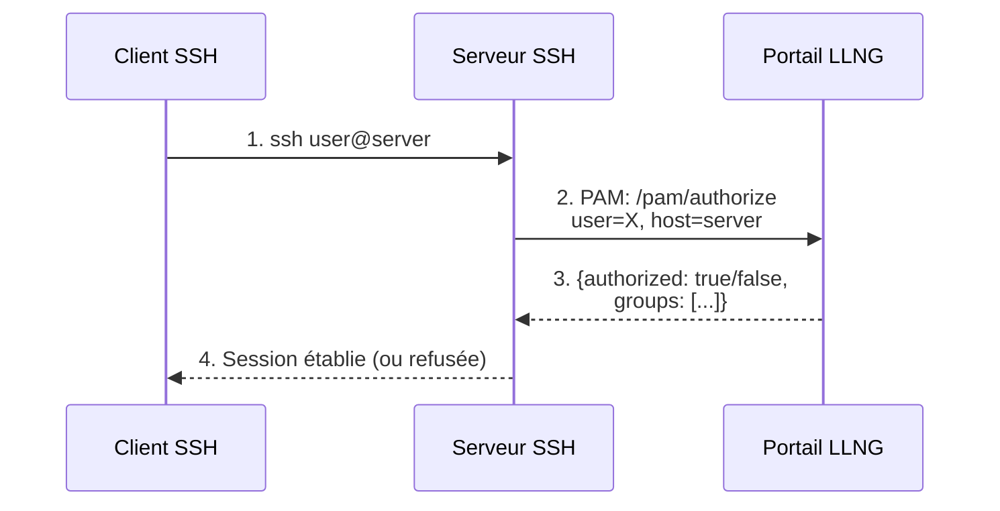
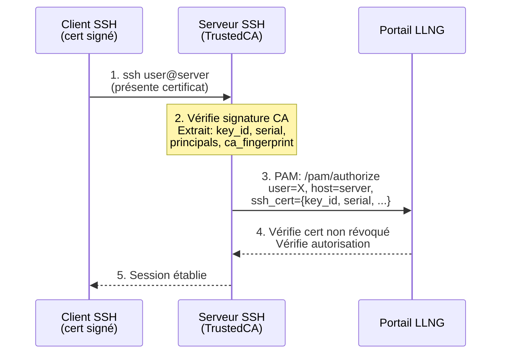
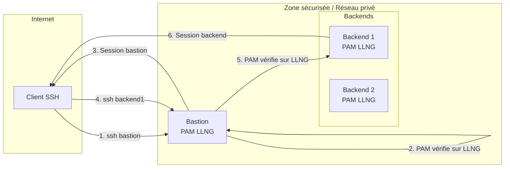
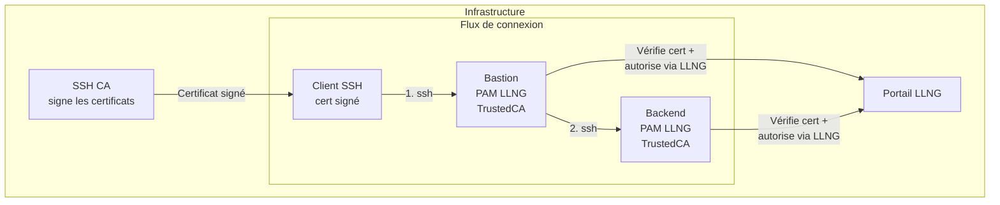
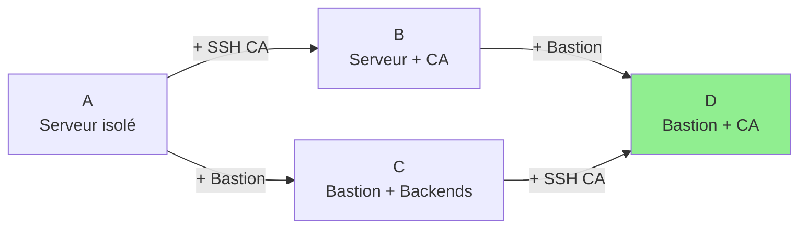

# Analyse de Sécurité - Phase 2 : Connexion SSH

## 1. Description des Architectures

Cette analyse couvre quatre architectures de déploiement SSH avec le module PAM LLNG :

| Architecture | Description                  | Niveau de sécurité |
| ------------ | ---------------------------- | ------------------ |
| **A**        | Serveur isolé                | Base               |
| **B**        | Serveur isolé + SSH CA       | Amélioré           |
| **C**        | Bastion + backends           | Élevé              |
| **D**        | Bastion + backends + SSH CA  | Optimal            |

### Acteurs

| Acteur            | Rôle                                              |
| ----------------- | ------------------------------------------------- |
| **Utilisateur**   | Personne se connectant en SSH                     |
| **Client SSH**    | Machine de l'utilisateur (laptop, workstation)    |
| **Serveur SSH**   | Serveur cible avec PAM LLNG                       |
| **Bastion**       | Point d'entrée unique pour les connexions SSH     |
| **Backend**       | Serveur accessible uniquement via le bastion      |
| **Portail LLNG**  | Serveur d'authentification/autorisation           |
| **SSH CA**        | Autorité de certification pour les clés SSH       |

---

## 2. Architecture A : Serveur Isolé

### Description

Configuration la plus simple : un serveur SSH autonome avec PAM LLNG.



### Authentification

L'utilisateur s'authentifie auprès du serveur SSH avec :
- Clé SSH publique/privée (méthode recommandée)
- Mot de passe (déconseillé, voir R-A1)

### Autorisation

Le module PAM LLNG appelle `/pam/authorize` avec :
- `user` : nom d'utilisateur
- `host` : hostname du serveur
- `service` : "sshd"

LLNG vérifie :
- L'utilisateur existe et est actif
- L'utilisateur est autorisé à accéder à ce serveur/server_group
- Les groupes et attributs de l'utilisateur

### Configuration

```ini
# /etc/security/pam_llng.conf
portal_url = https://auth.example.com
server_group = production
verify_ssl = true
```

```
# /etc/pam.d/sshd
auth       required     pam_llng.so
account    required     pam_llng.so
```

---

## 3. Architecture B : Serveur Isolé + SSH CA

### Description

Le serveur utilise des certificats SSH signés par une autorité de certification (SSH CA). Cette architecture améliore la traçabilité et permet une gestion centralisée des clés.



### Certificat SSH

Le certificat SSH contient :
- `key_id` : identifiant unique du certificat
- `serial` : numéro de série
- `principals` : liste des usernames autorisés
- `valid_after` / `valid_before` : période de validité
- Signature de la CA

### Extraction des informations de certificat

Le module PAM extrait les informations via les variables d'environnement SSH :
- `SSH_USER_AUTH` : méthode d'authentification (contient "-cert-" pour certificat)
- `SSH_CERT_KEY_ID` : identifiant du certificat
- `SSH_CERT_SERIAL` : numéro de série
- `SSH_CERT_PRINCIPALS` : principals autorisés
- `SSH_CERT_CA_KEY_FP` : empreinte de la CA

```c
// src/pam_llng.c:616-631
const char *key_id = pam_getenv(pamh, "SSH_CERT_KEY_ID");
const char *serial = pam_getenv(pamh, "SSH_CERT_SERIAL");
const char *principals = pam_getenv(pamh, "SSH_CERT_PRINCIPALS");
const char *ca_fp = pam_getenv(pamh, "SSH_CERT_CA_KEY_FP");
```

### Avantages vs Architecture A

| Aspect           | Architecture A       | Architecture B               |
| ---------------- | -------------------- | ---------------------------- |
| Traçabilité      | Username seul        | key_id, serial, principals   |
| Révocation       | Impossible sans LLNG | Possible via CRL ou LLNG |
| Durée de vie clé | Illimitée            | Limitée par certificat       |
| Audit            | Basique              | Complet avec serial          |

### Durée de vie des certificats SSH

#### Principe : la sécurité repose sur `/pam/authorize`

Avec le module PAM LLNG, la durée de vie du certificat SSH a peu d'impact sur la sécurité car :

```
┌──────────────────────┐         ┌─────────────────────┐
│  Certificat SSH      │         │   /pam/authorize    │
│  (authentification)  │ ──────► │   (autorisation)    │
│                      │         │                     │
│  "Qui suis-je ?"     │         │  "Ai-je le droit ?" │
└──────────────────────┘         └─────────────────────┘
         │                                  │
         │                                  ▼
         │                       • Compte actif ?
         │                       • Membre des bons groupes ?
         │                       • server_group autorisé ?
         ▼
   Validité : 1 jour à 1 an
   (peu d'impact sécurité)
```

**Le vrai verrou est `/pam/authorize`** : même avec un certificat valide, l'accès est refusé si le compte est désactivé ou retiré des groupes autorisés.

#### Comparaison des durées

| Durée certificat | Avantages | Inconvénients |
|------------------|-----------|---------------|
| **Courte (1h-8h)** | Révocation "naturelle" par expiration | Renouvellement fréquent, friction utilisateur |
| **Moyenne (1-7 jours)** | Bon compromis, renouvellement quotidien/hebdo | KRL nécessaire pour révocation urgente |
| **Longue (1-12 mois)** | UX optimale, pas de friction | KRL obligatoire, révocation via `/ssh/admin` |

#### Recommandation

Une durée **longue (plusieurs mois)** est acceptable car :

1. **La révocation se fait côté LLNG** : désactivation du compte ou retrait des groupes → effet immédiat
2. **`/pam/authorize` est vérifié à chaque connexion** : un certificat valide ne suffit pas
3. **La KRL via `/ssh/admin`** permet la révocation immédiate du certificat si nécessaire
4. **Évite le contournement** : les utilisateurs ne seront pas tentés d'ajouter leur clé dans `~/.ssh/authorized_keys`

#### Workflow utilisateur avec certificat longue durée

La clé SSH privée reste permanente, seul le certificat est renouvelé périodiquement :

```bash
# Une seule fois : générer sa clé SSH
ssh-keygen -t ed25519 -f ~/.ssh/id_ed25519

# Tous les 6 mois : renouveler le certificat via LLNG /ssh
# → Le certificat est stocké dans ~/.ssh/id_ed25519-cert.pub
# → ssh-agent n'a pas besoin d'être rechargé
```

#### Verrouillage de `authorized_keys` (recommandé)

Pour éviter que les utilisateurs contournent le système de certificats :

```bash
# /etc/ssh/sshd_config

# Désactiver les authorized_keys utilisateur
AuthorizedKeysFile none

# Utiliser uniquement les certificats CA
TrustedUserCAKeys /etc/ssh/llng_ca.pub
RevokedKeys /etc/ssh/revoked_keys
```

### Configuration serveur SSH

```bash
# /etc/ssh/sshd_config
TrustedUserCAKeys /etc/ssh/ca_user_key.pub
ExposeAuthInfo yes   # Requis pour SSH_CERT_* variables
```

---

## 4. Architecture C : Bastion + Backends

### Description

Les serveurs backends ne sont accessibles que via un bastion. Cette architecture offre :
- Point d'entrée unique et auditable
- Réduction de la surface d'attaque des backends
- Possibilité de segmentation réseau



### Double vérification PAM

1. **Sur le bastion** : LLNG vérifie que l'utilisateur peut accéder au bastion
2. **Sur le backend** : LLNG vérifie que l'utilisateur peut accéder à ce backend spécifique

### Configuration réseau sécurisée (backends)

**IMPORTANT** : Pour maximiser la sécurité, les backends doivent être configurés pour n'accepter les connexions SSH que depuis le bastion :

```bash
# /etc/ssh/sshd_config sur les backends
# Accepter UNIQUEMENT les connexions depuis le bastion
ListenAddress 10.0.0.0    # IP privée uniquement
# OU utiliser un firewall :
# iptables -A INPUT -p tcp --dport 22 -s 10.0.0.1 -j ACCEPT  # IP bastion
# iptables -A INPUT -p tcp --dport 22 -j DROP
```

Ou via groupe de sécurité (AWS/GCP/Azure) :
- Backends : SSH (22) autorisé uniquement depuis le security group du bastion

### Avantages sécurité

| Aspect                | Sans restriction réseau       | Avec restriction au bastion      |
| --------------------- | ----------------------------- | -------------------------------- |
| Surface d'attaque     | Backends exposés              | Bastion seul exposé              |
| Contournement         | Possible si IP backend connue | Impossible                       |
| Audit                 | Partiel                       | Complet (tout passe par bastion) |
| Compromission bastion | Accès backends                | Accès backends (identique)       |

### Configuration server_group

```ini
# Bastion : /etc/security/pam_llng.conf
server_group = bastion

# Backends : /etc/security/pam_llng.conf
server_group = backend-prod
```

Côté LLNG, définir les autorisations :
- Groupe "ops" → accès bastion + backend-prod
- Groupe "dev" → accès bastion + backend-dev
- Groupe "admin" → accès bastion + tous backends

---

## 5. Architecture D : Bastion + Backends + SSH CA

### Description

Architecture optimale combinant :
- Bastion comme point d'entrée unique
- Certificats SSH pour traçabilité et révocation
- Double vérification PAM sur bastion et backends
- Restriction réseau des backends



### Flux complet

1. **Émission certificat** : L'utilisateur obtient un certificat SSH signé par la CA
   - Durée de vie courte (ex: 8h, 24h)
   - Principals = username + groupes
   - key_id = identifiant unique pour audit

2. **Connexion bastion** :
   - SSH vérifie la signature CA
   - PAM LLNG envoie les infos certificat à LLNG
   - LLNG vérifie : utilisateur actif, certificat non révoqué, accès bastion autorisé

3. **Connexion backend** :
   - Même certificat présenté au backend
   - SSH vérifie la signature CA
   - PAM LLNG envoie les infos certificat à LLNG
   - LLNG vérifie : accès backend autorisé

### Agent forwarding vs ProxyJump

**Option 1 : Agent forwarding** (déconseillé)
```bash
ssh -A bastion
# puis sur bastion:
ssh backend
```
⚠️ Risque : Si le bastion est compromis, l'attaquant peut utiliser l'agent.

**Option 2 : ProxyJump** (recommandé)
```bash
ssh -J bastion backend
# ou dans ~/.ssh/config:
Host backend
    ProxyJump bastion
```
✓ La clé privée ne quitte jamais le client.

### Configuration complète

**CA SSH :**
```bash
# Générer la CA
ssh-keygen -t ed25519 -f /etc/ssh/ca_key -C "SSH CA"

# Signer un certificat utilisateur (durée 8h)
ssh-keygen -s /etc/ssh/ca_key \
    -I "user@example.com-$(date +%Y%m%d)" \
    -n "username" \
    -V +8h \
    -z $(date +%s) \
    user_key.pub
```

**Serveurs (bastion et backends) :**
```bash
# /etc/ssh/sshd_config
TrustedUserCAKeys /etc/ssh/ca_user_key.pub
ExposeAuthInfo yes
# Optionnel: révocation
RevokedKeys /etc/ssh/revoked_keys
```

**Backends uniquement :**
```bash
# Restreindre l'accès au bastion
# /etc/ssh/sshd_config
ListenAddress 10.0.0.0  # Réseau privé uniquement
```

---

## 6. Analyse des Risques

### Échelle de cotation

| Score | Probabilité     | Impact      |
| ----- | --------------- | ----------- |
| 1     | Très improbable | Négligeable |
| 2     | Peu probable    | Limité      |
| 3     | Probable        | Important   |
| 4     | Très probable   | Critique    |

---

### R-S1 - Authentification par mot de passe SSH

|                 | Score |
| --------------- | :---: |
| **Probabilité** |   3   |
| **Impact**      |   4   |

**Architectures concernées :** A, B, C, D (si mal configuré)

**Description :** L'authentification SSH par mot de passe est vulnérable aux attaques par force brute et au phishing.

**Vecteurs d'attaque :**
- Brute-force du mot de passe
- Credential stuffing (mots de passe réutilisés)
- Phishing pour obtenir le mot de passe
- Keylogger sur le client

**Remédiation configuration :**
```bash
# /etc/ssh/sshd_config
PasswordAuthentication no
ChallengeResponseAuthentication no
PubkeyAuthentication yes
```

|                 | Score résiduel             |
| --------------- | :------------------------: |
| **Probabilité** | 1 (avec clés uniquement)   |
| **Impact**      |             4              |

---

### R-S2 - Vol de clé SSH privée

|                 | Score |
| --------------- | :---: |
| **Probabilité** |   2   |
| **Impact**      |   4   |

**Architectures concernées :** A, C (sans certificats)

**Description :** Une clé SSH privée volée permet un accès illimité jusqu'à sa suppression manuelle des authorized_keys.

**Vecteurs d'attaque :**
- Compromission du poste client
- Backup non chiffré contenant la clé
- Clé sans passphrase
- Malware voleur de clés

**Conséquence :** Accès permanent à tous les serveurs où la clé est autorisée.

**Remédiation embarquée :**
- PAM LLNG vérifie l'autorisation à chaque connexion (l'utilisateur peut être désactivé)
- Audit des connexions avec IP source

**Remédiation configuration :**
```bash
# Clés avec passphrase obligatoire
ssh-keygen -t ed25519 -a 100 -f ~/.ssh/id_ed25519
# -a 100 : 100 rounds de dérivation (protection brute-force passphrase)

# Utiliser ssh-agent avec timeout
ssh-add -t 8h ~/.ssh/id_ed25519
```

**Remédiation architecturale :**
- Passer à l'architecture B ou D (certificats avec durée de vie limitée)

|                 | Score résiduel                                    |
| --------------- | :-----------------------------------------------: |
| **Probabilité** |                         2                         |
| **Impact**      | 3 (avec désactivation utilisateur LLNG possible)  |

---

### R-S3 - Certificat SSH compromis

|                 | Score |
| --------------- | :---: |
| **Probabilité** |   2   |
| **Impact**      |   3   |

**Architectures concernées :** B, D

**Description :** Un certificat SSH volé permet un accès limité dans le temps (durée de validité du certificat).

**Vecteurs d'attaque :**
- Mêmes que R-S2 (compromission poste client)

**Facteurs atténuants :**
- Durée de vie courte du certificat (8h-24h recommandé)
- Révocation possible via LLNG ou CRL SSH
- Le serial permet d'identifier précisément le certificat compromis

**Remédiation embarquée :**
- PAM LLNG envoie le serial à LLNG pour vérification de révocation
- Audit complet avec key_id et serial

**Remédiation configuration (côté LLNG) :**
- Liste de révocation par serial
- Alerte si même certificat utilisé depuis IPs différentes

|                 | Score résiduel                        |
| --------------- | :-----------------------------------: |
| **Probabilité** | 1 (avec durée courte + révocation)    |
| **Impact**      |          2 (durée limitée)            |

---

### R-S4 - Compromission de la CA SSH

|                 | Score |
| --------------- | :---: |
| **Probabilité** |   1   |
| **Impact**      |   4   |

**Architectures concernées :** B, D

**Description :** Si la clé privée de la CA SSH est compromise, l'attaquant peut émettre des certificats pour n'importe quel utilisateur.

**Vecteurs d'attaque :**
- Compromission du serveur hébergeant la CA
- Backup non chiffré de la clé CA
- Insider malveillant

**Conséquence :** Accès total à tous les serveurs faisant confiance à cette CA.

**Remédiation configuration :**
```bash
# CA sur machine air-gapped ou HSM
# Clé CA avec passphrase forte
ssh-keygen -t ed25519 -a 100 -f /secure/ca_key -C "SSH CA"

# Permissions strictes
chmod 400 /secure/ca_key
```

**Remédiation procédurale :**
- CA sur machine dédiée, non connectée au réseau
- Signature des certificats via processus audité
- Rotation périodique de la CA

**Remédiation architecturale :**
- Utiliser un HSM pour stocker la clé CA
- Short-lived CA (renouvellement régulier)

|                 | Score résiduel |
| --------------- | :------------: |
| **Probabilité** |       1        |
| **Impact**      |       4        |

---

### R-S5 - Contournement du bastion

|                 | Score |
| --------------- | :---: |
| **Probabilité** |   3   |
| **Impact**      |   3   |

**Architectures concernées :** C, D (si mal configuré)

**Description :** Si les backends sont accessibles directement (sans passer par le bastion), la sécurité du bastion est contournée.

**Vecteurs d'attaque :**
- Backends avec SSH ouvert sur IP publique
- Règles firewall permissives
- VPN donnant accès direct au réseau des backends

**Conséquence :**
- Perte de l'audit centralisé
- Surface d'attaque élargie
- Attaques directes sur les backends

**Remédiation configuration (CRITIQUE) - Option 1 : Restriction réseau :**
```bash
# Sur les backends : /etc/ssh/sshd_config
ListenAddress 10.0.0.0  # Réseau privé uniquement

# Firewall sur les backends
iptables -A INPUT -p tcp --dport 22 -s 10.0.0.1 -j ACCEPT  # IP bastion
iptables -A INPUT -p tcp --dport 22 -j DROP

# Security groups (cloud)
# Backend SG: SSH (22) from Bastion-SG only
```

**Remédiation configuration (RECOMMANDÉE) - Option 2 : Bastion JWT :**

La vérification JWT bastion offre une protection cryptographique contre le contournement,
même si les restrictions réseau sont contournées (VPN, erreur de configuration, etc.) :

```ini
# /etc/security/pam_llng.conf sur les backends
bastion_jwt_required = true
bastion_jwt_issuer = https://auth.example.com
bastion_jwt_jwks_url = https://auth.example.com/.well-known/jwks.json
bastion_jwt_jwks_cache = /var/cache/pam_llng/jwks.json
# Optionnel : whitelist des bastions autorisés
bastion_jwt_allowed_bastions = bastion-prod-01,bastion-prod-02
```

```bash
# /etc/ssh/sshd_config sur les backends
AcceptEnv LLNG_BASTION_JWT
```

Avec le JWT bastion :
- Même avec un accès réseau direct au backend, la connexion est refusée sans JWT valide
- Le JWT prouve cryptographiquement que la connexion vient d'un bastion autorisé
- Le JWT est vérifié localement (cache JWKS) → fonctionne même si LLNG est temporairement indisponible

**Vérification :**
```bash
# Depuis l'extérieur, doit échouer même avec credentials valides :
ssh -o ConnectTimeout=5 backend.internal.example.com
# PAM: Bastion JWT required but not provided

# Depuis le bastion via llng-ssh-proxy, doit fonctionner :
llng-ssh-proxy backend.internal.example.com
# Connexion établie
```

|                 | Score résiduel                               |
| --------------- | :------------------------------------------: |
| **Probabilité** | 1 (avec JWT bastion + restriction réseau)    |
| **Impact**      |               3                              |

---

### R-S6 - Compromission du bastion

|                 | Score |
| --------------- | :---: |
| **Probabilité** |   2   |
| **Impact**      |   4   |

**Architectures concernées :** C, D

**Description :** Si le bastion est compromis, l'attaquant a potentiellement accès à tous les backends.

**Vecteurs d'attaque :**
- Exploit sur le bastion (vulnérabilité SSH, système)
- Credentials volés d'un admin bastion
- Supply chain attack

**Conséquence :**
- Interception des connexions transitant par le bastion
- Pivot vers les backends
- Vol de clés si agent forwarding utilisé

**Remédiation embarquée :**
- PAM LLNG sur les backends = double vérification
- Même si le bastion est compromis, l'attaquant doit avoir des credentials valides pour chaque backend

**Remédiation configuration :**
```bash
# Interdire l'agent forwarding sur le bastion
# /etc/ssh/sshd_config
AllowAgentForwarding no

# Utiliser ProxyJump côté client (la clé ne touche jamais le bastion)
# ~/.ssh/config
Host backend
    ProxyJump bastion
```

**Remédiation procédurale :**
- Bastion durci (CIS benchmark)
- Pas de comptes utilisateurs sur le bastion (passage uniquement)
- Monitoring renforcé du bastion

**Réduction d'impact avec PAM LLNG sur backends :**
- Même depuis un bastion compromis, chaque accès backend est vérifié
- L'attaquant doit compromettre AUSSI les credentials utilisateur

|                 | Score résiduel                      |
| --------------- | :---------------------------------: |
| **Probabilité** |                  2                  |
| **Impact**      | 3 (avec PAM LLNG sur backends)      |

---

### R-S7 - Serveur LLNG indisponible

|                 | Score |
| --------------- | :---: |
| **Probabilité** |   2   |
| **Impact**      |   3   |

**Architectures concernées :** A, B, C, D

**Description :** Si LLNG est indisponible, les nouvelles connexions SSH ne peuvent pas être autorisées (sauf cache).

**Vecteurs d'attaque :**
- Panne réseau entre serveurs SSH et LLNG
- DoS sur LLNG
- Maintenance LLNG

**Conséquence :** Les utilisateurs ne peuvent plus se connecter aux serveurs.

**Remédiation embarquée :**
- Cache d'authentification offline (`src/auth_cache.c`)
- Les utilisateurs précédemment autorisés peuvent continuer à se connecter

**Remédiation configuration :**
```ini
# /etc/security/pam_llng.conf
auth_cache = true
auth_cache_ttl = 3600        # 1 heure de cache
auth_cache_offline_ttl = 86400  # 24h si LLNG indisponible
```

**Remédiation infrastructure :**
- LLNG en haute disponibilité
- Plusieurs portails LLNG (failover)

|                 | Score résiduel           |
| --------------- | :----------------------: |
| **Probabilité** |      1 (avec HA)         |
| **Impact**      | 2 (avec cache offline)   |

---

### R-S8 - Session SSH persistante après révocation

|                 | Score |
| --------------- | :---: |
| **Probabilité** |   3   |
| **Impact**      |   2   |

**Architectures concernées :** A, B, C, D

**Description :** Une session SSH déjà établie n'est pas terminée si l'utilisateur est révoqué dans LLNG.

**Vecteurs d'attaque :**
- Utilisateur révoqué maintient une session ouverte
- Screen/tmux avec session persistante

**Conséquence :** L'utilisateur révoqué conserve son accès tant que la session est active.

**Remédiation configuration :**
```bash
# /etc/ssh/sshd_config
ClientAliveInterval 300      # Ping toutes les 5 min
ClientAliveCountMax 2        # Déconnexion après 2 échecs

# Timeout de session
# /etc/profile.d/timeout.sh
TMOUT=3600  # Déconnexion après 1h d'inactivité
```

**Remédiation procédurale :**
- Script de révocation qui tue les sessions actives :
```bash
# Lors de la révocation d'un utilisateur
pkill -u $USERNAME -KILL
```

|                 | Score résiduel |
| --------------- | :------------: |
| **Probabilité** |       2        |
| **Impact**      |       2        |

---

## 7. Matrices des Risques par Architecture

### Architecture A : Serveur Isolé

**Avant remédiation :**

| Impact ↓ / Probabilité → | 1 - Très improbable | 2 - Peu probable | 3 - Probable | 4 - Très probable |
|--------------------------|---------------------|------------------|--------------|-------------------|
| **4 - Critique**         |                     | R-S2             | R-S1         |                   |
| **3 - Important**        |                     | R-S7             | R-S8         |                   |
| **2 - Limité**           |                     |                  |              |                   |
| **1 - Négligeable**      |                     |                  |              |                   |

**Après remédiation :**

| Impact ↓ / Probabilité → | 1 - Très improbable | 2 - Peu probable | 3 - Probable | 4 - Très probable |
|--------------------------|---------------------|------------------|--------------|-------------------|
| **4 - Critique**         | R-S1                |                  |              |                   |
| **3 - Important**        |                     | R-S2             |              |                   |
| **2 - Limité**           | R-S7                | R-S8             |              |                   |
| **1 - Négligeable**      |                     |                  |              |                   |

---

### Architecture B : Serveur Isolé + SSH CA

**Avant remédiation :**

| Impact ↓ / Probabilité → | 1 - Très improbable | 2 - Peu probable | 3 - Probable | 4 - Très probable |
|--------------------------|---------------------|------------------|--------------|-------------------|
| **4 - Critique**         | R-S4                |                  | R-S1         |                   |
| **3 - Important**        |                     | R-S3 R-S7        | R-S8         |                   |
| **2 - Limité**           |                     |                  |              |                   |
| **1 - Négligeable**      |                     |                  |              |                   |

**Après remédiation :**

| Impact ↓ / Probabilité → | 1 - Très improbable | 2 - Peu probable | 3 - Probable | 4 - Très probable |
|--------------------------|---------------------|------------------|--------------|-------------------|
| **4 - Critique**         | R-S1 R-S4           |                  |              |                   |
| **3 - Important**        |                     |                  |              |                   |
| **2 - Limité**           | R-S3 R-S7           | R-S8             |              |                   |
| **1 - Négligeable**      |                     |                  |              |                   |

**Bénéfices SSH CA :** R-S3 (certificat compromis) remplace R-S2 (clé compromise) avec impact réduit grâce à la durée de vie limitée.

---

### Architecture C : Bastion + Backends

**Avant remédiation :**

| Impact ↓ / Probabilité → | 1 - Très improbable | 2 - Peu probable | 3 - Probable | 4 - Très probable |
|--------------------------|---------------------|------------------|--------------|-------------------|
| **4 - Critique**         |                     | R-S6             | R-S1         |                   |
| **3 - Important**        |                     | R-S2 R-S7        | R-S5 R-S8    |                   |
| **2 - Limité**           |                     |                  |              |                   |
| **1 - Négligeable**      |                     |                  |              |                   |

**Après remédiation (avec restriction réseau backends) :**

| Impact ↓ / Probabilité → | 1 - Très improbable | 2 - Peu probable | 3 - Probable | 4 - Très probable |
|--------------------------|---------------------|------------------|--------------|-------------------|
| **4 - Critique**         | R-S1                |                  |              |                   |
| **3 - Important**        | R-S5                | R-S2 R-S6        |              |                   |
| **2 - Limité**           | R-S7                | R-S8             |              |                   |
| **1 - Négligeable**      |                     |                  |              |                   |

**Bénéfice restriction réseau :** R-S5 (contournement bastion) passe de P=3 à P=1.

---

### Architecture D : Bastion + Backends + SSH CA

**Avant remédiation :**

| Impact ↓ / Probabilité → | 1 - Très improbable | 2 - Peu probable | 3 - Probable | 4 - Très probable |
|--------------------------|---------------------|------------------|--------------|-------------------|
| **4 - Critique**         | R-S4                | R-S6             | R-S1         |                   |
| **3 - Important**        |                     | R-S3 R-S7        | R-S5 R-S8    |                   |
| **2 - Limité**           |                     |                  |              |                   |
| **1 - Négligeable**      |                     |                  |              |                   |

**Après remédiation complète :**

| Impact ↓ / Probabilité → | 1 - Très improbable | 2 - Peu probable | 3 - Probable | 4 - Très probable |
|--------------------------|---------------------|------------------|--------------|-------------------|
| **4 - Critique**         | R-S1 R-S4           |                  |              |                   |
| **3 - Important**        | R-S5                | R-S6             |              |                   |
| **2 - Limité**           | R-S3 R-S7           | R-S8             |              |                   |
| **1 - Négligeable**      |                     |                  |              |                   |

**Architecture D = meilleur profil de risque :**
- Tous les risques critiques en P=1
- Certificats → durée de vie limitée
- Bastion → point d'entrée unique
- Restriction réseau → pas de contournement

---

## 8. Synthèse des Remédiations par Architecture

### Checklist Architecture A (Serveur Isolé)

- [ ] Désactiver l'authentification par mot de passe
- [ ] Clés SSH avec passphrase
- [ ] ssh-agent avec timeout
- [ ] PAM LLNG configuré avec `server_group`
- [ ] Cache offline activé
- [ ] Monitoring des connexions

### Checklist Architecture B (Serveur Isolé + SSH CA)

Tout de A, plus :
- [ ] CA SSH sur machine sécurisée (air-gap ou HSM)
- [ ] `TrustedUserCAKeys` configuré
- [ ] `ExposeAuthInfo yes` dans sshd_config
- [ ] Certificats avec durée de vie courte (8-24h)
- [ ] Processus de révocation documenté

### Checklist Architecture C (Bastion + Backends)

Tout de A, plus :
- [ ] **CRITIQUE** : Backends accessibles UNIQUEMENT depuis le bastion
- [ ] Firewall/Security Groups configurés
- [ ] `AllowAgentForwarding no` sur le bastion
- [ ] Clients configurés avec `ProxyJump`
- [ ] PAM LLNG sur bastion ET backends
- [ ] `server_group` différents (bastion vs backends)

### Checklist Architecture D (Bastion + Backends + SSH CA)

Tout de B et C, plus :
- [ ] CA SSH signant les certificats utilisateur
- [ ] Même CA de confiance sur bastion et backends
- [ ] Révocation centralisée via LLNG
- [ ] Audit complet avec key_id/serial

---

## 9. Recommandations

### Choix d'architecture

|               Contexte               |     Architecture recommandée     |
|--------------------------------------|----------------------------------|
| Petit projet, peu de serveurs        | A (avec clés + PAM LLNG)         |
| Conformité audit renforcé            | B (certificats pour traçabilité) |
| Infrastructure importante            | C (bastion obligatoire)          |
| Haute sécurité / production critique | D (bastion + certificats)        |

### Évolution progressive



| Transition | Gain |
|------------|------|
| A → B | Traçabilité, révocation, durée limitée |
| A → C | Point d'entrée unique, audit centralisé |
| B/C → D | Cumul des avantages |
