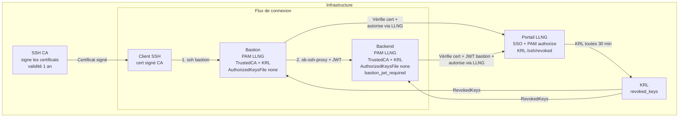
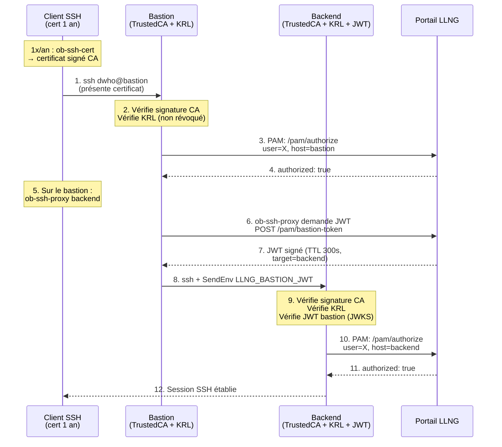
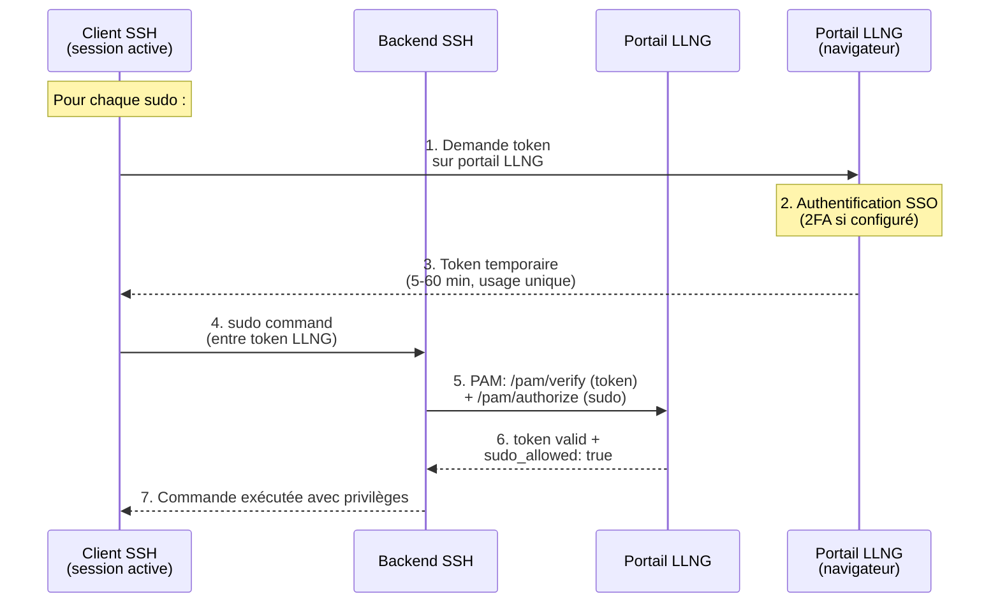
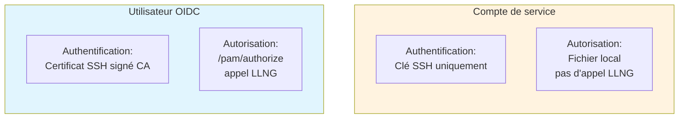
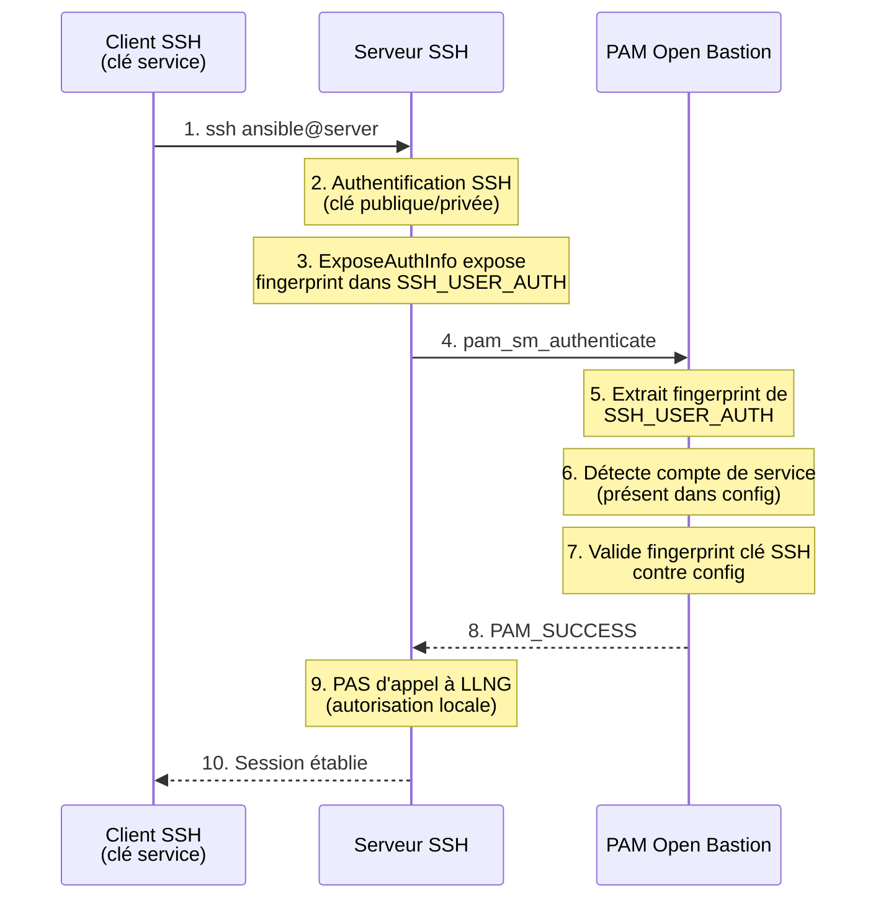

# Analyse de Sécurité - Connexion SSH

## 1. Cible de Sécurité

Cette analyse porte sur la cible de sécurité maximale d'Open Bastion, qui combine :

- **Bastion** : point d'entrée unique pour toutes les connexions SSH
- **SSH CA** : certificats signés par la CA LemonLDAP::NG (validité 1 an)
- **Certificats uniquement** : `AuthorizedKeysFile none` (pas de clés non signées)
- **KRL obligatoire** : révocation centralisée via Key Revocation List
- **sudo via token LLNG** : réauthentification SSO pour chaque escalade de privilèges
- **JWT bastion** : preuve cryptographique de l'origine des connexions vers les backends

> **Note** : D'autres architectures moins restrictives sont possibles (serveur isolé sans CA, sans bastion, avec mots de passe). Elles offrent un niveau de sécurité inférieur et ne sont pas couvertes par cette analyse.

### Acteurs

| Acteur           | Rôle                                           |
| ---------------- | ---------------------------------------------- |
| **Utilisateur**  | Personne se connectant en SSH                  |
| **Client SSH**   | Machine de l'utilisateur (laptop, workstation) |
| **Bastion**      | Point d'entrée unique pour les connexions SSH  |
| **Backend**      | Serveur accessible uniquement via le bastion   |
| **Portail LLNG** | Serveur d'authentification/autorisation        |
| **SSH CA**       | Autorité de certification pour les clés SSH    |

---

## 2. Architecture

### Vue d'ensemble


```mermaid
flowchart TB
    subgraph Infrastructure
        CA[SSH CA<br/>signe les certificats<br/>validité 1 an]
        LLNG[Portail LLNG<br/>SSO + PAM authorize<br/>KRL /ssh/revoked]
        KRL[KRL<br/>revoked_keys]

        CA -->|Certificat signé| Client

        subgraph ConnectionFlow["Flux de connexion"]
            Client[Client SSH<br/>cert signé CA] -->|1. ssh bastion| Bastion[Bastion<br/>PAM LLNG<br/>TrustedCA + KRL<br/>AuthorizedKeysFile none]
            Bastion -->|2. ob-ssh-proxy + JWT| Backend[Backend<br/>PAM LLNG<br/>TrustedCA + KRL<br/>AuthorizedKeysFile none<br/>bastion_jwt_required]
        end

        LLNG -->|KRL toutes 30 min| KRL
        KRL -->|RevokedKeys| Bastion
        KRL -->|RevokedKeys| Backend

        Bastion -->|Vérifie cert +<br/>autorise via LLNG| LLNG
        Backend -->|Vérifie cert + JWT bastion +<br/>autorise via LLNG| LLNG
    end
```

### Flux complet

#### 1. Obtention du certificat (1x/an)

```bash
# Sur le poste client : obtenir un certificat signé par la CA LLNG
ob-ssh-cert --llng-url https://auth.example.com
# → Certificat stocké dans ~/.ssh/id_ed25519-cert.pub (validité 1 an)
# → La clé privée ~/.ssh/id_ed25519 ne change pas
```

#### 2. Connexion SSH via bastion


```mermaid
sequenceDiagram
    participant Client as Client SSH<br/>(cert 1 an)
    participant Bastion as Bastion<br/>(TrustedCA + KRL)
    participant Backend as Backend<br/>(TrustedCA + KRL + JWT)
    participant LLNG as Portail LLNG

    Note over Client: 1x/an : ob-ssh-cert<br/>→ certificat signé CA

    Client->>Bastion: 1. ssh dwho@bastion<br/>(présente certificat)
    Note over Bastion: 2. Vérifie signature CA<br/>Vérifie KRL (non révoqué)
    Bastion->>LLNG: 3. PAM: /pam/authorize<br/>user=X, host=bastion
    LLNG-->>Bastion: 4. authorized: true
    Note over Client: 5. Sur le bastion :<br/>ob-ssh-proxy backend
    Bastion->>LLNG: 6. ob-ssh-proxy demande JWT<br/>POST /pam/bastion-token
    LLNG-->>Bastion: 7. JWT signé (TTL 300s,<br/>target=backend)
    Bastion->>Backend: 8. ssh + SendEnv LLNG_BASTION_JWT
    Note over Backend: 9. Vérifie signature CA<br/>Vérifie KRL<br/>Vérifie JWT bastion (JWKS)
    Backend->>LLNG: 10. PAM: /pam/authorize<br/>user=X, host=backend
    LLNG-->>Backend: 11. authorized: true
    Backend-->>Client: 12. Session SSH établie
```

> **Pourquoi ob-ssh-proxy et non ProxyJump ?** Le mécanisme SSH natif `ProxyJump` (`ssh -J`) fait transiter la connexion par le bastion, mais c'est le **client** qui négocie directement avec le backend. Le bastion n'a donc aucune opportunité d'injecter un JWT. `ob-ssh-proxy` résout ce problème : il s'exécute **sur le bastion**, demande un JWT signé à LLNG (`/pam/bastion-token`), puis ouvre la connexion SSH vers le backend avec `SendEnv LLNG_BASTION_JWT`. Le backend vérifie ce JWT pour s'assurer que la connexion provient bien d'un bastion autorisé.

#### 3. Escalade de privilèges (sudo)


```mermaid
sequenceDiagram
    participant Client as Client SSH<br/>(session active)
    participant Backend as Backend SSH
    participant LLNG as Portail LLNG
    participant Admin as Portail LLNG<br/>(navigateur)

    Note over Client: Pour chaque sudo :
    Client->>Admin: 1. Demande token<br/>sur portail LLNG
    Note over Admin: 2. Authentification SSO<br/>(2FA si configuré)
    Admin-->>Client: 3. Token temporaire<br/>(5-60 min, usage unique)
    Client->>Backend: 4. sudo command<br/>(entre token LLNG)
    Backend->>LLNG: 5. PAM: /pam/verify (token)<br/>+ /pam/authorize (sudo)
    LLNG-->>Backend: 6. token valid +<br/>sudo_allowed: true
    Backend-->>Client: 7. Commande exécutée avec privilèges
```

### Configuration sshd (bastion et backends)

```bash
# /etc/ssh/sshd_config
TrustedUserCAKeys /etc/ssh/llng_ca.pub           # CA LLNG uniquement
AuthorizedKeysFile none                           # Pas de clés non signées
RevokedKeys /etc/ssh/revoked_keys                 # KRL obligatoire
ExposeAuthInfo yes                                # Requis pour SSH_CERT_* variables
AllowAgentForwarding no                           # Pas de forwarding agent (sécurité)
PermitRootLogin no                                # Root uniquement via console (ttyS0)
AuthorizedPrincipalsCommand /bin/echo %u          # Accepte les certificats dont le principal = nom d'utilisateur
AuthorizedPrincipalsCommandUser nobody
```

> **Note `AuthorizedPrincipalsCommand` :** Cette directive permet d'accepter les certificats SSH dont le principal correspond exactement au nom d'utilisateur de la connexion. C'est nécessaire pour les utilisateurs résolus dynamiquement via NSS (`openbastion` dans `nsswitch.conf`), qui n'ont pas d'entrée `~/.ssh/authorized_principals` sur le système de fichiers. `ob-bastion-setup` configure cette directive automatiquement.

### Configuration PAM (sshd)

```
# /etc/pam.d/sshd
auth       required     pam_openbastion.so
account    required     pam_openbastion.so
```

### Configuration PAM (sudo)

```
# /etc/pam.d/sudo
auth       required     pam_openbastion.so   service=sudo
account    required     pam_openbastion.so   service=sudo
```

> **Note Mode E :** La ligne `account required pam_unix.so` est **absente** du stack sudo. `pam_unix.so` est incompatible avec les utilisateurs NSS-only (résolution dynamique via `openbastion` dans `nsswitch.conf`) : il échouerait pour tout utilisateur n'ayant pas d'entrée dans `/etc/passwd`. L'autorisation est entièrement déléguée à `pam_openbastion.so`. Le fichier `/etc/sudoers.d/open-bastion` autorise tous les utilisateurs (`ALL ALL=(ALL) ALL`) — le filtrage est effectué par PAM.

### Configuration Open Bastion (backends)

```ini
# /etc/open-bastion/openbastion.conf sur les backends
portal_url = https://auth.example.com
server_group = backend-prod
verify_ssl = true

# JWT bastion obligatoire
bastion_jwt_required = true
bastion_jwt_issuer = https://auth.example.com
bastion_jwt_jwks_url = https://auth.example.com/.well-known/jwks.json
bastion_jwt_jwks_cache = /var/cache/open-bastion/jwks.json
bastion_jwt_allowed_bastions = bastion-prod-01,bastion-prod-02

# Détection de replay JWT
bastion_jwt_replay_detection = true
bastion_jwt_replay_cache_size = 10000
bastion_jwt_replay_cleanup_interval = 60

# Politique de clés SSH (CA obligatoire, pas de clés faibles)
ssh_key_policy_enabled = true
ssh_key_allowed_types = ed25519, sk-ed25519, sk-ecdsa
```

### Restriction réseau des backends

```bash
# /etc/ssh/sshd_config sur les backends
ListenAddress 10.0.0.0  # Réseau privé uniquement

# Firewall sur les backends
iptables -A INPUT -p tcp --dport 22 -s 10.0.0.1 -j ACCEPT  # IP bastion
iptables -A INPUT -p tcp --dport 22 -j DROP
# Security groups (cloud) : Backend SG → SSH (22) depuis Bastion-SG uniquement
```

### Variable d'environnement SSH pour le JWT bastion

```bash
# /etc/ssh/sshd_config sur les backends
AcceptEnv LLNG_BASTION_JWT
```

### Durée de vie des certificats SSH

Avec le module PAM LLNG, la durée de vie du certificat SSH a peu d'impact sur la sécurité car :

```
┌──────────────────────┐         ┌─────────────────────┐
│  Certificat SSH      │         │   /pam/authorize    │
│  (authentification)  │ ──────► │   (autorisation)    │
│                      │         │                     │
│  "Qui suis-je ?"     │         │  "Ai-je le droit ?" │
└──────────────────────┘         └─────────────────────┘
         │                                  │
         │                                  ▼
         │                       • Compte actif ?
         │                       • Membre des bons groupes ?
         │                       • server_group autorisé ?
         ▼
   Validité : 1 an
   (le vrai verrou est /pam/authorize)
```

**Le vrai verrou est `/pam/authorize`** : même avec un certificat valide, l'accès est refusé si le compte est désactivé ou retiré des groupes autorisés dans LLNG.

Une durée **longue (1 an)** est acceptable car :

1. **La révocation se fait côté LLNG** : désactivation du compte ou retrait des groupes → effet immédiat via `/pam/authorize`
2. **`/pam/authorize` est vérifié à chaque connexion** : un certificat valide ne suffit pas
3. **La KRL via `/ssh/admin`** permet la révocation immédiate du certificat si nécessaire
4. **`AuthorizedKeysFile none`** : les utilisateurs ne peuvent pas contourner en ajoutant leur clé dans `~/.ssh/authorized_keys`
5. **UX optimale** : l'utilisateur obtient son certificat une fois par an via `ob-ssh-cert`

#### Workflow utilisateur

```bash
# Une seule fois : générer sa clé SSH
ssh-keygen -t ed25519 -f ~/.ssh/id_ed25519

# Une fois par an : renouveler le certificat via LLNG
ob-ssh-cert --llng-url https://auth.example.com
# → ~/.ssh/id_ed25519-cert.pub mis à jour
# → ssh-agent n'a pas besoin d'être rechargé
```

### KRL (Key Revocation List)

La KRL est le mécanisme de révocation immédiate des certificats. Elle est maintenue par LLNG et distribuée automatiquement :

```bash
# Téléchargement depuis LLNG
curl -sf -o /etc/ssh/revoked_keys https://auth.example.com/ssh/revoked

# Cron de rafraîchissement (toutes les 30 min)
# /etc/cron.d/llng-krl-refresh
*/30 * * * * root curl -sf -o /etc/ssh/revoked_keys.tmp https://auth.example.com/ssh/revoked && mv /etc/ssh/revoked_keys.tmp /etc/ssh/revoked_keys

# Monitoring : alerter si KRL > 1h sans mise à jour
*/15 * * * * root find /etc/ssh/revoked_keys -mmin +60 -exec echo "KRL stale" \;
```

**Révocation d'un certificat compromis :**

```bash
# Côté LLNG (admin) : révoquer via l'interface /ssh/admin
# → La KRL est mise à jour immédiatement
# → Propagation sur les serveurs dans les 30 min suivantes (cron)
# → Fenêtre d'exposition maximale : 30 min
```

---

## 3. Analyse des Risques

### Échelle de cotation

| Score | Probabilité     | Impact      |
| ----- | --------------- | ----------- |
| 1     | Très improbable | Négligeable |
| 2     | Peu probable    | Limité      |
| 3     | Probable        | Important   |
| 4     | Très probable   | Critique    |

---

### R-S3 - Certificat SSH compromis

|                 | Score |
| --------------- | :---: |
| **Probabilité** |   2   |
| **Impact**      |   3   |

**Description :** Un certificat SSH volé permet un accès limité dans le temps (1 an de validité). Contrairement aux certificats courts (8-24h) qui expirent naturellement, un certificat compromis d'1 an reste valide longtemps sans intervention explicite. La **KRL devient le contrôle compensatoire principal**.

**Vecteurs d'attaque :**

- Compromission du poste client (malware, backup non chiffré)
- Clé privée sans passphrase
- Malware voleur de certificats

**Facteurs atténuants :**

- Révocation immédiate via LLNG `/ssh/admin` → KRL propagée en 30 min
- Le serial permet d'identifier précisément le certificat compromis
- **Même avec un certificat compromis, l'attaquant ne peut pas faire de sudo** sans obtenir un token LLNG frais, ce qui nécessite une authentification SSO

**Remédiation embarquée :**

- PAM LLNG envoie le serial à LLNG pour vérification d'autorisation à chaque connexion
- KRL vérifiée par sshd avant PAM (rejet immédiat si révoqué)
- Audit complet avec key_id et serial

**Remédiation configuration :**

```bash
# Clés avec passphrase obligatoire
ssh-keygen -t ed25519 -a 100 -f ~/.ssh/id_ed25519
# -a 100 : 100 rounds de dérivation (protection brute-force passphrase)

# Utiliser ssh-agent avec timeout
ssh-add -t 8h ~/.ssh/id_ed25519
```

|                 |                   Score résiduel                    |
| --------------- | :-------------------------------------------------: |
| **Probabilité** |       2 (compromission poste client possible)       |
| **Impact**      | 2 (avec KRL + sudo impossible sans token SSO frais) |

---

### R-S4 - Compromission de la CA SSH

|                 | Score |
| --------------- | :---: |
| **Probabilité** |   1   |
| **Impact**      |   4   |

**Description :** Si la clé privée de la CA SSH est compromise, l'attaquant peut émettre des certificats pour n'importe quel utilisateur.

**Vecteurs d'attaque :**

- Compromission du serveur hébergeant la CA
- Backup non chiffré de la clé CA
- Insider malveillant

**Conséquence :** Accès total à tous les serveurs faisant confiance à cette CA. Toutefois, l'attaquant devra toujours passer `/pam/authorize` qui vérifie que l'utilisateur est actif et autorisé côté LLNG.

**Remédiation configuration :**

```bash
# CA sur machine air-gapped ou HSM
# Clé CA avec passphrase forte
ssh-keygen -t ed25519 -a 100 -f /secure/ca_key -C "SSH CA"

# Permissions strictes
chmod 400 /secure/ca_key
```

**Remédiation procédurale :**

- CA sur machine dédiée, non connectée au réseau
- Signature des certificats via processus audité
- Rotation périodique de la CA

**Remédiation architecturale :**

- Utiliser un HSM pour stocker la clé CA
- Short-lived CA (renouvellement régulier)

|                 | Score résiduel |
| --------------- | :------------: |
| **Probabilité** |       1        |
| **Impact**      |       4        |

---

### R-S5 - Contournement du bastion

|                 | Score |
| --------------- | :---: |
| **Probabilité** |   1   |
| **Impact**      |   3   |

**Description :** Tentative d'accès direct aux backends sans passer par le bastion. En cible de sécurité maximale, ce risque est fortement réduit car les backends exigent un certificat CA LLNG **et** un JWT bastion valide.

**Vecteurs d'attaque :**

- Backends avec SSH ouvert sur IP publique (mauvaise configuration)
- Règles firewall permissives
- VPN donnant accès direct au réseau des backends

**Facteurs atténuants en cible maximale :**

- `AuthorizedKeysFile none` + `TrustedUserCAKeys` : sans certificat CA LLNG, rejet par sshd avant même PAM
- `bastion_jwt_required = true` : même avec certificat valide, rejet si pas de JWT bastion
- Restriction réseau : backends non accessibles hors bastion (firewall/security groups)

**Remédiation configuration (défense en profondeur) :**

```bash
# Sur les backends : double protection
# 1. Réseau : firewall n'accepte que l'IP bastion
iptables -A INPUT -p tcp --dport 22 -s <IP_BASTION> -j ACCEPT
iptables -A INPUT -p tcp --dport 22 -j DROP

# 2. Cryptographique : JWT bastion obligatoire
# (même si les restrictions réseau sont contournées via VPN)
```

**Vérification :**

```bash
# Depuis l'extérieur, doit échouer même avec credentials valides :
ssh backend.internal.example.com
# sshd: No supported authentication methods available (server sent: publickey)
# ou : PAM: Bastion JWT required but not provided

# Depuis le bastion via ob-ssh-proxy, doit fonctionner :
ob-ssh-proxy backend.internal.example.com
```

|                 |                    Score résiduel                     |
| --------------- | :---------------------------------------------------: |
| **Probabilité** | 1 (cert CA requis + JWT bastion + restriction réseau) |
| **Impact**      |                           3                           |

---

### R-S6 - Compromission du bastion

|                 | Score |
| --------------- | :---: |
| **Probabilité** |   2   |
| **Impact**      |   4   |

**Description :** Si le bastion est compromis, l'attaquant a potentiellement accès à tous les backends.

**Vecteurs d'attaque :**

- Exploit sur le bastion (vulnérabilité SSH, système)
- Credentials volés d'un admin bastion
- Supply chain attack

**Conséquence :**

- Interception des connexions transitant par le bastion
- Pivot vers les backends avec JWT bastion légitime généré par le bastion compromis
- Accès aux backends pour les utilisateurs actifs dans LLNG

**Facteurs atténuants :**

- PAM LLNG sur les backends = double vérification : chaque accès backend est vérifié indépendamment
- `AllowAgentForwarding no` : pas de vol de clé via agent forwarding
- Même depuis un bastion compromis, l'attaquant doit avoir des credentials utilisateur valides côté LLNG

**Remédiation configuration :**

```bash
# Interdire l'agent forwarding sur le bastion
# /etc/ssh/sshd_config
AllowAgentForwarding no

# Utiliser ob-ssh-proxy (pas ProxyJump natif, qui contournerait le JWT bastion)
# ~/.ssh/config
Host backend
    ProxyCommand ssh bastion ob-ssh-proxy %h %p
```

**Remédiation procédurale :**

- Bastion durci (CIS benchmark)
- Pas de comptes utilisateurs sur le bastion (passage uniquement)
- Monitoring renforcé du bastion
- Séparation des rôles : le bastion ne peut pas modifier les autorisations LLNG

|                 |         Score résiduel         |
| --------------- | :----------------------------: |
| **Probabilité** |               2                |
| **Impact**      | 3 (avec PAM LLNG sur backends) |

---

### R-S7 - Serveur LLNG indisponible

|                 | Score |
| --------------- | :---: |
| **Probabilité** |   2   |
| **Impact**      |   3   |

**Description :** Si LLNG est indisponible, les nouvelles connexions SSH ne peuvent pas être autorisées (sauf cache).

**Vecteurs d'attaque :**

- Panne réseau entre serveurs SSH et LLNG
- DoS sur LLNG
- Maintenance LLNG

**Conséquence :** Les utilisateurs ne peuvent plus se connecter aux serveurs.

**Remédiation embarquée :**

- Cache d'authentification offline (`src/auth_cache.c`)
- Les utilisateurs précédemment autorisés peuvent continuer à se connecter

**Remédiation configuration :**

```ini
# /etc/open-bastion/openbastion.conf
auth_cache = true
auth_cache_ttl = 3600        # 1 heure de cache
auth_cache_offline_ttl = 86400  # 24h si LLNG indisponible
```

**Remédiation infrastructure :**

- LLNG en haute disponibilité
- Plusieurs portails LLNG (failover)

|                 |     Score résiduel     |
| --------------- | :--------------------: |
| **Probabilité** |      1 (avec HA)       |
| **Impact**      | 2 (avec cache offline) |

---

### R-S8 - Session SSH persistante après révocation

|                 | Score |
| --------------- | :---: |
| **Probabilité** |   3   |
| **Impact**      |   2   |

**Description :** Une session SSH déjà établie n'est pas terminée si l'utilisateur est révoqué dans LLNG.

**Vecteurs d'attaque :**

- Utilisateur révoqué maintient une session ouverte
- Screen/tmux avec session persistante

**Conséquence :** L'utilisateur révoqué conserve son accès tant que la session est active. Toutefois, il ne peut **pas escalader les privilèges via sudo** sans obtenir un nouveau token LLNG (qui sera refusé si révoqué).

**Remédiation configuration :**

```bash
# /etc/ssh/sshd_config
ClientAliveInterval 300      # Ping toutes les 5 min
ClientAliveCountMax 2        # Déconnexion après 2 échecs

# Timeout de session
# /etc/profile.d/timeout.sh
TMOUT=3600  # Déconnexion après 1h d'inactivité
```

**Remédiation procédurale :**

- Script de révocation qui tue les sessions actives :

```bash
# Lors de la révocation d'un utilisateur
pkill -u $USERNAME -KILL
```

|                 | Score résiduel |
| --------------- | :------------: |
| **Probabilité** |       2        |
| **Impact**      |       2        |

---

### R-S9 - Replay d'un JWT bastion intercepté

|                 | Score |
| --------------- | :---: |
| **Probabilité** |   2   |
| **Impact**      |   2   |

**Description :** Un attaquant qui intercepte un JWT bastion en transit pourrait le rejouer pour usurper une connexion dans la fenêtre de validité du token (5 minutes par défaut).

**Vecteurs d'attaque :**

- MITM entre bastion et backend (rare si réseau interne)
- Lecture de la variable d'environnement `LLNG_BASTION_JWT` sur le bastion
- Logs applicatifs exposant le JWT

**Facteurs atténuants :**

- Le JWT a une durée de vie très courte (300s par défaut)
- Le JWT contient `target_host` : utilisable uniquement vers ce backend spécifique
- Le JWT contient `bastion_ip` : le backend peut vérifier la cohérence IP
- Le `jti` (JWT ID) est unique et généré avec `Crypt::URandom` ou `/dev/urandom`

**Remédiation embarquée :**

- TTL court configurable via `pamAccessBastionJwtTtl` (défaut: 300s)
- Claim `target_host` limite le scope du JWT à un seul backend
- UUID cryptographiquement sécurisé pour le `jti`
- **Cache JTI pour détection de replay** : chaque `jti` utilisé est stocké localement jusqu'à expiration

**Configuration détection replay (activée par défaut) :**

```ini
# /etc/open-bastion/openbastion.conf (backend)
bastion_jwt_replay_detection = true   # Activer la détection (défaut: true)
bastion_jwt_replay_cache_size = 10000 # Capacité du cache (défaut: 10000)
bastion_jwt_replay_cleanup_interval = 60  # Nettoyage toutes les N sec (défaut: 60)
```

**Remédiation configuration :**

```ini
# /etc/open-bastion/openbastion.conf (backend) - Réduire le TTL accepté
bastion_jwt_clock_skew = 30   # Réduire la tolérance (défaut: 60s)
```

```yaml
# LLNG Manager - Réduire la durée de vie du JWT
pamAccessBastionJwtTtl: 60 # 1 minute au lieu de 5
```

|                 |            Score résiduel             |
| --------------- | :-----------------------------------: |
| **Probabilité** | 1 (avec détection replay + TTL court) |
| **Impact**      |  2 (usurpation de session si bypass)  |

---

### R-S10 - Rotation des clés JWKS non propagée

|                 | Score |
| --------------- | :---: |
| **Probabilité** |   1   |
| **Impact**      |   2   |

**Description :** Si les clés de signature LLNG sont rotées, le cache JWKS local sur les backends doit être mis à jour pour accepter les JWT signés avec la nouvelle clé.

**Remédiation embarquée (LLNG) :**

LemonLDAP::NG gère la rotation des clés de manière sécurisée :

1. **Publication anticipée** : La future clé est publiée dans le JWKS avant d'être utilisée pour signer
2. **Maintien de l'ancienne** : L'ancienne clé reste dans le JWKS après rotation pour les JWT en cours de validité
3. **Transition transparente** : Avec un refresh du cache JWKS au moins quotidien, la rotation est automatique

**Remédiation embarquée (PAM) :**

- TTL du cache JWKS configurable (défaut: 3600s = 1h)
- Refresh automatique du cache si `kid` (Key ID) non trouvé
- Vérification du claim `iss` (issuer) pour éviter les JWT d'autres sources

**Configuration recommandée :**

```ini
# /etc/open-bastion/openbastion.conf (backend)
# Le TTL par défaut (1h) est suffisant grâce à la publication anticipée LLNG
bastion_jwt_cache_ttl = 3600
```

**Cas particulier - Compromission clé LLNG :**

En cas de compromission de la clé privée LLNG (urgence), purger manuellement les caches :

```bash
rm -f /var/cache/open-bastion/jwks.json
```

|                 |                     Score résiduel                      |
| --------------- | :-----------------------------------------------------: |
| **Probabilité** | 1 (rotation transparente grâce à publication anticipée) |
| **Impact**      |              1 (en fonctionnement normal)               |

---

### R-S11 - Utilisation de clés SSH faibles ou obsolètes

|                 | Score |
| --------------- | :---: |
| **Probabilité** |   3   |
| **Impact**      |   3   |

**Description :** Des utilisateurs peuvent générer des clés SSH utilisant des algorithmes cryptographiques faibles ou obsolètes (DSA, RSA-1024), et les faire signer par la CA LLNG. La politique de clés CA peut rejeter ces clés, mais un contrôle côté PAM offre une défense en profondeur.

**Vecteurs d'attaque :**

- Clés DSA (taille fixe 1024 bits, considérées obsolètes)
- Clés RSA de moins de 2048 bits
- Clés générées avec des algorithmes compromis

**Conséquence :** Un attaquant pourrait casser une clé faible et obtenir le certificat associé.

**Remédiation embarquée (IMPLÉMENTÉE) :**

Le module PAM peut appliquer une politique de restriction des types de clés SSH :

```ini
# /etc/open-bastion/openbastion.conf
ssh_key_policy_enabled = true
ssh_key_allowed_types = ed25519, sk-ed25519, sk-ecdsa
```

**Types de clés supportés :**

| Type         | Description             | Recommandation                  |
| ------------ | ----------------------- | ------------------------------- |
| `ed25519`    | Curve25519              | **Recommandé**                  |
| `sk-ed25519` | Ed25519 + FIDO2         | **Recommandé** (clé matérielle) |
| `sk-ecdsa`   | ECDSA + FIDO2           | **Recommandé** (clé matérielle) |
| `ecdsa`      | ECDSA P-256/P-384/P-521 | Acceptable                      |
| `rsa`        | RSA                     | Acceptable si ≥2048 bits        |
| `dsa`        | DSA                     | **À désactiver**                |

**Prérequis SSH :**

```bash
# /etc/ssh/sshd_config
ExposeAuthInfo yes   # Requis pour accéder au type de clé (déjà configuré)
```

|                 |           Score résiduel           |
| --------------- | :--------------------------------: |
| **Probabilité** | 1 (avec politique de clés activée) |
| **Impact**      |    3 (si clé faible compromise)    |

---

### R-S12 - Brute-force du cache d'autorisation offline

|                 | Score |
| --------------- | :---: |
| **Probabilité** |   2   |
| **Impact**      |   2   |

**Description :** Lorsque le serveur LLNG est indisponible, le module PAM utilise un cache local des autorisations. Un attaquant avec accès local pourrait tenter de nombreux noms d'utilisateurs contre ce cache pour :

- Découvrir quels utilisateurs ont des entrées en cache (énumération)
- Tenter de se connecter en boucle jusqu'à trouver un utilisateur valide

**Vecteurs d'attaque :**

- Énumération d'utilisateurs via timing des réponses cache
- Brute-force offline sur le cache local
- Découverte de comptes autorisés sans contact avec LLNG

**Conséquence :** Un attaquant local pourrait identifier des comptes valides et potentiellement accéder au système pendant une panne LLNG.

**Remédiation embarquée (IMPLÉMENTÉE) :**

Le module PAM applique un rate limiting aux lookups de cache :

```ini
# /etc/open-bastion/openbastion.conf
cache_rate_limit_enabled = true
cache_rate_limit_max_attempts = 3       # Lockout après 3 tentatives
cache_rate_limit_lockout_sec = 60       # 1 minute initial
cache_rate_limit_max_lockout_sec = 3600 # 1 heure max
```

**Caractéristiques de protection :**

| Aspect                      | Mesure                                                          |
| --------------------------- | --------------------------------------------------------------- |
| **Comptage des tentatives** | TOUTES les tentatives (hits + misses) pour éviter l'énumération |
| **Rate limiting**           | Par utilisateur (attaque locale, pas par IP)                    |
| **Backoff exponentiel**     | 60s → 120s → 240s → ... → 3600s max                             |
| **Réinitialisation**        | Uniquement sur cache hit autorisé                               |
| **Persistance**             | État sur disque (survit aux redémarrages)                       |

|                 |              Score résiduel              |
| --------------- | :--------------------------------------: |
| **Probabilité** | 1 (avec rate limiting toutes tentatives) |
| **Impact**      |  2 (attaque locale limitée par lockout)  |

---

### R-S13 - Manipulation des groupes Unix via synchronisation LLNG

|                 | Score |
| --------------- | :---: |
| **Probabilité** |   2   |
| **Impact**      |   3   |

**Description :** La fonctionnalité de synchronisation des groupes Unix permet à LLNG de gérer les groupes supplémentaires des utilisateurs sur les serveurs. Un attaquant pourrait exploiter cette fonctionnalité pour obtenir des privilèges supplémentaires.

**Vecteurs d'attaque :**

- Modification des groupes côté LLNG pour obtenir des accès (ex: groupe docker, wheel, admin)
- Attaque MITM sur la communication PAM-LLNG pour injecter des groupes
- Modification du cache offline pour ajouter des groupes non autorisés
- Symlink attack sur /etc/group pendant la modification

**Conséquence :** Un attaquant pourrait obtenir des privilèges supplémentaires sur le serveur (sudo, docker, accès à des ressources sensibles).

**Remédiation embarquée (IMPLÉMENTÉE) :**

| Mesure de sécurité             | Description                                                                   |
| ------------------------------ | ----------------------------------------------------------------------------- |
| **Groupes gérés explicites**   | Seuls les groupes listés dans `managed_groups` peuvent être modifiés          |
| **Liste blanche locale**       | `allowed_managed_groups` permet de restreindre davantage côté serveur         |
| **Validation des noms**        | Les noms de groupes sont validés (alphanum, tiret, underscore uniquement)     |
| **Utilisation outils système** | `groupadd`/`gpasswd` pour manipulation atomique de /etc/group et /etc/gshadow |
| **Cache chiffré**              | Les groupes sont stockés en cache avec AES-256-GCM                            |
| **Audit GROUP_SYNC**           | Toutes les modifications de groupes sont journalisées                         |

**Configuration LLNG (server-side) :**

```yaml
# Configuration LLNG Manager
pamAccessManagedGroups:
  production: "docker,developers,readonly"
  bastion: "operators,auditors"
  default: "" # Pas de sync par défaut
```

**Configuration locale (defense-in-depth) :**

```ini
# /etc/open-bastion/openbastion.conf
# Liste blanche locale optionnelle - restreint les groupes que LLNG peut gérer
allowed_managed_groups = docker,developers,readonly
```

**Principe de moindre privilège :**

- Ne pas inclure les groupes critiques (wheel, sudo, root, admin) dans `managed_groups`
- Créer des groupes dédiés pour les accès applicatifs (ex: app-users, db-readers)
- Utiliser des `server_group` différents pour segmenter les accès
- Configurer `allowed_managed_groups` sur les serveurs sensibles

|                 |                                Score résiduel                                |
| --------------- | :--------------------------------------------------------------------------: |
| **Probabilité** | 1 (avec managed_groups restrictifs, liste blanche locale et validation noms) |
| **Impact**      |                       2 (groupes critiques non gérés)                        |

---

### R-S14 - DoS auto-infligé sur IPs partagées (CrowdSec)

|                 | Score |
| --------------- | :---: |
| **Probabilité** |   2   |
| **Impact**      |   3   |

**Description :** Lorsque plusieurs utilisateurs légitimes partagent une même IP publique (terminaison VPN d'entreprise, NAT carrier-grade, proxy), des échecs d'authentification normaux (fautes de frappe, sessions expirées) peuvent déclencher l'auto-ban CrowdSec, bloquant tous les utilisateurs derrière cette IP.

**Vecteurs de déclenchement :**

- Terminaison VPN d'entreprise (tous les employés partagent la même IP de sortie)
- NAT carrier-grade (opérateurs mobiles, certains FAI)
- Proxy d'entreprise centralisant le trafic
- Bastions partagés transmettant la même IP source

**Conséquence :** Déni de service auto-infligé pour un groupe entier d'utilisateurs légitimes pendant la durée du ban (4h par défaut).

**Remédiation embarquée (IMPLÉMENTÉE) :**

Le module PAM permet de configurer une whitelist d'IPs/CIDRs qui bypass complètement CrowdSec :

```ini
# /etc/open-bastion/openbastion.conf
crowdsec_whitelist = 10.0.0.0/8, 192.168.0.0/16, 203.0.113.10
```

Caractéristiques de la whitelist :

| Aspect                   | Comportement                                   |
| ------------------------ | ---------------------------------------------- |
| **Formats supportés**    | IPv4, IPv6, CIDR (ex: `10.0.0.0/8`, `::1`)     |
| **Vérification bouncer** | IPs whitelistées ne sont pas vérifiées         |
| **Report watcher**       | Échecs d'IPs whitelistées ne sont pas reportés |
| **Limite**               | Maximum 1000 entrées (protection DoS)          |

**Remédiation configuration :**

```ini
# /etc/open-bastion/openbastion.conf

# Option 1 : Whitelist des IPs de confiance (recommandé pour VPN)
crowdsec_whitelist = 203.0.113.0/24, 2001:db8::/32

# Option 2 : Mode warn au lieu de reject (log sans bloquer)
crowdsec_action = warn

# Option 3 : Augmenter le seuil avant ban
crowdsec_max_failures = 10
crowdsec_block_delay = 600  # 10 minutes au lieu de 3
```

**Bonnes pratiques pour les IPs whitelistées :**

1. Documenter toutes les IPs whitelistées et leur justification
2. Mettre en place un monitoring séparé pour ces IPs (SIEM, logs)
3. Réviser périodiquement la liste (IPs obsolètes, changements VPN)
4. Privilégier les IPs spécifiques aux larges CIDR quand possible

|                 |         Score résiduel          |
| --------------- | :-----------------------------: |
| **Probabilité** |    1 (avec whitelist active)    |
| **Impact**      | 2 (monitoring des IPs ignorées) |

---

### R-S15 - Certificat 1 an compromis sans KRL à jour

|                 | Score |
| --------------- | :---: |
| **Probabilité** |   2   |
| **Impact**      |   3   |

**Description :** Si la KRL n'est pas régulièrement mise à jour sur les serveurs, un certificat révoqué côté LLNG reste accepté par `sshd`.

**Vecteurs de risque :**

- Cron de rafraîchissement KRL en panne ou mal configuré
- Serveur LLNG indisponible empêchant le téléchargement KRL
- Délai entre la révocation et la propagation (jusqu'à 30 min)

**Facteur atténuant :** `/pam/authorize` vérifie toujours l'autorisation LLNG à chaque connexion. Si le compte est désactivé dans LLNG, l'accès est refusé même avec un certificat non révoqué dans la KRL locale.

**Remédiation :**

```ini
# Rafraîchissement KRL fréquent
# /etc/cron.d/llng-krl-refresh
*/30 * * * * root curl -sf -o /etc/ssh/revoked_keys.tmp https://auth.example.com/ssh/revoked && mv /etc/ssh/revoked_keys.tmp /etc/ssh/revoked_keys

# Monitoring : alerter si KRL > 1h
*/15 * * * * root find /etc/ssh/revoked_keys -mmin +60 -exec echo "KRL stale" \;
```

|                 |                    Score résiduel                     |
| --------------- | :---------------------------------------------------: |
| **Probabilité** | 1 (avec cron + monitoring + /pam/authorize en backup) |
| **Impact**      |          2 (sudo toujours bloqué sans token)          |

---

### R-S16 - Escalade de privilèges sudo

|                 | Score |
| --------------- | :---: |
| **Probabilité** |   1   |
| **Impact**      |   2   |

**Description :** Un attaquant ayant compromis une session SSH tente d'exécuter des commandes privilégiées via sudo.

**Remédiation intrinsèque à la cible de sécurité maximale :**

L'escalade sudo est bloquée par conception :

1. Le sudo exige un token LLNG frais (5-60 min de validité, usage unique)
2. L'obtention du token nécessite une authentification SSO (2FA si configuré)
3. Même un poste client compromis ne peut pas obtenir de token sans les credentials SSO de l'utilisateur

**Séparation des privilèges pour l'enregistrement de session :**

L'enregistrement de session utilise un wrapper setgid (`ob-session-recorder-wrapper`) appartenant au groupe `ob-sessions`. Le répertoire `/var/lib/open-bastion/sessions` a les permissions `1770` avec ce groupe. Cette séparation garantit que les utilisateurs ne peuvent ni lire ni supprimer leurs propres enregistrements de session, réduisant le risque de falsification de preuves en cas de compromission d'une session.

|                 |                 Score résiduel                  |
| --------------- | :---------------------------------------------: |
| **Probabilité** |   1 (réauthentification SSO pour chaque sudo)   |
| **Impact**      | 2 (scope limité à ce que sudo_allowed autorise) |

---

### R-S17 - Verrouillage total (lockout) en cas d'indisponibilité prolongée du SSO

|                 | Score |
| --------------- | :---: |
| **Probabilité** |   2   |
| **Impact**      |   4   |

**Description :** Si le serveur LLNG est indisponible de manière prolongée (au-delà du TTL du cache offline) et qu'aucun administrateur ne dispose d'un certificat SSH valide en cache, **plus personne ne peut se connecter** au serveur par SSH. En Mode E, le serveur n'accepte ni mot de passe (`AuthorizedKeysFile none`), ni clé SSH non signée par la CA — il n'existe donc aucun mécanisme SSH de secours natif.

**Conditions du lockout :**

1. LLNG indisponible (panne, réseau coupé, maintenance prolongée)
2. Cache d'autorisation offline expiré (`auth_cache_offline_ttl` dépassé)
3. Certificats SSH des administrateurs expirés ou révoqués (KRL)
4. Aucun compte de service configuré (`service-accounts.conf` vide ou absent)

**Vecteurs :**

- Panne LLNG prolongée (> 24h avec configuration par défaut)
- Panne réseau isolant le serveur du portail LLNG
- Incident combiné : panne LLNG + rotation de certificats récente (certificats courts)
- Erreur de configuration : cache offline désactivé ou TTL très court

**Conséquence :** Perte totale d'accès administratif au serveur. Seul un accès console hors-bande (KVM, IPMI, console hyperviseur type OVH/vSphere/Proxmox) permet le recouvrement. Si aucun accès console n'est disponible, le serveur est irrécupérable sans intervention physique.

**Remédiation opérationnelle :**

| Mesure                           | Description                                                                                                                                                                                                |
| -------------------------------- | ---------------------------------------------------------------------------------------------------------------------------------------------------------------------------------------------------------- |
| **Compte de service de secours** | Le paquet bootstrap `open-bastion-linagora` pré-configure un compte `linagora` dans `service-accounts.conf` avec clé RSA et `sudo_allowed = true`, stockée en coffre-fort                                  |
| **Accès console via ttyS0**      | Le paquet bootstrap configure `/etc/securetty` avec `ttyS0` pour l'accès root via la console OVH/hors-bande. `PermitRootLogin no` dans sshd bloque l'accès root SSH, la console reste le filet de sécurité |
| **Cache offline suffisant**      | Configurer `auth_cache_offline_ttl` à une valeur couvrant la durée maximale d'indisponibilité LLNG tolérée                                                                                                 |

> **Automatisation bootstrap :** Le paquet `open-bastion-linagora` prend en charge la configuration initiale de `securetty`, du compte de service `linagora` et de `PermitRootLogin no`. Ces éléments n'ont pas besoin d'être configurés manuellement sur les déploiements utilisant ce paquet.

**Remédiation infrastructure :**

- LLNG en haute disponibilité (réduit la probabilité de panne prolongée)
- Plusieurs portails LLNG en failover
- Monitoring avec alerte quand le cache offline approche de l'expiration
- Redémarrer `nscd` après toute modification de la configuration NSS (`/etc/nsswitch.conf`) pour éviter les entrées négatives en cache qui bloqueraient la résolution des utilisateurs du bastion

**Procédure de recouvrement via console :**

1. Accéder à la console hors-bande du serveur (KVM, IPMI, console OVH via ttyS0)
2. Se connecter en root via la console (root login SSH est bloqué par `PermitRootLogin no`)
3. Option A — Utiliser le compte de service `linagora` pré-configuré :
   ```bash
   # Le compte linagora est déjà dans service-accounts.conf (paquet bootstrap)
   # Se connecter depuis un poste disposant de la clé de secours :
   ssh linagora@server
   ```
4. Option B — Ajouter un compte de service temporaire depuis la console root :
   ```bash
   # Ajouter une clé de recouvrement dans service-accounts.conf
   cat >> /etc/open-bastion/service-accounts.conf << 'EOF'
   [recovery]
   ssh_keys = ssh-ed25519 AAAA... recovery@emergency
   EOF
   ```
5. Option C — Désactiver temporairement le module PAM (dernier recours) :
   ```bash
   # Commenter la ligne pam_openbastion dans /etc/pam.d/sshd
   sed -i 's/^auth.*pam_openbastion/#&/' /etc/pam.d/sshd
   ```
6. Rétablir la configuration normale dès que LLNG est de nouveau disponible
7. Documenter l'incident et les actions prises (audit)

> **Attention :** L'option C désactive toute la sécurité Open Bastion. Elle ne doit être utilisée qu'en dernier recours et pour la durée la plus courte possible.

|                 |                         Score résiduel                          |
| --------------- | :-------------------------------------------------------------: |
| **Probabilité** |          1 (avec HA LLNG + compte de service secours)           |
| **Impact**      | 2 (avec procédure de recouvrement console documentée et testée) |

---

### R-S18 - Effacement des enregistrements de session par un utilisateur

|                 | Score |
| --------------- | :---: |
| **Probabilité** |   3   |
| **Impact**      |   3   |

**Description :** Un utilisateur malveillant ou un attaquant ayant compromis une session SSH efface ou modifie les fichiers d'enregistrement de session (typescript, métadonnées) pour dissimuler ses actions. Si les fichiers de session sont créés avec les droits de l'utilisateur (propriétaire = utilisateur), celui-ci peut les supprimer librement.

**Conditions de la menace :**

1. L'utilisateur a une session SSH active (authentifié par certificat + autorisé par PAM)
2. Le session recorder (`ForceCommand`) crée les fichiers sous l'identité de l'utilisateur
3. L'utilisateur a accès en écriture au répertoire de sessions
4. Aucune protection n'empêche la suppression ou modification des fichiers

**Vecteurs :**

- Suppression directe des fichiers de session (`rm`) depuis le shell
- Modification du contenu (troncature, réécriture) pour masquer des commandes
- Suppression des métadonnées JSON pour effacer les traces d'activité

**Conséquence :** Perte de traçabilité des actions effectuées sur le serveur. En cas d'incident de sécurité, l'absence d'enregistrement empêche l'analyse forensique et l'imputation des actions.

**Remédiation implémentée — Séparation des privilèges par wrapper setgid :**

Le session recorder utilise un wrapper C setgid (`ob-session-recorder-wrapper`) appartenant au groupe `ob-sessions` :

1. Le binaire wrapper est installé en mode `2755 root:ob-sessions` (bit setgid)
2. Le wrapper utilise son gid effectif `ob-sessions` **uniquement** pour créer le sous-répertoire utilisateur en mode `2770 user:ob-sessions` (bit setgid sur le répertoire)
3. Le wrapper drop explicitement le gid élevé via `setregid(orig_gid, orig_gid)` avant l'exec. `exec` ne supprime **pas** un gid effectif/sauvé déjà acquis (seuls les bits setgid du *fichier* exécuté sont ignorés). Le drop explicite garantit que le script et le shell tournent avec le gid original de l'utilisateur
4. Le répertoire `/var/lib/open-bastion/sessions` a les permissions `1770 root:ob-sessions` :
   - `1` (sticky bit) : seul le propriétaire du répertoire (root) peut supprimer les fichiers
   - `770` : seuls root et le groupe `ob-sessions` peuvent accéder au répertoire
5. Les fichiers de session héritent du groupe `ob-sessions` grâce au bit setgid du sous-répertoire utilisateur (mode `2770`), sans que le processus ait besoin du gid élevé
6. L'environnement est sanitisé (LD_PRELOAD, BASH_ENV, PATH durci) avant l'exec

**Résultat :** L'utilisateur ne peut ni lire, ni modifier, ni supprimer les fichiers d'enregistrement de session depuis son shell.

**Protection complémentaire — Syslog :**

Le session recorder enregistre les événements de début/fin de session dans syslog (`auth.info`), qui constitue un journal d'audit indépendant et résistant à la falsification par l'utilisateur (syslog est protégé par les droits root).

|                 |                           Score résiduel                           |
| --------------- | :----------------------------------------------------------------: |
| **Probabilité** | 1 (setgid wrapper + sticky bit + syslog comme journal indépendant) |
| **Impact**      |              1 (syslog préserve les traces minimales)              |

---

## 4. Matrice des Risques

### Avant remédiation

| Impact ↓ / Probabilité → | 1 - Très improbable | 2 - Peu probable                  | 3 - Probable | 4 - Très probable |
| ------------------------ | ------------------- | --------------------------------- | ------------ | ----------------- |
| **4 - Critique**         | R-S4                | R-S6 R-S17                        |              |                   |
| **3 - Important**        |                     | R-S3 R-S7 R-S11 R-S15 R-S13 R-S14 | R-S18        |                   |
| **2 - Limité**           | R-S16               | R-S9 R-S10 R-S12                  | R-S8         |                   |
| **1 - Négligeable**      |                     |                                   |              |                   |

> **Note :** R-S1 (brute-force mot de passe) et R-S2 (vol de clé SSH simple) sont **éliminés** par la cible de sécurité maximale (`AuthorizedKeysFile none` + certificat CA requis). R-S5 démarre à P=1 grâce aux certificats CA obligatoires.

### Après remédiation complète

| Impact ↓ / Probabilité → | 1 - Très improbable                                            | 2 - Peu probable | 3 - Probable | 4 - Très probable |
| ------------------------ | -------------------------------------------------------------- | ---------------- | ------------ | ----------------- |
| **4 - Critique**         | R-S4                                                           |                  |              |                   |
| **3 - Important**        | R-S5                                                           | R-S6             |              |                   |
| **2 - Limité**           | R-S3 R-S7 R-S9 R-S10 R-S11 R-S12 R-S13 R-S14 R-S15 R-S16 R-S17 | R-S8             |              |                   |
| **1 - Négligeable**      | R-S18                                                          |                  |              |                   |
| **1 - Négligeable**      |                                                                |                  |              |                   |

**Profil de risque de la cible maximale :**

- R-S1 (brute-force mot de passe) : **ÉLIMINÉ** (pas de mot de passe SSH)
- R-S2 (vol clé SSH sans certificat) : **ÉLIMINÉ** (AuthorizedKeysFile none)
- R-S3 (certificat compromis) : **contrôlé par KRL** + sudo bloqué sans token SSO
- R-S5 (contournement bastion) : **P=1** (certificat CA requis + JWT bastion)
- R-S16 (escalade sudo) : **contrôlé par réauthentification SSO obligatoire**
- R-S17 (lockout) : **contrôlé par compte de service secours** + procédure console documentée
- R-S18 (effacement sessions) : **contrôlé par wrapper setgid** + sticky bit + syslog indépendant
- Seuls risques résiduels significatifs : R-S4 (CA compromise) et R-S6 (bastion compromis)

---

## 5. Checklist de Déploiement

### CA SSH et certificats

- [ ] CA SSH générée sur machine sécurisée (air-gap ou HSM)
- [ ] Clé CA avec passphrase forte (100 rounds de dérivation)
- [ ] `TrustedUserCAKeys /etc/ssh/llng_ca.pub` configuré sur bastion et backends
- [ ] `AuthorizedKeysFile none` sur bastion et backends
- [ ] `ExposeAuthInfo yes` dans sshd_config
- [ ] Certificats émis pour tous les utilisateurs (validité 1 an)
- [ ] `ob-ssh-cert` déployé sur les postes clients

### KRL (Key Revocation List)

- [ ] `RevokedKeys /etc/ssh/revoked_keys` dans sshd_config
- [ ] KRL initialisée et téléchargée depuis LLNG (`/ssh/revoked`)
- [ ] Cron de rafraîchissement KRL toutes les 30 min
- [ ] Monitoring KRL (alerte si > 1h sans mise à jour)
- [ ] Processus de révocation documenté et testé

### Bastion et JWT

- [ ] `AllowAgentForwarding no` sur le bastion
- [ ] Clients configurés avec `ob-ssh-proxy` (ProxyJump natif interdit car contourne le JWT)
- [ ] `bastion_jwt_required = true` sur les backends
- [ ] `bastion_jwt_replay_detection = true` activé
- [ ] `AcceptEnv LLNG_BASTION_JWT` dans sshd_config des backends
- [ ] Restriction réseau : backends accessibles uniquement depuis le bastion
- [ ] `bastion_jwt_allowed_bastions` configuré (whitelist des bastions)

### PAM et sudo

- [ ] PAM LLNG configuré sur bastion ET backends (sshd)
- [ ] `/etc/pam.d/sudo` configuré avec `pam_openbastion.so`
- [ ] `server_group` différents (bastion vs backends)
- [ ] Cache offline activé avec rate limiting

### Politique de clés SSH

- [ ] `ssh_key_policy_enabled = true`
- [ ] `ssh_key_allowed_types = ed25519, sk-ed25519, sk-ecdsa`
- [ ] Groupes critiques (wheel, sudo, root) exclus de `managed_groups`

### Tests de validation

- [ ] Test : connexion SSH sans certificat → rejetée
- [ ] Test : connexion SSH avec certificat révoqué (KRL) → rejetée
- [ ] Test : connexion directe backend sans passer par bastion → rejetée
- [ ] Test : sudo sans token LLNG → rejeté
- [ ] Test : sudo avec token LLNG valide → accepté
- [ ] Test : révocation compte LLNG → nouvelle connexion SSH refusée
- [ ] Test : révocation certificat via KRL → accès SSH coupé (< 30 min)

---

## 6. Politique de Clés SSH

### Description

La politique de clés SSH (`ssh_key_policy_enabled`) est activée par défaut en cible de sécurité maximale. Elle s'applique aux clés utilisées pour signer les certificats CA.

### Configuration recommandée (haute sécurité)

```ini
# /etc/open-bastion/openbastion.conf
ssh_key_policy_enabled = true
ssh_key_allowed_types = ed25519, sk-ed25519, sk-ecdsa
```

### Types de clés

| Type         | Description             | Recommandation                  |
| ------------ | ----------------------- | ------------------------------- |
| `ed25519`    | Curve25519              | **Recommandé**                  |
| `sk-ed25519` | Ed25519 + FIDO2         | **Recommandé** (clé matérielle) |
| `sk-ecdsa`   | ECDSA + FIDO2           | **Recommandé** (clé matérielle) |
| `ecdsa`      | ECDSA P-256/P-384/P-521 | Acceptable                      |
| `rsa`        | RSA                     | Acceptable si ≥2048 bits        |
| `dsa`        | DSA                     | **Interdit**                    |

### Extraction des informations de certificat

Le module PAM extrait les informations via les variables d'environnement SSH (nécessite `ExposeAuthInfo yes`) :

- `SSH_USER_AUTH` : méthode d'authentification (contient "-cert-" pour certificat)
- `SSH_CERT_KEY_ID` : identifiant du certificat
- `SSH_CERT_SERIAL` : numéro de série
- `SSH_CERT_PRINCIPALS` : principals autorisés
- `SSH_CERT_CA_KEY_FP` : empreinte de la CA

```c
// src/pam_openbastion.c
const char *key_id = pam_getenv(pamh, "SSH_CERT_KEY_ID");
const char *serial = pam_getenv(pamh, "SSH_CERT_SERIAL");
const char *principals = pam_getenv(pamh, "SSH_CERT_PRINCIPALS");
const char *ca_fp = pam_getenv(pamh, "SSH_CERT_CA_KEY_FP");
```

---

## 7. Protection du Cache Offline

Le cache offline est une mesure de résilience en cas d'indisponibilité LLNG. Sa sécurité est renforcée par le rate limiting pour éviter les attaques locales (voir R-S12).

### Configuration complète

```ini
# /etc/open-bastion/openbastion.conf

# Cache d'autorisation
auth_cache = true
auth_cache_ttl = 3600           # 1h de cache normal
auth_cache_offline_ttl = 86400  # 24h si LLNG indisponible

# Protection contre brute-force du cache
cache_rate_limit_enabled = true
cache_rate_limit_max_attempts = 3       # Lockout après 3 tentatives
cache_rate_limit_lockout_sec = 60       # 1 minute initial
cache_rate_limit_max_lockout_sec = 3600 # 1 heure max
```

### Comportement du cache en cible maximale

En mode offline, le cache mémorise les autorisations mais **pas** les tokens sudo. Une panne LLNG signifie :

- Les connexions SSH des utilisateurs précédemment autorisés continuent (cache hit)
- Les escalades sudo sont **refusées** (token LLNG non vérifiable)
- Les nouveaux utilisateurs ne peuvent pas se connecter

Ce comportement est intentionnel : l'escalade de privilèges requiert toujours une vérification en ligne.

---

## 8. Comptes de Service

### Description

Les comptes de service (ansible, backup, monitoring, deploy, etc.) sont des comptes techniques qui s'authentifient uniquement par clé SSH, **sans passer par LLNG**. Ils sont définis localement dans un fichier de configuration sur chaque serveur.


```mermaid
flowchart LR
    subgraph OIDC["Utilisateur OIDC"]
        direction TB
        A1[Authentification:<br/>Certificat SSH signé CA]
        A2[Autorisation:<br/>/pam/authorize<br/>appel LLNG]
    end

    subgraph Service["Compte de service"]
        direction TB
        B1[Authentification:<br/>Clé SSH uniquement]
        B2[Autorisation:<br/>Fichier local<br/>pas d'appel LLNG]
    end

    OIDC ~~~ Service

    style OIDC fill:#e1f5fe
    style Service fill:#fff3e0
```

### Configuration

```ini
# /etc/open-bastion/service-accounts.conf
# DOIT être : propriétaire root, permissions 0600, pas de symlink

[ansible]
key_fingerprint = SHA256:abc123def456...
sudo_allowed = true
sudo_nopasswd = true
gecos = Ansible Automation
shell = /bin/bash
home = /var/lib/ansible

[backup]
key_fingerprint = SHA256:xyz789...
sudo_allowed = false
gecos = Backup Service
shell = /bin/sh
home = /var/lib/backup
```

### Flux d'authentification


```mermaid
sequenceDiagram
    participant Client as Client SSH<br/>(clé service)
    participant Srv as Serveur SSH
    participant PAM as PAM Open Bastion

    Client->>Srv: 1. ssh ansible@server
    Note over Srv: 2. Authentification SSH<br/>(clé publique/privée)
    Note over Srv: 3. ExposeAuthInfo expose<br/>fingerprint dans SSH_USER_AUTH
    Srv->>PAM: 4. pam_sm_authenticate
    Note over PAM: 5. Extrait fingerprint de<br/>SSH_USER_AUTH
    Note over PAM: 6. Détecte compte de service<br/>(présent dans config)
    Note over PAM: 7. Valide fingerprint clé SSH<br/>contre config
    PAM-->>Srv: 8. PAM_SUCCESS
    Note over Srv: 9. PAS d'appel à LLNG<br/>(autorisation locale)
    Srv-->>Client: 10. Session établie
```

### Sécurité

| Aspect                     | Mesure                                              |
| -------------------------- | --------------------------------------------------- |
| **Fichier config**         | Propriétaire root, mode 0600, pas de symlink        |
| **Validation fingerprint** | Fingerprint SSH validé contre valeur configurée     |
| **ExposeAuthInfo**         | Requis dans sshd_config pour validation fingerprint |
| **Shells autorisés**       | Liste blanche configurable                          |
| **Home autorisés**         | Préfixes autorisés uniquement                       |
| **Noms de compte**         | Validation stricte (lowercase, max 32 chars)        |

### Risques spécifiques

#### R-SA1 - Vol de clé de compte de service

|                 | Score |
| --------------- | :---: |
| **Probabilité** |   2   |
| **Impact**      |   4   |

**Description :** Si la clé privée d'un compte de service est compromise, l'attaquant obtient un accès permanent tant que la clé publique n'est pas retirée du fichier de configuration.

**Différence avec les utilisateurs OIDC :** Contrairement aux utilisateurs avec certificat CA, la révocation côté LLNG ne bloque **pas** les comptes de service car ils n'utilisent pas `/pam/authorize`. La révocation nécessite une modification manuelle du fichier `service-accounts.conf`.

**Remédiation :**

1. Rotation régulière des clés de service (6-12 mois)
2. Stockage sécurisé des clés (Ansible Vault, HashiCorp Vault)
3. Audit des accès avec fingerprint dans les logs
4. Alerte si même clé utilisée depuis IP inattendue

|                 |   Score résiduel    |
| --------------- | :-----------------: |
| **Probabilité** |          2          |
| **Impact**      | 3 (avec monitoring) |

#### R-SA2 - Compromission du fichier de configuration

|                 | Score |
| --------------- | :---: |
| **Probabilité** |   1   |
| **Impact**      |   4   |

**Description :** Si un attaquant peut modifier `/etc/open-bastion/service-accounts.conf`, il peut ajouter son propre compte de service avec sudo.

**Remédiation embarquée :**

- Vérification propriétaire = root (uid 0)
- Vérification permissions 0600
- Refus des symlinks (O_NOFOLLOW)

**Remédiation complémentaire :**

- File integrity monitoring (AIDE, Tripwire)
- Audit des modifications sur `/etc/open-bastion/`

|                 | Score résiduel |
| --------------- | :------------: |
| **Probabilité** |       1        |
| **Impact**      |       4        |

### Recommandations

1. **Principe du moindre privilège** : Ne configurer que les comptes de service strictement nécessaires sur chaque serveur
2. **sudo_nopasswd** : Utiliser avec précaution, uniquement pour les comptes d'automatisation qui ne peuvent pas fournir de mot de passe
3. **Rotation des clés** : Planifier une rotation périodique (6-12 mois)
4. **Monitoring** : Logger les connexions des comptes de service avec leur fingerprint
5. **Ségrégation** : Utiliser des clés différentes par environnement (prod/staging/dev)

---

## 9. Recommandations

### Mesures critiques (non négociables)

| Mesure                        | Justification                                               |
| ----------------------------- | ----------------------------------------------------------- |
| `AuthorizedKeysFile none`     | Élimine R-S1 et R-S2 ; certificat CA obligatoire            |
| KRL avec cron 30 min          | Contrôle compensatoire pour les certificats 1 an            |
| `bastion_jwt_required = true` | Réduit R-S5 à P=1 même si restrictions réseau insuffisantes |
| PAM sudo avec token LLNG      | Bloque toute escalade sans réauthentification SSO           |
| Restriction réseau backends   | Défense en profondeur contre le contournement bastion       |

### Mesures recommandées

| Mesure                                                  | Justification                                                 |
| ------------------------------------------------------- | ------------------------------------------------------------- |
| CA sur HSM ou machine air-gap                           | Réduit l'impact catastrophique de R-S4                        |
| LLNG en haute disponibilité                             | Réduit R-S7 à P=1                                             |
| Monitoring KRL + alertes                                | Détection rapide de R-S15                                     |
| `AllowAgentForwarding no`                               | Réduit l'impact de R-S6 en cas de compromission bastion       |
| `ssh_key_allowed_types = ed25519, sk-ed25519, sk-ecdsa` | Élimine les clés faibles (R-S11)                              |
| `ob-ssh-proxy` (pas ProxyJump natif)                    | JWT bastion obligatoire + clé privée ne touche pas le bastion |
| `ClientAliveInterval 300`                               | Limite l'exposition des sessions actives après révocation     |
| 2FA sur LLNG pour les tokens sudo                       | Renforce la protection contre R-S16                           |

### Points de surveillance (SIEM / monitoring)

| Événement                                 | Criticité | Action recommandée       |
| ----------------------------------------- | --------- | ------------------------ |
| Connexion SSH sans certificat rejetée     | Medium    | Log + alerte récurrente  |
| Connexion avec certificat révoqué (KRL)   | High      | Alerte immédiate         |
| Connexion backend sans JWT bastion        | High      | Alerte immédiate         |
| KRL non mise à jour depuis > 1h           | High      | Alerte immédiate         |
| Sudo refusé (token absent/invalide)       | Medium    | Log                      |
| Même certificat depuis 2+ IPs différentes | High      | Alerte + investigation   |
| Modification `service-accounts.conf`      | Critical  | Alerte immédiate + audit |
