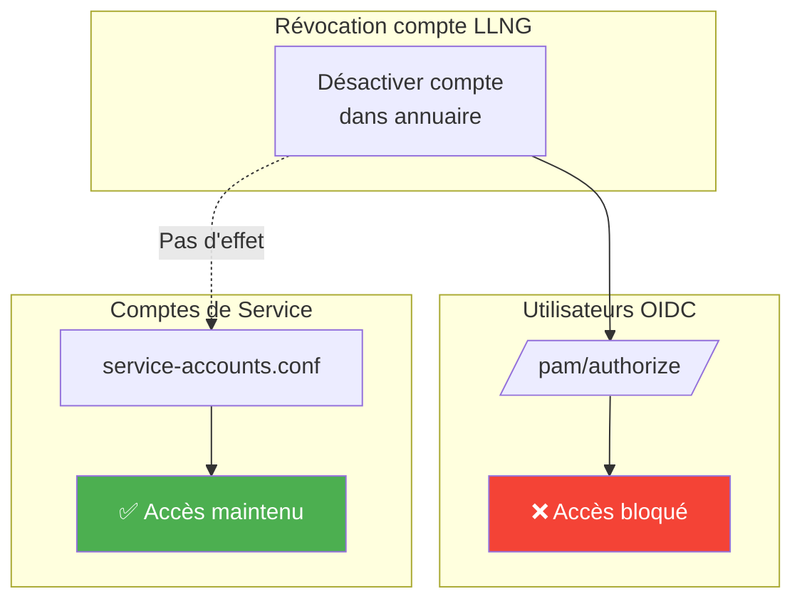
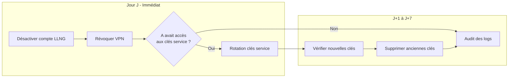

# Offboarding d'un Administrateur SSH

Ce document décrit la procédure de révocation des accès lorsqu'un administrateur SSH quitte l'entreprise ou change de service.

## Contexte

Un administrateur SSH (appelé "A" dans ce document) dispose généralement de :

| Accès | Description |
|-------|-------------|
| Compte annuaire | Compte LDAP/AD avec appartenance aux groupes autorisés |
| `client_secret` | Secret du client OIDC utilisé pour les enrôlements |
| Clés SSH | Clé privée SSH + clé publique déployée sur les serveurs |
| Certificats SSH | Si SSH CA : certificats signés par la CA LLNG |
| Accès réseau | VPN ou accès réseau interne vers les serveurs |
| Tokens machines | Connaissance des `refresh_token` des serveurs enrôlés |

## Principe : Défense en Profondeur

La sécurité repose sur plusieurs couches indépendantes. La compromission d'une couche ne suffit pas à obtenir un accès :

```
┌─────────────────────────────────────────────────────────────┐
│                    Accès SSH réussi                         │
└─────────────────────────────────────────────────────────────┘
                            ▲
                            │ Toutes les couches doivent être OK
        ┌───────────────────┼───────────────────┐
        │                   │                   │
   ┌────┴────┐        ┌─────┴─────┐       ┌─────┴─────┐
   │ Réseau  │        │   LLNG    │       │    SSH    │
   │ (VPN)   │        │ (authent) │       │ (clé/cert)│
   └─────────┘        └───────────┘       └───────────┘
```

**Avantage** : La révocation d'une seule couche bloque l'accès, évitant les actions d'urgence sur toutes les couches simultanément.

---

## Procédure d'Offboarding

### Phase 1 : Actions Immédiates (Jour J)

Ces actions bloquent immédiatement tout nouvel accès de A.

#### 1.1 Révocation LLNG (PRIORITÉ HAUTE)

**Action** : Désactiver le compte de A dans l'annuaire (LDAP/AD)

```bash
# Exemple LDAP
ldapmodify -x -D "cn=admin,dc=example,dc=com" -W <<EOF
dn: uid=admin-a,ou=people,dc=example,dc=com
changetype: modify
replace: nsAccountLock
nsAccountLock: true
EOF
```

**OU** retirer A des groupes autorisés :

```bash
ldapmodify -x -D "cn=admin,dc=example,dc=com" -W <<EOF
dn: cn=ssh-admins-prod,ou=groups,dc=example,dc=com
changetype: modify
delete: member
member: uid=admin-a,ou=people,dc=example,dc=com
EOF
```

**Effet** :
- A ne peut plus s'authentifier sur le portail LLNG
- A ne peut plus approuver de nouveaux enrôlements
- `/pam/authorize` refusera A pour toute connexion SSH

#### 1.2 Invalidation des Sessions LLNG Actives

```bash
# Supprimer toutes les sessions de A
lemonldap-ng-sessions search --uid admin-a | \
  xargs -I {} lemonldap-ng-sessions delete {}
```

#### 1.3 Révocation Accès Réseau/VPN

Retirer les droits VPN de A auprès de l'équipe réseau.

**Effet** : Même avec des credentials valides, A ne peut plus atteindre les serveurs SSH.

---

### Phase 2 : Révocation SSH (selon l'architecture)

#### Architecture A/C : Clés SSH Classiques

**Action** : Supprimer la clé publique de A de tous les serveurs

```bash
# Script à exécuter sur chaque serveur de la zone
# Ou via Ansible/Puppet/Chef

# Identifier la clé de A (par commentaire ou fingerprint)
grep -l "admin-a@" /home/*/.ssh/authorized_keys /root/.ssh/authorized_keys 2>/dev/null

# Supprimer la clé
for f in $(grep -l "admin-a@" /home/*/.ssh/authorized_keys /root/.ssh/authorized_keys 2>/dev/null); do
    sed -i '/admin-a@/d' "$f"
done
```

**Alternative avec Ansible** :

```yaml
# playbook-revoke-key.yml
- hosts: zone_prod
  tasks:
    - name: Remove admin-a SSH key
      ansible.posix.authorized_key:
        user: "{{ item }}"
        key: "ssh-rsa AAAA... admin-a@example.com"
        state: absent
      loop:
        - root
        - deploy
```

#### Architecture B/D : Certificats SSH (SSH CA)

Avec SSH CA, la révocation est centralisée et plus simple.

**Option 1 : Attendre l'expiration (recommandé si durée courte)**

Si les certificats ont une durée de vie courte (30-60 minutes), il suffit d'attendre leur expiration naturelle. La révocation LLNG (Phase 1) empêche A d'obtenir de nouveaux certificats.

**Option 2 : Révocation via l'interface d'administration LLNG**

Le plugin SSH CA de LLNG fournit une interface d'administration pour révoquer les certificats :

1. **Accéder à l'interface d'administration** :
   ```
   https://auth.example.com/ssh/admin
   ```

2. **Rechercher les certificats de A** :
   - L'endpoint `/ssh/certs` permet de lister/rechercher les certificats émis
   - Filtrer par utilisateur pour trouver les certificats de A

3. **Révoquer les certificats** :
   - Utiliser `/ssh/revoke` pour ajouter les certificats à la KRL
   - La révocation est immédiate côté LLNG

> **Note** : L'accès à l'interface d'administration est contrôlé par la règle `sshCaAdminRule` dans la configuration LLNG.

**Option 3 : Révocation manuelle via KRL**

Pour une révocation en ligne de commande :

```bash
# Récupérer le serial du dernier certificat de A (depuis les logs LLNG ou /ssh/certs)
# Puis ajouter à la KRL
ssh-keygen -k -f /var/lib/lemonldap-ng/ssh/krl -s /path/to/ca_key -z <serial> /dev/null
```

**Propagation de la KRL aux serveurs** :

La KRL est automatiquement distribuée si le cron est configuré :

```bash
# /etc/cron.hourly/update-ssh-krl (déjà en place sur les serveurs)
#!/bin/bash
curl -s https://auth.example.com/ssh/revoked > /etc/ssh/revoked_keys.new
mv /etc/ssh/revoked_keys.new /etc/ssh/revoked_keys
```

Pour une propagation immédiate :

```bash
# Sur chaque serveur ou via Ansible
curl -s https://auth.example.com/ssh/revoked > /etc/ssh/revoked_keys
```

**Configuration sshd requise** (normalement déjà en place) :

```bash
# /etc/ssh/sshd_config
TrustedUserCAKeys /etc/ssh/llng_ca.pub
RevokedKeys /etc/ssh/revoked_keys
```

---

### Phase 3 : Actions Planifiées (J+7 à J+30)

Ces actions ne sont pas urgentes mais doivent être planifiées.

#### 3.1 Rotation du `client_secret`

A connaissait le `client_secret` du client OIDC. Bien que la révocation LLNG empêche son utilisation malveillante, une rotation est recommandée :

1. **Générer un nouveau secret dans le Manager LLNG** :
   ```
   OIDC → Relying Parties → pam-prod → Options → Client secret → Générer
   ```

2. **Mettre à jour la configuration sur tous les serveurs de la zone** :
   ```bash
   # /etc/open-bastion/openbastion.conf
   client_secret = <nouveau_secret>
   ```

3. **Redémarrer le service PAM** (si applicable) ou tester une connexion.

**Note** : Cette rotation peut être faite lors de la prochaine fenêtre de maintenance. Elle n'est pas urgente car :
- A ne peut plus s'authentifier sur LLNG (compte désactivé)
- A ne peut plus atteindre les serveurs (VPN révoqué)

#### 3.2 Rotation Périodique Recommandée

Indépendamment des offboardings, planifier une rotation régulière :

| Élément | Fréquence recommandée |
|---------|----------------------|
| `client_secret` | Tous les 6 mois |
| Clé CA SSH | Tous les 2 ans (avec période de transition) |
| Tokens machines | Rotation automatique via `refresh_token` |

---

## Tableau Récapitulatif par Architecture

### Architecture A : Serveur Isolé (Clés SSH)

| Phase | Action | Délai | Effet |
|-------|--------|-------|-------|
| 1 | Désactiver compte LLNG | Immédiat | Bloque `/pam/authorize` |
| 1 | Révoquer VPN | Immédiat | Bloque accès réseau |
| 2 | Supprimer clé SSH | < 24h | Bloque authentification SSH |
| 3 | Rotation `client_secret` | < 30 jours | Limite exposition |

### Architecture B : Serveur + SSH CA

| Phase | Action | Délai | Effet |
|-------|--------|-------|-------|
| 1 | Désactiver compte LLNG | Immédiat | Bloque nouveaux certificats |
| 1 | Révoquer VPN | Immédiat | Bloque accès réseau |
| 2 | Révoquer via `/ssh/admin` | Immédiat | Ajoute certificats à la KRL |
| 2 | Expiration naturelle | 30-60 min | Certificats invalides (si pas de révocation) |
| 3 | Rotation `client_secret` | < 30 jours | Limite exposition |

### Architecture C : Bastion + Backends (Clés SSH)

| Phase | Action | Délai | Effet |
|-------|--------|-------|-------|
| 1 | Désactiver compte LLNG | Immédiat | Bloque `/pam/authorize` |
| 1 | Révoquer VPN | Immédiat | Bloque accès bastion |
| 2 | Supprimer clé SSH (bastion) | < 24h | Bloque accès bastion |
| 2 | Supprimer clé SSH (backends) | < 24h | Défense en profondeur |
| 3 | Rotation `client_secret` | < 30 jours | Limite exposition |

### Architecture D : Bastion + SSH CA

| Phase | Action | Délai | Effet |
|-------|--------|-------|-------|
| 1 | Désactiver compte LLNG | Immédiat | Bloque nouveaux certificats |
| 1 | Révoquer VPN | Immédiat | Bloque accès bastion |
| 2 | Révoquer via `/ssh/admin` | Immédiat | Ajoute certificats à la KRL |
| 2 | Expiration naturelle | 30-60 min | Certificats invalides (si pas de révocation) |
| 3 | Rotation `client_secret` | < 30 jours | Limite exposition |

---

## Checklist Offboarding Administrateur SSH

### Jour J (Immédiat)

- [ ] Compte A désactivé dans l'annuaire LDAP/AD
- [ ] Sessions LLNG de A supprimées
- [ ] Accès VPN de A révoqué
- [ ] (Si SSH CA) Certificats révoqués via `/ssh/admin`
- [ ] Équipe informée de ne pas réactiver le compte

### J+1 à J+7

- [ ] (Si clés SSH) Clés publiques de A supprimées de tous les serveurs
- [ ] Audit des accès récents de A (logs SSH, logs LLNG)
- [ ] Vérification qu'aucune session persistante n'existe

### J+7 à J+30

- [ ] Rotation du `client_secret` de la zone concernée
- [ ] Documentation mise à jour (liste des administrateurs)
- [ ] Revue des accès des autres administrateurs (principe du moindre privilège)

---

## Cas Particuliers

### A avait accès à plusieurs zones

Répéter la procédure pour chaque zone (chaque `client_secret` distinct).

### Suspicion de compromission active

En cas de suspicion que A a exfiltré des tokens ou tente activement d'accéder :

1. **Urgence réseau** : Bloquer l'IP de A au niveau firewall
2. **Rotation immédiate** : `client_secret` de toutes les zones accessibles par A
3. **Invalidation tokens** : Utiliser `/admintokenrevoke` pour révoquer les `refresh_token` des machines

```bash
# Révocation d'un refresh_token via l'API admin LLNG
curl -X POST https://auth.example.com/admintokenrevoke \
  -H "Authorization: Bearer <admin_secret>" \
  -d "token=<refresh_token>" \
  -d "token_hint=refresh_token"
```

### A était le seul administrateur d'une zone

S'assurer qu'un autre administrateur a les accès nécessaires AVANT de révoquer A :
- Accès au Manager LLNG
- Accès au `client_secret` (ou capacité à en générer un nouveau)
- Clé SSH ou certificat valide pour les serveurs

---

## Comptes de Service

### Particularité

Les comptes de service (ansible, backup, deploy, etc.) **ne passent pas par LLNG** pour l'autorisation. Ils sont définis localement dans `/etc/open-bastion/service-accounts.conf`.

**Conséquence importante :** La révocation du compte LLNG (Phase 1.1) ne bloque **pas** les comptes de service.



### Flux de révocation complet



### Actions requises pour les comptes de service

Si la personne partante avait connaissance d'une clé de service ou pouvait la régénérer :

#### Phase 1 : Actions Immédiates (Jour J)

1. **Identifier les comptes de service concernés** :
   ```bash
   # Sur chaque serveur
   cat /etc/open-bastion/service-accounts.conf
   ```

2. **Rotation des clés de service** (si A avait accès aux clés privées) :
   ```bash
   # Générer une nouvelle clé
   ssh-keygen -t ed25519 -f /secure/ansible_new_key -C "ansible@$(hostname)"

   # Obtenir le fingerprint
   ssh-keygen -lf /secure/ansible_new_key.pub
   # Exemple: 256 SHA256:NEW_FINGERPRINT ansible@server (ED25519)
   ```

3. **Mettre à jour le fichier de configuration** :
   ```bash
   sudo vim /etc/open-bastion/service-accounts.conf
   # Remplacer key_fingerprint par le nouveau fingerprint
   ```

4. **Déployer la nouvelle clé** :
   ```bash
   # Mettre à jour Ansible Vault / HashiCorp Vault
   # Ou déployer via le système de gestion de configuration
   ```

#### Phase 2 : Vérification (J+1)

- [ ] Tester que les comptes de service fonctionnent avec les nouvelles clés
- [ ] Supprimer les anciennes clés de tous les systèmes de stockage (Vault, etc.)
- [ ] Vérifier que l'ancienne clé ne permet plus l'accès

### Tableau récapitulatif - Comptes de Service

| Action | Délai | Condition |
|--------|-------|-----------|
| Rotation clé ansible | Immédiat | Si A avait accès à la clé |
| Rotation clé backup | Immédiat | Si A avait accès à la clé |
| Rotation clé deploy | Immédiat | Si A avait accès à la clé |
| Rotation clé monitoring | Immédiat | Si A avait accès à la clé |

### Checklist Comptes de Service

#### Jour J (si clés compromises)

- [ ] Identifier les comptes de service sur chaque serveur
- [ ] Générer de nouvelles clés pour les comptes concernés
- [ ] Mettre à jour les fingerprints dans service-accounts.conf
- [ ] Déployer les nouvelles clés dans le système de stockage sécurisé
- [ ] Tester le fonctionnement des automatisations

#### J+7

- [ ] Supprimer définitivement les anciennes clés
- [ ] Documenter les nouvelles clés (sans exposer le matériel privé)
- [ ] Auditer les logs pour détecter toute utilisation des anciennes clés
