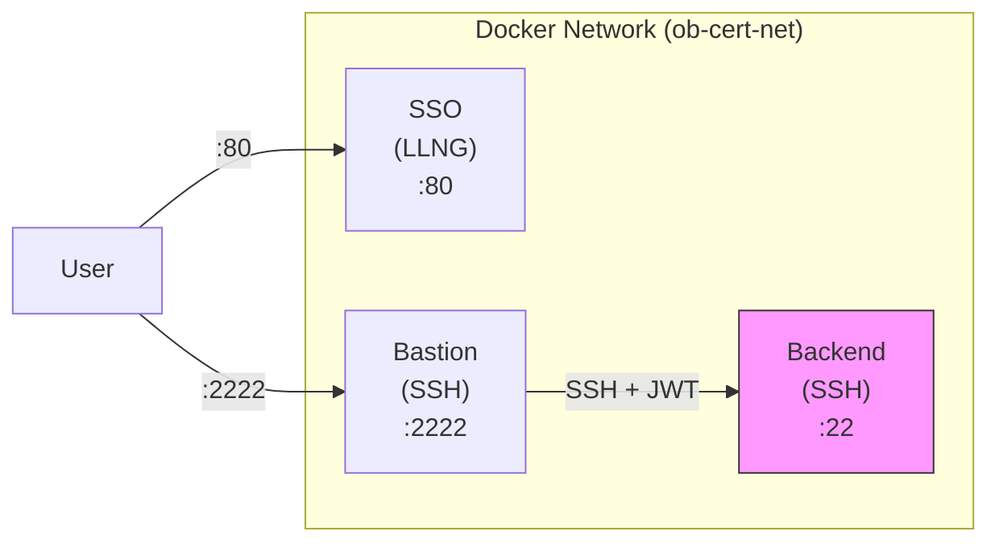
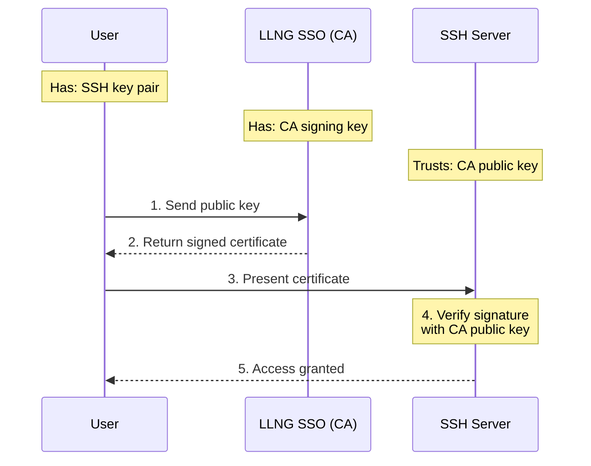
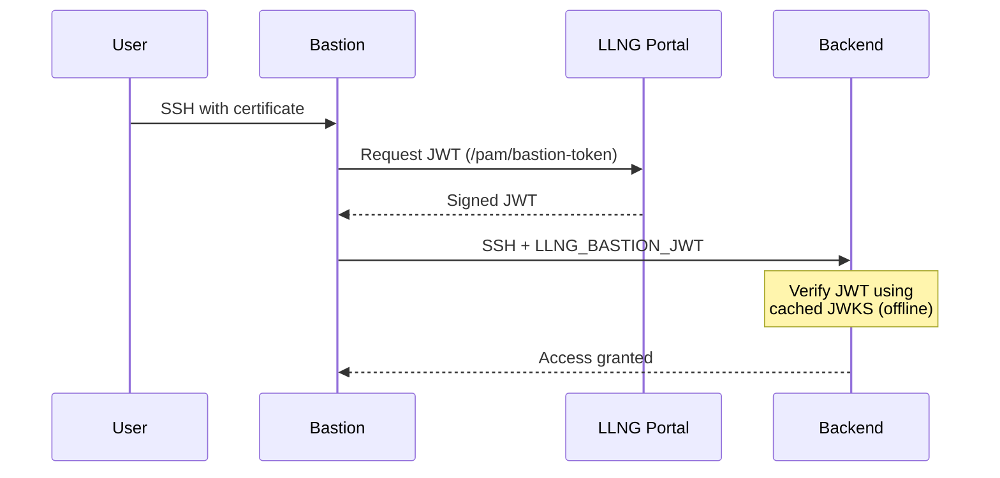

# LemonLDAP::NG SSH Certificate Authentication Demo

This Docker Compose demo demonstrates SSH certificate authentication with LemonLDAP::NG, including:

- **SSO Portal**: LemonLDAP::NG with SshCa, PamAccess and Device Authorization plugins
  (PamAccess is still required even though authentication is certificate-based:
  the PAM module on each server calls `/pam/authorize` for server-group access
  checks)
- **SSH Bastion**: Jump host with certificate authentication and PAM authorization
- **SSH Backend**: Internal server accessible only through the bastion

## Architecture



> Note: Only bastion port 2222 is exposed externally. Backend has no external port.

## Quick Start

### 1. Start the environment

```bash
cd docker-demo-cert/
docker compose up -d
```

Wait for all services to be healthy:

```bash
docker compose ps
```

### 2. Login to get a session

Using the `llng` CLI tool:

```bash
llng --llng-url http://localhost:80 --login dwho --password dwho llng_cookie
```

Or via browser at http://localhost:80 with credentials:

- Username: `dwho`, `rtyler`, or `msmith`
- Password: same as username

### 3. Get an SSH certificate

First, ensure you have an SSH key pair. If not, create one:

```bash
# Create an Ed25519 key (if you don't have one)
ssh-keygen -t ed25519 -f ~/.ssh/id_ed25519 -N ""
```

Then request a certificate for your public key.

**Option A: Using the web interface**

1. Go to http://localhost:80 and log in
2. Open http://localhost:80/ssh (the SSH CA page)
3. Paste your public key (content of `~/.ssh/id_ed25519.pub`)
4. Choose the validity duration
5. Click "Sign" and download the certificate
6. Save it as `~/.ssh/id_ed25519-cert.pub`

**Option B: Using curl**

```bash
# For bastion access
curl -s -X POST http://localhost:80/ssh/sign \
  -b ~/.cache/llng-cookies \
  -H "Content-Type: application/json" \
  -d "{\"public_key\":\"$(cat ~/.ssh/id_ed25519.pub)\",\"server_group\":\"bastion\"}" \
  | jq -r '.certificate' > ~/.ssh/id_ed25519-cert.pub

# Verify the certificate
ssh-keygen -L -f ~/.ssh/id_ed25519-cert.pub
```

### 4. Connect to the bastion

```bash
ssh -p 2222 dwho@localhost
```

### 5. From bastion, connect to backend

The backend server requires a signed JWT from the bastion to prove the connection
comes from an authorized bastion server. Use the `ob-ssh-proxy` command:

```bash
# On bastion - the proxy automatically gets a JWT and forwards it
ob-ssh-proxy backend

# Or using SSH with ProxyCommand
ssh -o ProxyCommand='ob-ssh-proxy %h %p' dwho@backend
```

**Note**: Direct SSH connections to the backend (without the bastion JWT) will be rejected,
even with a valid SSH certificate. This ensures backends only accept connections from authorized bastions.

## Demo Users

| User   | Password | SSH Access       | Sudo on Backend |
| ------ | -------- | ---------------- | --------------- |
| dwho   | dwho     | bastion, backend | No              |
| rtyler | rtyler   | bastion, backend | Yes             |
| msmith | msmith   | bastion, backend | No              |

## SSH Certificate Authority (CA) Trust Model

### Why certificates are accepted

SSH certificate authentication relies on a **Certificate Authority (CA)** that both the user and the server trust:



### CA Configuration in this demo

1. **CA Key Generation**: The SSO generates an Ed25519 CA key pair at startup (stored in `/var/lib/lemonldap-ng/ssh/`)

2. **CA Public Key Distribution**: Each SSH server downloads the CA public key from `/ssh/ca` endpoint at startup

3. **Server Trust Configuration**: SSH servers are configured to trust this CA:

   ```
   # In /etc/ssh/sshd_config.d/open-bastion-*.conf
   TrustedUserCAKeys /etc/ssh/llng_ca.pub
   ```

4. **Certificate Signing**: When a user requests a certificate via `/ssh/sign`:
   - LLNG verifies the user is authenticated
   - LLNG checks authorization rules for the requested `server_group`
   - LLNG signs the user's public key with the CA private key
   - The certificate includes: principal (username), validity period, permissions

5. **Certificate Verification**: When connecting, the SSH server:
   - Receives the user's certificate
   - Verifies the signature using the trusted CA public key
   - Checks the principal matches the login username
   - Checks the certificate hasn't expired
   - Grants access if all checks pass

### Certificate contents

A typical certificate contains:

```bash
$ ssh-keygen -L -f ~/.ssh/id_ed25519-cert.pub
        Type: ssh-ed25519-cert-v01@openssh.com user certificate
        Public key: ED25519-CERT SHA256:...
        Signing CA: ED25519 SHA256:... (using ssh-ed25519)
        Key ID: "dwho@llng-1234567890-000001"
        Serial: 1
        Valid: from 2025-01-01T00:00:00 to 2025-01-01T01:00:00
        Principals:
                dwho
        Critical Options: (none)
        Extensions:
                permit-agent-forwarding
                permit-port-forwarding
                permit-pty
                permit-user-rc
```

## SSH Server Registration Process

In this demo, SSH servers (bastion and backend) are pre-registered with a shared OAuth2 access token. In a production environment, each server should have its own token obtained through the Device Authorization flow.

### Hands-on Enrollment Tutorial

The `backend-new` container simulates a fresh server with only the PAM/NSS modules installed.
No configuration is done automatically - you must configure everything manually as you would in production.

#### Step 1: Start the unconfigured backend

```bash
docker compose up -d backend-new
```

#### Step 2: Download the SSH CA public key

```bash
# Download CA key from the SSO portal
docker exec ob-cert-backend-new curl -sf http://sso:8080/ssh/ca -o /etc/ssh/llng_ca.pub
docker exec ob-cert-backend-new cat /etc/ssh/llng_ca.pub
```

#### Step 3: Configure sshd for certificate authentication

```bash
docker exec ob-cert-backend-new tee /etc/ssh/sshd_config.d/open-bastion.conf << 'EOF'
# Open Bastion SSH Configuration
TrustedUserCAKeys /etc/ssh/llng_ca.pub
PubkeyAuthentication yes
PasswordAuthentication no
KbdInteractiveAuthentication no
UsePAM yes
X11Forwarding no
PermitRootLogin no
EOF
```

#### Step 4: Configure Open Bastion PAM module

```bash
docker exec ob-cert-backend-new tee /etc/open-bastion/openbastion.conf << 'EOF'
# Open Bastion PAM configuration
portal_url = http://sso:8080
server_group = backend-new
client_id = pam-access
client_secret = pamsecret
timeout = 10
verify_ssl = false
cache_enabled = true
cache_dir = /var/cache/open-bastion
cache_ttl = 300
log_level = info
EOF

docker exec ob-cert-backend-new chmod 600 /etc/open-bastion/openbastion.conf
```

#### Step 5: Configure NSS for dynamic user resolution

```bash
docker exec ob-cert-backend-new tee /etc/open-bastion/nss_openbastion.conf << 'EOF'
# Open Bastion NSS configuration
portal_url = http://sso:8080
server_token_file = /etc/open-bastion/token
cache_ttl = 300
min_uid = 10000
max_uid = 60000
default_gid = 100
default_shell = /bin/bash
default_home_base = /home
EOF

# Configure nsswitch.conf to use Open Bastion
docker exec ob-cert-backend-new sed -i 's/^passwd:.*/passwd:         files openbastion/' /etc/nsswitch.conf
docker exec ob-cert-backend-new sed -i 's/^group:.*/group:          files openbastion/' /etc/nsswitch.conf
```

#### Step 6: Configure PAM stack with home directory creation

```bash
docker exec ob-cert-backend-new tee /etc/pam.d/sshd << 'EOF'
# PAM configuration for SSH with Open Bastion
auth       required     pam_permit.so
account    required     pam_openbastion.so
session    required     pam_openbastion.so create_user=true
session    required     pam_unix.so
session    optional     pam_mkhomedir.so skel=/etc/skel umask=0022
EOF
```

#### Step 7: Enroll the server with ob-enroll

```bash
docker exec -it ob-cert-backend-new ob-enroll
```

The script will:

1. Read configuration from `/etc/open-bastion/openbastion.conf`
2. Request a device authorization code from the portal
3. Display a **user code** (e.g., `WXYZ-1234`)
4. Wait for administrator approval

#### Step 8: Approve the device via web interface

While the script is waiting, open a browser:

1. **Go to** http://localhost:80/device
2. **Log in** with credentials (e.g., `dwho` / `dwho`)
3. **Enter the user code** displayed by the script
4. **Click Approve**

After approval, the script will:

- Save the token to `/etc/open-bastion/token`
- Verify the enrollment

#### Step 9: Restart sshd to apply configuration

```bash
docker exec ob-cert-backend-new pkill -HUP sshd
```

#### Step 10: Test the connection

```bash
# 1. Ensure you have a valid LLNG session
llng --llng-url http://localhost:80 --login dwho --password dwho llng_cookie

# 2. Create an SSH key and get a certificate for backend-new
ssh-keygen -t ed25519 -f /tmp/test_key -N "" -q 2>/dev/null || true
curl -s -X POST http://localhost:80/ssh/sign \
  -b ~/.cache/llng-cookies \
  -H "Content-Type: application/json" \
  -d "{\"public_key\":\"$(cat /tmp/test_key.pub)\",\"server_group\":\"backend-new\"}" \
  | jq -r '.certificate' > /tmp/test_key-cert.pub

# 3. Copy key and certificate to bastion
docker exec ob-cert-bastion mkdir -p /home/dwho/.ssh
docker cp /tmp/test_key ob-cert-bastion:/home/dwho/.ssh/id_ed25519
docker cp /tmp/test_key-cert.pub ob-cert-bastion:/home/dwho/.ssh/id_ed25519-cert.pub
docker exec ob-cert-bastion chown -R dwho:dwho /home/dwho/.ssh
docker exec ob-cert-bastion chmod 700 /home/dwho/.ssh
docker exec ob-cert-bastion chmod 600 /home/dwho/.ssh/id_ed25519

# 4. Connect from bastion to backend-new
docker exec -u dwho ob-cert-bastion ssh -o StrictHostKeyChecking=no backend-new whoami
# Expected: dwho
```

Note: The user `dwho` is resolved dynamically via the NSS module - no local account exists on the server. The home directory is created automatically on first login by `pam_mkhomedir`.

### Summary: The ob-enroll Script

The `ob-enroll` script automates the entire Device Authorization flow:

1. **Reads configuration** from `/etc/open-bastion/openbastion.conf` (portal URL, client credentials)
2. **Requests device code** from `/oauth2/device` endpoint
3. **Displays instructions** with user code for administrator approval
4. **Polls for token** at configurable intervals
5. **Saves token** securely to `/etc/open-bastion/token`
6. **Verifies enrollment** by calling `/pam/authorize`

Options:

```bash
ob-enroll --help

Options:
  -p, --portal URL       LemonLDAP::NG portal URL
  -c, --client-id ID     OIDC client ID (default: pam-access)
  -s, --client-secret S  OIDC client secret (prefer OB_CLIENT_SECRET env var)
  -g, --server-group G   Server group name
  -t, --token-file FILE  Where to save the token (default: /etc/open-bastion/token)
  -C, --config FILE      Read settings from config file
  -k, --insecure         Skip SSL certificate verification
  -q, --quiet            Quiet mode
```

### How it works

1. **Server Token**: Each SSH server needs an OAuth2 access token to authenticate
   its PAM module requests to the LLNG portal.

2. **Token Configuration**: The token is stored in `/etc/open-bastion/token` and
   referenced by `server_token_file` in `/etc/open-bastion/openbastion.conf`.

3. **PAM Authorization Flow**:
   ```
   User SSH → sshd → PAM (pam_openbastion.so) → LLNG /pam/authorize → Allow/Deny
   ```

### Registering a new SSH server (production)

In production, use the Device Authorization Grant (RFC 8628) to register each server.
The recommended way is to run `ob-enroll` on the server, which takes care of the
entire flow. The raw HTTP exchange below is shown for reference:

```bash
# 1. Request device authorization
DEVICE_RESP=$(curl -s -X POST https://sso.example.com/oauth2/device \
  -d "client_id=pam-access&scope=pam:server")

echo "Please visit: $(echo $DEVICE_RESP | jq -r '.verification_uri')"
echo "Enter code: $(echo $DEVICE_RESP | jq -r '.user_code')"
DEVICE_CODE=$(echo $DEVICE_RESP | jq -r '.device_code')

# 2. User approves the device at the verification URL

# 3. Poll for token (after user approval)
TOKEN_RESP=$(curl -s -X POST https://sso.example.com/oauth2/token \
  -d "grant_type=urn:ietf:params:oauth:grant-type:device_code" \
  -d "device_code=$DEVICE_CODE" \
  -d "client_id=pam-access" \
  -d "client_secret=<secret>")

# 4. Save the token
echo $TOKEN_RESP | jq -r '.access_token' > /etc/open-bastion/token
chmod 600 /etc/open-bastion/token
```

### PAM Configuration

Each server needs `/etc/open-bastion/openbastion.conf`:

```ini
# Open Bastion PAM configuration
portal_url = https://sso.example.com
server_group = production-servers

# OAuth2 client credentials
client_id = pam-access
client_secret = <secret>

# Server token for authorization
server_token_file = /etc/open-bastion/token

# HTTP settings
timeout = 10
verify_ssl = true

# Cache settings (for offline mode)
cache_enabled = true
cache_dir = /var/cache/open-bastion
cache_ttl = 300
```

And `/etc/pam.d/sshd`:

```
auth       required     pam_permit.so
account    required     pam_openbastion.so
session    required     pam_unix.so
```

## Bastion JWT Verification

The backend server is configured to require a JWT from the bastion server. This provides
cryptographic proof that the SSH connection originates from an authorized bastion.



### How it works:

1. User SSH to bastion with SSH certificate
2. From bastion, user runs `ob-ssh-proxy backend`
3. Proxy requests a signed JWT from LLNG `/pam/bastion-token`
4. Proxy connects to backend with JWT in `LLNG_BASTION_JWT` env var
5. Backend verifies JWT signature using cached JWKS (offline capable)
6. If valid, SSH connection proceeds; otherwise, denied

## API Endpoints

| Endpoint                 | Method   | Description                                    |
| ------------------------ | -------- | ---------------------------------------------- |
| `/ssh`                   | GET      | Web interface to sign SSH keys (requires auth) |
| `/ssh/ca`                | GET      | Get SSH CA public key                          |
| `/ssh/sign`              | POST     | Sign a user's public key                       |
| `/pam/authorize`         | POST     | Check user authorization                       |
| `/pam/bastion-token`     | POST     | Get signed JWT for bastion-to-backend auth     |
| `/oauth2/device`         | POST     | Start device authorization                     |
| `/device`                | GET/POST | User device verification page                  |
| `/oauth2/token`          | POST     | Exchange device code for token                 |
| `/.well-known/jwks.json` | GET      | Public keys for JWT verification               |

## Troubleshooting

### Check container logs

```bash
docker logs ob-cert-sso
docker logs ob-cert-bastion
docker logs ob-cert-backend
```

### Test PAM authorization manually

```bash
docker exec ob-cert-bastion curl -s http://sso/pam/authorize \
  -H "Authorization: Bearer <token>" \
  -H "Content-Type: application/json" \
  -d '{"user":"dwho","server_group":"bastion"}'
```

### Verify SSH CA trust

```bash
docker exec ob-cert-bastion cat /etc/ssh/llng_ca.pub
curl http://localhost:80/ssh/ca
```

### Check certificate validity

```bash
ssh-keygen -L -f ~/.ssh/id_ed25519-cert.pub
```

## Data Storage

### No Persistent Volumes

This demo does NOT use persistent Docker volumes. All data is reset when containers are recreated.
This ensures a clean slate for each demo run.

To reset everything:

```bash
docker compose down
docker compose up -d
```

### SSO Sessions

User authentication sessions are stored in the SSO container:

```bash
# List active sessions
docker exec ob-cert-sso ls -la /var/lib/lemonldap-ng/sessions/

# Session files are named by session ID (the cookie value)
```

### SSH CA Keys

The SSH Certificate Authority keys are stored in the SSO:

```bash
# View CA storage
docker exec ob-cert-sso ls -la /var/lib/lemonldap-ng/ssh/

# Files:
# - ssh-ca (private key)
# - ssh-ca.pub (public key)
# - ssh-ca.serial (certificate serial counter)
```

### Session Recordings (optional)

When session recording is enabled on the bastion (via `ForceCommand`), recordings are stored in:

```bash
# List recordings
docker exec ob-cert-bastion ls -la /var/lib/open-bastion/sessions/

# Recordings use 'script' format and can be replayed with:
# scriptreplay timing_file typescript_file
```

Note: In this demo, session recording is disabled to allow ProxyJump. To enable it, add to sshd config:

```
ForceCommand /usr/sbin/ob-session-recorder
```

### PAM Authorization Cache

Each SSH server caches authorization responses for offline mode:

```bash
# Cache location
docker exec ob-cert-bastion ls -la /var/cache/open-bastion/

# Cache entries are encrypted and expire based on cache_ttl (default: 300s)
```

## Configuration Files

- `docker-compose.yml` - Service definitions
- `lmConf-1.json` - LemonLDAP::NG configuration
- `bastion/Dockerfile` - Bastion image build
- `bastion/entrypoint.sh` - Bastion startup script
- `backend/Dockerfile` - Backend image build
- `backend/entrypoint.sh` - Backend startup script

## Security Notes

- In production, use HTTPS for the portal
- Each server should have a unique token
- Tokens should be rotated regularly
- Enable `verify_ssl = true` in production
- Consider enabling audit logging
- **Bastion JWT**: Backends require a valid JWT from the bastion, preventing direct access even with valid SSH certificates
- The JWKS cache allows backends to verify JWTs offline (useful for network partitions)
