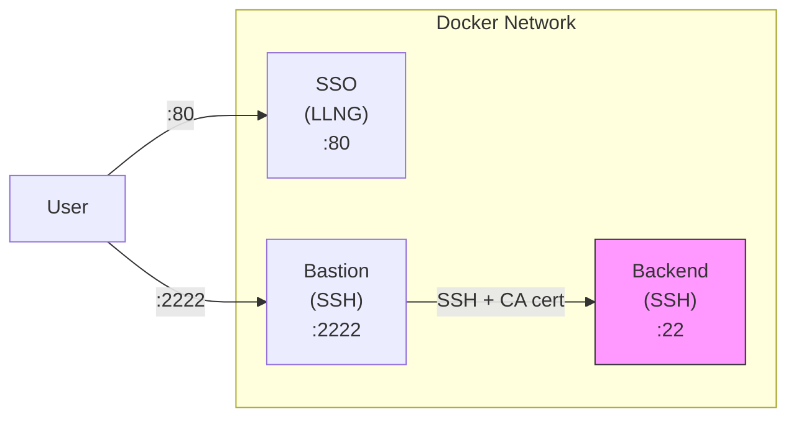

# Open Bastion Maximum Security Demo (Mode E)

This Docker Compose demo demonstrates the **maximum security configuration** (Mode E) with LemonLDAP::NG:

- **SSH**: only SSO-signed certificates accepted (`AuthorizedKeysFile none`)
- **sudo**: only LLNG temporary tokens accepted (PAM-access re-authentication)
- **KRL**: mandatory Key Revocation List, refreshed every 30 minutes
- **CA-signed certificates only**: the backend trusts the LLNG SSH CA and rejects unsigned keys. Per-bastion origin enforcement (`AuthorizedPrincipalsCommand` + allowed_bastions) is added by `ob-backend-setup` in a real deployment; this hand-rolled demo does not wire it.

## Architecture


```mermaid
flowchart LR
    subgraph Docker["Docker Network"]
        SSO["SSO<br/>(LLNG)<br/>:80"]
        Bastion["Bastion<br/>(SSH)<br/>:2222"]
        Backend["Backend<br/>(SSH)<br/>:22"]
    end

    User["User"] -->|:80| SSO
    User -->|:2222| Bastion
    Bastion -->|SSH + CA cert| Backend

    style Backend fill:#f9f,stroke:#333
```

> Only bastion port 2222 is exposed externally. Backend has no external port.

## Security Model

```
┌──────────────────────────┐       ┌──────────────────────────┐
│       SSH Access          │       │    sudo Escalation        │
│                          │       │                          │
│  SSO Certificate (1yr)   │       │  LLNG Token (5-60 min)   │
│  + /pam/authorize        │       │  + /pam/authorize        │
│                          │       │  (sudo_allowed=true)     │
│  "I have the right       │       │  "I want to perform a    │
│   to be here"            │       │   privileged action now"  │
└──────────────────────────┘       └──────────────────────────┘
```

### What's different from docker-demo-cert?

| Feature              | docker-demo-cert | docker-demo-maxsec (Mode E) |
| -------------------- | ---------------- | --------------------------- |
| SSH auth             | CA certificates  | CA certificates ONLY        |
| `AuthorizedKeysFile` | Default          | `none` (no unsigned keys)   |
| `RevokedKeys` (KRL)  | Not configured   | Mandatory + auto-refresh    |
| sudo                 | `NOPASSWD`       | LLNG token required         |
| KRL refresh          | Manual           | Every 30 min (timer)        |

## Quick Start

### 1. Start the environment

```bash
cd docker-demo-maxsec/
docker compose up -d
```

Wait for all services to be healthy:

```bash
docker compose ps
```

### 2. Get an SSH certificate

Create an SSH key pair (if needed) and get it signed by the SSO:

```bash
# Create an Ed25519 key
ssh-keygen -t ed25519 -f ~/.ssh/id_ed25519 -N "" 2>/dev/null || true

# Login to LLNG
llng --llng-url http://localhost:80 --login dwho --password dwho llng_cookie

# Sign your public key
curl -s -X POST http://localhost:80/ssh/sign \
  -b ~/.cache/llng-cookies \
  -H "Content-Type: application/json" \
  -d "{\"public_key\":\"$(cat ~/.ssh/id_ed25519.pub)\",\"server_group\":\"bastion\"}" \
  | jq -r '.certificate' > ~/.ssh/id_ed25519-cert.pub

# Verify
ssh-keygen -L -f ~/.ssh/id_ed25519-cert.pub
```

### 3. Connect to the bastion

```bash
ssh -p 2222 dwho@localhost
```

### 4. Test that unsigned keys are rejected

```bash
# Generate a new unsigned key
ssh-keygen -t ed25519 -f /tmp/unsigned_key -N "" -q

# Try to connect - should be REJECTED
ssh -p 2222 -i /tmp/unsigned_key dwho@localhost
# Expected: Permission denied (publickey)
```

### 5. Test sudo (requires LLNG token)

From the bastion, connect to backend and try sudo:

```bash
# On bastion - connect to backend
ob-ssh backend

# On backend - try sudo
sudo whoami
# You will be prompted for a password
# Enter a fresh LLNG temporary token from the portal
```

To get a temporary token:

1. Go to http://localhost:80 and log in as `rtyler` / `rtyler`
2. Navigate to the PAM-access section
3. Generate a temporary token
4. Use this token as the sudo "password"

> **Note**: Only `rtyler` has sudo permissions in this demo.

## Demo Users

| User   | Password | SSH Access       | Sudo on Backend  |
| ------ | -------- | ---------------- | ---------------- |
| dwho   | dwho     | bastion, backend | No               |
| rtyler | rtyler   | bastion, backend | Yes (with token) |
| msmith | msmith   | bastion, backend | No               |

## KRL (Key Revocation List)

The KRL is refreshed every 30 minutes by `ob-krl-refresh`, which only replaces
the list with one that parses (see below for how the demo schedules it). To
check:

```bash
# Check KRL on bastion
docker exec ob-maxsec-bastion ls -la /etc/ssh/revoked_keys

# Refresh it now
docker exec ob-maxsec-bastion ob-krl-refresh

# Check the refresh loop is running
docker exec ob-maxsec-bastion pgrep -af ob-demo-krl-refresh
```

## Troubleshooting

### Check container logs

```bash
docker logs ob-maxsec-sso
docker logs ob-maxsec-bastion
docker logs ob-maxsec-backend
```

### Verify Mode E configuration

```bash
# Check AuthorizedKeysFile is none
docker exec ob-maxsec-bastion grep AuthorizedKeysFile /etc/ssh/sshd_config.d/00-open-bastion-bastion.conf

# Check KRL is configured
docker exec ob-maxsec-bastion grep RevokedKeys /etc/ssh/sshd_config.d/00-open-bastion-bastion.conf

# Check sudo PAM uses pam_openbastion (not NOPASSWD)
docker exec ob-maxsec-backend cat /etc/pam.d/sudo
```

### Reset everything

```bash
docker compose down
docker compose up -d
```

## Security Notes

- In production, use HTTPS for the portal
- Each server should have a unique enrollment token
- KRL refresh interval should match your revocation SLA
- Consider shorter certificate validity in high-security environments
- Enable audit logging for compliance
- **Bastion-only origin** (production): wire `ob-backend-setup --allowed-bastions` so the backend's `AuthorizedPrincipalsCommand` rejects direct user certs — not configured in this hand-rolled demo
- **sudo tokens**: Each sudo operation requires a fresh LLNG authentication
- **Certificate minting socket**: a real bastion gets `/run/open-bastion/cert.sock` from `ob-cert.socket`, a systemd unit. These containers have no systemd, so the entrypoint starts `docker-demo-common/ob-demo-socket-activate` instead: one `ob-cert-daemon` per connection, on the accepted socket, exactly as `Accept=yes` does — the daemon still identifies the caller through `SO_PEERCRED`. Demo scaffolding only; the package never installs it.
- **Session-recording socket**: a real bastion gets `/run/open-bastion/rec.sock` from `ob-record.socket`; the demo stand-in serves it the same way, one `ob-record-sink` per connection on the accepted socket. It matters because `ob-session-recorder` is fail-closed — with recording enabled and no sink, every session is refused.
- **Heartbeat**: a real host refreshes its enrolment token from `ob-heartbeat.timer`; with no systemd the demos run `docker-demo-common/ob-demo-heartbeat` instead, `ob-heartbeat` every five minutes. Without it the token written at enrolment expires and NSS stops resolving LLNG users, so the container quietly stops accepting logins. Demo scaffolding; the package never installs it.
- **KRL refresh**: a real Mode E host refreshes `/etc/ssh/revoked_keys` from `ob-krl-refresh.timer`, every 30 minutes (it replaced the `/etc/cron.d/open-bastion-krl` job of 0.6). With no systemd the containers run `docker-demo-common/ob-demo-krl-refresh` instead, `ob-krl-refresh` on the same cadence, and no longer need cron at all. Without it a certificate revoked in LLNG would keep passing `RevokedKeys` for the life of the container. Demo scaffolding; the package never installs it.
