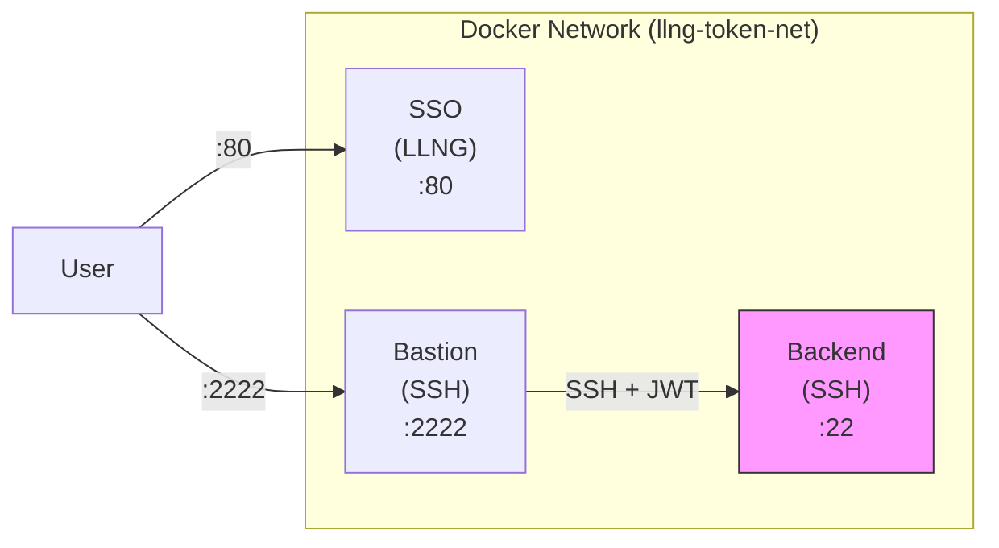
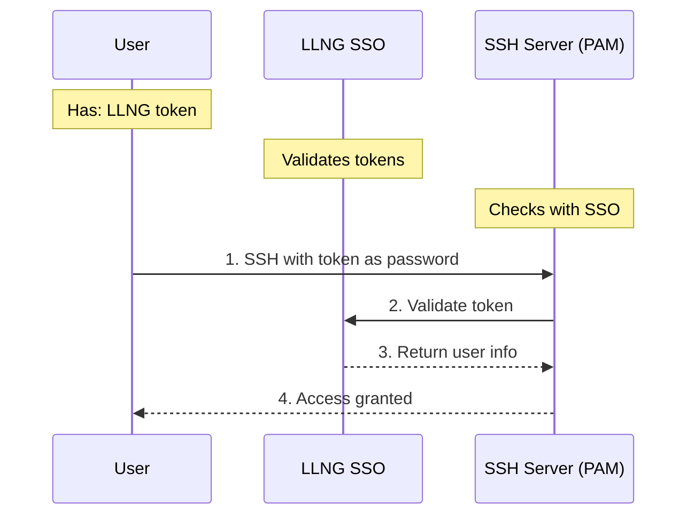
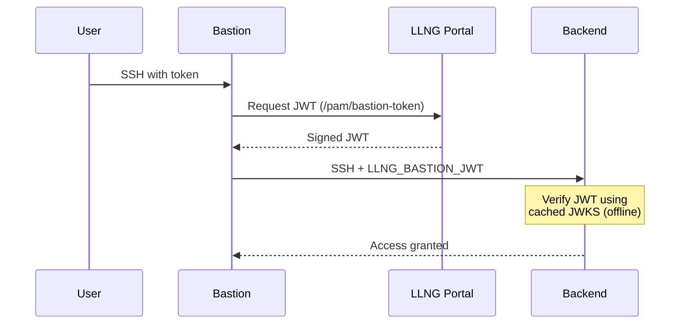

# LemonLDAP::NG Token-based SSH Authentication Demo

This Docker Compose demo demonstrates SSH authentication using LLNG tokens as passwords, including:

- **SSO Portal**: LemonLDAP::NG with PamAccess and Device Authorization plugins
- **SSH Bastion**: Jump host with token-based authentication and PAM authorization
- **SSH Backend**: Internal server accessible only through the bastion

> **Note**: For SSH certificate-based authentication (more secure), see the `docker-demo-cert/` folder.

## Architecture



> Note: Only bastion port 2222 is exposed externally. Backend has no external port.

## Quick Start

### 1. Start the environment

```bash
cd docker-demo-token/
docker compose up -d
```

Wait for all services to be healthy:
```bash
docker compose ps
```

### 2. Get an access token

Using the `llng` CLI tool:
```bash
llng --llng-url http://localhost:80 --login dwho --password dwho access_token
```

Copy the access token - you'll use it as your SSH password.

Or via browser at http://localhost:80 with credentials:
- Username: `dwho`, `rtyler`, or `msmith`
- Password: same as username

Then go to the "PAM Access" tab to see your access token.

### 3. Connect to the bastion

```bash
ssh -p 2222 dwho@localhost
# Password: paste your LLNG access token
```

### 4. From bastion, connect to backend

The backend server requires a signed JWT from the bastion to prove the connection
comes from an authorized bastion server. Use the `llng-ssh-proxy` command:

```bash
# On bastion - the proxy automatically gets a JWT and forwards it
llng-ssh-proxy backend

# Or using SSH with ProxyCommand
ssh -o ProxyCommand='llng-ssh-proxy %h %p' dwho@backend
```

**Note**: Direct SSH connections to the backend (without the bastion JWT) will be rejected,
even with a valid user token. This ensures backends only accept connections from authorized bastions.

## Demo Users

| User    | Password | SSH Access        | Sudo on Backend |
|---------|----------|-------------------|-----------------|
| dwho    | dwho     | bastion, backend  | No              |
| rtyler  | rtyler   | bastion, backend  | Yes             |
| msmith  | msmith   | bastion, backend  | No              |

## How Token Authentication Works



### Token Authentication Flow

1. **User obtains token**: Log in to the LLNG portal and get an access token
2. **SSH connection**: User connects to SSH server, using the token as password
3. **PAM validation**: The `pam_llng.so` module validates the token with the portal
4. **Authorization check**: Portal checks if user can access the server group
5. **User creation**: If user doesn't exist locally, it's created dynamically via NSS

## Comparison with Certificate Authentication

| Feature | Token Auth | Certificate Auth |
|---------|------------|------------------|
| **Security** | Good | Better (no password in transit) |
| **User experience** | Must paste token | Transparent with SSH agent |
| **Key management** | Token expires automatically | Certificate expires automatically |
| **Server setup** | Only PAM module needed | PAM module + CA trust |
| **Offline support** | Limited (cached auth) | Full (cert is self-contained) |

For production environments, we recommend **certificate authentication** (`docker-demo-cert/`).

## Bastion JWT Verification

The backend server is configured to require a JWT from the bastion server. This provides
cryptographic proof that the SSH connection originates from an authorized bastion.



### How it works:

1. User SSH to bastion with LLNG token
2. From bastion, user runs `llng-ssh-proxy backend`
3. Proxy requests a signed JWT from LLNG `/pam/bastion-token`
4. Proxy connects to backend with JWT in `LLNG_BASTION_JWT` env var
5. Backend verifies JWT signature using cached JWKS (offline capable)
6. If valid, SSH connection proceeds; otherwise, denied

## API Endpoints

| Endpoint | Method | Description |
|----------|--------|-------------|
| `/pam/authorize` | POST | Check user authorization |
| `/pam/bastion-token` | POST | Get signed JWT for bastion-to-backend auth |
| `/oauth2/device` | POST | Start device authorization |
| `/device` | GET/POST | User device verification page |
| `/oauth2/token` | POST | Exchange device code for token |
| `/.well-known/jwks.json` | GET | Public keys for JWT verification |

## Troubleshooting

### Check container logs
```bash
docker logs llng-token-sso
docker logs llng-token-bastion
docker logs llng-token-backend
```

### Test PAM authorization manually
```bash
docker exec llng-token-bastion curl -s http://sso/pam/authorize \
  -H "Authorization: Bearer <token>" \
  -H "Content-Type: application/json" \
  -d '{"user":"dwho","server_group":"bastion"}'
```

### Token not working?

1. Make sure the token hasn't expired (default: 1 hour)
2. Get a fresh token from the portal
3. Check that the user has access to the server group

## Configuration Files

- `docker-compose.yml` - Service definitions
- `lmConf-1.json` - LemonLDAP::NG configuration
- `bastion/Dockerfile` - Bastion image build
- `bastion/entrypoint.sh` - Bastion startup script
- `backend/Dockerfile` - Backend image build
- `backend/entrypoint.sh` - Backend startup script

## Security Notes

- In production, use HTTPS for the portal
- Each server should have a unique token
- Tokens should be rotated regularly
- Enable `verify_ssl = true` in production
- Consider certificate authentication for better security
- **Bastion JWT**: Backends require a valid JWT from the bastion, preventing direct access even with valid user credentials
- The JWKS cache allows backends to verify JWTs offline (useful for network partitions)
